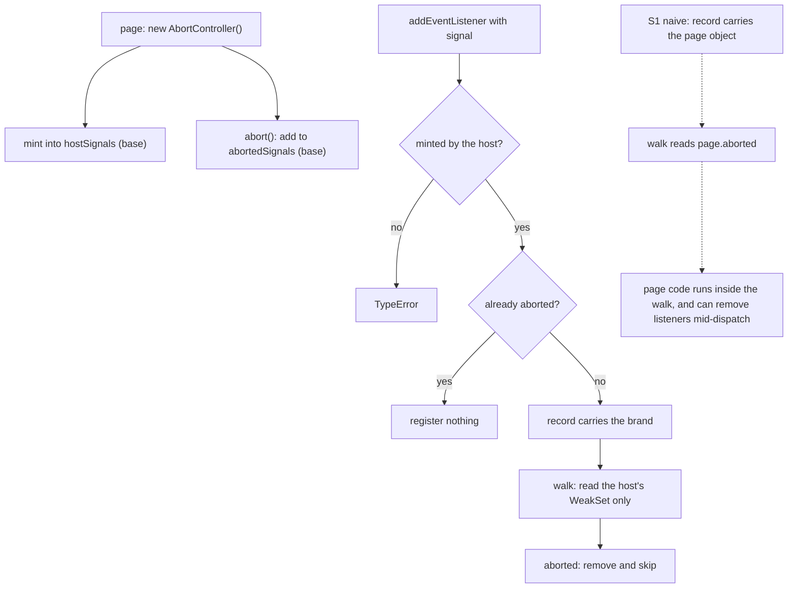

# `signal` and `AbortController` (L5) — read-only audit, 0.0.1

Design-only. Nothing implemented, no implementation court frozen, the handle
does not widen, no cap or floor proposed, no navigation or visual path run.
Three throwaway builds carried the candidates and went away with their
worktrees.

This is the last rung of the listener ladder, and the only one whose obvious
implementation is unsafe. The audit's job is to show that, measured, and to
price the alternatives.

## 1. Where the host stands

Measured on the shipped `91352a77f024…`:

| probe | today |
| --- | --- |
| `typeof AbortController` / `AbortSignal` | `undefined` / `undefined` |
| `addEventListener(t, f, {signal})` with a page object | accepted and **ignored**: the listener ran twice |
| a getter on that object | **never read** — nothing looks at it |

So there is no signal model at all, and — importantly for §2 — nothing reads
the object a page passes.

## 2. The obvious implementation is unsafe, and here is the measurement

Candidate **S1** is the naive one: keep whatever the page passed on the
record, and read `signal.aborted` when the listener would run. It produces
correct-looking abort semantics. It also does this:

| probe | S1 |
| --- | --- |
| a page object as the signal | accepted — `ran 1` |
| **a getter on `aborted`** | **"page code ran inside the walk"** |
| that getter removing another listener | `getter>getter>first` — the other listener **never ran** |

The second and third rows are the finding. A page passes
`{get aborted() { … } }`, and its code executes **inside the host's dispatch
walk**, between the snapshot and the callbacks — the exact place this host has
spent the event-fidelity, capture and passive slices keeping page code out of.
In the third row the getter used that window to `removeEventListener` a
listener the same dispatch was about to run, and it worked: a page can rewrite
which listeners a dispatch delivers to, from inside the dispatch.

That is why S1 is refused, and it is refused on evidence rather than on
principle.

## 3. The branded design

Candidate **S2**: the base owns the model.

- A closure-owned `WeakSet` of signals the host itself minted, and a second
  `WeakSet` of the ones that have been aborted. Both are read through captured
  `WeakSet.prototype` methods, like every other intrinsic on this path.
- `AbortSignal` and `AbortController` are host classes; `aborted` is a getter
  that asks the host's set, not a page-writable property.
- `addEventListener` with a `signal` that the host did not mint throws
  `TypeError`, so a page object cannot get onto a record at all.
- The walk reads the host's own `WeakSet`. No page code runs inside it.

Measured on S2: a page object is refused with `TypeError`, the getter case is
refused with `TypeError`, and the abort semantics are right — abort removes,
a signal aborted before the call registers nothing, abort during a dispatch
stops a listener that has not run yet, and it composes with `capture`.

Candidate **S3** is the same design with the two classes moved into the main
extension, the brand and the flags staying in the base, and **one new entry in
the one-shot handle** so the extension can mint and abort. It behaves
identically to S2 on every probe.

## 4. The tree

```
   page: new AbortController()
             |
      AbortController.abort()
             |
             v
   +--------------------------------+       base, closure-owned
   |  hostSignals   : WeakSet       |  <--- minted here, never page-writable
   |  abortedSignals: WeakSet       |  <--- flipped here
   +--------------------------------+
             ^                    ^
             |                    |
  addListener(..., {signal})      dispatchOn, at each record
   - not minted here? TypeError   - aborted? remove and skip
   - already aborted? register nothing
             |
             v
     record { …, signal }          <- a brand, not a page object

   S1 (refused):  record holds the PAGE object, and the walk reads
                  page.aborted  ->  page code runs inside the dispatch
```



## 5. Cost gradient

Against the shipped binary, `child-frame-court` and `shim-footprint-court`,
both allocators:

| candidate | M1 | Δ per child | M2 | main slack | M1 headroom |
| --- | --- | --- | --- | --- | --- |
| shipped `91352a77f024…` | 229,322 | — | 1,603,756 | 46,864 | 16,438 |
| **S1** naive — *refused* | 230,826 | +1,504 | 1,614,284 | — | 14,934 |
| **S2** branded, all in the base | 235,274 | **+5,952** | 1,645,420 | 52,944 | 10,486 |
| **S3** branded, classes in main, handle widened by one entry | 232,298 | **+2,976** | 1,624,588 | 54,560 | 13,462 |

**Safety costs four times the naive version if the classes live in the base,
and twice it if they do not.** The difference between S2 and S3 is 2,976 bytes
per child for two classes no child realm can ever construct, because a child
runs no scripts — the same divergence as every rung, at its largest yet.

One measurement note: S2's first `child-frames` run failed M4, the
footprint-acceleration check, at 81,920 bytes in the second half. Two reruns
passed at 0 and 16,384, so it is not attributed to the candidate; it is
recorded because a larger base makes that check's noise easier to trip.

## 6. What none of the candidates give

| the page expects | S1 / S2 / S3 | why |
| --- | --- | --- |
| `{signal}` removes the listener on abort | **served** | the record carries it |
| a signal already aborted registers nothing | **served** | checked at registration |
| abort during a dispatch stops a listener not yet run | **served**, measured | the removal is honoured by the snapshot's `removed` bit |
| `signal.aborted` readable | served (S2/S3: a host getter) | |
| `signal` is an `EventTarget`, `abort` fires on it | **not served** | the signal is not in the event model at all |
| `signal.reason`, `throwIfAborted()` | **not served** | no reason model |
| `AbortSignal.abort()`, `AbortSignal.timeout()` | **not served** | statics not modelled; `timeout` would need a timer owner |
| `signal.onabort` | **not served** | no IDL handler properties anywhere in this host |
| a foreign signal object | S1 accepts it; **S2/S3 throw `TypeError`** | branding |

The absent rows are not free to add later: an `EventTarget` signal means the
signal joins the dispatch model, and `timeout()` means a signal owns a timer.
Both deserve their own rulings rather than arriving inside this one.

## 7. A dependency worth fixing regardless

S3 adds a key to the one-shot handle, and **every frozen court still passes** —
`event-target` 24/24, `element-view` 23/23, `listener-options` 30/30,
`capture-phase` 36/36, `passive-listener` 30/30, `event-fidelity` 62/62. The
only criterion that reads the handle at all asks whether it names
`EventTarget`.

So the handle's shape is, today, guarded by nothing. Whatever is ruled about
L5, a court should pin the handle's **exact key set**, so that widening it
becomes a decision that fails a criterion rather than a diff nobody notices.

## 8. Pending rulings

1. **Which candidate, if any.** S1 is refused on the §2 measurement. S2 costs
   +5,952 per child; S3 costs +2,976 but needs the handle widened by one
   entry, which is its own ruling.
2. **The handle.** Widen it for S3, or keep it closed and pay S2's price, or
   defer L5 entirely and record `AbortController` as a standing loss.
3. **Headroom policy.** S2 leaves 10,486 bytes of M1 headroom and S3 leaves
   13,462, against a frozen floor this round does not move. The remaining
   standard surface in §6 is not priced and would eat more.
4. **Scope of the signal model**: the abort event, `reason`,
   `throwIfAborted`, the statics — each its own decision, none of them in the
   candidates measured here.
5. **Pin the handle's key set in a court**, independently of L5.
