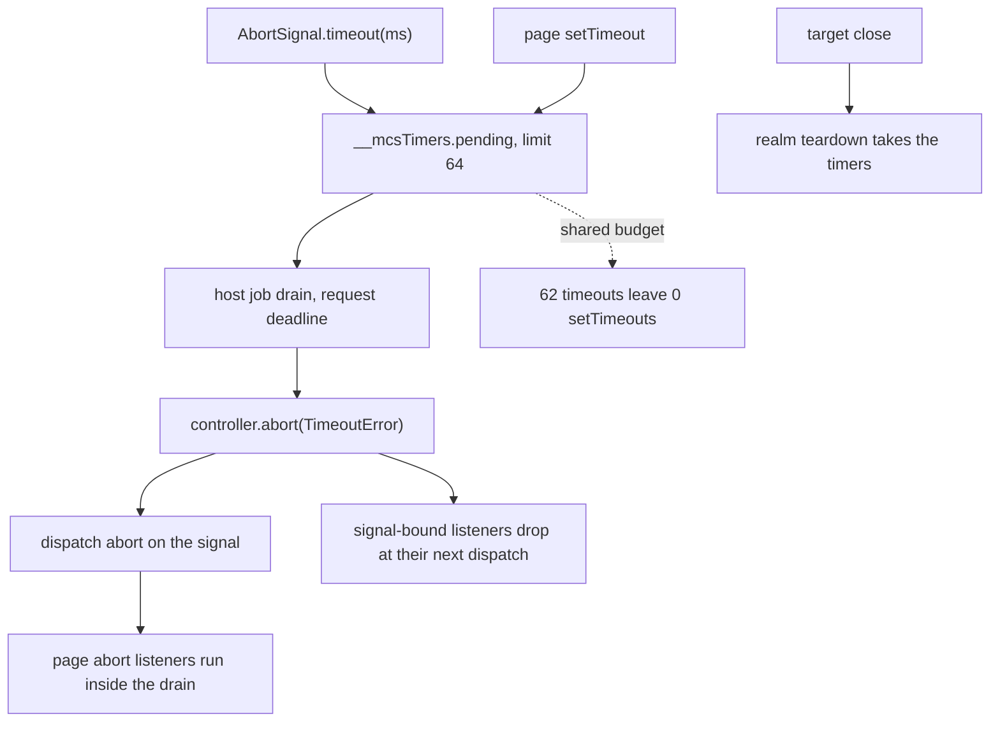

# `AbortSignal.timeout()` (R6) under the slack guard — read-only audit, 0.0.1

Design-only. Nothing implemented, no court frozen, the handle does not widen,
no cap or floor proposed or moved, no navigation, visual or surface path run.
Two throwaway builds carried the candidates and went away with their worktree.

The three frozen guards are respected throughout: `AbortSignal.timeout` stays
**absent** in the tree, the handle's **exact key set** is untouched, and **no
host path aborts a page's signal**. Anything that would need one of them moved
appears below only as a pending ruling.

**The short answer: 5,504 bytes of slack is enough for the version that
misbehaves and not enough for the version that behaves.** That is measured,
not estimated.

## 1. What a timeout would be made of

`timeout(ms)` is the only part of the signal surface that owns something. On
this host it would own one entry in the **page's own timer table**, which is
the main extension's `__mcsTimers`: a `Map` of pending callbacks with
`limit: 64`, a monotonic handle, and a refusal counter. The host collects due
callbacks and fires them one at a time during its job drain, under the
request's deadline.

```
   page: AbortSignal.timeout(ms)
              |
              v
   +---------------------------+
   |  main extension           |
   |  __mcsTimers.pending      |  <- ONE table, limit 64, shared with
   |  (Map, limit 64)          |     every setTimeout the page makes
   +---------------------------+
              |
        host drain, under the request deadline
              |
              v
   controller.abort(TimeoutError)
              |
        dispatch "abort" on the signal   <- page listeners run here,
              |                              inside the drain
              v
   listeners bound with {signal} are removed at their next dispatch
```



## 2. Measured, on a candidate built for this audit

| question | measurement |
| --- | --- |
| does it fire at all? | **yes** — `timeout(1)` aborted during the open, and the page read `reason.name === "TimeoutError"` |
| when? | inside the host's job drain, under whatever request is being served; there is no wall clock of its own |
| whose budget? | **the page's**: `target.inspect` reported `timers {limit: 64, pending: 62}` after 62 timeout signals |
| what does that cost the page? | **everything else**: after 62 timeout signals, `setTimeout` was refused **immediately**, 0 more accepted |
| retention | 60 long timeouts held across a target, then closed: owners returned to **exactly the baseline**, 0 bytes over |
| realm teardown | the realm takes its timers with it; nothing survives the close |
| authority | the abort runs page listeners inside the drain — which is what every page timer already does; no host path aborts a page signal, and none is proposed |
| reentrancy | the abort event dispatches from the timer callback, not from inside another page dispatch; the ruled §8 constraint is untouched |

The budget row is the finding. `fetch(url, {signal: AbortSignal.timeout(5000)})`
is the ordinary way this API is used, and sixty-four in-flight requests would
leave the page unable to schedule a single `setTimeout` — not because the page
wrote too many timers, but because a *convenience wrapper* did.

## 3. Two shapes, and what they cost

- **T1, as measured**: `timeout()` calls the page's `setTimeout`. Simple,
  main-only, no handle change.
- **T2, the one that behaves**: the same, plus a small quota of its own —
  measured with `limit: 16` — so timeout signals cannot consume the page's
  whole table. Measured: 14 signals then a refusal, and `setTimeout` still
  accepted 48. That is the correct behaviour.

| | M1 | child delta | main-only slack | slack left of 65,536 |
| --- | --- | --- | --- | --- |
| shipped `536ad23ed12a…` | 232,298 | — | 60,032 | 5,504 |
| **T1** | 234,346 | 2,048 (one block, quantization) | **61,504** | **4,032** |
| **T2** | 232,298 | 0 | **66,704** | **−1,168 — over the bound** |

**T2 fails the frozen slack check outright**: `shim-footprint` reads 17 of 18
with *"a main-only page costs no more than 65536 bytes above the baseline"*
failing at 66,704. The bound is frozen and this audit does not propose moving
it.

So the hard gate is not the child floor — that has 13,462 bytes and neither
shape threatens it — it is the main-only slack, and it lands **between** the
two shapes: the cheap one fits with 4,032 to spare, and the one that protects
the page's timer table is 1,168 bytes past the line.

## 4. Loss matrix

| the page expects | T1 | T2 | if R6 stays deferred |
| --- | --- | --- | --- |
| `AbortSignal.timeout(ms)` exists | served | served | **absent**, and pinned absent by a court |
| it aborts with a `TimeoutError` | served | served | — |
| it does not eat the page's timers | **not served** | served | not applicable |
| a timeout that is never used is cheap | no — it holds a slot until it fires | no, but bounded to its quota | — |
| cancelling a pending timeout | never — the standard gives `timeout()` no cancel | same | — |
| firing on a wall clock while the host is idle | never — it fires in the drain | same | — |
| the page can still `setTimeout` | **not after ~64 signals** | yes, 48 left | yes, all 64 |
| memory returned on close | served, measured 0 over baseline | same | — |

## 5. Candidates for the ruling

1. **Defer R6 again**, on the measurement: the version that fits misbehaves,
   and the version that behaves does not fit. The court already pins
   `timeout` absent, so nothing needs to change.
2. **Take T1 anyway**, accepting that a page using the standard idiom can
   starve its own timer table, and record that as a loss.
3. **Take T2 and move the slack bound** — which this audit does **not**
   propose, because the bound is frozen and moving it after measurement is
   exactly what the discipline forbids. It is listed only so the ruling can
   see the shape of the trade.
4. **Shrink something else in the main extension first**, then take T2 inside
   the existing bound. Nothing is proposed here; it would be its own slice
   with its own measurement.
5. **A host-owned timer** for signals, which would need the handle widened and
   would put a host path near a page's signal. Both are frozen guards, so this
   is a pending ruling and not a candidate.

## 6. Court design draft, for whenever R6 is ruled in

Not frozen, and not written as a file. What it would have to falsify:

- `AbortSignal.timeout(ms)` exists and returns a signal that is not yet
  aborted, then **is** aborted after a drain, with `reason.name` `TimeoutError`
  and `reason instanceof DOMException`.
- The abort event fires **once** on the signal, and a listener bound with that
  signal stops running afterwards.
- **The budget criterion, whichever way it is ruled**: under T1, that N signals
  leave the page's `setTimeout` refusing, recorded as the accepted loss; under
  T2, that the quota holds and the page keeps the rest of its table.
- `target.inspect` still reports the timer table honestly while signals hold
  slots.
- Owners return to the baseline after a target holding pending timeout signals
  is closed.
- The three standing guards still hold: the handle's exact key set, the
  main-only placement, and no host path aborting a page's signal.
- The `shim-footprint` slack check on the same binary, which is what decided
  this audit.


## 7. Ruled

**T3b is accepted**: `timeout()` refuses when the page's existing timer table
already holds 16 or more entries, so a page keeps **48 slots for its own
`setTimeout`** and timeout signals can hold at most 16. The refusal is a
`RangeError` and the page stays usable. No new quota state is introduced —
the threshold reads the table that is already there — and the accepted cost is
main slack **62,016 of 65,536**, 3,520 left, with M1, M2 and the child delta
unmoved. The main extension keeps its comments; `CustomEvent` and every other
capability stay.

### 7.1 The standing guard, amended

It read: **no host path may abort a page's signal.** It now reads:

> No host path may abort a page's signal, with one narrow exception: the timer
> that `AbortSignal.timeout()` created for a signal may abort **that signal and
> no other**. The exception is bound to the signal the call minted, fires only
> from that timer, and reaches nothing else — not another page signal, and not
> any host path that is not this timer.

Everything else about the guard is unchanged. A host path that wants to abort
a page's signal for any other reason still needs its own ruling.

### 7.2 The frozen `timeout` guard, amended

`abort-signal-surface-court.py` pinned `AbortSignal.timeout` **absent**, so
that taking it later would be a ruling and not a diff. This is that ruling: the
criterion is amended to require it, and the amendment is recorded here and in
the commit that makes it. The guard did its job — it made this a decision.

The implementation court is frozen before the code and covers the
`TimeoutError` `DOMException`, the abort event firing once with its listener
dropped, the reserve of 48 coexisting with 16 signals, the refusal type,
target close and owner release, the amended no-arbitrary-abort guard,
`AbortSignal.any` still absent, the unchanged handle key set, and the main
slack bound measured on the same binary.
