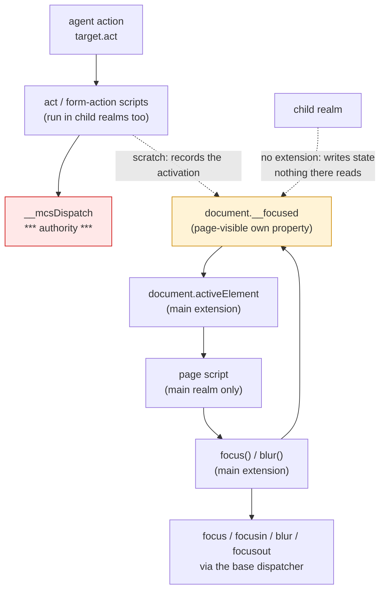

# `document.activeElement`: a focus audit (native-dom, control 0.0.2)

Design and read-only measurement only. No product code, no court frozen, no
handle widening, no navigation soak, no surface path. The cost variant was
built in a throwaway worktree that has been removed. Measured on `d730734` /
binary `0ac5a9a7dbbf…`.


## 1. What the door says today

| probe | answer |
| --- | --- |
| `document.activeElement` | **`undefined`** |
| `document.hasFocus` | `undefined` |
| `element.focus()` | returns `undefined`, **dispatches nothing** |
| `focus`, `focusin`, `blur`, `focusout` listeners after `focus()`/`blur()` | **no events at all** |
| `element.tabIndex` | `undefined` |
| the `autofocus` attribute | readable as an attribute, honoured by nothing |
| `document.querySelector(':focus')` | throws — the engine has no pseudo-classes |
| a **host-driven click** on a button | the page's listener runs; nothing about focus changes |
| the semantic snapshot | reports `dom_id`, `name`, `reference`, `role` — **no focus at all** |

So focus is not partly modelled here. It is absent in the DOM, absent in the
host's actions, and absent from what an agent reads back.


## 2. The question this audit exists to answer

`focus()` is already a no-op that lies quietly: a page calls it, nothing
happens, and nothing says so. The tempting fix is to track focus **inside the
page's own calls** — `focus()` sets a variable, `activeElement` reads it. That
is the one option this record recommends against, because it would make the
host lie louder: a page that clicks a field through the agent and then reads
`document.activeElement` would see whatever it last focused itself, or the
body, where a browser would name the field the click landed on. An absence a
page can detect is better than a value it cannot trust.

Modelling it honestly means the **host's own actions move focus**, because in
this host it is the agent, not a person, who clicks.


## 3. What an honest model costs, measured

A scratch build with: `document.activeElement` defaulting to `document.body`;
`focus()`/`blur()` restricted to focusable element types; `focus`, `focusin`,
`blur` and `focusout` dispatched through the base's own dispatcher with the
standard's bubbling; and the **host's action path recording the activation**,
so an agent's click moves focus as a person's would.

| | current `d730734` | with the model |
| --- | ---: | ---: |
| M1 (system) | 221,514 | **221,514** — unchanged |
| main-only slack against the `origin/main` baseline | 28,128 | **31,392** |

**3,264 bytes of main, nothing per child.** Courts on that scratch build:
child-frames 82/82, element-view 19/19, event-fidelity 62/62, form 179/179,
frame-actions 182/182, page-navigation 80/80, lifecycle 53/53. Probed again on
it, `activeElement` answers an object before and after a host-driven click.

*A probe artefact, not a finding:* my fixture registered its focus listeners
**after** its first `focus()` call, so the second call was a no-op and only
`blur` was seen. The events fire; the probe asked badly.


## 4. Where the state would have to live, and the wart in the cheap answer

The scratch keeps the focused element in `document.__focused`, an own property
of the document, because the extension can reach it without the one-shot
handle growing by an identifier — which this round was told not to do.

That has a wart worth ruling on: the property is **page-visible and
page-writable**. A page can forge focus. Nothing the host decides reads it, so
it grants nothing; but it is state the host writes and a page can rewrite, and
this project has been careful about exactly that shape. The alternative is one
more handle identifier and hidden state, which is a ruling this round could not
make on its own.

**The line to hold, whichever way it goes:** if the host ever routes an action
*by* focus — typing that goes to "the focused element" rather than to a named
one — then focus stops being page surface and becomes authority, and it must
move behind the bridge into hidden state before that happens, not after.


## 5. The tree

```
Can focus be modelled honestly, or should it stay absent?
├── A. The agent's click moves focus (owner: the host action path)
│   invariant: after a host activation of a focusable control, activeElement is that control
│   evidence: §3's scratch, probed before and after a host-driven click
│   safe failure: focus stays where it was; never a value that contradicts what the agent did
│   dependency: the act and form-action scripts, which run in child realms too
│   non-goal: focus following anything a page synthesises for itself
├── B. The page's own calls move focus (owner: the main extension)
│   invariant: focus() and blur() on a focusable element move it and raise focus, focusin, blur, focusout
│   evidence: §3's scratch, and the suites passing on it
│   safe failure: no movement and no events, which is today
│   dependency: dispatchOn and Event, already in the handle
│   non-goal: tabindex, contenteditable and every other focusability rule (§6)
├── C. The state's home (owner: this audit — unresolved)
│   invariant: whatever holds the focused element cannot be mistaken for something the host trusts
│   evidence: §4
│   safe failure: leave focus absent rather than write host state a page can rewrite
│   dependency: either an own property (page-writable) or one more handle identifier (hidden)
│   non-goal: widening the handle without a ruling
└── D. Say what is still not focus (owner: §6)
    invariant: an unmodelled part of focus is written down, not implied by the parts that work
    evidence: §6
    safe failure: —
    non-goal: a snapshot field for focus, which is protocol surface
```


## 6. The loss matrix

| what a page or agent might expect | what the model would give | class |
| --- | --- | --- |
| `activeElement` after a host click on a control | the control | in scope |
| `focus`, `focusin`, `blur`, `focusout` | dispatched, with the standard's bubbling | in scope |
| `activeElement` with nothing focused | `document.body`, as a browser has it | in scope |
| `tabIndex`, `tabindex`-driven focusability | **absent**: a fixed tag list decides focusability | loss |
| `contenteditable` focus | **absent** | loss |
| `autofocus` on load | **absent**: the attribute is readable and honoured by nothing | loss |
| Tab and sequential focus navigation | **absent**: this host acts on a named element, never on "the next one" | loss |
| `:focus` in a selector | throws, as every pseudo-class does | inherited limit |
| `document.hasFocus()`, window focus, focus across frames | **absent**: each realm would answer only about itself | loss |
| `relatedTarget` on focus events | **absent** | loss |
| a focus field in the semantic snapshot | **not proposed**: that is protocol surface and this slice does not touch it | out of scope |
| the focusable-element list | would live in **two places** — the host's action script and the extension — unless one derives from the other | duplication risk |


## 7. Where it sits




## 8. Boundaries, memory and permission

- **Memory**: M1 unchanged — a child realm compiles none of the view — and
  3,264 bytes of main, inside the frozen 65,536 slack, which currently stands
  at 28,128.
- **Permission**: `activeElement` grants nothing. It reports which element the
  page or the agent last activated; a page can already observe both by
  listening. The only new thing written is host state a page can rewrite
  (§4), and nothing the host decides reads it.
- **Boundary**: the host's action scripts run in child realms as well, so the
  scratch writes `document.__focused` there too, where no extension exposes
  it. Harmless, and worth removing with a guard if this is built.
- **Scope**: no protocol change, no snapshot field, no new operation, and no
  key-driven focus movement.


## 9. What I need ruled

1. **Whether to model focus at all.** Honest costs 3,264 bytes of main and
   touches the host's action path; absent costs nothing and keeps `focus()`
   the quiet no-op it is today. I lean to modelling it, because `focus()`
   already lies by doing nothing, and the losses in §6 are writable-down.
2. **Where the state lives** (§4): an own property a page can forge, or one
   more handle identifier and hidden state. I would rather ask than widen the
   handle after being told not to.
3. **The focusable-element list**: a fixed tag list in two places, or one
   place with the other deriving from it. It is small, but it is exactly the
   kind of duplication that drifts.
4. Whether `getAttributeNames`, `toggleAttribute` and `cloneNode` should be
   audited next in the same shape, or whether focus's answer settles enough to
   take them together.


## 10. The rulings, and how they change what I measured

**10.1 The model is narrow: only the host moves focus.** A host-driven action
— a click, and whatever later actions are explicitly ruled in — moves focus. A
page's own `focus()` and `blur()` **may not forge it**: they do not move
`activeElement` and they raise nothing on their own. That is stricter than the
scratch I measured, where `focus()` moved the state, and it is the right way
round: in this host the agent is who clicks, and a page saying "I am focused"
is not evidence that it is.

*The loss that comes with it, recorded rather than implied:* a page that calls
`element.focus()` and then reads `document.activeElement` still sees the
element the **agent** last activated, not the one it asked for. That is a
divergence from a browser, and it is chosen deliberately over a value the host
would be inventing.

**10.2 The state is hidden, not an own property.** `document.__focused` is
rejected: host-written state a page can rewrite is exactly the shape this
project has spent four rounds removing. The focused element lives in the
**base's closure**, moved only by the host's dispatch bridge, and the main
extension reads it through **one handle identifier** — a getter, never a
setter, so the extension cannot move focus either. That identifier is counted
and its cost measured before the code lands.

**10.3 One source for focusability.** The set of focusable elements is defined
once, in the base beside the bridge that uses it. Nothing in the extension or
in a host script repeats it, because two lists drift.

**10.4 Everything else stands as the audit recorded it**: `activeElement`
defaults to `document.body`; `focus`, `focusin`, `blur` and `focusout` go
through the existing trusted dispatcher with the standard's bubbling; and the
losses stay losses — no snapshot field, no Tab or sequential navigation, no
`hasFocus`, no cross-frame focus, no `:focus`, no `tabindex`,
no `contenteditable`, no `autofocus`, no `relatedTarget`.

**10.5 The line from §4 becomes a standing constraint**, not an aside: nothing
the host decides may read focus. The moment an action is routed *by* focus,
focus stops being page-visible state and becomes authority, and this design
must be revisited before that lands rather than after.


## 11. The court, frozen before the code

`active-element-court.py`, headless, both allocators. Criteria:

1. **A host click focuses what it clicked**, and `activeElement` names it.
2. **The default is `body`** before anything has been activated, and again
   after a navigation replaces the document.
3. **The page cannot forge it**: assigning `document.activeElement`, writing
   `document.__focused`, and calling `element.focus()` on another element all
   leave the value the host set, and a later host click still moves it.
4. **`focus()` does not overreach**: it moves nothing and raises nothing.
5. **Event order and bubbling**: moving focus from A to B raises `blur` at A,
   `focusout` at A, `focus` at B, `focusin` at B, in that order, with
   `focusin`/`focusout` reaching an ancestor listener and `focus`/`blur` not.
6. **Cleanup**: after `target.navigate` and after close-and-reopen, the focused
   element is gone and `activeElement` is `body` again — no element outlives
   the document that held it.
7. **Owner release**: closing every target returns the owners to the empty
   figure exactly.
8. **The floors and the slack**: M1 ≤ 245,760 and M2 ≤ 1,720,320 in the
   child-frame court on the same binary, and main-only slack ≤ 65,536 in the
   shim-footprint court, with the handle identifier's cost included in what
   that slack measures.


## 12. Two things the first implementation attempt found

**12.1 My court clicked what the host refuses to click.** The fixture focused
two text inputs with `target.act` `click`, and the host answers
`unsupported_capability` / `action_unsupported` — "click requires a button or
link node". So those criteria could never have passed, on any build. The
fixture now clicks **buttons** for the movement and ordering criteria, and
asserts separately that the action which *does* apply to a text field —
`set_value` — focuses it, which is the "explicit later action" half of the
ruling.

**12.2 Not every host activation goes through the bridge.** The `fire` helper
does, and so the hook in `dispatchFor` catches clicks on links and check
controls — but the button path ends in the base's own `Element.click()`, which
dispatches directly. A hook that only watches `dispatchFor` therefore misses
exactly the activation a page is most likely to notice.

Putting the hook in `dispatchOn` instead would catch it, and would also catch
a **page's** own `el.click()`, which in a browser moves no focus. That is the
forgery the ruling forbids, arrived at from the other side.

So the host asks for focus **explicitly**, through the capability bridge it
already holds: a reserved type the base understands as "move focus, dispatch
nothing". The act and form-action scripts call it once, before applying the
action; the base decides focusability, so the single source stays single; and
page script cannot call it at all, because it has no capability.

**12.3 And the fixture read a stale value.** With the focus request in place,
the `set_value` criterion still failed, reporting the previously clicked
button. The page reported what it saw only from its **click** listeners, and a
`set_value` raises `input` and `change`, never a click — so the fixture was
reading a value from the click before it and blaming the host. It listens for
`input` too now. Two of the three faults this slice found were mine, in the
court, and both are recorded here rather than quietly fixed.
