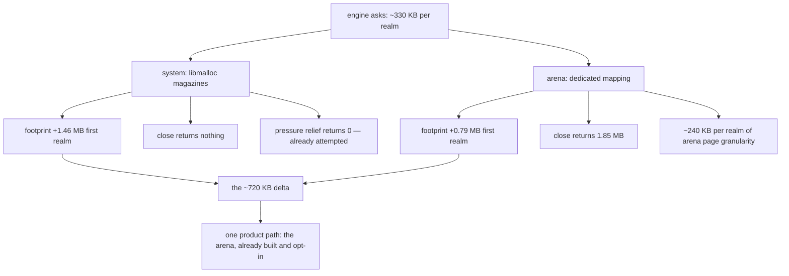

# The 720 KB allocator delta — read-only audit, 0.0.1

Design-only. Nothing implemented, no court frozen, no criterion or protocol
touched, D6's numbers untouched, no navigation soak, no visual or surface run.
All figures are black-box reads of the shipped `420cdf5b82bf…`, taken after
the first-request constant is paid so it is not counted twice.

**The answer to the brief: there is exactly one product-controllable path, and
it is already built and opt-in.** The delta is libmalloc servicing the realm's
allocations versus a dedicated mapped arena; everything else about it is
allocator policy that this host has already tried to move and cannot.

## 1. The same construction, both arms, with the allocator's own numbers

`lm_allocated` and `lm_in_use` are libmalloc's own accounting, as the host
reports it.

**System**

| step | footprint | Δ | lm allocated | Δ | lm in use |
| --- | --- | --- | --- | --- | --- |
| before any realm | 1,982,800 | — | 12,582,912 | — | 125,264 |
| realm 1 | 3,440,976 | **+1,458,176** | 12,582,912 | +0 | 465,936 |
| realm 2 | 3,899,728 | +458,752 | 12,582,912 | +0 | 795,728 |
| realm 3 | 4,505,936 | +606,208 | 20,971,520 | **+8,388,608** | 1,125,520 |
| realm 4 | 4,866,384 | +360,448 | 20,971,520 | +0 | 1,455,312 |

**Arena**

| step | footprint | Δ | lm allocated | Δ | lm in use |
| --- | --- | --- | --- | --- | --- |
| before any realm | 1,999,184 | — | 16,777,216 | — | 125,264 |
| realm 1 | 2,785,640 | **+786,456** | 20,971,520 | +4,194,304 | 140,752 |
| realm 2 | 3,342,720 | +557,080 | 20,971,520 | +0 | 145,232 |
| realm 3 | 3,867,032 | +524,312 | 20,971,520 | +0 | 149,712 |
| realm 4 | 4,424,112 | +557,080 | 20,971,520 | +0 | 154,192 |

## 2. What the delta is

**On the system arm the realm lives in libmalloc.** Its `in_use` rises by
about 330 KB per realm — exactly the host's own `script_realm_bytes` — so the
engine asks for what the host says it asks for. The footprint, though, rises
1,458,176 for the first realm and 360–606 KB for later ones: the difference is
**pages touched across libmalloc's magazines**, not memory the engine
requested.

**On the arena arm the realm does not live in libmalloc at all.** `in_use`
rises by about 4.5 KB per realm — the bookkeeping and nothing else — while the
footprint rises 524–786 KB, all of it inside the realm's own mapped region.

So the ~720 KB first-realm delta is the cost of servicing the *same* ~330 KB
of live objects through a shared general-purpose allocator instead of a
dedicated mapping. It is not engine demand; both arms account nearly identical
tracked bytes.

Two details worth recording rather than smoothing over:

- **libmalloc's reservation steps are not tied to a realm.** The 8 MiB jump
  lands on realm 3 in this run, and a previous run of the same script showed a
  different starting reservation (12,582,912 against 16,777,216). The
  reservation timing varies between runs; the footprint deltas do not.
- **The arena is not free either.** Its per-realm footprint of ~557 KB exceeds
  its ~317 KB of tracked bytes, so about 240 KB per realm is the arena's own
  page granularity. It buys recovery, not thrift.

## 3. Recovery, which is where the arms really differ

From the previous audit, and re-measured here: closing four targets returns
**nothing** on the system arm and **1,851,488** on the arena arm; and after a
close, `memory.trim` — which the host implements as
`malloc_zone_pressure_relief` plus an arena tail `madvise` — reports
`released_bytes: 0` on both. On the system arm libmalloc then sits at
20,971,520 allocated with 136,144 in use and does not give it back.

**The host already asks, and libmalloc already refuses.** That is the measured
end of the road for the system arm.

```
   the same ~330 KB of live realm objects
        |
        +-- through libmalloc (system arm)
        |     footprint +1.46 MB first, +0.36-0.61 MB after
        |     in_use tracks the engine exactly
        |     close returns 0 · pressure relief returns 0
        |
        +-- through a dedicated arena (opt-in)
              footprint +0.79 MB first, +0.52-0.56 MB after
              in_use barely moves — libmalloc is not involved
              close returns 1.85 MB · tail madvise returns 0
```



## 4. Loss matrix — candidate paths

| path | product-controllable | measured basis | what it costs | verdict |
| --- | --- | --- | --- | --- |
| **use the dedicated arena for realms** | **yes — it exists, opt-in** | first realm 786,456 against 1,458,176; close returns 1,851,488 | ~200 KB more per live realm; the plan keeps it opt-in deliberately | the only real path; **a route ruling, not a memory fix** |
| ask libmalloc to release after close | already done | `memory.trim` reports `released_bytes: 0` on both arms | nothing; it is already attempted every trim | **exhausted** |
| tune libmalloc through the environment | no | reservation steps vary run to run | outside the product; fragile and unmeasurable as a guarantee | rejected |
| shrink what the engine asks for | yes, in principle | `in_use` already equals the host's tracked bytes | this is engine work, not allocator work, and 330 KB is what a realm is | **out of scope here**; would be its own audit |
| re-derive D6 to pair live with post-close | not a memory change | system looks 573 KB better live and 2.13 MB worse after close | a criterion ruling | **already ruled**: report both, thresholds unchanged |

## 5. Safe failure

If the arena is never made default, the honest position is that **the system
arm's first realm costs 1.46 MB and returns nothing**, and both facts belong
in any G1 comparison rather than the first alone. If it is made default, the
route trades ~200 KB per live realm for 1.85 MB returned at close, and D6 —
which reads live footprint — will look *slightly* better, not decisively so:
6,046,200 against 6,619,592, still above 4,178,196.

Neither outcome closes D6. That is the finding: **D6 is not an allocator
problem**, and this audit ends the line of enquiry that hoped it was.

## 6. Recommendation

Nothing to implement. The allocator delta is understood, has one product path
that already exists as an opt-in route decision, and does not close D6 on its
own. If the order continues, the remaining honest candidates for G1 and D6 are
the engine's own ~330 KB per realm and the first-request constant — both
larger designs — or the G1 comparison campaign, which needs no code and is
what the gate actually asks for.
