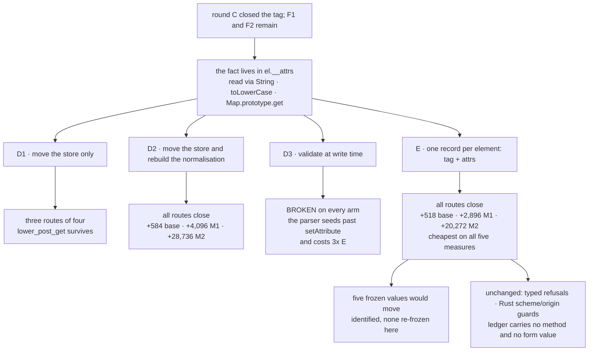

# Round D: the attributes a decision reads

Design-only, read-only audit of the second half of the element-fact ruling.
Nothing was implemented in the committed tree, no court was frozen, **no frozen
value was re-frozen** — §7 names the five that would have to move and leaves
every one of them exactly as it is, because re-freezing without an
implementation would only make the courts wrong about the tree they measure.
No intrinsic capture, no widened handle, no bound moved, nothing mixed with
slimming or H2, no visual run, no soak, nothing downloaded.

Four candidates were built on top of the pushed round-C tree, measured on
**both allocators**, and discarded; §6 proves the tree is back where it started.
Receipt: `evidence/native-dom-control-0.0.2-attribute-fact-candidates.json`.

## 1. What is still open after round C

Round C made an element's **tag** the host's, and F5 closed. Measured again here
as the round-D baseline on `e9e07111`, F1 and F2 are exactly where
`fail-open-triage-audit-0.0.1.md` left them:

| route the page takes | F1: a declared POST | F2: a named target |
| --- | --- | --- |
| selective `toLowerCase` | **submitted as a GET** | **activated in frame** |
| `Map.prototype.get` inside `getAttribute` | **submitted as a GET** | **activated in frame** |
| a direct write of `el.__attrs` | **submitted as a GET** | **activated in frame** |

and the snapshot tells the agent `method: "get"` for a form the page declared
POST. The fact the host trusts is `el.__attrs`, an ordinary writable own
property holding an ordinary `Map`, read through `getAttribute`, which is itself
built from the global `String`, `String.prototype.toLowerCase` and
`Map.prototype.get`. Every one of those is the page's.

## 2. The four candidates

**D1 — the store moves, the normalisation does not.** Attributes go into a
closure-owned `WeakMap`, read through a non-writable `__mcsAttr`; `methodOf`,
`targetOf`, `actionOf`, `linkDecision`, the download probe and the snapshot's
`entry.method` ask the store. `methodOf` and `targetOf` still finish with
`.trim().toLowerCase()`.

**D2 — the store moves and the normalisation is rebuilt**, from index reads,
`+=` and two literal alphabets, consulting no prototype method: the technique
already ruled in for `urlOf` and the approval signature.

**D3 — validated at write time.** The store keeps a second map of **pre-folded**
values for the four attributes a decision reads, written once in
`setAttribute`, so the host normalises nothing when it reads.

**E — one store for both facts.** Round C's `tags` map becomes a single record
per element holding `{tag, attrs}`, and both `__mcsTag` and `__mcsAttr` read it.
Normalisation as in D2.

All four keep the page's `__attrs` working: the field becomes an accessor whose
getter returns the same `Map` page code expects and whose **setter is an
explicit no-op landing place**, so a page's `el.__attrs = …` is ignored rather
than fatal. That is not decoration — the previous round measured that a
getter-only `__attrs` makes the page's assignment throw, kills its inline script
and answers `target_crashed`.

## 3. What each candidate closes

Ten arms, each carrying the honest markup beside the dishonest markup in the
same document.

| arm | after round C | D1 | D2 | D3 | E |
| --- | --- | --- | --- | --- | --- |
| `lower_post_get` → POST as GET | **open** | **open** | closed | **open** | closed |
| `map_get_method` → POST as GET | **open** | closed | closed | **open** | closed |
| `prop_attrs_method` → POST as GET | **open** | closed | closed | **open** | closed |
| `override_readers` → POST as GET | **open** | closed | closed | **open** | closed |
| `lower_target_self` → named target | **open** | **open** | closed | **open** | closed |
| `map_get_target` → named target | **open** | closed | closed | **open** | closed |
| `prop_attrs_target` → named target | **open** | closed | closed | **open** | closed |
| the snapshot's `method` for a POST form | `get` on four arms | `get` on one | **`post` on all ten** | **`get` on all ten** | **`post` on all ten** |
| the page's `__attrs` still reads as a `Map` | yes | yes | yes | yes | yes |

**D1 is not enough, and the measurement is what says so.** Moving the store
closes every route that attacks the *store*, and leaves untouched the route that
attacks the *normalisation*: `lower_post_get` still submits the POST as a GET.
A round that shipped D1 would have closed three routes out of four and reported
F1 as closed.

**D3 is broken, and instructively.** It fails on every arm — including the
unpatched one — and reports `method: "get"` for every form in the document. The
cause is that the parser seeds attributes **straight into the map**
(`dom_shim_base.js:479`) without going through `setAttribute`, so the folded
copy is never written and every read falls back to the default. This is round
C's lesson in a second dimension: *validation at write time misses whichever
construction door does not go through the writer.* Round C caught the same shape
in time by testing `cloneNode`; D3 shows what it looks like when it is not
caught.

**D2 and E both close everything.** Every arm refuses, the snapshot reports
`post` truthfully on all ten, and every honest control still works on every arm
of every build: the `method="get"` form submits and is fetched, the untargeted
link navigates, and the real `<a download>` delivers its 29 bytes.

**No authority expansion, measured on every build.** The escalation pairs are
identical before and after: an anchor with a `javascript:` href and one with a
`file://` href pointing at a real local file are both refused
`scheme_unsupported`, the file's bytes are never returned, and a second loopback
origin the host was never told to allow is refused `permission_denied/address`.
Every one of those refusals is the Rust half's and no candidate touches it.

**No page value or query leaks.** On every arm of every build the ledger
mentions no method and carries no form value; the entries stay
`target.act:submit` with an outcome and nothing else.

**The typed refusals are preserved, not widened.** The vocabulary is unchanged —
`form_method_unsupported`, `target_named`, `not_a_link` — and the candidates
only make the host reach them for the right reason.

## 4. Cost, measured on both allocators

Against the round-C tree (`e9e07111`, base shim 33,290; child-frame after C:
system M1 235,658 / M2 1,648,172, arena M1 227,850 / M2 1,592,540). Caps are
262,144 and 1,835,008.

| candidate | base bytes | system M1 | system M2 | arena M1 | arena M2 |
| --- | ---: | ---: | ---: | ---: | ---: |
| **D1** | +584 | +4,096 | +28,736 | +3,152 | +22,960 |
| **D2** | +584 | +4,096 | +28,736 | +3,152 | +22,960 |
| **D3** (broken) | +1,723 | +10,544 | +73,936 | +9,744 | +68,736 |
| **E** | **+518** | **+2,896** | **+20,272** | **+3,024** | **+21,904** |

**E is the cheapest on every one of the five measures and closes exactly what
D2 closes.** One record per element instead of two `WeakMap` entries saves 66
source bytes and, more usefully, 1,200 system M1 and 8,464 system M2 over D2.
Absolute headroom after E: **23,590** under M1 and **166,564** under M2 on the
system arm.

**D3's price is the reason to stop looking at it even if it worked**: a second
map per element costs roughly three times what E costs, because it stores a
second copy of what the first map already holds.

**Nothing here is extrapolated from round C or from the earlier estimates.**
Each row is its own build, its own probe run and its own child-frame run on both
arms. The previous round's C+D figures are not carried across; they were
measured against a different baseline and are superseded by this table.

## 5. Tree DAG

```
the ruling: an agent-facing fact must be the host's
├── the tag        — done in round C at 958f5c0
└── the attributes — this round
    ├── where does the decision's fact live?
    │   └── el.__attrs, a writable own property holding an ordinary Map
    │       └── read through getAttribute: the global String, toLowerCase, Map.prototype.get
    ├── move the store only                      → D1: three routes of four
    │   └── the normalisation is still the page's → lower_post_get survives
    ├── move the store AND rebuild the normalisation → D2: all routes close
    │   └── +584 base · +4,096 / +28,736 system · +3,152 / +22,960 arena
    ├── validate at write time                    → D3: BROKEN and dearest
    │   └── the parser seeds past setAttribute (base:479), so nothing is folded
    └── one record per element for tag and attrs  → E: all routes close, cheapest
        ├── +518 base · +2,896 / +20,272 system · +3,024 / +21,904 arena
        └── page compatibility kept by an explicit no-op landing setter
            └── without it a page's own write throws and the document dies (measured)
```

## 6. Mermaid



## 7. The five frozen values a round-D implementation would move

Identified by running the frozen courts against the E build. **None of them is
re-frozen in this commit**: the tree holds no implementation, so moving a pin
now would make the court wrong about the tree it measures. Each is listed with
what it would become, so the ruling can authorise them by name.

| court | criterion | today | under E |
| --- | --- | --- | --- |
| `property-shape-court.py` | `window` row | `113:5899bf6e` | `114:5d05836a` — one more global, `__mcsAttr` |
| `property-shape-court.py` | `Element.prototype` row | `40:26312e4` | `41:1c3f518d`, with `__attrs:gs:010` — the field becomes an accessor, which is **page-observable** and the one genuinely new cost of D |
| `signature-integrity-court.py` | base-byte pin | 33,290 | the round's measured value; the main shim stays 26,485 |
| `registry-brand-court.py` | N3 base-shim hash | `3561e774…` | the round's measured hash; the main-shim hash stays `d319246e…` |
| `element-tag-court.py` | the whole **cost group**, five criteria | ceilings measured from the **pre-C** baseline | all five fail — see below |

**`element-tag-court.py`'s cost group has expired, and that is a lesson rather
than a defect.** Its ceilings are deltas from the *pre-round-C* numbers
(`32,898`, `233,962`, `1,636,236`, `225,898`, `1,579,500`), which was exactly
right while round C was the last thing to land and is meaningless the moment
anything lands on top: under E it fails all five, reporting round C's cost plus
round D's as if they were round C's. **A cost ceiling written as a delta from a
fixed prior baseline expires when the next slice lands.** The recommendation is
to re-express that group as equalities at round C's own measured values —
33,290, 235,658, 1,648,172, 227,850, 1,592,540 — which keeps it a real
regression guard forever, and to give round D's own court ceilings measured
against *those* numbers. This is a court-shape decision and belongs to the
ruling.

Everything else holds on E, measured: `capture-declaration` 8/8 (**no sixteenth
capture** — `mapGet`, `mapSet`, `mapHas`, `weakMapGet` and `weakMapSet` all
already exist and `removeAttribute` keeps its prototype `delete`), `form`
179/179, `frame-action` 182/182, `page-navigation` 80/80, `downloads` 21/21,
`element-api` 28/28, `dataset` 15/15, `host-answer` 9/9.

## 8. Loss matrix

| option | closes | leaves open | measured cost | risk |
| --- | --- | --- | --- | --- |
| **Accept** | nothing | F1, F2 | zero | contradicts a ruling already made; the vocabulary stays page-writable for method and target |
| **D1** | three routes of four for each of F1 and F2 | the `toLowerCase` route on both | +584 base; +4,096 / +28,736 system; +3,152 / +22,960 arena | **the worst option on the table**: it costs what D2 costs and closes less, and it would be easy to report as done |
| **D2** | F1, F2, and the snapshot's `method` | — | +584 base; +4,096 / +28,736 system; +3,152 / +22,960 arena | two stores where one would do; five pins move |
| **D3** | nothing (broken) | everything | +1,723 base; +10,544 / +73,936 system; +9,744 / +68,736 arena | the write-time door is not the only door; three times E's price for a second copy of the same data |
| **E** | F1, F2, and the snapshot's `method` | — | **+518 base; +2,896 / +20,272 system; +3,024 / +21,904 arena** | same five pins move; touches round C's own store, so round C's court must be re-read as part of the round rather than after it |

The recommendation, on the evidence: **E**. It is the cheapest on every measure,
it closes everything D2 closes, and the extra risk it carries — that it edits
the store round C just landed — is a review cost rather than a behavioural one,
and it is bounded by round C's court still having to pass unchanged apart from
its expired cost group.

## 9. Dependencies

- **The five frozen values in §7**, four of which need naming in the ruling and
  one of which (`element-tag`'s cost group) needs a shape decision, not just a
  new number.
- **`capture-declaration-court.py`** stays 8/8 only while `removeAttribute`
  keeps its prototype `delete`. The moment a `mapDelete` capture appears, H3's
  declared set and its reserved list reopen — that was measured in the previous
  round and it is the reason the delete stays where it is.
- **`element-api-court.py`, `dataset-court.py`, `form-court.py`,
  `frame-action-court.py`, `page-navigation-court.py`, `downloads-court.py`** —
  all green on E and all touching what D changes; they are the behavioural
  regression set for the implementation round.
- **`dom_shim_main.js`** reads `__attrs` twice (`cloneNode` and
  `getAttributeNames`). Both keep working through the accessor, which is why
  `Element.prototype` gains a member. Rewriting those two sites is what would
  keep that row unchanged; it is **not priced here**, because its shape differs
  enough from what was built that carrying a number across would be an
  extrapolation.
- **H2 and slimming** — unrelated, and the `prop_attrs_*` arms prove again that
  routing capturable sites through captures closes none of this.

## 10. Safe failures

- An attribute missing from the store reads `null`, which `methodOf` turns into
  `"get"` and `targetOf` treats as absent — the same answers an honestly absent
  attribute gives today. An element missing from the store entirely has no
  `href`, no `method` and no `target`: refusals and plain elements, never an
  approval.
- The rebuilt normalisation returns a string for every input, and a wrong string
  is a value outside the closed set, which is a refusal.
- The no-op landing setter means a page's `el.__attrs = …` is ignored rather
  than fatal. Without it the page's script dies and the target answers
  `target_crashed` — measured, and the reason the setter is in all four
  candidates rather than only in the recommended one.
- If `__mcsAttr` is missing from a realm the host script throws, the act fails,
  and a failed act is a refusal.

## 11. Falsifiable court design, for the round that implements it

Not frozen. Three groups, and each refusal paired with the honest control.

**A — the method survives (7).** With `toLowerCase` selectively reading `"post"`
as `"get"`, with `Map.prototype.get` lying, with `el.__attrs` replaced outright,
and with an arm that tries to replace and delete `__mcsAttr`: `target.act` on the
form is refused `form_method_unsupported` and the server sees nothing, and the
snapshot reports `method: "post"`. Anti-vacuity: a `method="get"` form in the
same patched document still submits and is fetched; the marker element proves
the page's script ran.

**B — the target survives (6).** The same four arms for `target="somewhere"` →
`target_named`, with an untargeted link that must still navigate.

**C — the page keeps what it had (4).** A page assigning `el.__attrs` does not
throw and its script runs to completion; `el.__attrs` still reads as a `Map`;
`getAttributeNames` and `cloneNode` still work, the clone still classifies and
still downloads; ordinary markup still classifies as link, form, textbox and
button.

**D — nothing else moved (6).** The escalation pairs stay refused and
unchanged; the ledger mentions no method and carries no form value; the fifteen
declared captures are unchanged; `dom_shim_main.js` is unchanged; and the
round's own byte and owner-byte ceilings, measured against **round C's** values
and not against the pre-C ones.

Every source criterion must first assert that the region it inspects was found
and non-empty, and the court must be run against the pre-change binary and fail
there for its own reasons before it is trusted.

## 11b. The ruling, and what was frozen

Candidate **E** was chosen: D1 closes too little for the same price, D3 is
invalid because the parser seeds past the writer, and E is the cheapest complete
fix. Recorded here as the standing decision.

**`element-tag-court.py`'s cost group is rebased, not deleted.** Its five
criteria were deltas from the pre-round-C tree with ceilings of +400, +2,048 and
+14,336; round C came in at +392, +1,696/+1,952 and +11,936/+13,040, inside
every one, and then the group expired the moment a later candidate landed on
top. It now pins **equalities at what the tree actually costs** — base 33,290,
main 26,485, system M1 235,658 and M2 1,648,172, arena M1 227,850 and M2
1,592,540 — which makes it a live regression guard that every future slice must
re-freeze deliberately, the way `signature-integrity-court.py`'s base-byte pin
already works. The old deltas and the reason are kept in the file above the new
values. It reads 52/52 on the tree as it stands.

**`attribute-fact-court.py` is frozen from §11**, 154 criteria, run against
`e9e07111` at **126/154**: the unpatched arm passes in full, the F-group's three
technique and cost criteria fail because only the implementation can satisfy
them, and the rest are the defect. Two criteria were repaired before the freeze
rather than after, both of the kind this project keeps catching:

- **Both submit doors are asked.** With `el.__attrs` replaced, the *form's* own
  activation reads `allowed` while the *submitter's* reads
  `form_method_unsupported`; a court that acted only on the submitter would
  have passed on a page that still submits its POST through the form. The court
  now acts on both and requires both activations to agree.
- **The handle check named its keys.** The first draft counted colons in a
  regex match and failed for its own reasons rather than the host's. It now
  requires the thirteen handle keys by name and requires that **neither reader
  appears inside the handle** — the readers are separate globals, which is what
  "no handle widening" means here.

The four re-freezes the ruling authorised — `property-shape`'s `window` and
`Element.prototype` rows, `signature-integrity`'s base-byte pin and
`registry-brand`'s N3 hash — can only take their new values from the
implementation, so they are applied **after** it and reported with the measured
numbers, not guessed before it.

## 12. The builds are gone

Four candidate binaries were built, measured and discarded — `97e14cd6` (D1),
`34cb2189` (D2), `be72d04c` (D3) and `0cf8b65f` (E). After each,
`git checkout -- src/` restored the tree. It now holds `dom_shim_base.js` at
**33,290** bytes and `dom_shim_main.js` at **26,485**, and the rebuilt binary
hashes **`e9e071115461129e`** — the pushed round-C build, byte for byte.

## 13. Non-goals, and what this does not settle

No implementation, no court frozen, **no pin re-frozen**, no new intrinsic
capture, no widened internals handle, no bound moved, nothing mixed with
slimming or H2, no visual run, no soak, nothing downloaded, no protocol change,
and no refusal string or Rust guard altered.

- Whether `dom_shim_main.js`'s two `__attrs` readers should be rewritten to keep
  `Element.prototype` unchanged is open and **unpriced**.
- Node **names** still come from `textContent` and remain the page's. Not a
  fail-open and not in this ruling.
- The probe uses one document; element counts drive the price, so every number
  here is that document's, on this machine, on these two allocators.
- Which candidate to implement, and the shape of the `element-tag` cost group's
  replacement, are the ruling's to decide.
