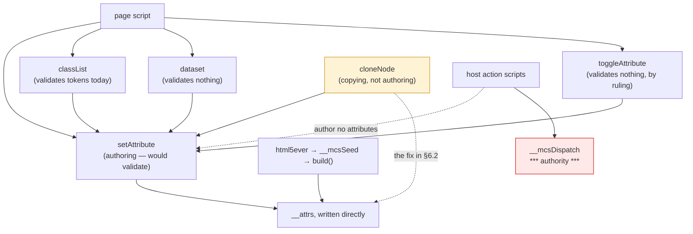

# Attribute-name validation: every write path, and what validating would break

Design and read-only measurement only. No product code, no court frozen, no
handle widening, no navigation soak, no surface path. The variant that made
the measurements was built in a throwaway worktree that has been removed.
Measured on `78bd78a` / binary `eaf4de9b68b6…`.


## 1. Every path that writes an attribute

Enumerated from the sources and confirmed by probe, not by reading alone:

| path | where | what it does today |
| --- | --- | --- |
| `setAttribute(name, value)` | base | lowercases, stores, records — **validates nothing** |
| `removeAttribute(name)` | base | lowercases, removes if present — validates nothing, which **matches the standard** |
| `id` and `className` setters | base | route to `setAttribute`; the *value* is free-form in the standard too |
| `build()` / `__mcsSeed` | base | writes `__attrs` **directly**, never through `setAttribute` |
| `classList` add/remove/toggle and the `value` setter | main extension | validates its **tokens** (`SyntaxError`, `InvalidCharacterError`) and then writes `class` through `setAttribute` |
| `dataset` setter | main extension | builds `data-` + kebab and writes through `setAttribute` — **validates nothing** |
| `toggleAttribute` | main extension | writes through `setAttribute`/`removeAttribute` — validates nothing, by ruling |
| `cloneNode` | main extension | copies every attribute through `setAttribute` |
| host action scripts | host | **none**: they write IDL state (`value`, `checked`, `selectedIndex`), never attributes |

## 2. What each accepts today, measured

`setAttribute` accepts **every** name I could think to try: `"a b"`, `""`,
`'a"b'`, `"a/b"`, `"a<b"`, `"a=b"`, `"1abc"`, `"a:b"`, `"-x"`, `"éx"`. A
browser throws `InvalidCharacterError` for all but the last two.
`removeAttribute("a b")` is accepted, as it should be. `classList.add("a b")`
already throws `InvalidCharacterError`. `dataset["a b"] = 1` is accepted and
creates `data-a b`, where a browser throws.

**And the parser produces names a validator would reject.** A document with
`<p id=odd data-ok=1 weird:name=2 1bad=3>` yields
`getAttributeNames() = 1bad | data-ok | id | weird:name`. That is what
browsers do too — HTML parsing is lenient where `setAttribute` is strict — and
it is why `build()` writing `__attrs` directly is correct rather than sloppy.


## 3. What validating `setAttribute` would break, demonstrated

A scratch build with a Name-production validator on `setAttribute`, on a page
whose element carries the parser-produced `1bad`:

```
clone   = threw:InvalidCharacterError
reset   = threw:InvalidCharacterError   (setAttribute('1bad', …) on the element that already has it)
read    = 3                              (getAttribute still answers)
remove  = ok                             (removeAttribute still works)
dataset = threw:InvalidCharacterError    (dataset['a b'] — correct, though the standard names it SyntaxError)
```

The third line is the finding. **`cloneNode` copies through `setAttribute`, so
validating `setAttribute` makes cloning a parser-produced element throw** —
and every court passes anyway, because no fixture clones an element carrying a
name the parser accepted and the validator would not. A browser has no such
problem: its clone copies attributes internally, never through the authoring
path.

The second line matches browsers exactly: an attribute the parser created can
be read and removed but not re-authored under a name `setAttribute` rejects.


## 4. Cost, measured

| | current `78bd78a` | with the validator in the base |
| --- | ---: | ---: |
| M1 (system) | 224,458 | **226,762** |
| M2 (system) | 1,569,708 | **1,585,836** |
| M1 headroom under the 245,760 floor | 21,302 | **18,998** |

**+2,304 bytes of M1 per child**, because the validator lives in the base where
every realm compiles it — this is the first candidate since the focus model to
cost child realms at all. The floors hold with room, and `element-view`,
`element-api`, `form` and `frame-actions` all still pass on that build.


## 5. The tree

```
Should authoring an attribute be checked, and what breaks if it is?
├── A. The authoring path (owner: the base's setAttribute)
│   invariant: a name a page authors is a Name, or the call throws InvalidCharacterError
│   evidence: §2's ten accepted names, all but two of which a browser refuses
│   safe failure: accept everything, as today, and record the loss
│   dependency: none — no host script authors attributes
│   non-goal: validating removeAttribute, which the standard does not
├── B. The parser path (owner: build / __mcsSeed)
│   invariant: what html5ever produced is stored as it produced it
│   evidence: 1bad and weird:name present in a parsed document
│   safe failure: —
│   dependency: writes __attrs directly, so validation cannot reach it
│   non-goal: making the parser's output conform to the authoring rule
├── C. The copying path (owner: cloneNode — §3, and the reason this is a ruling)
│   invariant: copying is not authoring; a copy carries what exists
│   evidence: the scratch build's clone=threw
│   safe failure: a clone that throws is at least loud, but it is a regression against today
│   dependency: today it goes through setAttribute
│   non-goal: leaving a copy silently short of an attribute
└── D. The derived paths (owner: classList, dataset, toggleAttribute)
    invariant: whatever they do, they agree with A
    evidence: classList already validates tokens; dataset validates nothing
    safe failure: —
    dependency: all of them write through setAttribute
    non-goal: three different answers to what a name is
```


## 6. The loss matrix, and the consistency risks

| case | today | with validation | note |
| --- | --- | --- | --- |
| `setAttribute("a b", …)` | accepted | throws `InvalidCharacterError` | the point of the slice |
| `setAttribute("", …)` | accepted | throws | " |
| `setAttribute("1abc", …)` | accepted | throws | matches browsers |
| `setAttribute("a:b", …)`, `"éx"` | accepted | accepted | valid Names |
| `removeAttribute("a b")` | accepted | accepted | the standard does not validate removal |
| reading a parser-made `1bad` | works | works | matches browsers |
| **cloning an element with `1bad`** | works | **throws** | **§3 — the regression** |
| `dataset["a b"] = 1` | accepted | throws | correct, but the standard names it `SyntaxError`, not `InvalidCharacterError` |
| `classList.add("a b")` | throws | throws | already right |
| a host action | unaffected | unaffected | host scripts author no attributes |

Two consistency risks worth naming:

1. **Three vocabularies for one idea.** `classList` throws
   `InvalidCharacterError` for a bad token and `SyntaxError` for an empty one;
   the standard wants `SyntaxError` from `dataset` and `InvalidCharacterError`
   from `setAttribute`. If validation lands, all three should be decided
   together rather than each picking a name.
2. **Copying versus authoring.** If §3 is resolved by letting `cloneNode`
   write `__attrs` directly — which the extension can do without the handle
   growing, exactly as `build()` does — then the host has one authoring rule
   and one copying rule, which is what a browser has. If it is resolved any
   other way, either clones start throwing or the validator gets a bypass that
   page script can reach.


## 7. Where it sits




## 8. Boundaries and assumptions

- The validator would live in the **base**, because `setAttribute` does, so it
  costs every child realm — 2,304 bytes of M1 — and this is the first
  candidate since the focus model to cost children at all.
- No host script authors an attribute, so no host action can be broken by
  validation; the risk is entirely page-facing plus the `cloneNode` path.
- The parser path is untouched and must stay untouched: what html5ever
  produced is what the document holds.
- One court run per variant, one machine, scratch build removed.


## 9. What I need ruled

1. **Whether to validate at all**, at 2,304 bytes of M1 per child, for a rule
   that only page-authored names ever break.
2. **§3 first, whichever way that goes**: `cloneNode` must stop copying
   through the authoring path before any validator lands, or clones of
   ordinary parsed documents start throwing. The cheap fix is for the copy to
   write `__attrs` directly, as `build()` does — no handle widening, no base
   growth — and it is also the honest one, because copying is not authoring.
3. **One vocabulary for names**, decided across `setAttribute`, `dataset` and
   `classList` together rather than one at a time.
