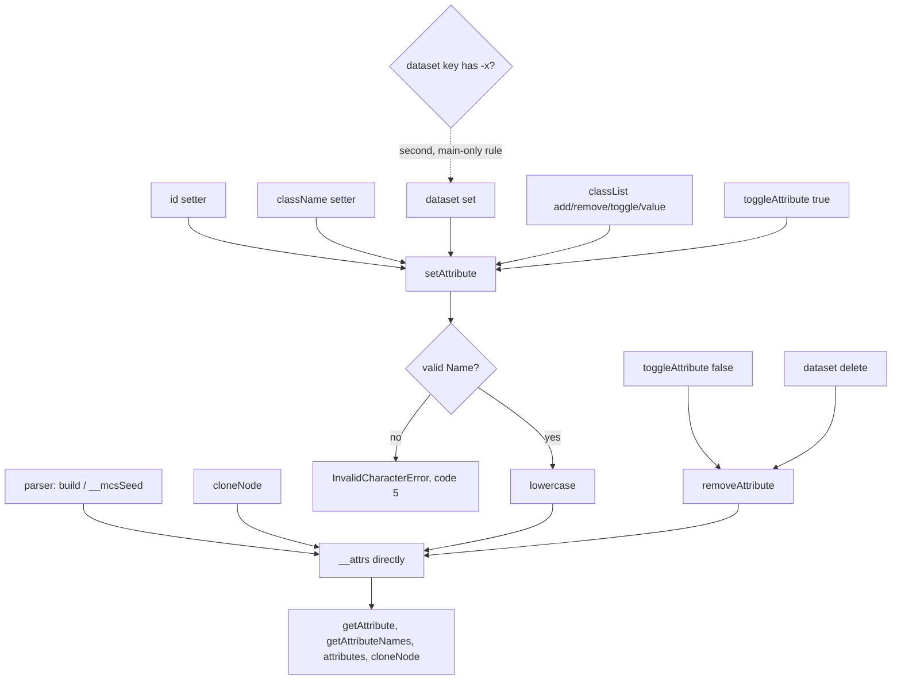

# Attribute-name validation — re-audit, 0.0.2

Design-only. Nothing implemented, no implementation court frozen, the handle
does not widen, no cap or floor proposed, no navigation or visual path run.
Two throwaway builds carried candidates for measurement and went away with
their worktree.

This supersedes the measurements in `attribute-name-validation-audit-0.0.1.md`
without erasing them. Two things changed under it, and both change the answer:
the clone now copies internally (`clone-node-audit-0.0.1.md` §11), so the
regression that audit found is no longer reachable, and the base now captures
a real `DOMException` (`error-class-audit-0.0.1.md` §9), so the vocabulary this
slice needs already exists and costs nothing to reach.

## 1. Every path into an element's attribute map

```
  parser (build / __mcsSeed)  ------------------> __attrs.set        [not authoring]
  cloneNode (main)            ------------------> __attrs.set        [not authoring]

  id setter -------+
  className setter +
  dataset set -----+--> setAttribute(name, value) --> lowercase --> __attrs.set
  classList writes +        ^                                          [authoring]
  toggleAttribute -+        |
                            +-- the one place a validator belongs

  toggleAttribute(false) --+
  dataset delete ----------+--> removeAttribute(name) --> lowercase --> delete
                                                            [lenient, by standard]
```



Six authoring surfaces funnel through one `setAttribute`, which is why the
whole slice is one guard in the base and not six.

## 2. What the parser produces, measured

A document carrying deliberately awkward names, read back on the shipped build
`7545d393b69c…` through `getAttributeNames()`:

```
-lead, .dot, 1bad, aé, id, ok-name, under_score, upper, weird:name, x.y
```

Ten names, all preserved; `UPPER` arrives lowercased by the parser. **The deep
clone carries all ten**, measured on the same build — the regression
`0.0.1` found is gone, because copying no longer re-authors.

## 3. What authoring accepts, today and under the candidate

Candidate V1: one guard in `setAttribute`, the XML `Name` production as an
ASCII regex, throwing the base's captured `DOMException`.

| authoring call | today | V1 | a browser |
| --- | --- | --- | --- |
| `setAttribute("1bad", …)` | accepted | **`InvalidCharacterError`, code 5** | `InvalidCharacterError` |
| `setAttribute("a b", …)` | accepted — an attribute literally named `a b` | **throws** | throws |
| `setAttribute("", …)` | accepted | **throws** | throws |
| `setAttribute('a"b', …)` | accepted | **throws** | throws |
| `setAttribute("ns:x", …)` | accepted | accepted | accepted |
| `setAttribute("MiXed", …)` | stored as `mixed` | stored as `mixed` | stored as `mixed` |
| `toggleAttribute("1bad")` | accepted | **throws**, through `setAttribute` | throws |
| `removeAttribute("1bad")` | lenient | lenient | lenient |
| `element.id = …`, `className = …` | via `setAttribute` | validated with it | same |
| `dataset.fooBar = …` | `data-foo-bar` | `data-foo-bar` | `data-foo-bar` |
| `dataset["a-b"] = …` | `data-a-b` | `data-a-b` | **`SyntaxError`** |
| `dataset["1x"] = …` | `data-1x` | `data-1x` | `data-1x` (a valid name) |
| a parsed `1bad`, and its clone | preserved | **preserved** | preserved |

Candidate V2 adds the one rule V1 cannot reach from the base: a dataset key
carrying a dash before a lowercase letter throws `SyntaxError`, measured
`dataset["a-b"] → threw:SyntaxError`. It is a plain named `Error`, matching
`classList` beside it, so the main extension needs no second capture.

## 4. Cost, measured

Against the shipped `7545d393b69c…`, `child-frame-court` and
`shim-footprint-court` on both allocators:

| | M1 (system) | Δ per child | M2 | main-only slack |
| --- | --- | --- | --- | --- |
| shipped | 224,762 | — | 1,571,836 | 38,800 |
| **V1** — the guard in `setAttribute` | 225,626 | **+864** | 1,577,884 (+6,048) | 39,584 |
| **V2** — V1 plus the dataset rule | 225,626 | +864 | 1,577,884 | 40,384 |

M2 is exactly seven times the M1 delta, so the cost is per-child with no
super-linear term. V2 costs **nothing per child** over V1 and 800 bytes of
main-only slack, because the dataset rule lives in the main extension.

**Floors of 245,760 and 1,720,320 are untouched, leaving 20,134 bytes of M1
headroom**, and the slack stays far inside 65,536. This is a third of the
`0.0.1` estimate of +2,304 per child, because that candidate carried its own
error helper and this one throws the constructor the base already captured.

Every court that could notice passes on V1: `element-view` 23/23 — **including
the clone criterion, which is the whole reason this is now safe** — `dataset`
15/15, `element-api` 28/28, `error-class` 27/27, `page-error-redaction` 23/23,
`child-frames` 82/82, `form` 179/179, `frame-actions` 182/182,
`page-navigation` 80/80. On V2, `dataset` 15/15 and `element-view` 23/23.

## 5. Loss matrix

| the page expects | after V1 (+V2) | why |
| --- | --- | --- |
| a bad name rejected, standard class and code | **served** — `InvalidCharacterError`, code 5, `[object DOMException]` | the base's captured constructor |
| the name validated before it is lowercased | **served** | the guard runs on the string as given |
| `removeAttribute` to stay lenient | **served** | the standard does not validate there either |
| a parsed `1bad` to survive, and to clone | **served** | the parser and the copy write the map directly; measured on ten such names |
| a non-ASCII but legal name, e.g. `aé` | **not served** — authoring throws | the guard approximates the XML `Name` production in ASCII; the parser still produces it and the clone still carries it, so a page can read and copy a name it may not write |
| `dataset["a-b"]` to throw `SyntaxError` | V1 no, **V2 yes** | the rule is about the key, which only the main extension sees |
| that `SyntaxError` to be a `DOMException` | **not served** | it is a plain named `Error`, like `classList` beside it, by the ruling that kept that vocabulary |
| a value validated as well as a name | never | out of scope; no path validates values |
| the host to reject a bad name too | not applicable | the host authors no attributes: `setAttribute` appears in no `.rs` file |
| the offending name in the thrown message | **not served** | the message names the fault, not the string, and the host's `details` carries neither |

The ASCII approximation is the honest cost of this slice and the one place it
diverges from a browser in the *strict* direction. It is written here rather
than discovered: this host will refuse to author a handful of names a browser
would accept, and will keep faithfully reading and copying those same names
when a document brings them in.

## 6. Dependencies

- **One guard, six surfaces.** `id`, `className`, `dataset`, `classList`,
  `toggleAttribute` and `setAttribute` itself all validate by construction,
  because they share the funnel. No new handle, no base-to-main call.
- **The vocabulary already exists.** The base captured `DOMException` in
  `7132bb9`; this slice reaches it as a local. Nothing is captured twice.
- **The parser and the copy are outside.** `build`/`__mcsSeed` and `cloneNode`
  write `__attrs`, by two earlier rulings, and that is what keeps §2 true.
- **The host is uninvolved**, and the redaction keeps it that way: an uncaught
  throw still says one fixed word, so nothing about a page's attribute names
  reaches a control answer.
- **Courts that read names**: `element-api-court.py:302` reads the two
  `classList` names, unchanged; the frozen clone criterion in
  `element-view-court.py` is the one that made this safe and stays as it is.

## 7. Pending rulings

1. **Take V1** — the guard in `setAttribute`, `InvalidCharacterError` with code
   5, at +864 bytes per child and 20,134 bytes of remaining M1 headroom.
2. **ASCII or unicode.** V1 approximates `Name` in ASCII. A fuller table costs
   bytes that are **not measured here** and buys the ability to author names
   like `aé`. Recommendation: take ASCII, record the loss, and price a wider
   table only if a real document needs one.
3. **Take V2 as well**, at 800 bytes of main-only slack, or leave the dataset
   key rule alone and record it in the loss matrix as a permanent divergence.
   Recommendation: take it — it is the only rule the standard states that this
   host would otherwise silently violate.
4. **May the thrown message name the offending attribute?** It is the page's
   own string going back to the page, and the host's `details` cannot carry it
   since the redaction. The candidates deliberately do not, so this is a
   ruling, not a fact.
5. **What the implementation court must falsify**, when it is frozen: the
   acceptance table of §3 in both directions, the parser's ten names surviving
   and cloning, `removeAttribute` staying lenient, validation before
   lowercasing, `classList`'s vocabulary unchanged, and the redaction still
   answering with its one fixed word.


## 8. Ruled

V1 and V2 are both accepted, as measured.

The guard sits in the `setAttribute` funnel, approximates the XML `Name`
production in ASCII, and throws the base's captured `DOMException` named
`InvalidCharacterError` with code 5. It runs **before** the name is
lowercased. `ns:x` is accepted, as measured. The ASCII approximation is
accepted **as an explicit loss**: a page will not be able to author a
non-ASCII name such as `aé`, while the parser still produces it, the clone
still carries it, and every read still returns it. `build`/`__mcsSeed` and
`cloneNode` write the map directly and are untouched — the parser and a copy
are not authoring. `removeAttribute` and `toggleAttribute(false)` stay
lenient.

V2 is taken with it: a `dataset` key carrying a dash before a lowercase letter
throws `SyntaxError` as a plain named `Error`, in the main extension, matching
the vocabulary `classList` keeps beside it. `classList` itself does not move.

**The message a page catches carries neither the offending name nor the
value.** It says what the fault was, not what was written, so a page's own
string is not handed back inside an error object it may then log; the host's
`details` keeps saying its one fixed word regardless.

The implementation court is frozen before the code, covering all six funnel
paths, the parser's ten awkward names surviving a deep clone, `removeAttribute`
and `toggleAttribute(false)` staying lenient, `toggleAttribute(true)` throwing
through the funnel, the lowercasing order, V2's dataset rule, `classList`
unchanged, the message carrying nothing of the page's, and the redaction still
answering with its fixed word. The floors and the slack are measured by the
child-frame and shim-footprint courts on the same binary, and a failure there
stops the slice rather than moving a floor.
