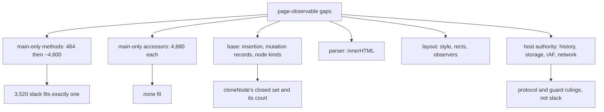

# Page-observable gaps under a 3,520-byte budget — read-only triage, 0.0.3

Design-only. Nothing implemented, no court frozen, the handle does not widen,
no cap or floor proposed or moved, no navigation, visual or surface path run.
Throwaway builds carried the price probes and went away with their worktree.
The three standing guards hold: the handle's exact key set, `AbortSignal.any`
absent, and no host path aborting a page's signal except the timer
`timeout()` minted for it.

**The headline is the budget, not the inventory.** With 3,520 bytes of
main-only slack left, the measured price of adding page surface is such that
**one plain method fits and nothing else does** — not two methods, and not a
single accessor.

## 1. The mechanical inventory

Sixty-nine page-observable names probed on the shipped `e8f85cf59354…`.
Present: `children`, `replaceChildren`, `cloneNode`, `contains`, `matches`,
`closest`, `tagName`, `querySelector`, `querySelectorAll`, `classList`,
`documentElement`, `head`, `body`, `title`, `readyState`, `clearTimeout`,
`queueMicrotask`, `navigator`, `btoa`, `atob`, `Headers`, `Response`, `fetch`,
`MutationObserver`, `localStorage`, and the engine's own `Promise`, `Proxy`,
`Reflect`.

Missing, grouped by what it would take to serve them:

| group | names | what it needs |
| --- | --- | --- |
| **main-only, method-shaped** | `hasAttributes`, `getElementsByTagName`, `getElementsByClassName` (element and document), `setInterval`/`clearInterval`, `structuredClone` | nothing but slack |
| **main-only, accessor-shaped** | `firstElementChild`, `lastElementChild`, `childElementCount`, `nextElementSibling`, `previousElementSibling`, `hidden`, `namespaceURI`, `outerHTML` | slack, and ten times as much per member — §2 |
| **base** | `insertBefore`, `replaceChild`, `prepend`, `before`, `after`, `replaceWith`, `createDocumentFragment`, `createComment`, `getAttributeNode` | insertion primitives and mutation records live in the base; new node kinds also touch `cloneNode`'s closed set and its court |
| **parser** | `innerHTML`, `insertAdjacentHTML` | a page-driven parser the host does not have; the host parses documents, not fragments |
| **layout** | `style`, `getComputedStyle`, `getBoundingClientRect`, `scrollIntoView`, `offsetWidth`, `clientWidth`, `matchMedia`, `screen`, `IntersectionObserver`, `ResizeObserver` | there is no layout engine, and no design proposes one |
| **host authority or protocol** | `history`, `sessionStorage`, `requestAnimationFrame`, `XMLHttpRequest`, `WebSocket`, `Blob`, `FormData`, `crypto`, `indexedDB`, `caches` | navigation authority, profile persistence, a frame clock, or network paths the control protocol owns |

Two probe artefacts, recorded so the table is not read wrong:
`getElementById`, `getElementsByTagName` and `getElementsByClassName` were
probed on an *element*; `getElementById` does not exist on `Element` in a
browser either, and `document.getElementById` is present in this host.

## 2. What a member costs now, measured

All on the shipped binary at 62,016 of the 65,536 bound, each built and
measured with `shim-footprint`:

| addition | slack | delta | verdict |
| --- | --- | --- | --- |
| **one plain prototype method** | 62,480 | **+464** | **fits, 3,056 left, 18 of 18** |
| two plain methods | 67,072 | +5,056 | over by 1,536 |
| five plain methods | 69,024 | +7,008 | over |
| **one `defineProperty` accessor** | 66,896 | **+4,880** | **over by 1,360** |
| two accessors | 67,616 | +5,600 | over |
| five accessors | 69,344 | +7,328 | over |

Two things follow, and both are design rules worth keeping:

1. **Accessors are roughly ten times a method here.** A single
   `defineProperty` getter costs 4,880 where a plain method costs 464. Any
   future design that can express itself as a method should.
2. **The price is block-quantized and the current fill sits near a
   boundary.** One method lands inside the block; the second crosses it and
   pays for a whole new one. That is why "five accessors" and "five methods"
   land within 300 bytes of each other while one of each differs tenfold.

Earlier calibration on a less-full extension read 512 to 832 bytes per method,
so **the per-member price is not a constant of the design — it is a function
of where the current fill sits**, and must be re-measured before each slice
rather than extrapolated.

## 3. The tree

```
   page-observable gaps
        |
        +-- main-only, methods ....... 464 for the first, ~4,600 for the second
        |     hasAttributes, getElementsByTagName/ClassName, setInterval
        |
        +-- main-only, accessors ..... 4,880 each, over budget on their own
        |     first/lastElementChild, next/previousElementSibling, hidden
        |
        +-- base ..................... insertion primitives, mutation records,
        |     insertBefore, prepend,       new node kinds touch cloneNode's
        |     createDocumentFragment       closed set and its frozen court
        |
        +-- parser ................... innerHTML, insertAdjacentHTML
        +-- layout ................... style, rects, observers, matchMedia
        +-- host authority ........... history, sessionStorage, rAF, XHR,
              WebSocket, crypto, indexedDB   -> protocol and guard questions
```



## 4. Loss matrix, for the affordable shortlist only

| candidate | shape | measured | value | risk |
| --- | --- | --- | --- | --- |
| `hasAttributes()` | method | +464 | low — a page can already read `getAttributeNames().length` | none: no authority, no reentrancy, no realm effect |
| `getElementsByClassName(n)` | method | +464 as the first member | **high for older pages**, which use it instead of `querySelectorAll` | returns a plain array, like `querySelectorAll` — the live-`HTMLCollection` loss is already recorded |
| `getElementsByTagName(n)` | method | same | high, same reason | same |
| `setInterval`/`clearInterval` | two methods | over budget as a pair | moderate | **interacts with the timer reserve just ruled**: an interval holds a slot indefinitely, so the 16/48 split would need re-reasoning |
| any of the sibling or child accessors | accessor | +4,880 each | moderate | none beyond cost |

## 5. What this triage recommends

**Take at most one method, or hold.** The honest reading of §2 is that this
host is at a block boundary, so the next member is cheap and the one after it
is not. If a member is taken, `getElementsByClassName` is the one I would
argue for: it is what older pages actually call, it reuses the selector engine
unchanged, it is a method rather than an accessor, and it carries no
authority, reentrancy or lifetime question at all.

Holding is also defensible: 3,056 bytes of slack after one method is a thin
reserve for a host that has spent this whole batch discovering that shapes
cost more than they look.

**Nothing else on the list is a slack question.** The base group needs
insertion primitives and would touch `cloneNode`'s frozen closed set; the
parser, layout and host-authority groups each need a design and a ruling
before a byte is spent. Recording them here is the point: they are not
forgotten, they are priced out for different reasons than cost.

## 6. Pending rulings

1. **One method, or none.** If one: which — my recommendation is
   `getElementsByClassName`.
2. **Whether to re-open slimming** now that §2 gives it a price: the
   comment strip measured 832 and the accessor price is 4,880, so prose can
   never fund an accessor. That was not knowable before this triage.
3. **`setInterval`** deserves its own audit rather than a slot here, because
   of the timer reserve it would sit inside.
4. **The base group** — insertion and node kinds — as a single design if it is
   ever wanted, since they share the same machinery and the same court.


## 7. Ruled

**`getElementsByClassName` is taken, and nothing else**: no other method, no
accessor, no `setInterval`, no base insertion group. The cost gate is the
measured **+464**, taking main slack from 62,016 to about 62,480 with roughly
3,056 left; the bound does not move, the handle does not widen, the base does
not grow, and no capability is removed to pay for it.

**One member serves both call surfaces.** `querySelectorAll` lives on
`Node.prototype` in the base and both `Element` and `Document` extend `Node`,
so defining `getElementsByClassName` there once gives a page
`document.getElementsByClassName(…)` and `element.getElementsByClassName(…)`
for the price of a single member. Two separate definitions would have cost
two, which §2 measured at 5,056 and would not fit.

**It adds no authority, no reentrancy and no lifetime semantics.** It reads
the tree through the same selector engine a page can already call, runs no
listener, mints no event, touches no host state and owns nothing that outlives
the call.

The shape it must have, so the court can pin it:

- a class list is space-separated and means **all of them**: `"a b"` finds
  elements carrying both, which is why it cannot be a bare `"." + name`;
- the argument is trimmed, and an empty or whitespace-only one returns an
  empty result rather than throwing;
- matching is **case-sensitive**, as the engine already matches classes;
- the result is a **plain array in document order**, non-live, exactly like
  `querySelectorAll` — the live `HTMLCollection` is a loss already recorded
  for that method and is inherited here rather than newly introduced;
- a class name this host's selector engine cannot express returns an **empty
  result and does not throw**, because the standard method never throws; that
  is a new recorded loss and the court pins it.

The implementation court is frozen before the code and covers both call
surfaces, case, whitespace, multi-class conjunction, duplicates, empty
results, document order, detached subtrees, the plain-array non-live shape,
the inexpressible-name loss, the absence of the member in a child realm, owner
release, the unchanged handle key set, and the main-slack bound on the same
binary.
