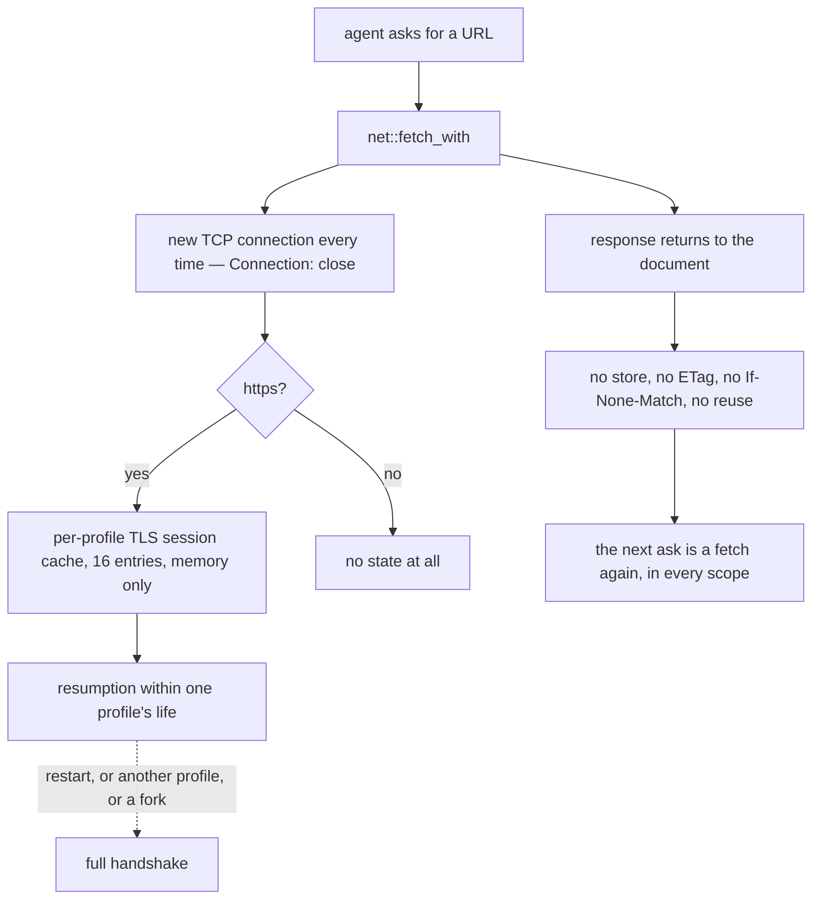

# Cache (P6) — design-only audit, 0.0.1

Read-only and design-only, from `579820e`. Nothing implemented, no court
frozen, no handle, base or bound changed, no visual run, no navigation soak,
and **nothing fetched from outside the fixtures in this file**.

**One cache exists and it is not the one the question is usually about. There
is no HTTP response cache at any scope — proven, not assumed.**

## 1. What exists: a TLS session cache, per profile

`net.rs` builds one rustls client per profile:

```rust
config.resumption = rustls::client::Resumption::store(Arc::new(
    rustls::client::ClientSessionMemoryCache::new(TLS_SESSION_CACHE_ENTRIES),  // 16
));
```

| property | value |
| --- | --- |
| scope | **one client per profile** (`Profile.tls`, minted by `tls_client()`) |
| size | **16 entries**, chosen because rustls rounds anything below 16 to a single server slot its eviction empties at once |
| storage | `ClientSessionMemoryCache` — memory only, never a file |
| across profiles | never shared: each profile mints its own client |
| across restarts | gone; `secure-cookie-court.py:242` already pins that a restarted host's first https fetch is a **full handshake** |
| a copy-on-write fork | the child mints its own client, so it inherits **no** session tickets |

That court also pins the first-fetch-is-a-full-handshake property, so the TLS
cache is already governed. This audit adds nothing to it.

## 2. What does not exist: any HTTP response cache

Measured on one hermetic origin serving `Cache-Control: max-age=3600`, an
`ETag` and a `Last-Modified`, counting server hits:

| the agent does | page fetches | script fetches |
| --- | ---: | ---: |
| first open | 1 | 1 |
| reload | **2** | **2** |
| navigate away and back | **3** | 4 |
| second target, same session | **4** | 5 |
| second session, same profile | **5** | 6 |
| second profile | **6** | 7 |
| **after a host restart** | **7** | 8 |

Every scope re-fetches. And the host never revalidates: across thirteen
requests the only headers it ever sent were **`accept`, `connection`, `host`,
`user-agent`** — no `If-None-Match`, no `If-Modified-Since`. `Cache-Control`,
`ETag` and `Last-Modified` are read by nothing.

Connections are not pooled either: thirteen fetches opened **thirteen TCP
connections**, which follows from the `Connection: close` every request carries.

Nothing accumulates from repetition: twelve reloads left the tracked realm
bytes **identical** (329,088 → 329,088). Process malloc rose 480,976 → 537,696,
about 4.7 KB per reload, which is ledger and allocator noise rather than stored
responses — there is nothing to store them in.



## 3. Owners, invariants, evidence

- **Owner**: the TLS session cache belongs to the profile and dies with it. No
  other cache has an owner because no other cache exists.
- **Invariants that hold today, for free**: nothing survives a restart; nothing
  crosses a profile; nothing crosses a fork; a readonly session writes nothing
  because there is nothing to write; a page cannot make the host serve a stale
  body, because the host has no body to serve.
- **Evidence**: §1 read from `net.rs` and `main.rs`; §2 measured over seven
  scopes plus a restart, with the server's request log and header list as the
  witness.

## 4. If a response cache were added: what it would cost and break

| dimension | consequence |
| --- | --- |
| **Isolation** | it must be per profile, or it becomes a cross-profile channel — the same rule the cookie jar and the TLS cache already follow |
| **Memory** | a cache is retained bytes; `MAX_ACCOUNTED_BYTES_PER_PROFILE` is 131,072, and the history audit already showed how fast that budget is consumed. A response cache needs its **own** budget, not a share of that one |
| **D6** | D6 is measured in RSS, and on the system arm nothing is returned on close, so a cache would raise the high-water mark permanently. It must be measured on the **arena** arm |
| **G1** | the comparison baseline counts fetches; a cache changes fetch counts, so any G1 run would have to state whether the cache was warm. Today that question cannot arise |
| **Disk** | a persistent cache means bodies in the profile record, which is sealed — every hit would decrypt, and every store would re-seal the whole record at ~12 ms, as the copy-on-write audit measured |
| **Downloads** | a download is a fetch; a cached download is a body the agent believes it fetched now. It should be excluded explicitly, as it was from history |
| **Security** | `Vary`, `Set-Cookie` in a cached response, credentialed responses, and cache poisoning by a page that controls a subresource — each is a ruling of its own, and none of them exists today |

## 5. Loss matrix

| | no cache (today) | memory cache | persistent cache |
| --- | --- | --- | --- |
| fetch count | one per use, always | fewer, unpredictably | fewest |
| cross-profile leakage | impossible | possible if scoped wrong | possible if scoped wrong |
| survives restart | nothing does | no | **yes** — a new retention class |
| D6 | unaffected | raises the high-water mark | raises it, plus record size |
| readonly session | writes nothing | must be ruled | must be ruled |
| a stale body reaching an agent | impossible | possible | possible |
| implementation surface | none | budget, eviction, `Vary` | all that, plus sealing and I/O |

## 6. Dependencies and non-goals

- **Dependencies**: none today. A cache would depend on the profile budget
  ruling, the D6 measurement discipline, and the download exclusion.
- **Non-goals for this audit**: adding any cache; changing the TLS cache's 16
  entries; connection pooling, which is a different question with its own
  latency and isolation trade-offs; anything touching `Connection: close`.

## 7. Court draft, if a cache is ever ruled in

1. A response served from cache is never served across profiles.
2. A restart serves nothing from cache unless persistence was ruled in, and
   then only within the profile that stored it.
3. A fork inherits no cache entries — the same answer history got.
4. A readonly session neither stores nor evicts.
5. `Cache-Control: no-store` is honoured, and a response with `Set-Cookie` is
   not stored.
6. A download is never served from cache.
7. The cache has its own budget and cannot consume the profile's accounted
   bytes; exhausting it evicts rather than refusing a fetch.
8. Tracked bytes and arena-arm RSS are measured before and after, and stated.

## 8. Court draft for what exists today

These would pass now and are worth pinning if the cache question is revisited:

1. The same URL fetched in two profiles produces two server requests.
2. A restart re-fetches, and the first https fetch is a full handshake
   (already `secure-cookie-court.py:242`).
3. The host sends no `If-None-Match` or `If-Modified-Since`.
4. Twelve reloads leave the tracked realm bytes unchanged.

## 9. Pending rulings

1. Whether a response cache is wanted at all. The measurement says the current
   answer is coherent: no cache, no revalidation, no pooling, and therefore no
   staleness, no cross-profile channel and no new retention class.
2. If it is wanted, memory-only or persistent — §4's disk row is the expensive
   one, because the profile record is sealed and rewritten whole.
3. Whether §8 is worth freezing as a court now, to pin the absence rather than
   rediscover it.

---

## 10. Ruled — 2026-09-06: the absence is the design

No HTTP response cache is implemented, and the status quo is now a decision
rather than a gap. The per-profile 16-slot TLS `ClientSessionMemoryCache` stays
as it is, governed by `secure-cookie-court.py`.

**§8's four criteria are adopted into the record.** They describe what must
remain true, and each is measured in §2 rather than assumed:

1. The same URL asked for in two profiles produces **two** server requests —
   nothing crosses a profile.
2. A restart re-fetches, and the first https fetch is a full handshake — nothing
   survives a host's life. (Already pinned at `secure-cookie-court.py:242`.)
3. The host sends **no** `If-None-Match` and no `If-Modified-Since`: it never
   revalidates, so no cache directive can make it serve a body it did not just
   receive.
4. Twelve reloads leave the tracked realm bytes **unchanged** — repetition
   accumulates nothing.

To those four, §2 adds the reload, navigate-back and second-target results and
the thirteen-connections measurement, which are the same property seen from
other angles.

**If the requirement ever appears**, it does not begin with code. It begins
with its own round: a protocol shape, a budget of its own, an isolation ruling,
and a court measured on the **arena** arm because D6 is RSS. Downloads are
excluded by name from the start, as history was. And the G1 question must be
settled in the same round: a comparison run would have to declare whether the
cache was warm, which is a question that cannot arise today.

Nothing in this round changed code, the handle key set, the base, or any bound.
