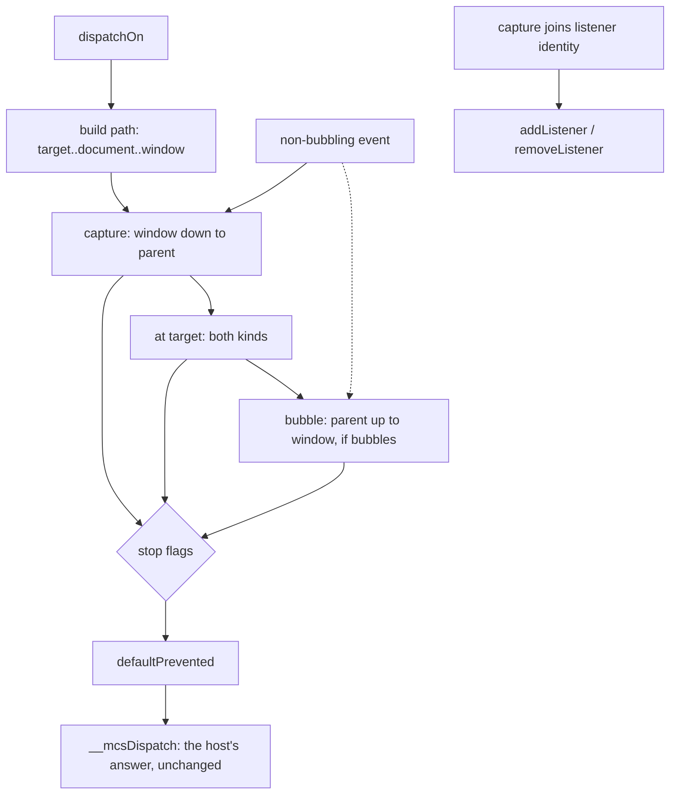

# The capture phase (L4) — read-only audit, 0.0.1

Design-only. Nothing implemented, no implementation court frozen, the handle
does not widen, no cap or floor proposed, no navigation or visual path run.
One throwaway build carried the candidate and went away with its worktree. L3
`passive` and L5 `signal`/`AbortController` stay deferred and untouched.

This deepens §3's L4 row in `listener-options-audit-0.0.1.md` with the
measurements that row did not have: the authority boundary around the host's
own synthesized events, the stop-flag interactions, and what happens to a
non-bubbling event.

## 1. What the path is today, and what it would become

Measured on the shipped `799895aab740…` against a candidate built on it. The
fixture is `document > #box > #go`, with a listener at every level.

| probe | shipped | candidate | the standard |
| --- | --- | --- | --- |
| order, bubbling event | `target > box-cap > box-bub > doc-cap > win-bub` | **`doc-cap > box-cap > target > box-bub > win-bub`** | capture down, target, bubble up |
| `window` first | `target > doc-cap > win-cap` | **`win-cap > doc-cap > target`** | window is the outermost |
| `eventPhase` values | `2,3,3` | **`1,2,3`** | 1, 2, 3 |
| a **non-bubbling** event | `target` only | **`box-cap > target`** | ancestors still capture |
| `stopPropagation` in capture | `target > box-cap` — the target already ran | **`box-cap`** only | capture can stop the rest |
| `stopImmediatePropagation` in capture | `target > cap1` | **`cap1`** | first capture listener only |
| both flags at the target | `cap-reg > bub-reg` | `cap-reg > bub-reg` | both run at the target |
| `remove(t, f, false)` after `add(t, f, true)` | **removes it** — 0 runs | **1 run**: capture is identity | does not remove |
| `add(t,f,true)` + `add(t,f,false)` | 1 registration | **2** | 2 |
| `once` + `capture` | 1 | 1 | 1 |
| `handleEvent` + `capture`, then remove with `true` | 1 | 1 | 1 |

Three of those lines are the reason the rung exists: today there is **no
capture phase at all**, a non-bubbling event never leaves its target, and
`removeEventListener` with the wrong flag **removes a listener it must not**.

## 2. The authority boundary, measured on both builds

This is what the ruling asked to have pinned down, and it separates cleanly
into a page-visible ordering change and a host decision that does not move.

**What changes.** A page's capture listener now runs *before the target's own
listener* on the host's synthesized click, and `stopPropagation()` there
suppresses the target's listener entirely:

| host-driven click, page has a document-level capture listener that stops propagation | shipped | candidate |
| --- | --- | --- |
| the page's document listener ran | yes | yes |
| **the target's own listener ran** | **yes** | **no** |

**What does not change.** The host's own decision is read from
`defaultPrevented` through the bridge, not from propagation, and both builds
agree exactly:

| host clicks a link, page listener at document level | shipped | candidate |
| --- | --- | --- |
| listener calls `stopPropagation()` → navigation | **happens** (`next.html`) | **happens** (`next.html`) |
| listener calls `preventDefault()` → navigation | **refused** (stays) | **refused** (stays) |
| `target.act` answer | ok, applied | ok, applied |

So the capture phase gives a page a **new place to stand, not new power**: it
can already cancel the host's default from a document-level listener today,
and it still cannot cancel by stopping propagation. What it gains is the
ability to keep the target's own page listeners from seeing an event the agent
synthesized — which is a page suppressing *itself*, not the host.

The one thing to be explicit about: a page that installs a capture listener at
`document` sees every synthesized event **before** any page code that the
document's own author registered on the target. For a page that is the subject
of an agent's actions, that is the standard behaviour a browser also has, and
the host's `__mcsDispatch` still mints the event, still owns the walk, and
still answers from hidden state.

## 3. The tree

```
                       dispatchOn(target, event)
                                |
                  path = [target, …ancestors…, document, window]
                                |
        +-----------------------+------------------------+
        |                       |                        |
   CAPTURING (1)            AT_TARGET (2)           BUBBLING (3)
   window → document        the target only         document → window
   → … → parent            both kinds of            only non-capture
   only capture records     record run              records
        |                       |                        |
        +-----------------------+------------------------+
                                |
             stop / stopImmediate honoured at every hop
                                |
                   defaultPrevented  ──────────────►  __mcsDispatch
                   (unchanged: the host's only answer)
```



Note the `NB` edge: a non-bubbling event **must** still run the capture side,
which is why the path has to be built even when `bubbles` is false. That is a
real behavioural expansion beyond "add a phase".

## 4. Cost

Measured against the shipped binary with `child-frame-court` and
`shim-footprint-court`, both allocators:

| | M1 | Δ per child | M2 | main-only slack |
| --- | --- | --- | --- | --- |
| shipped `799895aab740…` | 227,258 | — | 1,589,308 | 44,768 |
| candidate | 228,922 | **+1,664** | 1,600,956 | 46,464 |

M2 is exactly seven times the M1 delta. **This is the third independent
measurement of +1,664 for this rung** — the ladder in the listener-options
audit produced the same number on a different base — so the price is stable.
Floors of 245,760 and 1,720,320 hold, leaving **16,838 bytes of M1 headroom**,
and the slack stays inside 65,536.

Every court that could feel an ordering change passes on the candidate:
`event-fidelity` 62/62, `event-view` 11/11, `event-target` 24/24,
`listener-options` 30/30, `form` 179/179, `frame-actions` 182/182,
`page-navigation` 80/80, `lifecycle` 53/53, `child-frames` 82/82,
`shim-footprint` 18/18.

**Child impact** is the familiar one: the walk lives in the base, so every
child realm carries the extra bytes and no child can use them, because a child
runs no scripts. Nothing about this rung is main-only-able: the host's own
dispatch uses the same walk.

## 5. Loss matrix

| the page expects | after L4 | why |
| --- | --- | --- |
| capture ordering, window first | **served** | the path is walked in reverse first |
| `eventPhase` 1 during capture | **served** | the constant exists at last |
| capture in listener identity | **served**, and the wrong removal is gone | the record carries the flag |
| a non-bubbling event to reach ancestor capture listeners | **served** | the path is built regardless of `bubbles` |
| `stopPropagation` from capture to suppress the target | **served** | flags are honoured at every hop |
| `{capture: true}` and the positional `true` to mean the same | **served** | both are read |
| a capture listener on `window` for an event that does not bubble | **served** | window is in the path always |
| `passive` to stop a capture listener cancelling | **not served** — deferred rung L3 | today any listener can cancel |
| `signal` to remove a capture listener | **not served** — deferred rung L5 | no signal model yet |
| retargeting across a shadow boundary | never | no shadow DOM in this host |
| `composedPath()` | **not served** | not modelled; the path is internal |
| a listener added during the capture phase to run later in the same dispatch | **not served** | the per-hop snapshot is taken when the hop begins, which the event-fidelity design already fixes in place |

## 6. Dependencies

- **Base only**, so every child pays; the handle does not widen; the main
  extension needs no change at all — `window`'s three methods and the
  `EventTarget` class already forward options since the first rung.
- **The already-built rung composes**: `once` + `capture` spends the right
  registration (measured 1), and `handleEvent` + `capture` removes with
  `true` (measured 1). The `once` removal must pass the capture flag, or it
  removes the wrong record — that is a one-argument mistake and the court
  should pin it.
- **`__mcsDispatch` is untouched in shape.** It mints, walks and reads
  `defaultPrevented`; only the order of the page callbacks between those steps
  changes.
- **The lifecycle steps** (`DOMContentLoaded`, `load`) dispatch through the
  same walk; `lifecycle` is 53/53 on the candidate.

## 7. Pending rulings

1. **Take L4 at +1,664 per child**, leaving 16,838 bytes of M1 headroom, or
   defer again and record the three defects of §1 as standing losses.
2. **The suppression in §2** — a page's capture listener stopping the target's
   own listeners from seeing a synthesized event — is standard browser
   behaviour and no loss of host authority. It should be ruled explicitly,
   because it is the one page-visible change to how an agent's action is seen.
3. **Non-bubbling events now leave their target** on the capture side. That is
   the standard, and it is a behavioural expansion this host has not had; it
   deserves a sentence in the ruling rather than arriving as a side effect.
4. **What an implementation court must falsify**: the §1 table in both
   directions, the §2 authority pair on a real `target.act`, `once` and
   `handleEvent` composing with capture, the stop flags in each phase, the
   window's place in the path, and the M1/M2 floors measured on the same
   binary.
