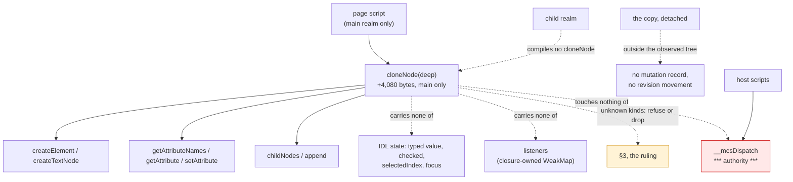

# `cloneNode`: what a copy would carry, and what it would silently drop

Design and read-only measurement only. No product code, no court frozen, no
handle widening, no navigation soak, no surface path. The cost variant was
built in a throwaway worktree that has been removed. Measured on `4ea4ccc` /
binary `744153d18294…`.


## 1. What the door says today

| probe | answer |
| --- | --- |
| `node.cloneNode` | **`undefined`** |
| `document.createElement`, `createTextNode` | present |
| `document.createComment` | **`undefined`** |
| `input.value = "typed"` then the `value` attribute | `prop=typed, attr=orig` — **separate** |
| `checkbox.checked = true` then the `checked` attribute | `prop=true, attr=false` — **separate** |
| a second element with an existing `id`, then `getElementById` | answers the **original** |
| `createTextNode("hello")` | `nodeType=3`, `data=hello` |
| the child kinds of `<div>text<span>…</span></div>` | `3,1` — text and element only |
| a listener on a node, then a dispatch | fires once |
| `<select>` with a `selected` option | `options.length=2`, `selectedIndex=1` |
| `<textarea>preset</textarea>` | `value=preset`, `defaultValue=preset` |

Two of those matter more than the rest, and they are **good news**: this host
already separates an element's **IDL state** (`value`, `checked`) from its
**attributes**, which is exactly the line the standard draws for cloning. A
copy built from attributes alone would correctly carry `value="orig"` and not
the typed `"typed"`, and carry `checked` only if the attribute is set.


## 2. What a clone would be built from, and what it would cost

Every piece is public and stays in the base: `createElement`,
`createTextNode`, `getAttributeNames`, `getAttribute`, `setAttribute`,
`append`, `childNodes`, `nodeType`, `localName`. No handle widening, no base
growth, nothing a child compiles, and — because a detached copy is outside the
observed tree — **no mutation record and no revision movement** until a page
appends it.

| | current `4ea4ccc` | with `cloneNode` |
| --- | ---: | ---: |
| M1 (system) | 224,458 | **224,458** — unchanged |
| main-only slack | 33,568 | **37,648** |

**4,080 bytes of main, nothing per child** — five times the last three
candidates, because a clone is a recursive walk rather than three lines.


## 3. The risk that decides this: a copy that is quietly not a copy

`cloneNode` is the first of these candidates where **the failure mode is
silence**. The others either work or throw. A deep clone built this way walks
what it understands and skips what it does not, so anything the extension
cannot recreate simply is not there in the copy, with nothing raised.

Today that list is short and, as far as the probe reaches, empty in practice:
this host's trees hold **only** text nodes and elements (`3,1`), because
nothing constructs comments and the extension has no `createComment` to
recreate one with. But "as far as the probe reaches" is doing real work in
that sentence: if the parser ever hands the realm a node kind the walk does
not know, a page's clone is a lie and no one is told.

Two ways to hold that, and this is the ruling I most want:

- **Fail loudly**: the walk refuses a node kind it cannot copy, so a clone is
  either faithful or an error;
- **Copy what is known**, and record the silence as a loss.

I lean to failing loudly, because a silent partial copy is the one outcome
this project has consistently refused elsewhere — a value a caller cannot
trust is worse than an absence it can see.


## 4. What a clone must **not** carry

- **Event listeners.** The standard does not clone them, and this host's are
  keyed by node in a closure-owned `WeakMap`, so a copy naturally has none.
  That is right by construction rather than by care, which is worth saying so
  nobody "fixes" it later.
- **IDL state**: the typed `value`, the `checked` property, `selectedIndex`.
  §1 shows the host already keeps these apart from the attributes, so a copy
  starts with the attribute-derived defaults, as a browser's does.
- **The lazy views**: `dataset` and `classList` are accessors over attributes,
  so a copy gets its own views over its own attributes with nothing to carry.
- **Focus.** The focused element is the host's, in the base's closure; a clone
  of a focused element is not focused, which is both correct and automatic.
- **Identity**: `id` is copied as an attribute, which is what a browser does,
  and the page then owns two elements with one `id` — `getElementById` answers
  the original, as §1 measured.


## 5. The tree

```
Should a page be able to copy a subtree, and can the copy be trusted?
├── A. The shape of a copy (owner: this audit)
│   invariant: a clone carries element names and attributes, and text data, and nothing else
│   evidence: §1's separation of IDL state from attributes; the court a slice would freeze
│   safe failure: absent, as today — a page's own call throws
│   dependency: createElement, createTextNode, getAttributeNames, setAttribute, append — all in the base
│   non-goal: listeners, IDL state, focus, or any cross-realm copy
├── B. Depth (owner: the walk)
│   invariant: deep copies descendants in order; shallow copies none
│   evidence: a court fixture with nested text and elements
│   safe failure: a RangeError from the realm's own stack limit on a pathological tree, which is a page's own doing
│   dependency: childNodes
│   non-goal: an iterative rewrite for depth this host has never seen
├── C. The silence (owner: §3 — unresolved)
│   invariant: a clone is faithful, or it says it is not
│   evidence: the child kinds this host actually holds are 3 and 1
│   safe failure: refuse the kind rather than drop it
│   dependency: —
│   non-goal: adding comment nodes to make the walk complete
└── D. The revision (owner: the base's record)
    invariant: making a detached copy moves nothing; appending it moves the revision as any append does
    evidence: a detached node is outside the observed subtree, so no record is written
    safe failure: —
    dependency: the mutation record the base already writes
    non-goal: a new mutation kind for clones
```


## 6. The loss matrix

| what a page may expect | what it would get | class |
| --- | --- | --- |
| `cloneNode(true)` copying names, attributes and text | exactly that | in scope |
| `cloneNode(false)` copying one node without children | exactly that | in scope |
| listeners on the copy | **none**, as the standard has it | matches |
| the typed `value` or the `checked` property on the copy | **not carried**, as the standard has it | matches |
| comment nodes inside a deep copy | **cannot be created**; refused or dropped, per §3 | **loss, and the ruling** |
| `cloneNode` on the document or a doctype | not modelled | loss |
| namespaces, `importNode`, `adoptNode`, cross-document copies | none of these exist here | hard loss |
| a copy of a `<template>`'s content | no template element is modelled | hard loss |
| very deep trees | the realm's stack limit, as a `RangeError` | bounded by the page's own tree |


## 7. Where it sits




## 8. Boundaries, memory and permission

- **Memory**: M1 unchanged; 4,080 bytes of main, inside the frozen 65,536
  slack, which stands at 33,568. It is the largest of the five additions and
  still the cheapest thing in this record to reverse.
- **Permission**: none. A clone reads a subtree a page can already read and
  produces a detached node only that page holds. Nothing the host decides is
  touched, and no host script names `cloneNode`.
- **Realm**: the copy is made by the realm that asks, with that realm's
  `document`. There is no cross-realm or cross-document copy to get wrong,
  because a page cannot reach another realm's document at all.
- One court run per variant, one machine, scratch build removed.


## 9. What I need ruled

1. **Whether to add it**, at 4,080 bytes of main and nothing per child — five
   times the last three candidates, for the last of the five.
2. **§3, the silence**: refuse an uncopyable node kind, or copy what is known
   and record the loss. I lean to refusing, on the same ground this project
   has used throughout: an absence a page can see beats a value it cannot
   trust.
3. Whether a **shallow-by-default** `cloneNode()` with no argument should
   match the standard exactly — it does in my measurement, since `!!undefined`
   is `false` — or whether the court should pin it explicitly so a later
   refactor cannot flip it quietly. I would pin it.


## 10. The rulings

**10.1 `cloneNode` is accepted**: 4,080 bytes of main, nothing per child, no
base growth, no handle widening.

**10.2 Shallow is the default**, `!!deep` being `false` for a missing
argument, and the court **pins** it so a later refactor cannot flip it
quietly.

**10.3 An uncopyable node kind fails closed.** The walk never skips and never
returns a partial copy: a kind it does not model raises a typed failure and
the call produces nothing. The kinds it models are a **closed set** — text and
element, the only two this host's trees hold — and adding a kind means
updating this record and the court **before** the walk learns it.

*How that failure is spelled, since this is page-facing:* the realm throws a
real `TypeError` naming the node type it cannot copy. The host's own
vocabulary for the same thing is `unsupported_capability`, and it does not
appear here because no host operation is involved — `cloneNode` is page
surface, and the failure is the page's to catch.

**10.4 What a copy carries stands as §4 recorded it**: attributes yes, IDL
state no, listeners no, focus no, and `dataset` and `classList` as the copy's
own views over the copy's own attributes.

**10.5 A detached copy moves nothing.** The revision advances when the page
appends it, exactly as any append does, and the court measures that from
outside as the toggle criteria do.

**10.6 The criteria join `element-view-court.py`**: shallow and deep,
attribute order, the typed `value` and the `checked` property staying behind,
no listener and no focus on a copy, the closed-set failure path, owner
release, and the child divergence. Attribute-name validation, the selector
engine's error name, C2b and `EventTarget` stand as ruled.
