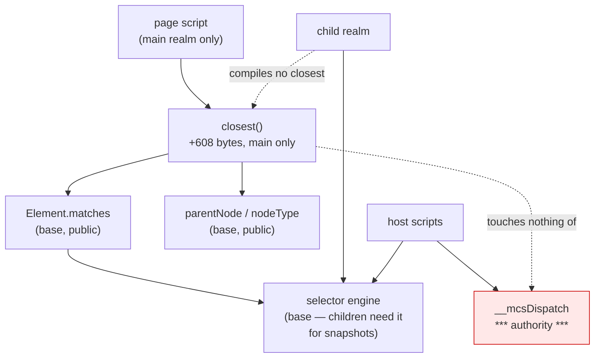

# `Element.closest`: a call-site and cost audit (native-dom, control 0.0.2)

Design and read-only measurement only. No product code, no court frozen, no
handle widening, no navigation soak, no surface path. The cost variant was
built in a throwaway worktree that has been removed. Measured on `2d5a1bd` /
binary `64e77ee292d7…`.


## 1. What the control door says today

Probed in one page, through the existing door:

| probe | answer |
| --- | --- |
| `typeof element.closest` | **`undefined`** |
| `typeof element.matches` | `function` |
| `matches('p')`, `('.leaf')`, `('#t')` | `true`, `true`, `true` |
| `matches('[data-role=leaf]')`, `('[data-role="leaf"]')` | `true`, `true` |
| `matches('section p')` — descendant | `true` |
| `matches('section > p')` | **throws** |
| `matches('p, div')` | **throws** |
| `matches('p:first-child')` | **throws** |
| `matches` on a detached subtree | `true`, `true` |
| `document.matches` | throws `TypeError` — `Document` has no `matches` |
| the four-line walk a page can write today | `found:section` |
| `body` → `null` by `parentNode` | 3 hops, and `document.nodeType` is `9` |


## 2. The honest value: compatibility, not capability

`closest` would add **nothing a page cannot already do**. The walk is four
lines over `matches` and `parentNode`, and it works today — the probe wrote it
and it answered.

What is missing is that **a real page does not write those four lines**. It
calls `element.closest('[data-action]')`, gets `undefined is not a function`,
and its own script dies partway through — after which the DOM an agent reads
is a DOM no browser would have produced. That is the whole case for it, and it
is a compatibility case rather than a capability one. The record says so
plainly so the ruling is made on the real ground.


## 3. Dependencies, and what it would not touch

Built in the main extension out of members that stay in the base:
`Element.prototype.matches`, `Node.prototype.parentNode`, and `nodeType` to
stop at the document.

- **No handle widening.** `matches` is public; nothing internal is needed.
- **No base growth.** A child realm compiles nothing of it, and no host script
  names `closest` — verified against every child-capable script's own literal,
  as in the `Element` audit.
- **No authority.** It reads the tree; it dispatches nothing, mutates nothing
  and answers no host question.


## 4. Cost, measured

A scratch build with `closest` alone, against the current binary:

| | current `2d5a1bd` | with `closest` |
| --- | ---: | ---: |
| M1 (system) | 221,514 | **221,514** — unchanged |
| main-only slack against the `origin/main` baseline | 27,488 | **28,096** |

**608 bytes of main, nothing per child.** That is below even the per-member
band, because the method is four lines and children never see it.


## 5. The tree

```
Should a page's own script survive its own idioms?
├── A. The idiom (owner: this audit)
│   invariant: element.closest(selector) answers the nearest inclusive ancestor that matches, or null
│   evidence: §1's probe, and the court a slice would freeze
│   safe failure: absent, as today — a page's script throws where it calls it, which is today's behaviour
│   dependency: matches, parentNode, nodeType — all staying in the base
│   non-goal: any selector the engine cannot parse (§6)
├── B. The cost (owner: the shim-footprint and child-frame courts)
│   invariant: nothing per child, and main stays inside its frozen 65,536 slack
│   evidence: §4
│   safe failure: do not add it
│   dependency: the main extension
│   non-goal: base growth of any size for this
└── C. What it inherits (owner: the selector engine)
    invariant: closest can answer exactly what matches can answer, and no more
    evidence: §1's throwing rows
    safe failure: the same throw a page gets from matches today
    dependency: parseSelector's grammar
    non-goal: growing the grammar in this slice
```


## 6. The loss matrix

| what a page may write | what happens | class |
| --- | --- | --- |
| `closest('.card')`, `closest('#main')`, `closest('section')`, `closest('[data-x=y]')` | would work | in scope |
| `closest('section > .card')` | throws, as `matches` does | inherited limit |
| `closest('.a, .b')` | throws | inherited limit |
| `closest('li:first-child')` | throws | inherited limit |
| `closest(':scope')` | throws | inherited limit |
| the error a page catches | a plain `Error` whose message begins `SyntaxError:`, **not** a `DOMException` named `SyntaxError` | **pre-existing fidelity gap**, not introduced here |
| `closest` across a shadow boundary | no shadow DOM exists | hard loss |

The error-name gap is worth naming because a page that does
`try { … } catch (e) { if (e.name === 'SyntaxError') … }` behaves differently
here — and it is the selector engine's, in the base, so fixing it is base
growth and belongs to whoever rules on that, not to this slice.


## 7. Where it sits




## 8. Boundaries and assumptions, stated

- A child realm runs no page script, so `closest` is unreachable there; that
  is the same assumption C1, C2a and the `dataset` slice were ruled on.
- The frozen floors (245,760 and 1,720,320) and the frozen main slack (65,536)
  are the gates; this candidate moves only the third, by 608 bytes.
- One court run per variant, one machine, scratch build removed, nothing
  committed as qualification.
- `document.closest` would not exist, because `Document` has no `matches`
  today and this slice does not add one.


## 9. What I need ruled

1. **Whether to implement it at all.** It buys no capability — only that a
   real page's own script does not die on a standard idiom. 608 bytes of main,
   nothing per child. I lean yes, on the ground that a page that dies halfway
   leaves an agent reading a DOM no browser would produce; but the case is
   compatibility, and you may prefer to spend nothing until a fixture actually
   needs it.
2. **Whether a four-line member earns its own frozen court**, or whether its
   criteria belong in `element-view-court.py`, which already guards what the
   main extension installs and what a child does not get.
3. **The selector engine's error name** — a plain `Error`, not a `SyntaxError`
   `DOMException` — is a pre-existing gap in the base that `closest` would
   inherit. It is not this slice's to fix and it is not free: say whether it
   should become its own candidate.


## 10. The rulings

**10.1 `closest` is accepted as a compatibility fix**, not as a capability:
608 bytes of main, nothing per child, no base growth and no handle widening.
The ground is the one §2 states — a real page's own script should not die on a
standard idiom — and the record keeps it on that ground.

**10.2 Its criteria join `element-view-court.py`** rather than a court of
their own. That court already guards what the main extension installs, what a
child does not get, and the inventory re-derived from the shipped sources; a
four-line member does not earn a second file. The amendment covers: tag, id,
class and attribute selectors; the inclusive match on the element itself; the
walk stopping at the document rather than running past it or throwing; a
detached subtree; and the **same refusals `matches` gives** for child
combinators, commas and pseudo-classes. The child divergence stays as it was
accepted for the other members.

**10.3 The selector engine's error name is deferred** as its own base
candidate: those failures throw a plain `Error` whose message begins
`SyntaxError:`, not a `DOMException` named `SyntaxError`. Nothing in this
increment changes it, and `closest` inherits it exactly as `matches` has it —
which is what the court asserts, rather than a fidelity the base does not
have.

**10.4 The rest is unchanged**: `activeElement`, `getAttributeNames`,
`toggleAttribute` and `cloneNode` stay individual candidates, C2b stays
scope-closed, `EventTarget` stays deferred.
