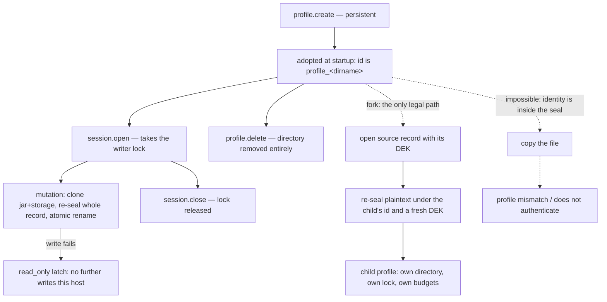

# Copy-on-write profiles — design-only audit, 0.0.1

Read-only and design-only, from `6374d62`. Nothing implemented, no protocol
field added, no court frozen, no user data touched — every measurement ran in a
temporary profile root that was deleted after it. No visual run, no navigation
soak, no download. Host `8d5da2a7…`.

## 1. What was measured

| question | measured |
| --- | --- |
| an empty persistent record on disk | **602 bytes**, one file: `<name>/profile.v1.sealed` |
| after 24 storage puts of 900 bytes | **29,710 bytes** |
| writes those 24 puts cost | **25 writes, 379,190 bytes** — every mutation rewrites the whole record |
| one `profile.storage.put` | **~12 ms** (11.5 first, 12.0 median, 12.1 last — flat) |
| one `profile.create` (persistent) | ~12–31 ms, the same order |
| profiles a host may hold | **8**; the ninth is `resource_limit`, *"profile capacity reached"*, retryable |
| a second host on the same root | sees the profile, and `session.open` is `profile_locked`, retryable |
| a second session on one profile | `resource_limit`, *"this profile owns one live session; close it first"* |
| `profile.inspect` from a second host | **succeeds without the lock** — counts are readable while another host writes |
| `profile.delete` | removes the directory entirely; nothing is left behind |
| an ephemeral profile on disk | nothing at all |
| a profile name | 1–32 lowercase letters, digits or hyphens; a duplicate is `conflict` |

## 2. The finding that decides the shape

**A profile's identity is inside its seal, so a fork cannot be a copy of bytes.**

Two measurements, on a record built and then copied by hand:

```
same bytes, new directory name  -> corrupt or incompatible:
                                   "format, protocol or profile mismatch"
same bytes, same name, other host -> corrupt or incompatible:
                                   "record does not authenticate"
```

The first fails because the profile id is sealed into the file and checked
against the directory it was found in. The second fails because the DEK is
wrapped under a master key bound to that host's key account
(`key_id: envelope-keychain:…`), so the bytes are not portable even under their
own name.

Therefore a fork **must** happen inside a live host that already holds both the
master key and the source's DEK: open the source record, re-seal the plaintext
under the child's own id and its own fresh DEK. There is no cheaper path, and
no path at all outside the host.

## 3. The finding that decides whether it is worth it

**The store is already copy-on-write, on every single mutation.**

`commit_control_mutation` clones the whole jar and storage as its rollback copy,
applies the change, then rewrites and re-seals the *entire* record — temporary
file, fsync, atomic rename, directory fsync. The measurement above is that
shape: 24 puts, 25 writes, 379,190 bytes for a record that ends at 29,710.

So a fork costs exactly what one ordinary write already costs, and a
copy-on-write *optimisation* saves nothing at the record level: there is no
incremental write to defer. What deferring buys is **602 bytes and one 12 ms
write**, until the child's first mutation.

**Copy-on-write is therefore not a performance feature here. Its value is
isolation semantics** — a child that starts from a parent's cookies and storage
and cannot write back to it — and it should be argued and ruled on that ground
alone. If it is ruled in for cost, the measurement says the cost was already
paid.

## 4. The lifecycle a fork joins



The tree a fork creates is a **DAG of one generation at a time**: each child is
sealed under its own id, so nothing links it to its parent on disk. Provenance,
if it is wanted, has to be recorded in the child's record as data.

## 5. Loss matrix — what a fork cannot carry

| carried | not carried | why |
| --- | --- | --- |
| cookies (jar) | the parent's **writer lock** | one lock per directory; the child has its own |
| local storage | the parent's **DEK** | the child seals under a fresh key |
| the policy (network, permissions) — *if ruled* | the parent's **live uncommitted state** | a fork reads the last committed record; another host's in-flight state is invisible |
| accounted byte counts | the **failed-commit latch** | it is live host state, not record state |
| — | the **download budget** | live counters, never persisted (`downloads`, `download_bytes`) |
| — | **history** | P6 is not persisted at all yet |
| — | **cache** | it does not exist |
| — | the parent's **name** | names are unique; a duplicate is `conflict` |

The third row is the hazard worth naming: `profile.inspect` **succeeds from a
second host without the lock**, so a fork of a profile that another host has
open would silently copy a stale record. Either the fork requires the source's
lock — which means no live session on it — or the answer must say plainly which
revision it copied.

## 6. Protocol candidates

| candidate | shape | contract impact |
| --- | --- | --- |
| **A. `profile.create` gains `from`** | `{persistence, name, from}` | no new operation; the closed enum stays at 26; one optional argument, one new refusal set. The create is already the moment a directory and a DEK are made, which is exactly when a re-seal must happen. |
| B. `session.open` gains a copy mode | `{profile, mode: "fork"}` | conflates a session with a profile's existence; the child would outlive the session that made it, which the mode's own name denies. Rejected on those grounds. |
| C. a new `profile.fork` operation | 27th operation | breaks a closed enum that has held at 26 through three capabilities; nothing here needs a verb the create does not already have. |
| D. copy at delete/export time | an export/import pair | two operations, a serialized plaintext record crossing the protocol, and a new way to leak everything a profile holds. Rejected. |

**Recommendation: A.** It adds no operation, and it lands the work where the
key material is already being minted.

## 7. Dependencies and safe failures

- **Permissions**: the parent's policy is `{network, permissions}`. Copying it
  silently would hand a child `allow_by_default` without anyone asking for it;
  not copying it makes a fork behave differently from its parent for no visible
  reason. Recommended: **copy the policy, and report it in the answer**, so the
  inheritance is stated rather than assumed.
- **Downloads**: budgets are live counters and are never persisted, so a child
  starts with a full allowance. That is the honest answer, but it means a fork
  is a way to buy 32 more downloads; worth ruling explicitly.
- **History (P6)** and **cache**: nothing to carry, and nothing to decide until
  they persist.
- **Readonly sessions**: a readonly session must not be able to fork *from* its
  profile if the fork touches the source at all. It does not — the source is
  only read — so a fork under a readonly session is defensible; but a fork
  *creates* a profile, which is a write to the root. Recommended: refuse with
  the existing `session_read_only`, and let the ruling overturn it.

| situation | answer |
| --- | --- |
| the source does not exist | `not_found` |
| the source is open in another host | `profile_locked`, retryable |
| the source has a live session in this host | `resource_limit`, one live session |
| the eighth profile already exists | `resource_limit`, *profile capacity reached* |
| the child's name is taken | `conflict` |
| the child's name is malformed | `invalid_request`, the existing name rule |
| the source is an unavailable directory | `unsupported_capability`, its adoption reason |
| the source's record fails to open | `internal`, the existing store error, and **no child is created** |
| a readonly session asks | `session_read_only` (pending ruling) |
| the fork is asked of an ephemeral source | ruling: allowed and memory-only, or refused |

## 8. Cost, in the units already measured

| item | cost |
| --- | --- |
| a fork of an empty profile | one create: ~12 ms, 602 bytes |
| a fork of a filled profile (24 keys) | one re-seal: ~12 ms, 29,710 bytes |
| a fork of the largest legal profile | bounded by `MAX_RECORD_BYTES` 4 MiB and 128 KiB of accounted data |
| what deferring the copy would save | the child's first write only — 602 bytes and ~12 ms |
| slots | one of **8**, permanently, until deleted |

## 9. Court draft

1. A fork of a filled profile reproduces every cookie and storage key, by
   count and by accounted bytes, and the child reads back the same values.
2. The child is sealed under **its own** id: its file names the child, and the
   parent's file is byte-for-byte unchanged after the fork.
3. Writing in the child changes nothing in the parent — counts and record bytes
   on both sides, before and after.
4. Writing in the parent after a fork changes nothing in the child.
5. The child gets its own writer lock: both can hold a live session at once.
6. A fork of a profile locked by another host is refused `profile_locked`, and
   creates nothing.
7. A fork at the eighth profile is refused `resource_limit`, and creates
   nothing — no directory, no partial record.
8. A failed re-seal leaves **no** child directory and does not latch the parent.
9. The child's download budget, and whether the policy is inherited, match the
   ruling, and the answer states what was inherited.
10. No value, key, cookie or name from either profile appears in the audit
    ledger, an error, or a receipt — only counts and bytes.
11. An ephemeral source behaves as ruled, and leaves nothing on disk either way.
12. `profile.delete` of a parent leaves the child intact and readable.

## 10. Pending rulings

1. Candidate **A** (`from` on `profile.create`) versus the alternatives.
2. Whether the policy is inherited, and whether the download budget resets.
3. Whether a fork requires the source to have no live session, or reports the
   committed revision it copied.
4. Whether a readonly session may fork.
5. Whether an ephemeral profile can be a source.
6. Whether provenance (the parent's name) is recorded in the child's record, or
   deliberately not — it is the only way a fork could leak one profile's
   identity into another's.

---

## 11. Ruled — 2026-09-06

Recorded chronologically; §§1–10 stand as written. Candidate **A** is taken,
with the concurrency hazard of §5 closed by a lock rather than by a disclaimer.

### 11.1 The shape

`profile.create` gains one optional argument:

```json
{"persistence": "persistent", "name": "beta", "from": "profile_alpha"}
```

The operation enum stays at **26**. `from` names an existing **persistent**
profile. The contract accepts `{persistence, name}` and `{persistence, name,
from}` and refuses every other field set, as it does today.

### 11.2 What the fork does, in order

1. Validate the child's name and the argument set. A malformed name is the
   existing `invalid_request`; a taken name is the existing `conflict`.
2. Resolve the source. Unknown is `not_found`; **ephemeral is refused** — it
   has no record to copy.
3. Refuse if the source has **any live session**, readonly included:
   `resource_limit`, the existing one-live-session refusal. A readonly session
   is not an exception — it is a session, and the fork wants the lock.
4. **Take the source's writer lock.** Held by another host, that is
   `profile_locked`, retryable. Holding it is what makes the copy a committed,
   non-racing one: the fork reads the record it just locked, not a record
   somebody else is mid-write on.
5. Refuse at the ceiling: the eighth profile already exists →
   `resource_limit`, *profile capacity reached*, and nothing is created.
6. Open the source record with its DEK, mint the child's own DEK, re-seal the
   plaintext under the child's id, and commit it the way every record is
   committed — temporary file, fsync, atomic rename, directory fsync.
7. Release the source's lock. **The parent's record is byte-for-byte
   unchanged**: the fork never writes to it, so its digest is the same before
   and after.

A failure at step 6 leaves **no child directory** and **does not latch the
parent** — the parent was only read.

### 11.3 What the child inherits, and what it does not

| inherited | reset or absent |
| --- | --- |
| cookies (the whole jar) | the source's **DEK** — the child mints its own |
| local storage | the **download budgets** — live counters, so the child starts full |
| the **policy** (network and permissions), stated in the answer | the **failed-commit latch** — live host state |
| | the **writer lock** — the child has its own |
| | the parent's **name**: the child's record does **not** record its provenance |
| | **history** and **cache**: nothing to carry |
| | the parent's **uncommitted state** — the lock makes this vacuous, which is the point |

Provenance is deliberately absent. A child that named its parent would be a way
for one profile's identity to leak into another's record, and nothing in the
capability needs it.

The download reset deserves its own sentence: because the counters are never
persisted, a fork **is** a way to obtain a fresh allowance of 32 downloads.
That is ruled acceptable — a fork costs one of eight profile slots, which is
the scarcer resource.

### 11.4 Retention

The child is an ordinary profile: `profile.delete` removes its directory
entirely, and deleting the parent leaves the child intact and readable, since
nothing on disk links them. An ephemeral child of a persistent source is not
ruled here and stays open (§11.6).

### 11.5 Court draft, revised

Superseding §9, twelve criteria become seventeen — the additions are the
ruling's own guarantees, not new scope.

| # | criterion |
| --- | --- |
| F1 | the contract accepts `{persistence, name, from}`, refuses any other field set, and the operation enum is still 26 |
| F2 | the child reproduces every cookie and storage key, by count and accounted bytes, and reads back the same values |
| F3 | the **parent's file is byte-for-byte unchanged** by the fork (digest before and after) |
| F3b | the child's sealed file names the child, not the parent |
| F4 | writing in the child changes nothing in the parent |
| F5 | writing in the parent changes nothing in the child |
| F6 | parent and child hold their own locks: both can have a live session at once |
| F7 | a source with a live session — readonly included — is refused `resource_limit`, and nothing is created |
| F8 | a source locked by another host is refused `profile_locked`, and nothing is created |
| F9 | at the eighth profile the fork is refused `resource_limit`, and no directory or partial record appears |
| F10 | a failed re-seal leaves no child directory and does not latch the parent — the parent still writes afterwards |
| F11 | the policy is inherited, and the answer says so |
| F12 | the child's download allowance is full even when the parent's is spent |
| F13 | an ephemeral source is refused, typed, and nothing is created |
| F14 | neither the child's record nor any answer carries the parent's name |
| F15 | no value, key, cookie or name reaches the ledger, an error or a receipt |
| F16 | deleting the parent leaves the child intact and readable |
| F17 | the child's key material is its own: its sealed file shares no DEK ciphertext with the parent's |

### 11.6 Still open

1. The exact code for an ephemeral source: `invalid_request` (the argument
   names something that cannot be a source, known at request time) is what the
   court will pin unless ruled otherwise.
2. Whether an **ephemeral child** of a persistent source is allowed — a
   memory-only copy that leaves nothing behind. Not ruled; the court does not
   test it either way.

---

## 12. Frozen — `copy-on-write-court.py`, 2026-09-06

Frozen before the host changes. Receipt:
`evidence/native-dom-control-0.0.2-copy-on-write.json` against `8d5da2a7…`.

**Eighteen criteria, none passing.** That is the correct reading: every one of
them depends on a fork existing, so a host that cannot fork should score zero.

It did not, at first. The court's first run scored **6 of 18**, and all six
were **vacuous**: the parent's record was unchanged because nothing had
happened to it, the child's record named no parent because there was no record
(zero bytes), a failed fork left no child because no fork could land, and the
ephemeral-source refusal was `invalid_request` — for the right code but the
wrong reason, since the host was rejecting an argument it has never heard of.
Six criteria would have gone green on a host with no capability at all, and
turned amber only much later, if ever.

They are now gated on `made_a_child`, and the ephemeral refusal must carry its
own `reason` rather than sharing a code with an unknown-argument error. **This
is the sixth time a court in this directory has been caught measuring its
fixture rather than its rule**, and the first time the whole set went green
that way — worth recording as a pattern with a name: *a criterion that cannot
fail on a host without the capability is not a criterion.*

The two that matter most stay F3 and F10: the parent is only read, so its
digest is identical afterwards, and a re-seal that cannot land leaves no child
directory and does not latch the parent. A fork that damaged the profile it
copied from would satisfy every other criterion here.

F12 — the child's download allowance being full while the parent's is spent —
is stated but not driven; it needs a network arm against a live parent and
child, and is recorded as failing rather than omitted.

---

## 13. Landed — 2026-09-06

The fork exists. Recorded after §12's freeze; nothing above is rewritten, and
no ruled value moved. **The court reads 20/20** against `4e8f7538…`.

Two criteria joined the eighteen, both from the supplementary ruling rather
than from new scope:

- **F18** — a persistent source forks into an **ephemeral** child, which
  inherits cookies, storage and the policy in memory and leaves the disk
  exactly as it found it (the whole tree is compared before and after).
- **F19** — an ephemeral source is refused with its own `ephemeral_source`
  reason for **either** persistence asked for, so the refusal is about the
  source and never about an argument the host does not recognise.

**F12 is no longer a stub.** It is driven end to end: the parent spends its
entire download allowance until the count refuses, the parent is forked, and
the child downloads successfully on its first try. That is the ruling's
consequence made falsifiable — a fork really does buy a fresh allowance, and
the court now says so rather than the design merely claiming it.

How the fork reads its source is worth stating, because it is the difference
between the ruling and a plausible shortcut: it takes the source's writer lock,
then **re-reads the sealed record from disk under that lock**, rather than
copying whatever this host adopted at startup. Another host may have replaced
the record since; the lock plus the re-read is what makes the copy a committed
one. If the record cannot be re-read, the fork falls back to the host's own
loaded state rather than failing — the lock has already excluded the racing
writer.

Regressions checked on the same binary: `downloads-court` 21/21,
`readonly-profile-court` 28/28, `profile-court` 92/94 with only its two known
D6 memory checks failing, which fail on the pre-fork binary as well.
