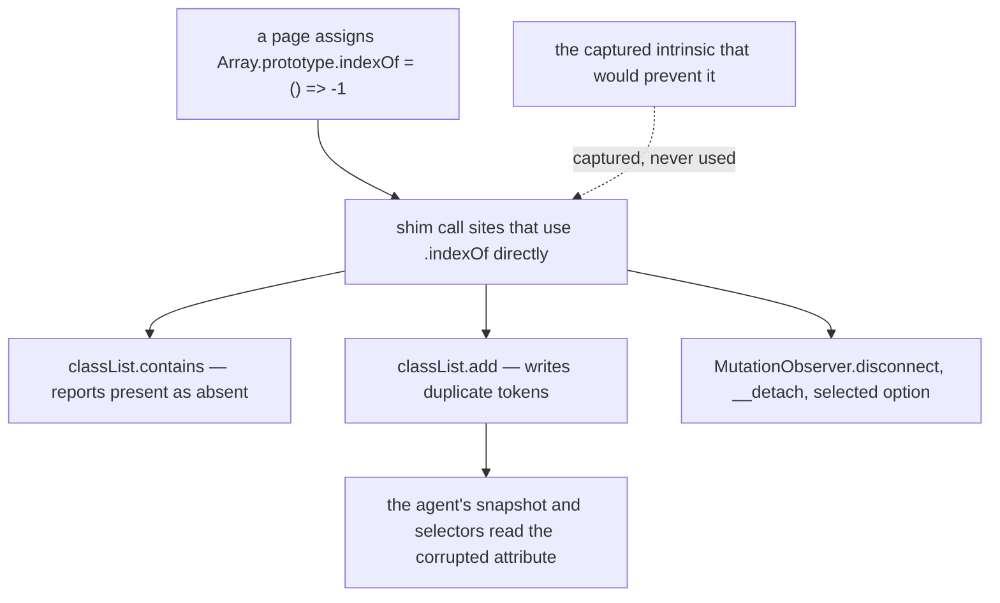

# The dead `arrayIndexOf` capture (C2) — design-only audit, 0.0.1

Read-only and design-only, from `13821f8`. Nothing implemented, no court
frozen, no protocol, threshold, D6 or slack bound changed, no structural
rework, no lazy install, no shared runtime, no visual run, no navigation soak,
no download. The shim is exactly as shipped; the deletion was applied only long
enough to measure it and was reverted.

**Verdict: HOLD the deletion — and the reason is not the bytes.**

## 1. It is dead, confirmed

`const arrayIndexOf = Array.prototype.indexOf;` at `dom_shim_base.js:24` is
referenced **nowhere** — not in either shim, not in the host's scripts, not in
a court, not in a fixture. The only other mentions in the repository are this
audit and the one that proposed removing it.

## 2. What removing it is worth

Measured three times in the scratch crate and twice per arm against the real
host, every run identical:

| | per realm |
| --- | ---: |
| scratch, marginal realm | **−112** |
| host, system arm | 327,456 → 327,344 = **−112** |
| host, arena arm | 317,232 → 317,328 = **+96** |
| RSS, either arm | no effect — the run-to-run spread is ~200 KB, three orders of magnitude larger |

The arena arm costing *more* is a packing artefact: removing 112 bytes of
compiled scope shifts what follows into different size buckets. It is
reproducible, and it means the deletion is **a wash** — it helps one allocator
and hurts the other by a comparable amount, and neither is visible in RSS.

By the ruling's own test — hold if the benefit cannot be quantified — this is a
hold. It *is* quantified; it just nets to nothing.

## 3. Why it is dead, which is the part that matters

The shim captures intrinsics so a page cannot change what the host's own code
does by replacing a prototype method. The capture is dead because **the pattern
is applied to a minority of call sites**:

| captured | used via the capture | called directly on an object |
| --- | ---: | ---: |
| `arrayPush` | 7 | **26** |
| `weakMapGet` | 7 | 11 |
| `mapGet` | 3 | 11 |
| `weakMapSet` | 2 | 11 |
| `mapHas` | 1 | 6 |
| `arraySplice` | 1 | 4 |
| **`arrayIndexOf`** | **0** | **7** |

`arrayIndexOf` is not an oddity. It is the extreme point of a hardening pattern
that is roughly a third applied.

## 4. The gap is exploitable, measured

A hermetic page that replaces `Array.prototype.indexOf` and then uses ordinary
DOM APIs:

```
the shim called the page's replacement          6 times
classList.contains("alpha") on class="alpha beta"   false   ← a lie, believed
classList.add("alpha") twice                    class="alpha alpha alpha"
```

Two things are wrong there. `contains` reports a class that is present as
absent. And `add` produces **duplicate tokens**, which `classList` may never
do — the dedup check is `if (after.indexOf(token) < 0) after.push(token)`, and
it trusted the page's replacement.

The corrupted attribute is not confined to the page: it is the document the
**agent** reads through a snapshot or selects on. This host's whole position is
that what the agent reads is not a page's to define, and here a page redefines
it with one assignment.

The same shape applies to every direct call in the table: `observers.indexOf`
in `MutationObserver.disconnect`, `this.childNodes.indexOf` in `__detach`, and
`select.__options().indexOf` in the selected-option path.



## 5. What follows

- **Do not delete the capture.** Deleting it removes the last evidence of an
  intent the code still needs, and buys nothing measurable.
- **Do not quietly leave it either.** The finding is not "an unused constant";
  it is "a hardening pattern that is a third applied, and the gap is
  reachable from an ordinary page".
- The fix is to route the seven direct `.indexOf` calls — and, on the same
  argument, the direct `push`, `get`, `has` and `splice` calls — through the
  captures already sitting there. That is a **behaviour-preserving change with
  a security purpose**, not a byte optimisation, and it will *cost* bytes
  (`invoke(arrayIndexOf, list, [token])` is longer than `list.indexOf(token)`).
  It needs its own ruling and its own court, and per-site measurement.
- Nothing here should be bundled into a byte-reduction programme. The two
  arguments point in opposite directions, and mixing them would let a saving
  justify a weakening.

## 6. Court draft, if the hardening is ruled in

1. A page that replaces `Array.prototype.indexOf`, `push`, `splice`,
   `Map.prototype.get`/`has` or `WeakMap.prototype.get`/`set` cannot change
   what `classList.contains`, `classList.add`, `classList.remove`,
   `MutationObserver.disconnect` or option selection do.
2. `classList.add` never writes a duplicate token, whatever the page has
   replaced.
3. The agent's snapshot of an element's `class` matches what the DOM operations
   should have produced, not what a replaced intrinsic produced.
4. Every captured intrinsic is referenced at least once — a rule, not a
   fixture, so a future dead capture fails here rather than being noticed by
   accident.
5. The property-shape guard still reads 22/22, and every existing shim court
   still passes.
6. The per-realm cost is measured on both arms before and after, and the
   increase is stated rather than absorbed.

## 7. Pending rulings

1. Whether C2's deletion is closed permanently (recommended: yes, on the
   grounds of §3–§4, not §2).
2. Whether the hardening gap gets its own design round, with §6 as the court
   draft and a measured per-site cost.
3. Whether criterion 4 above — no captured intrinsic may be unused — is worth
   adding to an existing shim court now, since it is the check that would have
   surfaced this without anyone hunting for it.
