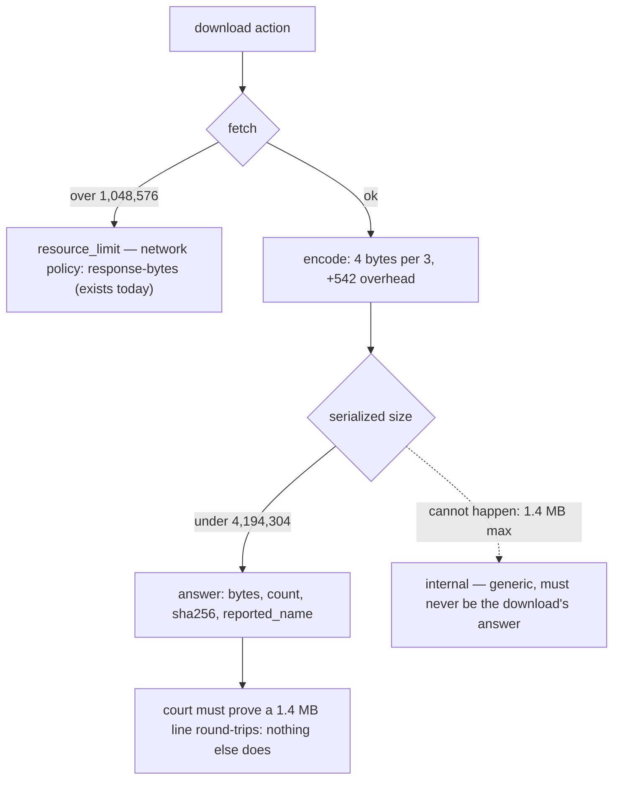

# The download envelope — read-only measurement, 0.0.1

Design-only and read-only. Nothing implemented, no court frozen, no protocol
changed, D6 and G1 untouched, no navigation soak, no visual run, and nothing
was downloaded: the fixture is local and hermetic. Measured against the shipped
`8ff70b9f26c1…`.

## 1. What fits, arithmetically

A sink-C answer carries `kind`, `byte_count`, `sha256`, `reported_name`,
`truncated` and `bytes_base64` inside the ordinary envelope.

| quantity | measured |
| --- | --- |
| envelope + metadata with an empty payload and a 255-character name | **542 bytes** |
| base64 expansion | 4 bytes per 3, so 1,048,576 → **1,398,104** |
| a **network-cap** download serialized in full | **1,398,652 bytes** |
| against the response bound | 4,194,304 — **2,795,652 spare** |
| the payload the envelope could carry if nothing else limited it | **3,145,317 bytes** |
| worst-case escaping of a 255-character name (control characters, six bytes each) | +1,275, leaving 2,794,377 spare |

**The envelope is not the binding constraint.** It could carry three times what
the network layer will fetch.

## 2. The real ceiling is already there, and already typed

Measured, by asking the host to open a 1.4 MB document:

```
target.open -> resource_limit   "network policy: response-bytes"
```

At 900 KB the same document opens fine. So the network layer's 1,048,576-byte
cap is **enforced and typed today**, before any download logic would run.

That gives the ceiling for free: **a download's ceiling is the network cap, and
its over-ceiling refusal is the existing `resource_limit`.** No new number has
to be frozen, and the ruling's "typed refusal over the ceiling" is satisfied by
a mechanism that already exists and is already measured.

## 3. The risk this measurement uncovered

**Nothing in this host emits a large response line today.** The same 900 KB
document snapshots to a **666-byte** answer at every `max_bytes` from 65,536 to
4,194,304, because the semantic snapshot truncates each node's text at **256
characters**.

So the 4,194,304 transport bound is **declared but unexercised**. A sink-C
download would produce, at ~1.4 MB, by far the largest line this host has ever
written — through a stdio writer and a client reader that no evidence has
stressed. That is not an argument against sink C; it is a criterion the court
must carry, and it would have been easy to miss.

There is a second edge in the same area: an oversized response is replaced by

```
internal   "response exceeds byte limit"
```

a **generic** error carrying no reason. If the download path let an oversized
answer reach serialization, a client would see `internal` and could not tell a
too-large download from a host fault. The download must therefore refuse
**before** serializing — which, given §2, it already does at the fetch.



## 4. Budgets, permission, naming, redaction

- **Per-profile budgets**: `download_bytes` and `downloads`, reported beside
  the existing profile budgets so a limit is visible before it is hit. The
  natural first values follow the record budget's shape rather than inventing
  a scale; the numbers are a ruling, not a measurement.
- **Permission point**: at use. `permission_denied` when the policy denies,
  which is what first moves `permissions_effect` off `recorded_only`.
- **Action-kind naming**: `download`. It takes a node reference exactly as
  `click` does, and the vector — a link, an attachment — is the node's business
  rather than the kind's. `download_link` would have to grow a sibling the
  moment a non-link vector is served.
- **Redaction**: `reported_name` is bounded to 255 characters, reported
  **verbatim** rather than sanitised, kept out of the audit ledger and every
  host diagnostic, and never used to name anything. `sha256` and `byte_count`
  are host-derived and safe to record.

## 5. Typed failures, and keeping them distinct

| situation | answer |
| --- | --- |
| the policy denies the permission | `permission_denied` (at use) |
| the session was opened readonly | `session_read_only` |
| the vector is not served — cross-origin attachment, a scheme, a named target | `unsupported_capability` |
| the body exceeds the network cap | `resource_limit`, *"network policy: response-bytes"* — **already exists** |
| the per-profile download budget is exhausted | `resource_limit`, with a download reason |
| the target or session closes mid-transfer | the operation's existing cancellation answer |
| the response would exceed the envelope | **must be unreachable**; never the generic `internal` |

Five distinct questions with five distinct answers, and one that must never be
reached.

## 6. Court draft, updated

Carrying forward the ten criteria of `download-sink-c-design-0.0.1.md` §6, with
three changes this measurement forces:

- **new** — a download at or near the network cap **round-trips as a single
  line**: the answer's `byte_count` and `sha256` match the fixture, proving the
  transport at a size nothing else in this host exercises.
- **amended** — the over-ceiling criterion now expects the **existing**
  `resource_limit` with *"network policy: response-bytes"*, rather than a new
  download-specific code.
- **new** — an oversized answer never surfaces as `internal`: the refusal
  happens at the fetch, and the generic error is unreachable from this path.

## 7. Pending rulings

1. **The ceiling is the network cap** — recommended, since it already exists,
   is already typed, and needs no new frozen number.
2. **Budget values** for `download_bytes` and `downloads`.
3. **`sha256` in the answer** — recommended; it is the only way an agent can
   verify an encoded blob, and it hashes bytes already in memory.
4. **`download` as the action-kind name** — recommended over `download_link`.
5. Whether the large-line criterion is enough, or whether the transport should
   be exercised on its own before a capability depends on it.
