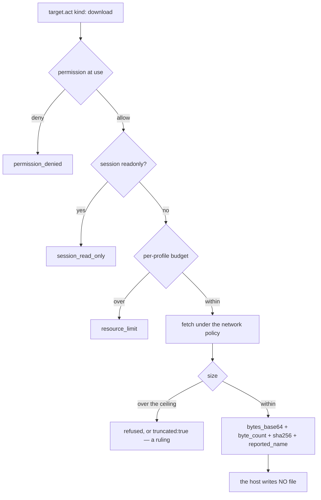

# Sink C — the bytes come back over the protocol, design-only 0.0.1

Design-only and read-only. Nothing implemented, no protocol changed, no court
frozen, D6 and G1 untouched, no navigation soak, no visual run, and nothing was
downloaded. Ruled: **sink C** — download bytes return through the existing
control protocol, the filename is a bounded reported string and **never** a
path, the request is an **action kind** on `target.act`, the permission is
checked **at use** with `permission_denied`, and `session_read_only` and
`unsupported_capability` stay distinct.

## 1. The bounds this has to live inside, measured

| bound | value | source |
| --- | --- | --- |
| control **request** | 65,536 bytes | the contract's `MAX_REQUEST_BYTES`, enforced by the host's line reader |
| control **response** | 4,194,304 bytes | the contract's and the host's `MAX_RESPONSE_BYTES` |
| network response body | 1,048,576 bytes | the network layer's own cap |
| a download today | refused after the fetch, so the host already buys up to the network cap | measured in the downloads audit |

So the transport ceiling is **4 MiB per answer**, and the network layer will
not hand over more than **1 MiB** in one fetch anyway. A design that pretends
to stream gigabytes through this protocol would be lying about both.

## 2. The shape

```
   target.act {kind: "download", reference}
        |
        +-- permission?  deny_by_default -> permission_denied (at use)
        +-- session readonly? -> session_read_only   (a different question)
        +-- capability absent for this vector? -> unsupported_capability
        |
        v
   host fetches under the profile's network policy and budgets
        |
        +-- over the per-profile download budget -> resource_limit
        |
        v
   answer: { kind: "download", bytes_base64, byte_count, sha256,
             reported_name, truncated: false }
                 |
                 +-- reported_name is BOUNDED, REDACTED and NEVER a path
                 +-- no file is written anywhere by the host
```



## 3. Size: a ceiling, not chunking

Chunking would mean the host holds a partial transfer across requests: a new
owner with a lifetime, a resumption token, an eviction rule, and a way for a
target or session to close underneath it. That is a stateful subsystem inside
a host whose whole design is that state is owned, bounded and visible.

A **single-shot ceiling** costs none of that. Concretely: refuse anything whose
body exceeds a per-profile `download_bytes` bound, answering `resource_limit`
with the measured size, and let the agent fetch large artefacts by its own
means. The recommendation is one call, one answer, no partial state.

If a later ruling wants chunking, it should arrive as its own design with its
own owner class and lifetime — not as a parameter added here.

## 4. The filename, which is the whole security story

`reported_name` comes from the page or the server: the `download` attribute or
`Content-Disposition`. Under sink C it is **never resolved, joined, or opened**
— it is a label the agent may use or ignore.

The rules the court should pin:

- bounded to a small length, and truncated rather than refused;
- carried through the same redaction discipline as every other page-derived
  string, so it never reaches the audit ledger or a host diagnostic;
- reported **as given**, without normalising away the evidence — an agent that
  sees `report .. /etc/passwd.txt` should see exactly that, because sanitising
  it silently would hide what the page tried;
- **never** used by the host to name anything.

That last point is what sink C buys: there is no path to traverse, so
traversal is not a bug class here. The probe in the downloads audit offered
precisely that name to make the difference concrete.

## 5. Budget, owners, lifecycle

- **Budget**: a per-profile `download_bytes` and `downloads` count, reported
  beside the existing profile budgets, so the limit is visible before it is
  hit.
- **Owner**: the bytes exist only inside one request — fetched, encoded,
  answered, dropped. **No new long-lived owner class**, which is the direct
  consequence of choosing a ceiling over chunking. `memory.report` should still
  show the transfer while it is in flight, as every other in-flight cost is
  shown.
- **Lifecycle**: nothing survives the answer. A target or session closing
  mid-transfer cancels the request the way any other in-flight operation is
  cancelled, and leaves no artefact, because there is no artefact to leave.
- **Ephemeral profiles**: nothing to clean up.
- **Retention**: one bounded buffer, returned when the request ends — the
  memory audits in this batch make that a requirement, not a nicety.

## 6. Court draft

1. Denied by policy, a download answers **`permission_denied`** at the point of
   use, and `permissions_effect` reads `enforced`.
2. From a readonly session, it answers **`session_read_only`** — a different
   question from a denied permission.
3. Permitted, a small hermetic fixture comes back with `byte_count` equal to
   the fixture's size and a `sha256` that matches it.
4. **The reported name is never a path**: a fixture offering
   `report .. /etc/passwd.txt` comes back reported verbatim and bounded, and
   the host has created **no file anywhere** — checked against the profile
   root and the working directory.
5. Over the per-profile byte budget, the answer is **`resource_limit`** naming
   the measured size, and nothing is transferred.
6. Over the transport ceiling, the answer is the ruled one — refusal or
   `truncated: true` — and never a silent short read.
7. A target closed mid-transfer answers typed and leaves no artefact.
8. The bytes are visible in `memory.report` while in flight and gone after.
9. The vectors that remain unserved — a cross-origin attachment, or anything
   over the ceiling — still answer **`unsupported_capability`**, so the three
   refusals stay distinct.
10. Nothing page-authored reaches the audit ledger or any host diagnostic.

Criteria 4 and 10 are the ones that make sink C worth choosing; criterion 9 is
what keeps today's honest refusal from being quietly replaced by a vaguer one.

## 7. Pending rulings

1. **The ceiling value**, and whether over-ceiling is a refusal or a truncated
   answer. This audit recommends refusal: a truncated download that looks
   successful is the same class of defect as a silent failure.
2. **The budget values** for `download_bytes` and `downloads` per profile.
3. **The `sha256`** in the answer — recommended, since the agent cannot verify
   an encoded blob otherwise, and it costs one hash of bytes already in memory.
4. Whether the action kind is `download` or something narrower like
   `download_link`, given it takes a node reference.
5. Chunking, explicitly deferred, to be designed with its own owner and
   lifetime if it is ever wanted.

---

## 8. Frozen — `downloads-court.py`, 2026-09-06

Recorded chronologically, after the envelope measurement and the two-half
transport stress, and after the ruling that set the budgets. The court is
`downloads-court.py`; its receipt against the shipped
`8ff70b9f26c1…` is `evidence/native-dom-control-0.0.2-downloads.json`.

**Twenty criteria, five passing today.** The five are guards, not progress —
they pass now and must keep passing after the capability lands:

| passing today | what it guards |
| --- | --- |
| C1 | no new operation joins the enum; the download stays an act kind (26 operations) |
| V1 | the page's own `link.click()` on `a[download]` observes `dispatched,returned:undefined` — no host vocabulary, nothing thrown |
| V2 | navigating at an attachment keeps its own typed `unsupported_capability` |
| R1 | no filename and no page values reach the agent's record |
| L1 | nothing is written to any disk |

The other fifteen fail because the capability does not exist. **T1 is the
gate**: a near-cap download through the real host, `byte_count` and `sha256`
verified after base64 decoding, exactly one newline. It is the join the
transport stress could not test — the writer and the reader each passed alone —
and per the ruling a failure there stops the work rather than being covered by
the halves that passed.

Two criteria were tightened before freezing, for the same reason four earlier
courts were amended: they were measuring the fixture rather than the rule. C1
had leaned on the substring `download`, which the contract already contains
via `download_unsupported`; and B3 had matched the bare number `32`, which
appears throughout a memory report. Both now assert the actual shape.

Three criteria — B1, B2 and L2 — are stated but not driven: 33 downloads and
32 MiB cannot be measured against a host that refuses the first one. They are
recorded as failing rather than omitted, so the count cannot quietly grow when
they are finally run.

Frozen values, which do not move after this point: ceiling 1,048,576 inherited
from the network cap; name bound 255 bytes; `downloads` 32; `download_bytes`
32 MiB.

---

## 9. Landed — 2026-09-06

The capability exists. Recorded chronologically after §8's freeze; nothing in
§§1–8 is rewritten, and no frozen value moved.

**The court reads 21/21** against `8d5da2a7…`, with T1 — the gate — green:
byte_count 1,000,000, sha256 matching after base64 decoding, one line of
1,333,615 bytes with exactly one newline, payload identical. That is the join
the two-half transport stress could not test.

Three things the implementation found that the design had not:

1. **The byte budget cannot bind alone.** Ceiling 1,048,576 × `downloads` 32 is
   exactly `download_bytes` 32 MiB, so thirty-two cap-sized downloads come to
   precisely the byte budget and neither limit can be reached first. §5 of the
   envelope audit claimed these values meant "neither limit makes the other
   unreachable"; the arithmetic says they are *coincident*, which is a weaker
   and different property. Ruled: keep all three values, and rewrite the
   criterion to state what is true — the byte budget exists, is enforced, and
   tops out in the same breath as the count.
2. **A quoted filename may contain the separator.** The first parser split
   `Content-Disposition` on every `;`, so a name containing one was reported
   cut short. It now parses the quoted string properly, honouring `\"`.
3. **A name is one line.** A server can inject a line break into the header.
   Where the injection leaves a parseable line, the host reports no name at
   all rather than a piece of one; where it leaves a malformed line, the
   network layer refuses the response before a name exists. Both are pinned
   (N2), and nothing from an injected line reaches the agent.

Two court fixtures were amended for the same reason four earlier courts were:
they measured the fixture, not the rule. The hostile filename carried a raw
CRLF (which the header parser refuses before any name exists) and an unescaped
`"` (which closes the quoted string, so the fixture was measuring where a name
ends rather than how a long one is reported). Both are now escaped on the wire,
and the CRLF case became its own criterion instead of quietly disabling N1.

`frame-action-court.py` moved by eight checks, all of them the same word: the
snapshot's activation label for `a[download]` is `download_available` rather
than `download_unsupported`, as V3 required. **The behaviour did not move** —
a click on such a link is still refused `unsupported_capability` and still
advances no revision — and that court reads 182/182 after the amendment.

What a download does *not* do: dispatch anything into the page, run a handler,
advance a revision, write a cookie back, spend the document's fetch allowance,
or touch a disk. The record carries `target.act:download`, the outcome
`served` and a byte count; it never carries the name or the bytes.
