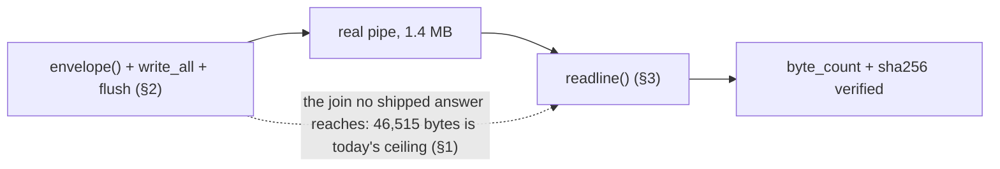

# The download transport, stressed — 0.0.1

Required before implementation by the sink C ruling. Hermetic and headless:
the fixtures are a local server and a stand-in emitter, **nothing was
downloaded**, no capability is implemented, no court is frozen, and G1 and D6
are untouched. Harnesses: `transport-line-stress.py` and `transport_tests` in
`src/main.rs`.

## 1. Why this had to be two halves

The envelope audit found that **no shipped operation can emit a large line**.
Measured again here, against a 400-node document, with each answer serialized
in full:

| operation | line |
| --- | --- |
| `target.snapshot` (`max_nodes` 128, `max_bytes` 4,194,304) | **46,515 bytes** |
| `memory.report` | 3,560 |
| `target.inspect` | 793 |
| `profile.list` | 245 |

**46,515 bytes is the ceiling — 1.109% of the response bound**, and about a
thirtieth of the line a download at the network cap would write. The caps that
hold it there are structural: node text truncates at 256 characters,
`MAX_SNAPSHOT_NODES` is 128, storage values are bounded in kilobytes, and
`MAX_PROFILES` is 8.

So an end-to-end stress is **impossible without the capability that depends on
it**, and the honest answer is to stress each end against the real code and say
plainly that the join is untested until sink C exists.

## 2. The host writer, at a download-sized line

`transport_tests::a_download_sized_line_survives_the_writer_a_pipe_and_a_reader`
drives the **real** `envelope()` and the **real** write sequence — `write_all`,
newline, `flush` — over a **real** pipe with its own kernel buffer, then reads
the far side to EOF.

- payload 1,048,576 bytes, base64 encoded, with a 255-character name;
- serialized line **1,398,652 bytes**, under `MAX_RESPONSE_BYTES`, so the
  generic-`internal` path is unreachable at this size;
- the bytes on the far side are **identical**, `byte_count` matches, and the
  digest recomputed after decoding equals the one the host wrote.

The pipe matters: at 1.4 MB the write is broken into many kernel-buffer-sized
pieces, which is exactly the case `write_all`'s loop exists for and which no
shipped answer has ever reached.

## 3. The reader, at the same size

Every court in this directory reads with `process.stdout.readline()`. Driven at
a 1,398,624-byte line through a real pipe:

```
line written            1,398,624 bytes
line read by readline   1,398,625 bytes     (the line and its newline)
payload intact          True
byte_count matches      True
sha256 matches          True
```

Nothing truncates and nothing splits. The digest is checked **after** base64
decoding, so it proves the payload, not just the envelope.

## 4. Over the cap, before serialization

```
target.open -> resource_limit  "network policy: response-bytes"
   details { reason: "response-bytes",
             detail: "response body exceeds the 1048576-byte cap" }
```

Refused at the fetch, **typed, with a reason**, and never the generic
`internal`. The second test,
`transport_tests::an_oversized_answer_loses_its_reason`, pins why this matters:
an answer past the bound comes back as `internal` / *"response exceeds byte
limit"* with **no details at all**, indistinguishable from a host fault. The
ruling's requirement holds by construction — a download can never reach that
path, because its body is capped three times smaller than the bound.



## 5. Candidate per-profile budgets

Values remain a ruling, not a measurement. The existing shape: 32 fetches and
4 MiB per document, 128 KiB of accounted storage and 256 cookies per profile.

- **Recommended** — `downloads` **32**, `download_bytes` **32 MiB**. The count
  echoes `MAX_FETCHES_PER_DOCUMENT`, and the byte budget is the count times the
  single-shot ceiling, so **neither limit makes the other unreachable**. A
  profile that downloads 32 cap-sized files exhausts both at once.
- **Conservative alternative** — `downloads` 32, `download_bytes` **4 MiB**,
  borrowing `MAX_BYTES_PER_DOCUMENT` verbatim. Cheaper, but the byte budget
  then binds at the fourth cap-sized download and the count of 32 is
  decoration.

Download bytes are not retained — they cross the protocol and are gone — so
this budget is a rate, not a storage cost, which is why it can exceed the
128 KiB storage budget without inconsistency.

## 6. What this does and does not license

- **Settled**: the writer at 1.4 MB, the reader at 1.4 MB, the digest across
  both, and the typed pre-serialization refusal.
- **Still open**: the two halves joined through the real host, which cannot be
  measured until an operation can emit such a line. It stays a court criterion
  and must be the **first** check the implementation court runs.
- Also worth recording: `sha2` and `base64` are **already dependencies**, so
  the ruled answer shape needs no new crate.

## 7. Pending rulings

1. The budget values in §5 — recommendation stated, decision open.
2. Whether §6's open join is enough of a residue to gate implementation, or
   whether it is satisfied by being the court's first criterion.
