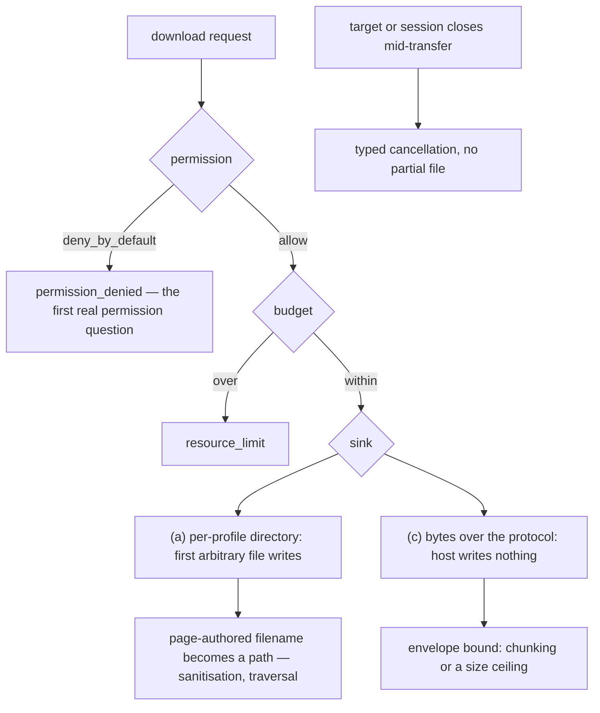

# Downloads — design-only audit, 0.0.1

Design-only and read-only. Nothing implemented, no protocol changed, no court
frozen, D6 and G1 untouched, no navigation soak, no visual run, and **nothing
was downloaded**: the fixtures are local and hermetic. Measurements are
black-box against the shipped `8ff70b9f26c1…`.

## 1. Every vector, measured

| vector | today |
| --- | --- |
| agent clicks `a[download]` | **`unsupported_capability`**, `reason: download_unsupported` |
| agent clicks a plain link whose response is `Content-Disposition: attachment` with `application/octet-stream` | **`unsupported_capability`**, details carrying `content_type`, `href`, `navigation: "failed"` — the host fetched, looked, and refused |
| `target.navigate` straight at an attachment | **`unsupported_capability`** |
| **a page's own `link.click()` on `a[download]`** | **nothing happens, and nothing is said** — the call returns normally, no download, no error |
| any download owner class in `memory.report` | none |

Three of the four are typed refusals a client can act on. The fourth is the
one to fix whatever else is decided: **a page that clicks its own download link
is told nothing**, where a browser would have downloaded. It is the same shape
as the silent failures this batch found in `handleEvent` and `onabort`, and it
is reachable today.

One mechanical detail that shapes the design: the attachment refusal happens
**after the fetch**. The bytes arrive in the host's response buffer — bounded
by the network layer's 1 MiB `MAX_RESPONSE_BYTES` — and are then dropped. So
the host already pays for a small download before refusing it, and that bound
is far below what a real download is.

## 2. Where the bytes could go

```
   a download is bytes + a name + a budget + a place to put them
        |
        +-- (a) a per-profile sink directory under --profile-root
        |       isolated, deleted with the profile, budgeted like the record
        |       COST: the host's first arbitrary file writes, and a page-authored
        |             FILENAME becomes a PATH
        |
        +-- (b) a host-configured --download-root
        |       one place for every profile
        |       COST: cross-profile mixing, which P6 exists to prevent
        |
        +-- (c) the bytes come back over the control protocol
                the agent decides where they land; the HOST WRITES NO FILE
                COST: bounded by the envelope, so large downloads need chunking
```



**Recommendation (c), for a ruling.** It keeps the property this host has held
all along — the only files it writes are its own sealed records — and it turns
the filename from a *path* into a *reported string*, which removes the entire
traversal and sanitisation surface. The probe deliberately offered the name
`report .. /etc/passwd.txt`; under (c) that is a label to redact and bound,
never a path to resolve. Under (a) it is a security question on the host's
first arbitrary write.

## 3. The permission point

By the ruling on `permissions`, downloads are where the first permission
question lands. With `permissions: deny_by_default`, a download is refused
**`permission_denied`** — the code `network` already uses — with a reason
naming the permission, and the refusal happens **at the point of use**, not
when the policy was set. That makes the `permissions_effect` label move from
`recorded_only` to `enforced` for the first time, which the permissions court
draft already has as its criterion 4.

It must stay distinct from the two refusals beside it: `session_read_only` for
an open that promised not to write, and `unsupported_capability` for a
capability that does not exist. Three different questions, three answers.

## 4. Owner, invariant, evidence, safe failure, dependency, non-goal

**Owner** the host, on behalf of one profile. **Invariant** a download is an
explicit, permitted, budgeted transfer whose bytes are accounted and whose name
is data, never a path. **Evidence** a refused case, an allowed case, a budget
refusal, a permission refusal, and a close mid-transfer that leaves nothing
behind. **Safe failure** today's typed `download_unsupported` — it is a
perfectly good answer and this audit does not propose removing it until a
capability replaces it. **Dependency** the permission point above; the profile
budgets; and, for (a) only, a sink path. **Non-goal** resuming, background
transfers, the user's own directories, and anything that writes a file the
agent did not ask for.

## 5. Lifecycle and retention

- **In flight**: bytes live in the host's response buffer. Under (c) they also
  cross the envelope once; under (a) they are written and then live on disk
  until the profile goes.
- **Target close, session close, host exit**: each needs a typed answer, and
  under (a) each needs a rule about the partial file. Under (c) there is no
  partial anything — the operation either answers with bytes or fails.
- **Ephemeral profiles**: under (a) the sink dies with the profile, which is
  the correct behaviour and one more reason the sink must be per profile.
- **Memory**: a new owner class either way, so the download is visible in
  `memory.report` rather than being untracked growth — which this batch's
  memory audits make an obvious requirement.

## 6. Protocol shape

The operation enum has been kept closed all batch. A download fits an
**action kind** on `target.act` — the enum of actions already carries `click`,
`set_value`, `submit`, `press` — which grows the action vocabulary rather than
the operation vocabulary. Under (c) the result carries the bytes and the
reported name; under (a) it carries the sink-relative path the host chose.

That is a ruling to take before any code: this audit proposes the action-kind
shape and does not assume it.

## 7. Court draft

1. With no permission granted, a download is refused **`permission_denied`**,
   at the point of use, and `permissions_effect` reads `enforced`.
2. Permitted, a download of a small hermetic fixture answers with the bytes
   (or the sink path) and the byte count matches the fixture exactly.
3. **The page-authored name never becomes a path**: a fixture offering
   `report .. /etc/passwd.txt` is reported as a bounded, redacted label, and
   nothing outside the sink or the envelope is created.
4. Over the profile's byte or count budget, the answer is `resource_limit`.
5. A target closed mid-transfer answers typed, and leaves no partial artefact.
6. The bytes are accounted in `memory.report` under their own owner class,
   and return when the transfer ends.
7. **A page's own `link.click()` stops being silent** — it either performs the
   download or refuses it in a way the page can observe.
8. `a[download]`, `Content-Disposition` and a direct navigation all reach the
   same decision, so the vector does not decide the outcome.
9. An ephemeral profile's downloads are gone with the profile.

Criterion 3 is the one that matters most under (a) and is nearly free under
(c) — which is the audit's argument for (c) in one line.

## 8. Pending rulings

1. **Sink shape**: (c) bytes over the protocol, recommended; (a) a per-profile
   sink; (b) a shared root, which this audit argues against because it mixes
   profiles.
2. **Protocol shape**: an action kind on `target.act` rather than a new
   operation.
3. **The silent `link.click()`**, which is a defect today whatever is decided
   about downloads, and could be fixed on its own as a typed refusal.
4. **Whether `download_unsupported` survives** as the answer for the vectors a
   ruled-in download capability still will not serve — for instance a
   cross-origin attachment, or one over the size ceiling.
