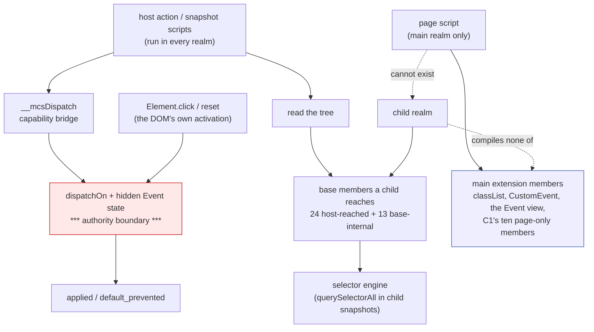

# Auditing `Node`, `Text` and `Element` (native-dom, control 0.0.2)

Design and measurement only. No product code on `main`, nothing pushed, no
navigation soak, no surface path. Every number was measured in a **throwaway
worktree with scratch builds that are not committed and are not
qualification**.

The pricing rule this slice works to is the one just ruled: a member of a
shared prototype costs **600 to 960 bytes of M1 per child**, and the shim
split's bulk ratio is historical context only.


## 1. The inventory, by who reaches each member

Fifty-six members are declared across `Node`, `Text` and `Element` in
`dom_shim_base.js`. Each was matched against every host script — the raw and
plain script bodies in `main.rs` — against `dom_shim_main.js`, and against the
base's own code, mechanically rather than by reading.

**A child-capable host script reaches these 24 — untouchable:**
`__groupState`, `__restoreGroup`, `checked`, `click`, `disabled`, `elements`,
`form`, `getAttribute`, `hasAttribute`, `href`, `id`, `isConnected`, `label`,
`name`, `options`, `querySelector`, `querySelectorAll`, `readOnly`, `reset`,
`selected`, `selectedIndex`, `textContent`, `type`, `value`.

That list is also the measured answer to a question the shim-split record left
open: `snapshot_script` calls `querySelectorAll` and `querySelector` **in
child realms**, so the selector engine stays in the base, and `click` and
`reset` are reached because the base's own activation raises them.

**The base itself uses these 13 — untouchable for the same reason:**
`__controls`, `__descendants`, `__detach`, `__options`, `__radioGroup`,
`append`, `attributes`, `children`, `className`, `defaultChecked`,
`dispatchEvent`, `removeChild`, `setAttribute`.

**Only the main extension uses these 2:** `addEventListener`,
`removeEventListener`. They stay in the base because the base's own
`dispatchOn` is the other half of that model and a child's host actions
dispatch through it.

**Nothing but page script can reach these 13:** `appendChild`, `contains`,
`defaultValue`, `firstChild`, `focus`, `innerText`, `lastChild`, `matches`,
`parentElement`, `remove`, `removeAttribute`, `replaceChildren`, `submit` —
plus `blur`, which shares a line with `focus` and the same fate.


## 2. The tree

```
What a child realm must still be able to do
├── A. Answer a snapshot (owner: snapshot_script)
│   invariant: every node, role, name, label and state the semantic snapshot reports is derivable in a child realm
│   evidence: child-frames court, and the frozen court's child-snapshot criterion
│   safe failure: a typed snapshot failure; never a partial tree reported as whole
│   dependency: querySelectorAll, querySelector, textContent, id, name, type, value, checked, disabled, readOnly, selected, selectedIndex, options, label, href, form, getAttribute, hasAttribute
│   non-goal: any snapshot format change
├── B. Apply a host action (owner: act_script, form_action_script, the dispatch bridge)
│   invariant: an action's applied/default_prevented answer comes from the host's dispatcher and hidden state
│   evidence: event-fidelity court's authority and intrinsics groups; frame-actions; form
│   safe failure: a typed refusal; never a fabricated result
│   dependency: click, reset, checked, value, selectedIndex, disabled, form, elements, __groupState, __restoreGroup, isConnected, plus dispatchOn and Event in the base
│   non-goal: enabling page script in a child
├── C. Keep the DOM's own activation honest (owner: Element.click / reset)
│   invariant: the base's activation raises its events through the closure-owned dispatcher and reads defaultPrevented from hidden state
│   evidence: event-view court's child reset criterion
│   safe failure: no activation rather than an unchecked one
│   dependency: dispatchOn, Event, defaultPrevented, removeChild, append, __detach
│   non-goal: any new page-facing member in the base
└── D. Pay for nothing else (owner: this audit)
    invariant: a member no child-capable script and no base code reaches does not live in the base
    evidence: the measurement in §3 and the frozen court's floors
    safe failure: leave the member where it is; an unmeasured move is not a saving
    dependency: the main extension, which is the only realm that can call them
    non-goal: moving anything on the strength of an argument rather than a measurement
```


## 3. Candidate C1: ten page-only members leave the base

Ten of the fourteen need **nothing new** from the one-shot handle — they are
written in terms of members that stay in the base (`childNodes`, `parentNode`,
`append`, `removeChild`, `textContent`, `getAttribute`, `localName`) or of
`dispatchOn` and `Event`, which the handle already carries: `firstChild`,
`lastChild`, `parentElement`, `appendChild`, `remove`, `innerText`,
`defaultValue`, `focus`, `blur`, `submit`.

Measured on a scratch build:

| | current `main` | candidate C1 |
| --- | ---: | ---: |
| M1 (system) | 236,938 | **230,506** |
| M1 headroom under the 245,760 floor | 8,822 | **15,254** |
| M2 (system) | 1,657,068 | **1,612,044** |
| M1 / M2 (arena) | 229,770 / 1,607,836 | 224,298 / 1,568,172 |

−6,432 bytes of M1 for ten members: **643 per member**, inside the ruled band.

Courts on that scratch build: child-frames 82/82, event-view 11/11,
event-fidelity 62/62, element-api 28/28, form 179/179, frame-actions 182/182,
page-navigation 80/80, lifecycle 53/53, timers 68/68, job-deadline 42/42,
frame-realm 62/62, cdp-frame-tree 64/64. `control-churn` was **not run**: it
requires a surface binary, and this slice runs no surface path.


## 4. Candidate C2, and why I am not proposing it yet

The remaining four — `contains`, `matches`, `removeAttribute`,
`replaceChildren` — are page-only too, but each is written in terms of base
**internals**: the `contains` helper, `parseSelector` and `matchChain`, and
`record` together with `__attrs` and `__detach`. Moving them means widening
the one-shot handle to hand out the mutation-record function and the selector
engine's internals.

Worth about 2.6 KB of M1 at the measured price, against a handle that would
carry the machinery for recording mutations. I am not proposing that trade
without a ruling, and I have not measured it, because measuring it would mean
building the wider handle first.


## 5. The dependencies, and where authority sits



The authority boundary is unchanged by this slice: it is the dispatcher and
the hidden state, reached only through the capability bridge. Nothing in C1
touches it, and nothing in C1 is reachable from a child at all.


## 6. The court, frozen before any product code

`element-view-court.py`, headless, both allocators. Criteria:

1. **Host call-site coverage.** The court re-derives the inventory of §1 from
   the shipped sources and fails if any member a child-capable host script
   names is missing from the base — so the audit cannot go stale silently.
2. **A child still answers a snapshot** with roles, names and labels, which is
   the selector engine and two dozen members working in a child realm.
3. **A child's host action still applies** through the bridge, and a canceled
   one still reports `default_prevented`.
4. **The DOM's own reset still works in a child**, which is `click`, `reset`
   and the base's activation reading hidden state.
5. **A main realm keeps every moved member**, called from page script and
   answering exactly as it did in the base.
6. **A child realm has none of them**, read through the court-only realm probe.
7. **The floors hold**: M1 ≤ 245,760 and M2 ≤ 1,720,320, measured by the
   child-frame court on the same binary, and main-only slack ≤ 65,536.


## 7. What I need ruled

1. **Candidate C1**, and with it a second `Element.prototype` divergence
   between a main realm and a child one — the same shape you accepted for
   `Event`, invisible in a child because nothing there can call them.
2. **Candidate C2**: whether the handle may widen to hand the extension
   `record`, `parseSelector`, `matchChain` and the `contains` helper for about
   2.6 KB more, or whether those four stay in the base as the cheaper honesty.
3. Whether `addEventListener`/`removeEventListener` should be counted as
   page-only. I have **not** proposed moving them: the base's own dispatcher
   is the other half of that model, and a child's host actions dispatch
   through it, so moving the registration half would split one model across
   two files for about 1.3 KB.


## 8. Limits

One court run per variant, one machine, scratch builds removed. `control-churn`
is not part of the evidence because it needs a surface binary. The navigation
soak was not run at all, by standing ruling.


## 9. The rulings

**9.1 C1 is accepted**: exactly ten members — `firstChild`, `lastChild`,
`parentElement`, `appendChild`, `remove`, `innerText`, `defaultValue`,
`focus`, `blur`, `submit` — move to the main extension. A second
`Element.prototype` divergence between a main realm and a child one is
accepted on the same ground as `Event`'s: invisible in a script-free child.
Host scripts and child-capable scripts must not depend on any moved member,
and the child snapshot, action and reset invariants are unchanged.

**9.2 C2 is closed by scope, not by measurement.** `contains`, `matches`,
`removeAttribute` and `replaceChildren` stay in the base. Their dependencies —
mutation recording, the selector engine's internals, `__detach` and `__attrs`
— would widen the one-shot handle into a second coupling for about 2.6 KB,
and that is not worth it in this increment. Recorded as a candidate awaiting
its own dependency audit, not as a saving forgone by accident.

**9.3 `addEventListener` and `removeEventListener` stay in the base**, with
`dispatchOn`. Moving only the registration half would split one listener model
across two files for about 1.3 KB, and that is not authorized. My §7.3
recommendation stands as ruled.


## 10. What the court found in itself

**10.1 A criterion that read the Rust around a script.** The source-inventory
criterion took each child-capable script's body as a fixed window after its
declaration, and the window ran off the end of the string literal into the
Rust that follows it. It duly reported that a host script calls `.remove()` —
the line it had found was `self.entries.remove(0)`, a Rust call on a Rust
collection, and on that evidence `remove` would have been struck from C1 for
no reason at all.

The body is now the script's own literal and nothing after it, raw string or
plain, and the criterion says what it meant to say.

**10.2 Four of the criteria judge the tree, not the binary.** The
source-inventory criteria read `dom_shim_base.js`, `dom_shim_main.js` and
`main.rs` from the checkout beside the court, so they answer for the *sources
as they stand* whichever binary is passed. Run against the build before C1 the
court therefore scores 16 of 17 rather than 13 of 17: the three inventory
criteria already see the moved sources, and what falsifies on the old binary is
the runtime half — every child realm still carrying the ten members.

That is the honest shape of a court that guards an audit rather than a
behaviour, and the receipt says so rather than letting the number read as a
weak falsification. Against the *sources* of the build before C1 the inventory
criteria do fail; that state is not reachable from a receipt taken today, and
it is not claimed as one.


## 11. The C2 dependency audit

Design and read-only measurement, from clean `origin/main` `681c48f`. No
product code, no implementation court frozen, no navigation soak, no surface
path. The variants were built in a throwaway worktree that has been removed.

**11.1 Call sites, re-verified mechanically.** Each of the four was matched
against every child-capable host script's own literal, against the base's own
code and against the extension: `contains`, `matches`, `removeAttribute` and
`replaceChildren` are named by **no host script, no extension code, and — for
three of them — no base code either**.

**11.2 A correction to §4: `contains` needs nothing.** §4 said all four are
written in terms of base internals. That is wrong for `contains`. What the
base uses at line 44 is the free helper `contains(a, b)`, for
`MutationObserver` subtree scope; the **method** `Node.prototype.contains` is
page-only and is one `parentNode` walk. The extension can carry that walk
without the handle growing by a single identifier.

**11.3 What the other three actually need.** Exactly four identifiers, and
`Node` is already in the handle from C1:

| member | needs from the base |
| --- | --- |
| `matches` | `parseSelector`, `matchChain` |
| `removeAttribute` | `record` (the element's `__attrs` is an own property and needs nothing) |
| `replaceChildren` | `record`, `Text` (`__detach` is a prototype method and needs nothing) |

**11.4 Measured, both sub-candidates.**

| | current `main` | C2a: `contains` alone | C2b: all four |
| --- | ---: | ---: | ---: |
| handle identifiers added | — | **0** | **4** |
| M1 (system) | 230,506 | 230,106 | **226,154** |
| M1 headroom under the 245,760 floor | 15,254 | 15,654 | **19,606** |
| M2 (system) | 1,612,044 | 1,609,244 | **1,581,580** |
| M1 / M2 (arena) | 224,298 / 1,568,172 | 223,594 / 1,565,148 | 219,898 / 1,537,196 |
| per member | — | 400 | 1,088 |
| main-only slack against the `origin/main` baseline | 32,032 | — | 31,952 |

`contains` is **below** the ruled 600–960 band at 400 bytes, and the other
three are **above** it at about 1,088 each: they are larger methods than the
ten C1 moved, and the band is a guide rather than a law. Courts on the C2b
scratch build: child-frames 82/82, element-view 17/17, event-view 11/11,
event-fidelity 62/62, element-api 28/28, form 179/179, frame-actions 182/182,
page-navigation 80/80, lifecycle 53/53, timers 68/68, job-deadline 42/42,
frame-realm 62/62, cdp-frame-tree 64/64, shim-footprint 18/18.

**11.5 What handing out `record` would mean.** `record` is how a mutation
becomes a `MutationObserver` record, and `MutationObserver` is how
`window.__mcs.revision` moves — the revision being the primitive that gates
every action a caller takes against a snapshot. Handing it to the extension
does **not** put it within reach of page script: the handle is one-shot,
consumed before any page script runs, and deleted in a child realm outright.
So this is coupling, not a page-reachable authority hole — but it is the first
time anything outside the base could move the gate, and it should be ruled on
those terms rather than on its byte count.

`Text` and the two selector functions carry no such consideration:
constructing a text node and matching a parsed selector are what the extension
already causes through public members.

**11.6 The one loss, in C2a.** Moving `contains` means the ancestor walk
exists twice — the base's helper for observer scope, and the extension's
method for pages. Four lines, two copies, and they can drift. The alternative
is to hand out the helper, which is one more identifier for one small member.

**11.7 What I need ruled.**

1. **C2a** — `contains` alone, 400 bytes, no handle change, at the cost of a
   duplicated four-line walk (11.6). Or hand out the helper and duplicate
   nothing, for one identifier.
2. **C2b** — the other three, 3,952 bytes more, for `record`, `parseSelector`,
   `matchChain` and `Text` in the handle, with `record`'s meaning as in 11.5.
3. Whether either is worth doing **now**, given M1 already has 15,254 bytes of
   headroom under an unchanged floor: neither is needed to unblock anything,
   and both spend the one-shot handle's narrowness, which is the thing that
   has made every audit since the split cheap to reason about.

My own view, for what it is worth against your ruling: take C2a with the
helper handed out rather than duplicated — one identifier, no divergence in
behaviour, no second copy of anything — and leave C2b until a slice actually
needs the 3,952 bytes.
