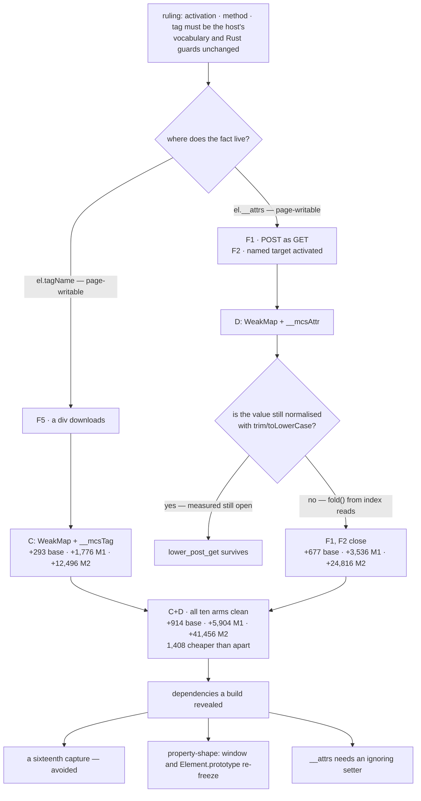

# Host-owned element facts: the ruling, and what it costs to keep

Design-only, read-only. Nothing was implemented in the committed tree and no
court was frozen. Four candidate builds were made, measured on **both
allocators**, and discarded; §8 says exactly what they were and proves the tree
is back where it started. No intrinsic capture is proposed, no bound is moved,
nothing is mixed with slimming or H2, no visual run, no soak, nothing
downloaded.

## 1. The ruling being recorded

`fail-open-triage-audit-0.0.1.md` established that F1, F2 and F5 are
**writable-element-field integrity defects, not intrinsic defects and not
authority escalation**, and asked whether the activation vocabulary is worth
defending. The ruling that came back, recorded here as the standing decision:

> The agent-facing facts — an element's **activation**, its **method** and its
> **tag** — should be trustworthy and defended. The existing typed refusal
> vocabulary is preserved as it stands, and every Rust-side scheme, origin and
> bound guard stays exactly where it is. The three defects remain **separate in
> behaviour** even though they share a root.

Two consequences run through everything below. Defending a fact means the host
reads it from somewhere the page cannot write — nothing weaker survived
measurement in the previous round. And *preserving* the vocabulary means no
refusal string, no error code and no Rust guard changes: the whole change is
about where a fact comes from, never about what the host decides once it has it.

## 2. The two candidates, as built

**C — a host-owned tag.** The base shim keeps a closure-owned `WeakMap` from
element to its lower-case tag, written in the `Element` constructor through the
already-captured `weakMapSet`, and read back through a non-writable,
non-configurable `__mcsTag` global on the `__mcsJson` pattern. All seven host
script sites that asked `el.tagName.toLowerCase()` ask `__mcsTag(el)` instead —
including `role()`, so the agent's snapshot is covered and not just the
download probe.

**D — a host-owned attribute map.** The element's attributes move from the
`this.__attrs` own property into a closure-owned `WeakMap` from element to its
Map, and `__mcsAttr(el, name)` reads it. `methodOf`, `targetOf`, `actionOf`,
`linkDecision`, the download probe and the snapshot's `entry.method` ask the
store instead of `getAttribute`.

**D on its own is not enough, and the measurement is what said so.** With the
store moved, `map_get_method` and `prop_attrs_method` are closed — but
`lower_post_get` still submits the POST as a GET, because `methodOf` normalised
the honest value with `trim().toLowerCase()`, which is still the page's. So the
candidate that is actually measured as **D** below is D plus a normalisation
built from index reads and `+=` in the style already ruled in for `urlOf`: a
`fold()` that strips ASCII whitespace and lower-cases through two literal
alphabets, consulting no prototype method at all.

## 3. What each candidate closes

Ten arms per build, from `fail-open-triage-probe.py`: the three selective
monkeypatches, the three direct page writes, two `Map.prototype.get` patches, an
arm that tries to replace and delete the readers themselves, and the unpatched
control — each carrying the honest markup beside the dishonest markup in the
same document. Receipt:
`evidence/native-dom-control-0.0.2-element-fact-candidates.json`.

| arm | baseline | C | D | C+D |
| --- | --- | --- | --- | --- |
| `lower_div_anchor` → the div downloads | **open** | closed | open | **closed** |
| `prop_tag_name` → the div downloads | **open** | closed | open | **closed** |
| `lower_post_get` → POST submitted as GET | **open** | open | closed | **closed** |
| `map_get_method` → POST submitted as GET | **open** | open | closed | **closed** |
| `prop_attrs_method` → POST submitted as GET | **open** | open | closed | **closed** |
| `lower_target_self` → named target activated | **open** | open | closed | **closed** |
| `map_get_target` → named target activated | **open** | open | closed | **closed** |
| `prop_attrs_target` → named target activated | **open** | open | closed | **closed** |
| `override_readers` → replace or delete `__mcsTag`/`__mcsAttr` | n/a | closed | closed | **closed** |

**C closes F5 completely and more than expected.** The div does not merely fail
to download — with `role()` reading the host's tag, `div_role` is `null` on
every arm, so the element is never offered to the agent as a link in the first
place. The refusal an agent sees is the honest one: the node is not there.

**Each candidate closes only its own defect**, which is the independence the
ruling asked for, measured rather than asserted: C leaves every F1 and F2 arm
exactly where it was, and D leaves every F5 arm exactly where it was.

**Nothing honest broke, on any build.** In every one of the ten arms of every
candidate, the `method="get"` form still submits and is fetched, the untargeted
link still navigates, and the real `<a download>` still delivers its 29 bytes.
The marker element is in the snapshot on every arm, which is what proves the
page's script ran before the host looked.

**No authority expansion, measured.** The escalation pairs are unchanged on
every build: an anchor with a `javascript:` href and one with a `file://` href
pointing at a real local file are both refused `scheme_unsupported`, the local
file's bytes are never returned, and a second loopback origin the host was never
told to allow is refused `permission_denied/address`. Every one of those
refusals is still the Rust half's, untouched by any candidate. **No page value
or built query leaks**: the ledger mentions no method and carries no form value
on any arm of any build.

## 4. Cost, measured on both allocators

Caps are child-frame M1 262,144 and M2 1,835,008.

| build | base shim bytes | system M1 | system M2 | arena M1 | arena M2 |
| --- | ---: | ---: | ---: | ---: | ---: |
| baseline `0da1c6b1` | 32,898 | 233,962 | 1,636,236 | 225,898 | 1,579,500 |
| **C** `a247ea29` | 33,191 (+293) | 235,738 (+1,776) | 1,648,732 (+12,496) | 227,690 (+1,792) | 1,593,548 (+14,048) |
| **D** `35e50de8` | 33,575 (+677) | 237,498 (+3,536) | 1,661,052 (+24,816) | 229,450 (+3,552) | 1,605,548 (+26,048) |
| **C+D** `3eb55470` | 33,812 (+914) | 239,866 (+5,904) | 1,677,692 (+41,456) | 231,258 (+5,360) | 1,617,580 (+38,080) |

Headroom left by C+D: **22,278** under M1 and **157,316** under M2 on the system
arm; 30,886 and 217,428 on the arena arm. Every build scored 82/82 or 81/82 on
child-frame, the variance criterion being the only difference, and all four
passed `cargo test` at 58.

**Combining is cheaper than the sum, and by a measured amount.** C+D costs
+5,904 system M1 where C alone costs +1,776 and D alone +3,536 — a saving of
1,408 bytes over doing both separately, because the two readers share the
constructor's work and the global-installation shape. That is the only reason to
consider one round instead of two, and it is a cost argument, not a security one.

**No per-realm rate is offered and none may be derived.** Both stores hold one
entry per element, so the price follows a document's element count; M1 and M2 do
not divide to the same number on either allocator, and the difference between
them is the fixture. Anyone who needs a per-document figure must measure the
documents they care about. Extrapolating here would be the C1 error a third
time.

## 5. Three costs that only appeared because the candidates were built

**A sixteenth capture is avoidable, and the first build proved it was there.**
The natural way to write `removeAttribute` against a closure-owned Map is to
capture `Map.prototype.delete`, and the first combined build did exactly that —
whereupon `signature-integrity-court.py`'s group D caught it: *"the declared
captures are unchanged and there is no sixteenth"*, `mapDelete` found. The fix
is that `removeAttribute` is page-facing only and the host never calls it, so
its `delete` can stay on the prototype: a page that patches it only breaks its
own removal, which is the same class as a page not calling `removeAttribute` at
all. The measured build above is the one **with no new capture**, and
`capture-declaration-court.py` reads 8/8 on it.

**`property-shape-court.py` moves, and cannot be avoided.** On both allocators
the combined build fails four of its criteria: `window keeps its properties,
flags and order` and `Element.prototype keeps its properties, flags and order`.
The window fingerprint moves because a hardened reader **is** a new global — any
of them, including the `__mcsJson` that already exists — and `Element.prototype`
moves because D replaces the `__attrs` data property with an accessor. Neither
is a defect in the candidate; both are frozen fingerprints correctly noticing a
deliberate change. **Re-freezing them is a decision for the ruling, not for this
audit**, and it is the single largest procedural dependency of this slice.

**Taking `__attrs` away without a setter crashes the page's script.** The first
D build defined `__attrs` as a getter only; a page assigning `el.__attrs = …`
then threw, the page's inline script died, and `target.open` answered
`target_crashed`. Measured on three of the ten arms. Defining an ignoring setter
beside the getter restores the old behaviour — the page's write is silently
without effect, exactly as an assignment to a getter-only property is in sloppy
mode — and all ten arms open cleanly. **A slice that moves an internal field
must leave a landing place for the write it used to accept**, or it converts a
page's harmless mistake into a dead document.

## 6. Tree DAG

```
the ruling: an agent-facing fact must be the host's
├── which facts?  activation · method · tag        (activation is already host-owned since 7b9e11a)
├── where does the fact live today?
│   ├── el.tagName / el.localName   — page-writable own property     → F5
│   └── el.__attrs                  — page-writable own property     → F1, F2
│       └── and its accessor adds Map.prototype.get, String, toLowerCase
└── where must it live?  a closure-owned store, read through a hardened global
    ├── C: WeakMap element→tag, __mcsTag           → F5 closes; div is not even a node
    │   └── +293 base bytes · +1,776 / +12,496 system · +1,792 / +14,048 arena
    ├── D: WeakMap element→attrs, __mcsAttr        → F1, F2 close ONLY WITH
    │   ├── the store moved                        (map_get_* and prop_attrs_* close)
    │   └── the normalisation rebuilt              (lower_* closes — measured, not assumed)
    │   └── +677 base bytes · +3,536 / +24,816 system · +3,552 / +26,048 arena
    └── C+D together                               → all three close, all ten arms clean
        ├── +914 base bytes · +5,904 / +41,456 system · +5,360 / +38,080 arena
        ├── 1,408 bytes cheaper than C and D apart (measured)
        └── costs that only a build reveals
            ├── a sixteenth capture — avoidable, and avoided in the measured build
            ├── property-shape: window AND Element.prototype fingerprints move
            └── __attrs needs an ignoring setter, or a page's write kills the document
```

## 7. Mermaid



## 8. The builds are gone

Four candidate binaries were built, measured and discarded: `a247ea29` (C),
`44fdaa8a` and `35e50de8` (D, before and after the normalisation was rebuilt),
`94724ef6` (combined, with the sixteenth capture) and `3eb55470` (combined,
without it). After each, `git checkout -- src/` restored the tree. The tree now
holds `dom_shim_base.js` at **32,898** bytes and `dom_shim_main.js` at
**26,485**, and the rebuilt binary hashes **`0da1c6b115532886`** — the pushed
build, byte for byte. Nothing from any candidate is in this commit except its
numbers and the probe that produced them.

## 9. Loss matrix

| option | closes | leaves open | measured cost | risk |
| --- | --- | --- | --- | --- |
| **Accept** | nothing | F1, F2, F5 | zero | the ruling says the facts should be defended, so this is now the option that contradicts a decision rather than merely a preference |
| **C alone** | F5, and the snapshot's div-as-a-link with it | F1, F2 | +293 base; +1,776 / +12,496 system; +1,792 / +14,048 arena | smallest of the three; still moves the window fingerprint, so `property-shape` re-freezes for a one-defect slice |
| **D alone** | F1, F2, and the snapshot's `method` | F5 | +677 base; +3,536 / +24,816 system; +3,552 / +26,048 arena | larger surface: `Element.prototype` shape moves as well as `window`, and the ignoring setter is mandatory |
| **C+D, one round** | all three | — | +914 base; +5,904 / +41,456 system; +5,360 / +38,080 arena | 1,408 bytes cheaper than the two apart; one `property-shape` re-freeze instead of two; but it is one review of a larger diff |
| **C then D, two rounds** | all three, in order | — | the two rows above, summed | keeps the defects separate in review as well as in behaviour, which is what the ruling asks for in behaviour; costs 1,408 bytes and a second re-freeze |

The audit's reading: the ruling requires the facts to be defended, and the
measurements say **all three are closable within the technique already
authorised, with no new capture, no widened bound, and 22,278 bytes of M1
headroom left**. The choice between one round and two is a review-process
choice, and it is the ruling's to make; nothing in the evidence forces bundling,
and the behaviour stays separable either way.

## 10. Dependencies

- **`property-shape-court.py`** — four criteria move on both allocators for any
  option. The window fingerprint moves for C, D or both; `Element.prototype`
  moves for anything containing D. This must be re-frozen deliberately, with the
  movement recorded chronologically, and it is a precondition of the
  implementation round rather than part of it.
- **`signature-integrity-court.py` group D** — its base-byte pin (32,898 /
  26,485) and its fifteen-capture pin are the guards that caught the sixteenth
  capture. The byte pin **must** be re-frozen by whatever ruling authorises a
  base-shim change; it is doing exactly what it was written to do by failing.
- **`capture-declaration-court.py`** — 8/8 on the measured build. It stays 8/8
  only if `removeAttribute` keeps its prototype `delete`; the moment a
  sixteenth capture appears, H3's declared set and its reserved list reopen.
- **`shim-footprint-court.py`** — a recovery court needing a `--baseline`; the
  per-realm evidence used here is child-frame's M1/M2 on both allocators, which
  is the same measurement the caps are written against.
- **`form-court.py` (179/179), `frame-action-court.py` (182/182),
  `page-navigation-court.py` (80/80), `downloads-court.py` (21/21),
  `element-api-court.py` (28/28), `dataset-court.py` (15/15)** — all green on the
  candidates that touch what they exercise; they are the behavioural regression
  set for the implementation round.
- **H2 and slimming** — unrelated and must stay unrelated. Routing capturable
  sites through existing captures closes none of these three; the `prop_*` arms
  proved that in the previous round and prove it again here.

## 11. Safe failures

- A tag missing from the store answers `""`, which is not `"a"` and not any tag
  the classifier knows, so the element gets no role and no activation: the
  failure direction is that the agent is offered less, never more. Measured —
  that is exactly what the div does under C.
- An attribute missing from the store answers `null`, which `methodOf` turns
  into `"get"` and `targetOf` treats as absent — the same answers the honest
  absent attribute produces today. A store that lost an element entirely makes
  every attribute absent, which is a document with no `href`, no `method` and no
  `target`: refusals and plain elements, never an approval.
- If a hardened reader is missing from a realm the host script throws, the act
  fails, and a failed act is a refusal. Same shape as `__mcsJson`.
- If the ignoring setter is omitted, a page's `__attrs` write kills the page's
  script and the target reports `target_crashed`. That is a fail-closed
  direction but a bad one, and §5 records it precisely so the implementation
  does not rediscover it.

## 12. Non-goals, and what this does not settle

No implementation in the committed tree, no court frozen, no new intrinsic
capture, no bound moved, no widened internals handle — the readers are separate
non-writable globals, not new keys on `__mcsInternals`, and `property-shape`'s
thirteen-key check passes on every candidate. Nothing mixed with slimming or H2,
no visual run, no soak, nothing downloaded, no protocol change, and no refusal
string or Rust guard altered anywhere.

- The C-class snapshot corruptions from `uncaptured-intrinsic-audit-0.0.1.md`
  §3.2 are only partly touched. C makes `role()` honest and D makes
  `entry.method` honest, but node **names** still come from `textContent` and a
  page still owns those. That is not a fail-open and it is not in this ruling.
- `dom_shim_main.js`'s own two `__attrs` uses were left working through the
  accessor rather than rewritten. Rewriting them is what would keep
  `Element.prototype`'s shape unchanged, and it is **not priced here** — the
  shape of that change is different enough from what was built that carrying a
  number across would be an extrapolation.
- The probe uses one document. Element counts drive the price, so the numbers
  above are that document's, on this machine, on these two allocators.
- Whether to do one round or two is left to the ruling, and so is the
  re-freezing of `property-shape` and of the base-byte pin.
