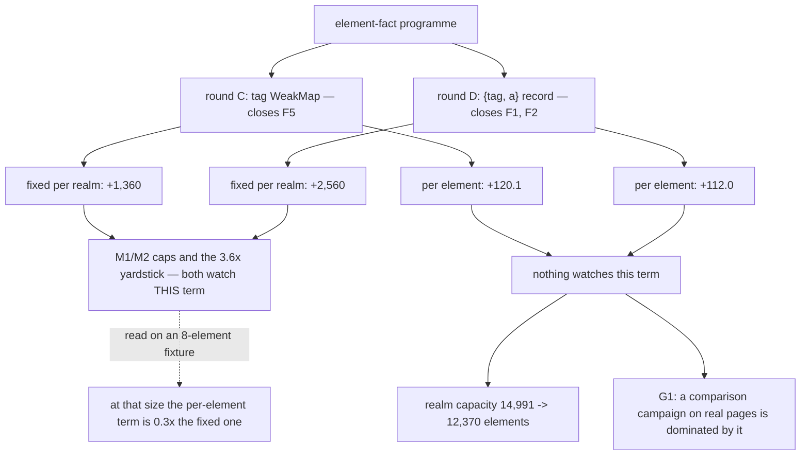

# What an element costs a realm — read-only audit, 0.0.1

Design-only. Nothing implemented, no court frozen, no criterion, cap, floor or
protocol touched, no navigation soak, no visual or surface run, nothing
downloaded. Two comparison binaries were rebuilt from committed commits in
throwaway worktrees outside this checkout; both were measured and then left
there. The five standing guards hold.

**The finding: the element-fact programme was priced where its cost is
smallest and never where it is largest.** Every round measured its fixed
per-realm cost against a frozen ceiling and passed honestly. None measured the
term that scales with the page, and that term is where the rounds actually
spent: **+232 bytes per element, a 21% increase**, which no ceiling bounds and
no yardstick names.

## 1. Three builds, one measurement

`element-scaling-probe.py`, tracked `script_realms.malloc_bytes`, one host and
one target per point, both allocators. Tracked bytes are exact and
deterministic — every figure below reproduced to the byte across runs, so
nothing here is averaged.

System arm. "bare" is one element carrying no attributes; "slope" is the
least-squares fit over 0…4,000 elements carrying two each.

| build | base shim | slope | Δ | bare element | Δ | per attribute | empty realm | Δ |
| --- | ---: | ---: | ---: | ---: | ---: | ---: | ---: | ---: |
| `fb4f001` before round C | 32,898 | 1,097.4 | — | 632.6 | — | 229.8 | 325,440 | — |
| `a26aea3` round C | 33,290 | 1,217.6 | **+120.2** | 752.7 | **+120.1** | 229.8 | 326,800 | +1,360 |
| `9fb51ad` round D, shipped | 33,886 | 1,329.6 | **+112.0** | 864.7 | **+112.0** | 229.8 | 329,360 | +2,560 |

Arena arm, same shape: 1,029.5 → 1,178.4 → 1,279.3 bytes per element, and an
empty realm of 315,216 → 317,040 → 319,696.

Three facts fall straight out, and the third is the one that matters:

1. **The per-attribute cost never moved.** 229.8 bytes on all three builds,
   system arm, identical to the byte; 199.2 → 200.4 on the arena arm. Neither
   round touched what an attribute costs.
2. **The whole increase is a flat charge on every element**, independent of
   how many attributes it carries — round C's `WeakMap` entry (+120.1) and
   round D's `{tag, a}` record replacing an own-property `Map` (+112.0).
   The shim was not touched again after `a0482ed`, so the second figure is
   round D's alone.
3. **The fixed per-realm term behaved exactly as the engine audit predicted.**
   `first-realm-engine-audit-0.0.1.md` §2 put the shim's exchange rate at
   ~3.6 bytes of realm memory per byte of shim source. Measured here on the
   empty-realm figure: **3.47, 4.30 and 3.97** bytes per source byte. That
   rate is confirmed. It simply prices only one of the two terms.

## 2. Why every ceiling passed

The rounds were measured against the child-frame caps M1 and M2, and they
passed with room to spare. Those caps are read on the child-frame court's own
fixtures, and `child-a.html` is a page shell around `
embedded
alpha
` — on the order of eight elements.

At eight elements, round D's per-element term is **896 bytes against a fixed
term of 2,560** — a third of it. At a realistic page it inverts:

| elements | round D per-element term | round D fixed term | ratio |
| ---: | ---: | ---: | ---: |
| 8 — the court's fixture | 896 | 2,560 | **0.3×** |
| 500 | 56,000 | 2,560 | 21.9× |
| 1,500 | 168,000 | 2,560 | 65.6× |
| 3,000 | 336,000 | 2,560 | 131.2× |

So the ceilings did not fail to catch this. **They were never pointed at it.**
A cap expressed in bytes-per-child-realm, read on an eight-element fixture,
cannot see a slope; and the programme's proposed yardstick — the 3.6× source
exchange rate of `first-realm-engine-audit-0.0.1.md` §8 candidate A — prices
the same fixed term the caps already watch.

## 3. What it costs where it is spent

Tracked realm bytes for a whole page, system arm:

| elements | before round C | shipped | delta |
| ---: | ---: | ---: | ---: |
| 500 | 874,140 | 994,160 | +120,020 |
| 1,500 | 1,971,540 | 2,323,760 | +352,220 |
| 3,000 | 3,617,640 | 4,318,160 | +700,520 |
| 5,000 | 5,812,440 | 6,977,360 | +1,164,920 |

And the consequence with a name. The per-realm limit is 16 MiB, so the slope
sets the largest document a realm can hold:

| arm | before round C | shipped | change |
| --- | ---: | ---: | ---: |
| system | 14,991 elements | **12,370** | **−2,621 (−17.5%)** |
| arena | 15,990 elements | **12,864** | −3,126 (−19.6%) |

The hardening bought two real closures — F5 at round C, F1 and F2 at round D —
and paid for them with about a sixth of the largest page the host can open.
**That may well be the right trade.** It has simply never been stated as one,
because the number was never taken.

## 4. The second question: is the store the host's, or only the host's to hold?

Round D put each element's facts behind a closure-owned `WeakMap` read through
non-writable globals. But `Element.prototype.__attrs` is a page-observable
accessor, and **its getter returns the record's live `Map` object**.
`fail-open-triage-probe.py` already records that a page can reach it; no arm
had asked whether a page can write through it. `attribute-store-probe.py` asks,
in ten arms, each dishonest write paired with the honest DOM call it imitates.

| what the page did | POST form submit | named-target link | plain link |
| --- | --- | --- | --- |
| nothing | refused `form_method_unsupported` | refused `target_named` | `GET /landed.html` |
| `__attrs.set('method','get')` | **submitted, GET** | refused | `GET /landed.html` |
| `setAttribute('method','get')` | **submitted, GET** | refused | `GET /landed.html` |
| `__attrs.delete('method')` | **submitted, GET** | refused | `GET /landed.html` |
| `removeAttribute('method')` | **submitted, GET** | refused | `GET /landed.html` |
| `__attrs.delete('target')` | refused | **activated** | `GET /landed.html` |
| `removeAttribute('target')` | refused | **activated** | `GET /landed.html` |
| `__attrs.set('href','/moved.html')` | refused | refused | **`GET /moved.html`** |
| `setAttribute('href','/moved.html')` | refused | refused | **`GET /moved.html`** |

**Every dishonest write lands exactly where its honest twin lands, and nowhere
else.** Writing through the handed-out `Map` reaches what `setAttribute`
reaches: a page rewriting its own document gets a document that reflects the
rewrite, which is correct. **F1 and F2 stay closed** — what round D defends
against is a page that *lies* about a fact its markup still declares, and no
arm here produced an outcome honest markup could not.

This audit expected a fail-open and did not find one. The pairing is the only
reason that is a result rather than an omission: without the honest column,
rows two and three of that table look like an escalation and are not.

One difference is real but unmeasured and is recorded as a question, not a
claim: `__attrs.set` writes past `setAttribute`'s name validation and past its
`record("attributes", …)` mutation entry, so a page can in principle change an
attribute without the revision moving. Whether an agent waiting on
`revision_at_least` can be made to act on stale state was **not** measured
here — it needs a write that happens after a snapshot, which this probe's
page-load script cannot produce. It harms only the page that does it, and it
is named so the next brief can decide whether it is worth an arm.

## 5. Owners, invariants, evidence

- **Owner**: the `Element` constructor in `dom_shim_base.js`, which builds one
  `WeakMap` entry and one `{tag, a}` record for every element a document has.
- **Invariants any change must keep**: the tag and the attribute map stay
  unreachable for *dishonest* writing — a page may change its own markup and
  must not be able to make the host read a fact the markup denies; the
  `__attrs` landing setter keeps swallowing a page's direct assignment rather
  than throwing, which is what stops `target_crashed`; F1, F2 and F5 stay
  closed on every route their courts pin.
- **Evidence**: `-element-scaling` on the shipped binary, `-element-scaling-round-c`
  and `-element-scaling-pre-round-c` on the two rebuilt comparison binaries, and
  `-attribute-store` on the shipped binary. The two comparison binaries were
  built at a path other than the canonical one, so by the same-path provenance
  rule in `AGENTS.md` their hashes are **not** the historical `0da1c6b11553…`
  and `e9e07111…` and must not be read as those builds' tokens. Runtime memory
  does not depend on the build path, which is what makes the comparison valid
  and the hash match irrelevant.

## 6. Loss matrix — the candidate paths, none taken

| path | what it would touch | measured basis | safe failure | verdict |
| --- | --- | --- | --- | --- |
| accept the slope and record it | nothing | §1 | none | **the honest default until a ruling says otherwise** |
| add a per-element criterion to a court | a frozen court gains an arm | §2: nothing watches the slope | if the slope cannot be held, the number is still on the record | **the cheapest thing that would stop this recurring**; needs a ruling, and a number chosen *before* the next round, not after |
| collapse the `{tag, a}` record into the `Map` | the round-D store | would remove one object per element | — | **rejected here, not deferred**: the page is handed that `Map`, so a tag inside it is a tag the page can write, and F5 reopens. Recorded so it is not proposed later |
| store the tag in a second `WeakMap` again | back to round C's shape | round C was +120.1 alone, round D +112.0 | — | deferred: it is not obviously cheaper and it undoes a round that was ruled |
| make `__attrs` hand out a copy | the getter | not measured | — | deferred, and it would *raise* the per-element cost, not lower it |
| re-derive what the caps measure | M1/M2's wording | §2 | leave the caps and add a separate slope guard | **ruling required.** The caps are frozen and correct for what they say; this audit does not move them |

## 7. Falsifiability, for whichever is taken

A per-element guard would have to pin: the slope over at least four element
counts on both arms, since a single page size cannot distinguish a slope from
an intercept; the bare-element and per-attribute figures separately, so a
change to one is not hidden by the other; the empty-realm intercept, so a
saving that merely moves cost from the slope into the fixed term is caught; and
the realm capacity that follows from them, because that is the number a product
claim would actually be made about. The separation of the two terms is the
criterion that matters — this audit found the gap between them, and only that
separation would keep a future round honest.

## 8. Recommendation

Nothing to implement, and no cap moved. Three things for the next ruling, in
order:

1. **Record the slope as a product number.** 1,329.6 bytes per element and a
   12,370-element realm ceiling are facts about the route that a G1 comparison
   campaign will be dominated by on any real page. They belong beside the
   marginal-target figure, not inside it.
2. **Decide whether a per-element criterion is frozen before the next element
   round**, and if so choose its number in advance. Every existing guard reads
   a fixture small enough that the term is invisible.
3. **Amend `open-goal-triage-0.0.1.md` §8.** Its ordering item 1 is "shrink the
   first-profile step (1.77 MB)", which `first-request-cost-audit-0.0.1.md`
   then measured out of existence — profiles cost ~16 KB and the constant is
   the first served line. The triage still recommends it, and it is the
   document a reader consults for what to do next.
