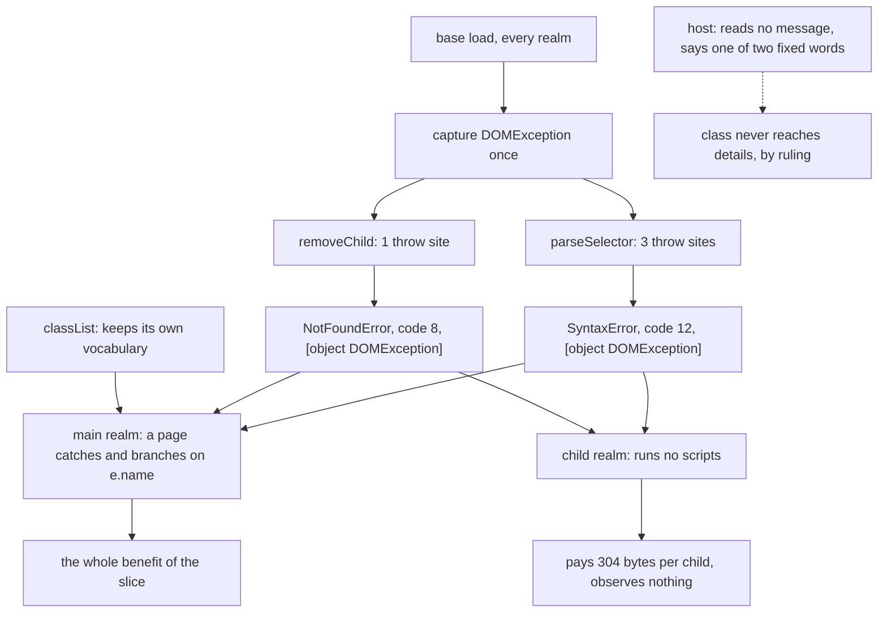

# Standard error classes for the base's own throws — read-only audit, 0.0.1

Design-only. Nothing implemented, no implementation court frozen, the handle
does not widen, no cap or floor is proposed, and no navigation or visual path
was run. One throwaway build carried candidate A for measurement and was
discarded with its worktree; the repository carries none of it.

Candidate A, as provisionally accepted: the base captures `DOMException` at
load and throws it, with the standard name, from the selector engine and from
`removeChild`. `classList` keeps the vocabulary it has. Whether the exception's
class may appear in `details` stays **forbidden** — the host says one of two
fixed words and this audit does not reopen that.

## 1. What changes, measured on candidate A

Built on top of `d46ee3c` and measured through a page fixture:

| call | today | candidate A | a browser |
| --- | --- | --- | --- |
| `querySelector("div:hover")` | `Error`, no `code`, `[object Error]`, name only in the message | **`SyntaxError`, `code` 12, `[object DOMException]`** | `SyntaxError`, code 12, `DOMException` |
| `querySelectorAll`, `closest`, `matches` | as above | as above | as above |
| `removeChild(orphan)` | `Error`, message is the bare word `NotFoundError` | **`NotFoundError`, `code` 8, `[object DOMException]`** | `NotFoundError`, code 8 |
| `classList.add("a b")` | `InvalidCharacterError`, no `code`, `[object Error]` | unchanged | `InvalidCharacterError`, code 5 |
| `setTimeout("…")`, `cloneNode` on an unmodelled kind | `TypeError` | unchanged | `TypeError` / no throw |

The message loses its `SyntaxError:` prefix, because the name is now the name:
`e.message.indexOf("SyntaxError") === -1` is true on the candidate.

## 2. The capture holds, measured

The risk the earlier audit recorded was that `globalThis.DOMException` is
page-replaceable. On candidate A the base captures the constructor at load,
and the measurement is unambiguous: a page that installs its own `Fake` over
`globalThis.DOMException` and then trips the selector engine still catches a
real `DOMException` — `SyntaxError`, `code` 12, `[object DOMException]`, and
`e instanceof Fake` is **false**. Replacing `globalThis.Error` likewise
changes nothing about what the base throws. The capture is the whole reason
this is safe to do, and it is the same discipline the privileged dispatch path
already uses for `Reflect.apply` and the rest.

## 3. The objection that the redaction removed

The error-name audit recorded a real cost: rquickjs's `as_exception()` returns
`None` for a `DOMException`, so the host's `details.engine_error` fell back to
a contentless string and the host lost its diagnostic. **That objection no
longer exists.** Since `d46ee3c` the host never reads an exception's message at
all; it says one of two words it authors itself. Measured on candidate A, an
uncaught `DOMException` carrying a page value produces exactly what an
uncaught `Error` produces:

```
{"engine_error":"a script threw","script":"inline","script_index":0}   code: target_crashed
```

with the page value absent. So the redaction slice, taken first, retired the
only measured argument against the standard class. The order those two slices
were ruled in turned out to matter.

## 4. The tree

```
                      base load (every realm)
                              |
                  const DOMExceptionCtor = DOMException   <- captured once
                              |
        +---------------------+---------------------+
        |                     |                     |
  parseSelector()        removeChild()        classList (main only)
   3 throw sites          1 throw site         2 throw sites, unchanged
        |                     |                     |
        v                     v                     v
  SyntaxError/12        NotFoundError/8      SyntaxError, InvalidCharacterError
        |                     |                     |  (plain Error, no code)
        +----------+----------+                     |
                   |                                |
             who can observe it                     |
                   |                                |
        +----------+-----------+                    |
        |                      |                    |
   main realm page        child realm           main realm page
   catches and reads      *runs no scripts*     catches and reads
        |                      |
        v                      v
   the whole benefit      pays 304 bytes, observes nothing
```



## 5. Cost, and where it falls

Measured on the throwaway candidate against the shipped `30004da4d050…`, with
`child-frame-court` on both allocators:

| | M1 (system) | Δ per child | M2 | arena M1 |
| --- | --- | --- | --- | --- |
| shipped | 224,458 | — | 1,569,708 | 217,658 |
| candidate A | 224,762 | **+304** | 1,571,836 (+2,128) | 217,946 (+288) |

M2 is exactly seven times the M1 delta, so the cost is per-child with no
super-linear term. Floors of 245,760 and 1,720,320 are untouched, leaving
**20,998 bytes of M1 headroom**. The candidate reproduces the number measured
in the error-name audit on the earlier baseline, so the price is stable across
two builds and two baselines.

**Where it falls is the finding.** The selector engine lives in the base, so
every realm pays. But a child realm **runs no scripts** — the frozen
child-frame court says so on this very binary: *"an embedded document's inline
script does not run"*, passing on both allocators — and the host itself never
passes a selector into any realm. So no page in a child realm can ever catch
one of these errors. The 304 bytes buy nothing there; the whole benefit lands
in the main realm, and children pay for it seven-fold in M2. That is not an
argument against the slice, and it is not free either: it is the price of
having one selector engine instead of two.

Existing courts on the candidate: `page-error-redaction` 23/23, `element-view`
23/23, `element-api` 28/28, `event-fidelity` 62/62, `dataset` 15/15,
`child-frames` 82/82. Nothing in the shipped evidence depends on the old shape.

## 6. Loss matrix after candidate A

What a page still cannot rely on, so the record says it rather than a user
discovering it:

| the page expects | after A | why |
| --- | --- | --- |
| `e.name` on a selector refusal | **served** | standard name, from the engine's own class |
| `e.code` on a selector refusal | **served** | 12 / 8, the engine's legacy table |
| `e instanceof DOMException` | **served** | it is one |
| `e instanceof SyntaxError` | still false | correct: a browser throws a `DOMException` here too |
| `classList` errors as `DOMException` | **not served** | keeps plain `Error` with a name; no `code`, `[object Error]` |
| `InvalidStateError` from re-entrant dispatch, `QuotaExceededError` from storage | **not served** | same shape as `classList`: named plain `Error` |
| a selector the engine does not implement (`,`, `>`, `+`, `~`, `:`) | still refused | A changes the *class* of the refusal, never the coverage |
| `cloneNode` on a node kind the host does not model | still `TypeError` | a deliberate closed set, ruled earlier |
| the exception's class in a control error's `details` | **forbidden** | the host says one of two fixed words; unchanged by this audit |
| `e.stack` | present in both | engine-provided, unspecified content |

The middle rows are the honest cost of a partial slice: after A this host has
**two** error vocabularies instead of three — engine-class `DOMException` for
the base's DOM refusals, named plain `Error` for `classList`, dispatch and
storage — and a page that catches both still reads `e.name` successfully for
each. `e.name` is the portable thing; `e.code` and the tag are not.

## 7. Dependencies

- **Host → error class: none.** No `.rs` file reads a name, a class or a
  message. Since `d46ee3c` the host does not even read `message()`.
- **Host → selector engine: none.** The word `selector` does not appear in the
  host; no control operation passes one.
- **Courts → names:** one criterion, `element-api-court.py:302`, reads the two
  `classList` names, which A does not move.
- **Base → main:** none. The capture and the throw sites are entirely inside
  the base; the main extension is untouched, so the split is unaffected.
- **Child realms:** pay the bytes, observe nothing (§5).
- **The pending attribute-name validator** is the one forward dependency: if it
  throws, it should throw the same way this slice establishes, and the vocabulary
  it was ruled to use — `InvalidCharacterError`, `SyntaxError` — is exactly the
  `DOMException` set. Landing A first makes that slice smaller.

## 8. Pending rulings

1. **Take A as measured**, at 304 bytes per child, with the constructor
   captured at base load, covering the selector engine and `removeChild`.
2. **`classList`, dispatch and storage**: leave them as named plain `Error`s
   (this audit's recommendation — they already read correctly and moving them
   costs bytes for a `code` almost nothing branches on), or bring them along
   for one vocabulary everywhere, which should be priced before it is ruled.
3. **Whether the child cost is acceptable** given that no child can observe the
   benefit, or whether the ruling would rather leave the base alone until a
   child realm ever runs a script.
4. **What the implementation court must falsify**, when it is frozen: the
   proposal is name, `code` and tag for both throw sites, the capture proven by
   a page that replaces the global first, `classList` unchanged, and the
   redaction's R1/R2/R8 still passing so the class change cannot be mistaken
   for a leak repair.


## 9. Ruled

Candidate A is accepted as measured. The selector engine's four page entry
points — `querySelector`, `querySelectorAll`, `closest`, `matches` — throw the
base-load captured `DOMException` named `SyntaxError` with `code` 12 and the
`[object DOMException]` tag; `removeChild` throws `NotFoundError` with `code`
8. A page that replaces `globalThis.DOMException` or `globalThis.Error` must
not be able to change any of it.

**Scope stops there, deliberately.** `classList`, the re-entrant dispatch
guard and `localStorage` keep the plain named `Error`s they have. This host
will carry two error vocabularies rather than pay bytes to unify a third, and
§6's loss matrix stands as the written record of that choice rather than
something a page's author discovers.

The class and the message stay out of the host's `details`, which keeps saying
one of two fixed words. The redaction's R1, R2 and R8 must still pass on the
build that carries this slice: a class change must never be mistaken for, or
quietly become, a leak repair.

**304 bytes per child is accepted**, with the floors of 245,760 and 1,720,320
and the caps unmoved and roughly 21,000 bytes of M1 headroom left. The child
divergence recorded in §5 — every child pays, no child can observe — is
accepted with it, and the implementation court carries a criterion for it so
the fact stays measured rather than remembered.

The implementation court is frozen before the code, covering names, codes and
tags at both sites, the capture against a page that replaces the global first,
`classList` unchanged, the redaction regression, and the child divergence.
