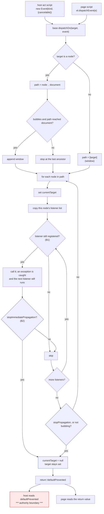

# Bounded `Event` fidelity (native-dom, control 0.0.2)

Design and measurement only. No product code, no court frozen yet, nothing
pushed. Written against `31a0e3f` / release `2b6d985fe682…`, and every claim
below about today's behaviour is a measurement through the control door, not
a reading of the source.


## 1. The outcome this is for

An agent acts on a page and then reads the DOM to decide what happened. That
only works if the page's own handlers behave the way the page's author
expected — if a handler cancels an activation, the activation must not happen;
if it stops propagation, the outer handler must not run; if one handler
throws, the others must still run. Where this host's events diverge from the
page author's expectation, the DOM the agent reads afterwards is a DOM no
browser would have produced, and every conclusion drawn from it is drawn from
a fiction.

`CustomEvent` landed on top of this model last slice, which is why the model
itself is now worth making faithful.


## 2. What the host does today, measured

Twenty-three probes, run through `target.open` + `target.snapshot` against
`2b6d985fe682…`, each writing its result into its own element:

| probe | measured | verdict |
| --- | --- | --- |
| `new Event(t, null)` | `threw:TypeError` | **defect** |
| `new Event(t)` | ok | correct |
| `e.type = "z"` | `writable` | **defect** |
| `e.target = "forged"` | `writable` | **defect** |
| `e.defaultPrevented = true` | `writable` | **defect**, see §3 |
| `eventPhase` | `undefined` | **absent** |
| `preventDefault()` on a non-cancelable event | `false` | correct |
| `preventDefault()` on a cancelable event | `true` | correct |
| `dispatchEvent` return when canceled | `false` | correct |
| `stopPropagation` | ancestor did not run | correct |
| `stopImmediatePropagation` | `undefined` | **absent** |
| a second listener after it | both ran | follows from the absence |
| `composed`, `isTrusted`, `timeStamp` | all `undefined` | **absent** |
| after dispatch | `target` kept, `currentTarget` null | correct |
| re-dispatch of the same object | ran twice | correct (the standard only forbids re-entrant dispatch) |
| listener **added** during dispatch | did not run | correct |
| listener **removed** during dispatch | **still ran** | **defect** |
| a listener that throws | later listeners and ancestors still ran, `dispatchEvent` returned true | correct, and silently swallowed |
| same object along the path, `currentTarget` per node, `target` fixed | all true | correct |
| dispatch at the window | `target` and `currentTarget` are the window | correct |

So the dispatch *shape* is right — path, bubbling, target/currentTarget,
cancelation gating, exception isolation, added-during-dispatch — and what is
wrong is the event object's integrity, three absent members, and one
dispatch-loop rule.


## 3. The one finding with authority in it

The host's own action scripts dispatch events into the page and read
`ev.defaultPrevented` to decide whether an activation proceeds
(`main.rs:712`, `719`, `782`, `852`). That field is a plain writable property.

Measured on a link, three fixtures identical but for one line in the page's
click handler:

| the handler does | the host's answer |
| --- | --- |
| nothing | `navigated: true`, a new document, generation 2 |
| `ev.preventDefault()` | `applied: true`, no navigation |
| `ev.defaultPrevented = true` | `applied: true`, no navigation |

**Writing the field cancels a host-driven navigation without ever calling
`preventDefault`.** Stated precisely, and no wider: this is *not* a present
escalation, because that click is dispatched `cancelable: true` and the page
was entitled to cancel it. What it is, is the cancelation rule expressed
nowhere except in a method the page can bypass. The host already dispatches
non-cancelable events with the same helper — `fire("input", false)` and
`fire("change", false)` — whose return values are unused today. The day one of
those returns is read, a page can cancel what the standard says it cannot,
and nothing in the model would have to change for that to happen.

That is why `defaultPrevented` is treated below as an authority boundary and
not as fidelity.


## 4. The tree

```
Event fidelity an agent can act on
├── A. Object integrity (main extension)
│   ├── A1 null dictionary
│   │   invariant: new Event(t, null) and new CustomEvent(t, null) construct, with the defaults of an empty dictionary
│   │   evidence: court criterion; today measured `threw:TypeError`
│   │   safe failure: construction throws as it does now — a page error, never a host one
│   │   dependency: none
│   │   non-goal: any other coercion of a non-object dictionary
│   ├── A2 read-only members
│   │   invariant: type, bubbles, cancelable, defaultPrevented, eventPhase, composed, isTrusted, timeStamp cannot be assigned by page script
│   │   evidence: court asserts assignment leaves the value unchanged, and that preventDefault still moves defaultPrevented
│   │   safe failure: a page's assignment is silently ignored, as a getter-only property is in sloppy mode; nothing throws
│   │   dependency: A4 (preventDefault must still be able to set it)
│   │   non-goal: target and currentTarget — see Blocker 2
│   ├── A3 absent members
│   │   invariant: composed is false, isTrusted is false for page-constructed events, timeStamp is a number that does not decrease within a document
│   │   evidence: court reads each in a listener
│   │   safe failure: absent is what they are today; a wrong value is worse than none, so each is either right or stays absent
│   │   dependency: none
│   │   non-goal: isTrusted true for host-driven events — the host's synthetic events are not user gestures and will not claim to be
│   └── A4 cancelation as the only cancel
│       invariant: defaultPrevented moves only through preventDefault, and only when cancelable
│       evidence: the §3 three-way measurement, rerun as a court criterion, with the forged variant now navigating
│       safe failure: a page that writes the field is ignored; the host's decision is unchanged from the un-canceled case
│       dependency: A2
│       non-goal: making host-dispatched events non-cancelable
├── B. Dispatch rules (base — see Blocker 1)
│   ├── B1 a listener removed during dispatch does not run
│   │   invariant: removal is observed by the dispatch in progress
│   │   evidence: court measures `first` where today it measures `first,second`
│   │   safe failure: the listener runs, which is today's behaviour
│   │   dependency: none
│   │   non-goal: re-entrancy guards of any other kind
│   └── B2 stopImmediatePropagation
│       invariant: no later listener on the same target runs, and no ancestor runs
│       evidence: court measures `one` where today it measures `one,two`
│       safe failure: it behaves as stopPropagation, which is strictly weaker and never more permissive
│       dependency: B1's loop
│       non-goal: capture phase, once, passive, signal, handleEvent
├── C. Phase (main extension)
│   └── C1 eventPhase
│       invariant: 2 at the target, 3 at an ancestor, 0 before and after dispatch
│       evidence: court reads it in listeners at both positions and after
│       safe failure: absent, as today
│       dependency: the base dispatcher exposing which node it is at, which it already does through currentTarget
│       non-goal: 1 (capturing) — this host has no capture phase and will not pretend to
└── D. Unchanged invariants (regression, not new work)
    ├── D1 children stay script-free and compile none of A or C
    ├── D2 M1 <= 245,760 and M2 <= 1,720,320, the shim floors, re-measured
    └── D3 the whole same-binary suite, unchanged
```


## 5. The dispatch path, and where authority sits



The authority boundary is one edge: what the host reads back. Everything
above it is page behaviour; `defaultPrevented` is the only value that crosses,
and A4 is what makes it mean what the standard says it means. The kill
boundaries are `stopImmediatePropagation` (ends the listener loop),
`stopPropagation` (ends the path walk) and the end of dispatch (clears
`currentTarget`, keeps `target`).


## 6. Base or extension, decided per item by one test

The test the root set: *does a child agent action require it?* A child frame
runs no page script, so nothing in a child realm can call
`stopImmediatePropagation`, read `isTrusted`, or add and remove listeners.
What a child realm does do is run the host's snapshot, preflight and action
scripts, which construct events, dispatch them, and read `defaultPrevented`.

- **A1–A4 and C1 go in the main extension, with zero base growth.** The
  extension replaces `g.Event` with a subclass that normalizes the dictionary
  and defines the read-only members, and replaces `g.CustomEvent` on top of
  it. The host's own scripts resolve `Event` through the same global, so in a
  main realm they get the faithful class and in a child realm the plain base
  one — where there is no page script to forge anything.
- **B1 and B2 are in the base's dispatch loop**, which is the contested one:
  Blocker 1.

Everything a child can reach stays exactly as it is today.


## 7. Falsification against `31a0e3f`

The court is written to fail on `2b6d985fe682…`, and the §2 table is the
prediction of *how* it fails: `null_init` throws, `type_writable` and
`defaultPrevented_writable` report `writable`, `eventPhase`, `composed`,
`isTrusted`, `timeStamp` report `undefined`, `stopImmediate_effect` reports
`one,two`, `remove_during` reports `first,second`, and the §3 link fixture
cancels a navigation through a forged field. Each is one criterion. The
criteria that already pass today — the dispatch shape, exception isolation,
added-during-dispatch, the same object along the path — are in the court as
regressions, and they must keep passing.


## 8. Blockers and rulings I need

**Blocker 1 — B1 and B2 need the base, or a second dispatcher.** There is one
dispatch implementation and it is in the base. The extension can wrap
`Event`, but it cannot change how the base's loop treats its listener list
without replacing `Node.prototype.dispatchEvent` and the window's with its
own walk — about 700 bytes of extension and, more to the point, **two
dispatchers that must agree forever**. The alternative is about 90 bytes of
base — roughly 300 bytes of M1 at the measured 3.4 bytes-live-per-source-byte,
against 40,486 bytes of headroom — and one dispatcher.

*My recommendation, for your ruling:* take the base change. Neither B1 nor B2
is page-only compatibility in the sense the memory rule guards: B1 is a
correctness property of any dispatcher and is reachable in a main realm
**through a host-driven click**, and B2's flag is inert in a child. I will not
implement either until you rule, and if you rule for the extension I will
implement the second dispatcher and record the divergence risk rather than
argue it again.

**Blocker 2 — `target` and `currentTarget` cannot be made read-only from the
extension.** The base's dispatcher assigns them (`event.target = target`,
`event.currentTarget = node`). A getter-only property would silently drop
those writes in sloppy mode, which breaks dispatch outright; a setter that
accepts them is a setter a page can call too. Making them genuinely read-only
needs the dispatcher to write through a channel the page does not have, which
is a base change.

*My recommendation:* leave both writable and record the loss, because no host
script reads either — measured: `ev.target` and `.currentTarget` appear in no
host script — so a forged value misleads only the page that forged it. If you
want them read-only, it is a base change and I will price it.

**Blocker 3 — `isTrusted` for host-driven events.** A browser sets it true
for user gestures. This host's clicks are synthesized by an agent. My ruling
unless you say otherwise: `isTrusted` is **false everywhere**, including
host-driven dispatch, because claiming otherwise would let a page distinguish
nothing while telling it something untrue.

**Blocker 4 — `timeStamp` reintroduces a clock.** The realm already has
`Date` and `performance` (recorded in the timer slice), so a monotonic
`timeStamp` adds no new observable. My ruling unless you say otherwise:
implement it as `performance.now()` at construction, and record that it is a
page-readable clock the host does not gate.


## 9. What this does not do

No protocol change, no new operation, no capture phase, no listener options
(`once`, `passive`, `capture`, `signal`), no `handleEvent` objects, no
`composedPath`, no event constructors beyond `Event` and `CustomEvent`, no
child-realm surface, and no change to what the host reads from a dispatch
beyond making `defaultPrevented` mean what the standard says.
