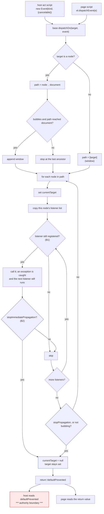

# Bounded `Event` fidelity (native-dom, control 0.0.2)

Design and measurement only. No product code, no court frozen yet, nothing
pushed. Written against `31a0e3f` / release `2b6d985fe682…`, and every claim
below about today's behaviour is a measurement through the control door, not
a reading of the source.


## 1. The outcome this is for

An agent acts on a page and then reads the DOM to decide what happened. That
only works if the page's own handlers behave the way the page's author
expected — if a handler cancels an activation, the activation must not happen;
if it stops propagation, the outer handler must not run; if one handler
throws, the others must still run. Where this host's events diverge from the
page author's expectation, the DOM the agent reads afterwards is a DOM no
browser would have produced, and every conclusion drawn from it is drawn from
a fiction.

`CustomEvent` landed on top of this model last slice, which is why the model
itself is now worth making faithful.


## 2. What the host does today, measured

Twenty-three probes, run through `target.open` + `target.snapshot` against
`2b6d985fe682…`, each writing its result into its own element:

| probe | measured | verdict |
| --- | --- | --- |
| `new Event(t, null)` | `threw:TypeError` | **defect** |
| `new Event(t)` | ok | correct |
| `e.type = "z"` | `writable` | **defect** |
| `e.target = "forged"` | `writable` | **defect** |
| `e.defaultPrevented = true` | `writable` | **defect**, see §3 |
| `eventPhase` | `undefined` | **absent** |
| `preventDefault()` on a non-cancelable event | `false` | correct |
| `preventDefault()` on a cancelable event | `true` | correct |
| `dispatchEvent` return when canceled | `false` | correct |
| `stopPropagation` | ancestor did not run | correct |
| `stopImmediatePropagation` | `undefined` | **absent** |
| a second listener after it | both ran | follows from the absence |
| `composed`, `isTrusted`, `timeStamp` | all `undefined` | **absent** |
| after dispatch | `target` kept, `currentTarget` null | correct |
| re-dispatch of the same object | ran twice | correct (the standard only forbids re-entrant dispatch) |
| listener **added** during dispatch | did not run | correct |
| listener **removed** during dispatch | **still ran** | **defect** |
| a listener that throws | later listeners and ancestors still ran, `dispatchEvent` returned true | correct, and silently swallowed |
| same object along the path, `currentTarget` per node, `target` fixed | all true | correct |
| dispatch at the window | `target` and `currentTarget` are the window | correct |

So the dispatch *shape* is right — path, bubbling, target/currentTarget,
cancelation gating, exception isolation, added-during-dispatch — and what is
wrong is the event object's integrity, three absent members, and one
dispatch-loop rule.


## 3. The one finding with authority in it

The host's own action scripts dispatch events into the page and read
`ev.defaultPrevented` to decide whether an activation proceeds
(`main.rs:712`, `719`, `782`, `852`). That field is a plain writable property.

Measured on a link, three fixtures identical but for one line in the page's
click handler:

| the handler does | the host's answer |
| --- | --- |
| nothing | `navigated: true`, a new document, generation 2 |
| `ev.preventDefault()` | `applied: true`, no navigation |
| `ev.defaultPrevented = true` | `applied: true`, no navigation |

**Writing the field cancels a host-driven navigation without ever calling
`preventDefault`.** Stated precisely, and no wider: this is *not* a present
escalation, because that click is dispatched `cancelable: true` and the page
was entitled to cancel it. What it is, is the cancelation rule expressed
nowhere except in a method the page can bypass. The host already dispatches
non-cancelable events with the same helper — `fire("input", false)` and
`fire("change", false)` — whose return values are unused today. The day one of
those returns is read, a page can cancel what the standard says it cannot,
and nothing in the model would have to change for that to happen.

That is why `defaultPrevented` is treated below as an authority boundary and
not as fidelity.


## 4. The tree

```
Event fidelity an agent can act on
├── A. Object integrity (main extension)
│   ├── A1 null dictionary
│   │   invariant: new Event(t, null) and new CustomEvent(t, null) construct, with the defaults of an empty dictionary
│   │   evidence: court criterion; today measured `threw:TypeError`
│   │   safe failure: construction throws as it does now — a page error, never a host one
│   │   dependency: none
│   │   non-goal: any other coercion of a non-object dictionary
│   ├── A2 read-only members
│   │   invariant: type, bubbles, cancelable, defaultPrevented, eventPhase, composed, isTrusted, timeStamp cannot be assigned by page script
│   │   evidence: court asserts assignment leaves the value unchanged, and that preventDefault still moves defaultPrevented
│   │   safe failure: a page's assignment is silently ignored, as a getter-only property is in sloppy mode; nothing throws
│   │   dependency: A4 (preventDefault must still be able to set it)
│   │   non-goal: target and currentTarget — see Blocker 2
│   ├── A3 absent members
│   │   invariant: composed is false, isTrusted is false for page-constructed events, timeStamp is a number that does not decrease within a document
│   │   evidence: court reads each in a listener
│   │   safe failure: absent is what they are today; a wrong value is worse than none, so each is either right or stays absent
│   │   dependency: none
│   │   non-goal: isTrusted true for host-driven events — the host's synthetic events are not user gestures and will not claim to be
│   └── A4 cancelation as the only cancel
│       invariant: defaultPrevented moves only through preventDefault, and only when cancelable
│       evidence: the §3 three-way measurement, rerun as a court criterion, with the forged variant now navigating
│       safe failure: a page that writes the field is ignored; the host's decision is unchanged from the un-canceled case
│       dependency: A2
│       non-goal: making host-dispatched events non-cancelable
├── B. Dispatch rules (base — see Blocker 1)
│   ├── B1 a listener removed during dispatch does not run
│   │   invariant: removal is observed by the dispatch in progress
│   │   evidence: court measures `first` where today it measures `first,second`
│   │   safe failure: the listener runs, which is today's behaviour
│   │   dependency: none
│   │   non-goal: re-entrancy guards of any other kind
│   └── B2 stopImmediatePropagation
│       invariant: no later listener on the same target runs, and no ancestor runs
│       evidence: court measures `one` where today it measures `one,two`
│       safe failure: it behaves as stopPropagation, which is strictly weaker and never more permissive
│       dependency: B1's loop
│       non-goal: capture phase, once, passive, signal, handleEvent
├── C. Phase (main extension)
│   └── C1 eventPhase
│       invariant: 2 at the target, 3 at an ancestor, 0 before and after dispatch
│       evidence: court reads it in listeners at both positions and after
│       safe failure: absent, as today
│       dependency: the base dispatcher exposing which node it is at, which it already does through currentTarget
│       non-goal: 1 (capturing) — this host has no capture phase and will not pretend to
└── D. Unchanged invariants (regression, not new work)
    ├── D1 children stay script-free and compile none of A or C
    ├── D2 M1 <= 245,760 and M2 <= 1,720,320, the shim floors, re-measured
    └── D3 the whole same-binary suite, unchanged
```


## 5. The dispatch path, and where authority sits



The authority boundary is one edge: what the host reads back. Everything
above it is page behaviour; `defaultPrevented` is the only value that crosses,
and A4 is what makes it mean what the standard says it means. The kill
boundaries are `stopImmediatePropagation` (ends the listener loop),
`stopPropagation` (ends the path walk) and the end of dispatch (clears
`currentTarget`, keeps `target`).


## 6. Base or extension, decided per item by one test

The test the root set: *does a child agent action require it?* A child frame
runs no page script, so nothing in a child realm can call
`stopImmediatePropagation`, read `isTrusted`, or add and remove listeners.
What a child realm does do is run the host's snapshot, preflight and action
scripts, which construct events, dispatch them, and read `defaultPrevented`.

- **A1–A4 and C1 go in the main extension, with zero base growth.** The
  extension replaces `g.Event` with a subclass that normalizes the dictionary
  and defines the read-only members, and replaces `g.CustomEvent` on top of
  it. The host's own scripts resolve `Event` through the same global, so in a
  main realm they get the faithful class and in a child realm the plain base
  one — where there is no page script to forge anything.
- **B1 and B2 are in the base's dispatch loop**, which is the contested one:
  Blocker 1.

Everything a child can reach stays exactly as it is today.


## 7. Falsification against `31a0e3f`

The court is written to fail on `2b6d985fe682…`, and the §2 table is the
prediction of *how* it fails: `null_init` throws, `type_writable` and
`defaultPrevented_writable` report `writable`, `eventPhase`, `composed`,
`isTrusted`, `timeStamp` report `undefined`, `stopImmediate_effect` reports
`one,two`, `remove_during` reports `first,second`, and the §3 link fixture
cancels a navigation through a forged field. Each is one criterion. The
criteria that already pass today — the dispatch shape, exception isolation,
added-during-dispatch, the same object along the path — are in the court as
regressions, and they must keep passing.


## 8. Blockers and rulings I need

**Blocker 1 — B1 and B2 need the base, or a second dispatcher.** There is one
dispatch implementation and it is in the base. The extension can wrap
`Event`, but it cannot change how the base's loop treats its listener list
without replacing `Node.prototype.dispatchEvent` and the window's with its
own walk — about 700 bytes of extension and, more to the point, **two
dispatchers that must agree forever**. The alternative is about 90 bytes of
base — roughly 300 bytes of M1 at the measured 3.4 bytes-live-per-source-byte,
against 40,486 bytes of headroom — and one dispatcher.

*My recommendation, for your ruling:* take the base change. Neither B1 nor B2
is page-only compatibility in the sense the memory rule guards: B1 is a
correctness property of any dispatcher and is reachable in a main realm
**through a host-driven click**, and B2's flag is inert in a child. I will not
implement either until you rule, and if you rule for the extension I will
implement the second dispatcher and record the divergence risk rather than
argue it again.

**Blocker 2 — `target` and `currentTarget` cannot be made read-only from the
extension.** The base's dispatcher assigns them (`event.target = target`,
`event.currentTarget = node`). A getter-only property would silently drop
those writes in sloppy mode, which breaks dispatch outright; a setter that
accepts them is a setter a page can call too. Making them genuinely read-only
needs the dispatcher to write through a channel the page does not have, which
is a base change.

*My recommendation:* leave both writable and record the loss, because no host
script reads either — measured: `ev.target` and `.currentTarget` appear in no
host script — so a forged value misleads only the page that forged it. If you
want them read-only, it is a base change and I will price it.

**Blocker 3 — `isTrusted` for host-driven events.** A browser sets it true
for user gestures. This host's clicks are synthesized by an agent. My ruling
unless you say otherwise: `isTrusted` is **false everywhere**, including
host-driven dispatch, because claiming otherwise would let a page distinguish
nothing while telling it something untrue.

**Blocker 4 — `timeStamp` reintroduces a clock.** The realm already has
`Date` and `performance` (recorded in the timer slice), so a monotonic
`timeStamp` adds no new observable. My ruling unless you say otherwise:
implement it as `performance.now()` at construction, and record that it is a
page-readable clock the host does not gate.


## 9. What this does not do

No protocol change, no new operation, no capture phase, no listener options
(`once`, `passive`, `capture`, `signal`), no `handleEvent` objects, no
`composedPath`, no event constructors beyond `Event` and `CustomEvent`, no
child-realm surface, and no change to what the host reads from a dispatch
beyond making `defaultPrevented` mean what the standard says.


## 10. The rulings, and the audit correction that overturned my plan

The root ruled, and one ruling overturns §6 of this record.

**10.1 My extension-subclass plan was wrong, and the base proves it.** §6 said
the whole of A and C could sit in the main extension with zero base growth,
because the host's own scripts resolve `Event` through the global. They do —
but the **base's own code does not**. `dom_shim_base.js` constructs events
lexically in `Element.reset()` (line 227), `Element.submit()` (237) and
`Element.click()` (243, 248), and line 245 reads `ev.defaultPrevented` back
from one of them. A main-only subclass would leave every one of those minting
the old, forgeable object, so the fix would have covered the events a page
constructs and missed the events the DOM itself raises — including the one
whose `defaultPrevented` decides whether a reset happens. Zero base growth was
not a smaller version of the fix; it was a hole in it.

Ruled: **one faithful bounded `Event` and one dispatcher, in the base**, with
the measured growth taken and the floors re-measured. If a field cannot be
made single-authority without materially larger growth, I stop and report
before implementing it.

**10.2 One dispatcher.** Removal-during-dispatch recheck and
`stopImmediatePropagation` go in the base loop. No second main-only
dispatcher. This is dispatcher correctness, and M1/M2 measure its cost.

**10.3 Nothing about an event is page-writable.** Its state lives in
closure-owned hidden storage — a `WeakMap` keyed by the event — and `type`,
`bubbles`, `cancelable`, `target`, `currentTarget`, `defaultPrevented`,
`eventPhase` and `dispatching` are read-only to page script. **The dispatcher
alone** writes `target`, `currentTarget`, `eventPhase` and `dispatching`;
**`preventDefault` alone** sets `defaultPrevented`, and only when `cancelable`.
That is what closes §3: the cancelation rule stops being a method a page can
step around and becomes the only door.

**10.4 Re-entrant dispatch is refused, completed re-dispatch is not.**
Dispatching an event that is already dispatching throws an `Error` named
`InvalidStateError` **before** anything is written, so the outer dispatch is
not corrupted: it continues with its remaining listeners and its ancestors,
and its `target` and `currentTarget` are untouched. Dispatching an event whose
dispatch has finished stays allowed, as it is today and in the standard.

**10.5 Cleanup on every path.** When dispatch ends — normally, or through a
listener that threw, or through either stop — `currentTarget` is null,
`eventPhase` is `NONE` and `dispatching` is false, while `target` remains the
last target dispatched to.

**10.6 `isTrusted` is false for every event, host-driven included.** The host's
clicks are synthesized by an agent; `true` would be a claim that is not true.

**10.7 `timeStamp` is `performance.now()` at construction**, explicitly tied
to the clock this realm already inherited and does not model (recorded in the
timer slice). This slice creates **no new clock guarantee**: it exposes a
number from a clock that was already there.

**10.8 `composed` defaults to false and follows the dictionary.** It changes
no dispatch behaviour here, because this host has no shadow tree to cross.


## 11. Explicit losses, recorded rather than implied

Listener options (`capture`, `once`, `passive`, `signal`), the capture phase
and therefore `eventPhase === 1`, `handleEvent` objects, `composedPath()`,
`Event.NONE`/`AT_TARGET`/`BUBBLING_PHASE` as interface constants, global error
reporting of an exception a listener threw (it is swallowed; nothing is
reported to the page or the host), `relatedTarget` and every typed event
interface other than `Event` and `CustomEvent`, and `srcElement`.


## 12. The court, frozen before the code

`event-fidelity-court.py`, headless, both allocators, supervised hosts. Its
falsifiers, each predicted to fail on `2b6d985fe682…`:

1. **Phase order**: `eventPhase` is `0` before dispatch, `2` in a listener at
   the target, `3` in a listener on an ancestor, `0` after.
2. **Stop versus stop-immediate**: `stopPropagation` in the first of two
   listeners on the target still runs the second and no ancestor;
   `stopImmediatePropagation` runs neither.
3. **Add and remove during dispatch**: a listener added during a dispatch does
   not run in it; a listener removed during a dispatch does not run.
4. **Nested re-dispatch**: dispatching the same event inside its own dispatch
   throws `InvalidStateError`, the outer dispatch still reaches its remaining
   listener and its ancestor, and the event's `target` is unchanged; a
   re-dispatch after completion runs normally.
5. **Read-only**: assigning `type`, `bubbles`, `cancelable`, `target`,
   `currentTarget`, `defaultPrevented`, `eventPhase` or `dispatching` leaves
   each unchanged.
6. **Cancelability and return value**: `preventDefault` on a non-cancelable
   event leaves `defaultPrevented` false and `dispatchEvent` true; on a
   cancelable one, false.
7. **Cleanup after a throw**: after a listener throws, `currentTarget` is
   null, `eventPhase` is 0, `dispatching` is false and `target` is the element
   dispatched to.
8. **Host-driven activation authority**: on a link, a handler that writes
   `defaultPrevented` no longer cancels the navigation, while one that calls
   `preventDefault` still does.
9. **`isTrusted`** is false in a page-constructed dispatch and in a
   host-driven click.
10. **`timeStamp`** is a number that does not decrease between two
    constructions; **`composed`** is false by default and true when the
    dictionary says so.
11. **Regressions**: `CustomEvent` still carries `detail`, a null dictionary
    still constructs, the same object still travels the path with `target`
    fixed and `currentTarget` per node, an exception still does not stop later
    listeners or ancestors, and the window is still the last hop only when the
    path reached the document.

The unchanged M1 and M2 floors are measured by the child-frame and
shim-footprint courts on the same binary, not restated here (§9.1 of the shim
record is why).


## 13. One defect the court found that the inventory had missed

§2 measured re-dispatch of a *completed* event and found it correct. It never
measured re-dispatch of an event **while that event is dispatching**. The
frozen court does, and on `2b6d985fe682…` the answer is not "unrefused" — it
is `RangeError`, after the listener re-entered its own dispatch about eighty
times and exhausted the stack.

So the guard §10.4 rules is not only a fidelity item: today a page handler
that dispatches the event it was handed drives unbounded recursion inside a
host operation, and what stops it is the engine running out of stack rather
than anything this host decided. The criterion stands as written — the refusal
must be an `InvalidStateError` raised **before** the outer dispatch is
touched, with the outer dispatch then reaching its remaining listener and its
ancestor — and it is now also the fix for a page-triggerable stack exhaustion.


## 14. Second root audit: four findings, each measured before it is fixed

Probed through the control door on `abd1ed744721…`, the build the first round
produced.

**14.1 Remove-then-re-add during a dispatch still calls the listener.**
Measured: `first,second` where the standard says `first`. The recheck added
last round asks `list.indexOf(fn) >= 0` against the *live* list, so a first
listener that removes the second and re-adds the same function puts that
function back in the list, and the snapshot entry then passes the recheck. The
standard treats each registration as its own **record**: removal marks that
record removed, and re-adding creates a new one, which this dispatch's
snapshot does not contain.

Ruled: the store holds records, not bare functions, each with a removed bit,
and the dispatch skips a record whose bit is set. Identity is the record, not
the function.

*Falsifier:* the first listener removes the second and re-adds the same
function; the second must not run in that dispatch, and must run in the next.

**14.2 The stop flags are cleared at the wrong end.** Measured:
`first=ran,redispatch=ran,ran`. Both halves are wrong. A stop flag set
**before** dispatch is effective for that dispatch — no listener is invoked —
and the flags are unset when the dispatch **completes**, not when the next one
starts. Clearing at the start makes a pre-set flag vanish, which is what the
measurement shows.

Ruled: nothing is reset at the start; `stop` and `stopImmediate` are cleared
in the same `finally` that clears `currentTarget`, `eventPhase` and
`dispatching`.

*Falsifier:* `e.stopPropagation()` before `dispatchEvent(e)` invokes no
listener, and a second dispatch of that same completed event does invoke it,
because the cleanup cleared the flag: `first=none,redispatch=ran`.

**14.3 Dispatching a non-event reports a dispatch that never happened.**
Measured: `returned=true,ran=no`. `dispatchOn` returns `true` when the object
has no hidden state, so a caller is told the dispatch completed and was not
canceled, when nothing was dispatched at all.

Ruled: `dispatchEvent` of anything that is not one of this realm's events
throws a `TypeError`, before any listener is reached.

*Falsifier:* `t.dispatchEvent({type: "d"})` throws `TypeError` and no listener
ran.

**14.4 A listener type is not converted to a string.** Measured: `string`,
where both halves should have matched. `addEventListener(1, fn)` keys the map
on the number `1`, while `new Event("1")` stores the string `"1"`, and a `Map`
compares keys by identity — so the listener never runs. The reverse works only
because `Event` already stringifies its own type. This is not among the
recorded losses; it is a defect.

Ruled: `addEventListener` and `removeEventListener` key on `String(type)`.

*Falsifier:* a listener added as `1` runs for `new Event("1")`, and one added
as `"2"` runs for `new Event(2)`: `numeric,string`.

All four stay inside the one base dispatcher and the hidden event state. No
listener options, no capture phase and no `handleEvent` object comes with
them.

**14.5 The re-add criterion asked for something the standard forbids.** With
the records in place the court answered `first/first`, and the second half is
the host being right, not wrong. My fixture removed and re-added the listener
on **every** dispatch, so the second dispatch also re-registered it after its
own snapshot was taken — and a listener registered during a dispatch is not
called by that dispatch. The listener would never run, at any depth, and my
criterion demanded that it eventually did.

Corrected: the first listener removes and re-adds only once, so the second
dispatch begins with the re-added record already registered and calls it.
That is the distinction the criterion was meant to draw — *not yet, but next
time* — and it now draws it.


## 15. A work-in-progress fix that was wrong, corrected before it was committed

While narrowing the memory cost of §14.1 I replaced the per-registration
records with a per-dispatch `Set` of removed **functions**, shared by every
dispatch in flight. The root caught it in the working tree before it was
committed, and it is wrong for two reasons that no criterion I had written
would have caught:

- the set is keyed by the callback alone, so removing a function from one
  target — or from one event type — suppresses **the same function** wherever
  else it is registered, on an ancestor or under another type, for the rest of
  that dispatch;
- a removal is broadcast to every dispatch in flight without asking whether
  that dispatch's snapshot has anything to do with the target or type the
  removal touched.

Both are the same mistake: identity is the **registration**, not the callback.
Reverted to listener records — `{ callback, removed }` in each target/type
list — where a dispatch snapshots record identities, a removal marks exactly
that record and drops it, a re-add creates a distinct record the snapshot does
not contain, and the dispatch invokes the snapshot's records whose `removed`
bit is clear. The overhead is one small object per live registration, page-
owned under the realm limit like every other thing a page allocates, and the
floors measure it.

Two falsifiers are added, because the ones I had could not tell the two
implementations apart:

- the same callback registered on the target **and** on an ancestor: removing
  it from the target during the dispatch must not stop the ancestor's copy
  from running;
- the same callback registered under two types, with a nested dispatch of the
  second type inside a listener for the first: removing the first type's
  registration must not suppress the second's.


## 16. A frozen cap this slice is failing, reported rather than moved

The navigation court's differential soak is failing on this build and I am
stopping on it rather than continuing.

Measured, three runs per build, same machine, same session:

| build | navigation court | excess (cap 1,048,576) | tail slope (cap 65,536) |
| --- | --- | --- | --- |
| `2b6d985fe682…`, before the Event slice | 90/90, 90/90 | — | — |
| `abd1ed744721…`, Event round one | 90/90, 90/90 | 1,032,192 measured once | 65,536 measured once |
| this build, Event round two | 88/90, 90/90, 89/90 | 1,064,960 and 1,097,728 | 81,920 |

Round one already sat **at** both lines — 98.4% of the excess cap and exactly
100% of the slope cap — so the margin was gone before round two added
anything. Round two's growth is what tips it over, intermittently.

I attempted exactly one narrowing, replacing the per-registration records with
a per-dispatch set of removed callbacks. It was **wrong** (§15) and is
reverted; the criteria that catch it are in the court. I have not attempted a
second, I have moved no cap, and I am not presenting this slice as qualified.

What is true regardless of the ruling: the M1 and M2 floors hold (234,042 and
1,636,012 against 245,760 and 1,720,320), the event court is 40 of 40, and
every other court on this binary passes. What is failing is a retention
criterion the README already describes as **cross-batch narrow on the default
allocator** — but this is the first time it has failed repeatedly on one
binary while passing repeatedly on the two before it, which is a different
thing from the flake that route has shown before, and I am not going to call
it one.


## 17. Pre-registration: one read-only attribution, before it is measured

Written and committed **before** the measurement, so the reading cannot be
chosen after the numbers are seen.

**The question.** Did round two add live or owned `Event`/listener state that
**accumulates across navigations**, or is the divergence only released
realm/build allocations that the default zone keeps resident?

**Method.** The existing `navigation-attribution-court.py`, read-only, which
produces no pass and no fail, moves no cap and is followed by no optimisation.
One matched run per binary — exact round one `abd1ed744721…` and exact round
two `a91bdf2c85b7…` — same fixture, order and request shape, both allocators,
`--repetitions 1`. No product change, no arm change, no allocator change, no
retry of the navigation court.

**Observations required, and what this mechanism can and cannot give.**

- *the stage where footprint separates*: available — per-stage footprint and
  in-use deltas over the six navigation stages;
- *realm in-use*: available as `realm_malloc_bytes` and as the per-stage
  `in_use`;
- *libmalloc allocated and resident beside in-use*: **the court records
  in-use only**; allocated and resident exist in `memory.report` and
  `sample_process` but this court does not sample them, and extending it is
  instrumentation, so it is reported as a gap rather than added;
- *live `Event`/listener owner bytes*: **not available at all**. There is no
  owner for event or listener state; `realm_malloc_bytes` is the whole
  realm's allocator, and nothing decomposes it. I will say so rather than
  attribute by arithmetic;
- *owners after target and session close*: available;
- *arena returned and leak counters*: **not recorded by this court**, though
  `memory.report` carries them; same gap, same treatment.

**The reading, fixed in advance.**

- If owner or in-use bytes **accumulate** across the run and are attributable
  to live `Event`/listener state, this round is **not qualified** and must be
  rescaled.
- If owners stay bounded and return to zero on close, and the divergence
  appears during the candidate build and persists only as released pages the
  default zone keeps resident, then `Event` may remain qualified under its own
  frozen floors while navigation stays the **cross-batch, default-allocator
  narrow** the README already documents.
- If the two cannot be told apart with what this mechanism reports, that is
  the finding: I record the uncertainty and name the missing observable.


## 18. What the attribution measured

One matched run per binary, both allocators, `--repetitions 1`, no product
change and no retry of the navigation court.

**The answer to §17's question: no accumulation, and no difference in
accumulation.** Owner growth across the 128-navigation run is **identical**
between round one (`abd1ed744721…`) and round two (`a91bdf2c85b7…`), field for
field, on both allocators:

```
audit_bytes 7198   audit_capacity_bytes 7168   document_bytes 0
document_fetches 0 history_bytes 231           realm_malloc_bytes 0
```

`realm_malloc_bytes` grows by **zero** across 128 navigations on both builds,
and after the target and session close every owner is **0** on both. The live
realm after the run differs by a constant — 353,008 → 354,208 bytes on system,
344,112 → 345,264 on arena — which is one live document's realm being slightly
larger, not a per-navigation term.

**Where the footprint separates: the candidate build, and it is released.**
Per-stage sums over 128 navigations are the same on both builds —
`candidate_fetched->candidate_built` carries all of it (1,081,344 bytes of
footprint on system; 53,021,696 on arena, which the arena hands back at
`after_swap`). What differs between the builds at that stage is `in_use`:
36,032,432 → 36,478,224 on system, about **+3.5 KB per navigation while a
candidate is being built**, matched by a corresponding negative at
`after_swap`. That is the larger shim being compiled and then released, not
state being kept.

**Reading, as pre-registered.** Owners are bounded, return to zero on close,
and grow identically on both builds; the divergence appears during the
candidate build and is released there. That is the second of the two readings
fixed in §17: **`Event` stays qualified under its own frozen floors** — M1
234,042 and M2 1,636,012 against 245,760 and 1,720,320 — **and the navigation
soak stays the cross-batch, default-allocator narrow** the README already
documents, now with a measured reason: the system allocator keeps released
pages resident, the arena returns them, and this round's larger per-build
transient is what pushes a criterion that was already sitting on its line.

**Uncertainty, recorded rather than smoothed.** At one run per cell the
process-footprint totals do **not** discriminate: system navigating +180,224,
system navigating with stage sampling −49,152, arena navigating −65,536, arena
navigating with sampling +49,152. The sign is not stable, and I am not reading
a direction out of it. What is stable, and what the reading rests on, is the
owner arithmetic — identical growth, zero after close — and the per-stage
placement, which agree across both allocators and both builds.

**Gaps, named rather than filled.** There is no owner for `Event` or listener
state, so "live Event bytes" is not a number this host can report and I have
not inferred one. This court records `in_use` but not libmalloc allocated or
resident, and does not record the arena returned or leak counters; both exist
in `memory.report`, and adding them here would be instrumentation, which this
run was not permitted to do.


## 19. The authority claim was not closed: hidden state, public surface

§10.3 said `defaultPrevented` stops being a field a page can step around. That
closed **assignment** and nothing else. The host's action scripts still do

```js
const ev = new Event(name, { bubbles: true, cancelable });
el.dispatchEvent(ev);
return ev.defaultPrevented;
```

and every one of those three lines is page-reachable surface:

- `Object.defineProperty(ev, "defaultPrevented", { value: true })` on the
  event a handler was handed shadows the prototype getter with an own
  property, and the host reads the own property;
- redefining `Event.prototype.defaultPrevented` as a getter returning `true`
  does the same for every event;
- replacing the global `Event` gives the host's `new Event(...)` an object of
  the page's own shape;
- replacing `Element.prototype.dispatchEvent`, or the element's own
  `dispatchEvent`, means the host's dispatch never reaches the real listener
  model at all, and whatever the page returns is what the host believes.

The court's read-only criteria could not see any of this: they test that
**assignment** does not take, which is true and beside the point.

**Ruled, mine, for review: a single-authority host action bridge.** The base
defines one non-writable, non-configurable, non-enumerable global that takes
the per-realm capability the host already mints, and that, given an element, a
type and a cancelability:

- constructs the **lexically captured** `Event` — the class the base closed
  over, never the global a page can replace;
- calls the closure-owned `dispatchOn` directly, never `element.dispatchEvent`;
- returns the cancellation answer from the **hidden state**, not from any
  property lookup on the event.

A wrong capability is a typed refusal. A page cannot replace the bridge
(non-writable, non-configurable) and cannot call it (it never sees the
capability, exactly as with the lifecycle bridge). If the bridge is absent the
host's action fails typed; there is no fallback to the public methods, because
a fallback is the hole.

The base's own `Element.click`, `submit` and `reset` take the same path:
they call `dispatchOn` directly instead of `this.dispatchEvent`, so a page
cannot intercept the DOM's own activation either.

**Scope.** Every host action path whose answer decides `applied`,
`default_prevented`, a navigation, a reset or a submit: the `fire` helper, the
keyboard `phase` helper and the form-submit dispatch. This is not general
hostile-page hardening: unrelated DOM operations are untouched, and a page
that breaks its own `dispatchEvent` still breaks its own code.

**Falsifiers, all on a checkbox so the document survives the action and both
halves are observable — that the real handler ran, and what the host
decided.** Each fixture's handler writes a marker and then does one thing:

1. `Object.defineProperty` of `defaultPrevented` on the received event: the
   host must **not** cancel, and the marker must show the handler ran;
2. a forged `Event.prototype.defaultPrevented` getter: must not cancel;
3. a replaced global `Event`: must not cancel, and the handler must still run;
4. a replaced `Element.prototype.dispatchEvent` **and** own `dispatchEvent`:
   the handler must still run and the host must still decide correctly;
5. an attempted `delete` and reassignment of the bridge: the action still
   works, because neither is permitted;
6. a real `preventDefault`: still cancels, and the checkbox is put back.

Nothing here moves a cap, and the frozen M1 and M2 floors are re-measured
after it.


## 20. The bridge is privileged; its tools were not

§19 moved the host's dispatch behind a capability, and the dispatch then did
its work with intrinsics it looked up **after** page script had run:

- `eventState.get` and `.set` resolve `WeakMap.prototype.get`/`set` at call
  time — a page that patches those sees, and can answer for, the hidden state
  the whole authority claim rests on;
- `listenersOf` resolves `Map.prototype.get`/`set`/`has` and constructs with
  the global `Map`;
- the dispatch copies its listener list with a spread and walks it with
  `for…of`, both of which go through `Array.prototype[Symbol.iterator]`, and
  registration uses `indexOf`, `push`, `splice` and `filter` from the same
  mutable prototype;
- a listener is invoked as `record.callback.call(node, event)`, which reads
  `.call` off a page-owned function;
- `String(type)` and `Object.keys(extras)` read the global `String` and
  `Object`.

So the capability kept a page from *calling* the bridge while leaving it able
to change what the bridge is made of. That is the same defect as §19 one level
down, and my own criteria could not see it for the same reason: they exercise
the bridge, not its tools.

**Ruled, mine: capture the intrinsics once, before any page script runs, and
use only the captured values on the privileged path.** The shim already runs
before page script — that is the whole basis of the capability — so the
capture point exists and needs no new mechanism. `Reflect.apply` is captured
too, so the privileged path never reads `.call` off anything a page owns, and
the listener walk uses an index loop over a captured `slice`, never the
iterator protocol. The extras argument becomes a **fixed key vocabulary**: the
only extra any host action passes is `key`, so it is a parameter, and
`Object.keys` disappears from the path rather than being hardened.

Nothing outside the `Event`, dispatch and listener path changes. A page that
breaks `Array.prototype.indexOf` for itself still breaks its own code.

**Falsifiers, all on the checkbox fixture so both halves stay visible, and all
falsified against `44ad1aa47263…`:**

1. a handler patches `WeakMap.prototype.get` and `.set` after load, keeping
   the originals so the page can read and rewrite the hidden state it is
   handed, and tries to force a cancellation: the host must still apply, and
   the real handler must still run;
2. a page patches `Map.prototype.get`/`has`/`set` and
   `Array.prototype[Symbol.iterator]` and `slice`: the registered handler must
   still run and the decision must still be the host's;
3. a page replaces the global `String` and `Object` before the action: the
   host action must still work.

In every case the alternative outcome the court will not accept is a
**fabricated** answer — an `applied` or a `default_prevented` reported without
the real handler having run.

**20.1 A mechanical replacement that must not land, and a scope I had
widened.** Hardening the intrinsics, I replaced `String(` and
`JSON.stringify(` across every host script by pattern. Two things were wrong
with that and the root caught both in the working tree:

- `c.charCodeAt(0).toString(16)` in `SERIALIZE_JS` became
  `.to__mcsString(16)` — not a method, and it would have broken GET form
  serialization outright;
- snapshot, timers, lifecycle, the seal, the realm probe and the serializer
  are **not** the privileged path this round was ruled to fix. A page that
  replaces `String` and then breaks its own snapshot gets a typed failure,
  which is an acceptable outcome under the stated scope; what is not
  acceptable is a host **action** fabricating a result.

Reverted to the justified minimum, and the reasons are per-site rather than
per-pattern:

- the base captures `String` and `JSON.stringify` once and leaves them where
  only the host looks (`__mcsString`, `__mcsJson`, both non-writable and
  non-enumerable);
- `Realm::eval` reads every result through `__mcsString`. This is not a script
  rewrite: it is how the **host** turns any realm answer into a string, and a
  page that replaces the global otherwise decides what every answer says;
- `act_script` and `form_action_script` serialise their answers with
  `__mcsJson`, because those answers *are* the action's result — a page that
  replaced `JSON.stringify` could return well-formed JSON saying
  `{"applied": true}` for an action that did nothing, which is exactly the
  fabrication the ruling forbids;
- everything else is back on the ordinary globals, and a page that breaks them
  breaks its own page.

The form court's GET-submission criteria are the check on the typo, and they
are rerun on the fixed build.

**20.2 My three criteria demanded more than the ruling.** They asserted
`applied: true` under each monkeypatch. With the hardening scoped back to the
privileged path, two of the three no longer get that far: a page that breaks
`Map.prototype.get` or the array iterator breaks the **extension's own**
machinery — the lifecycle, storage and timers it is built from — and the
target fails to build at all. That is a typed, fail-closed refusal, which the
ruling names as an acceptable outcome; what it forbids is a fabricated
`applied` or `default_prevented`.

The criteria are corrected to the ruling's own shape: each monkeypatch must
end in **one of two** states — the action applied with the page's real handler
having run, or a typed failure with no result reported at all. What fails the
criterion is the third state: an `applied` or a `default_prevented` the host
reports without the handler having run.

**20.3 One intrinsic leak survived the pass: the path walk.** After moving the
listener walk off the iterator protocol I left `dispatchOn`'s outer loop as
`for (const node of path)`, which is the same page-mutable
`Array.prototype[Symbol.iterator]` one line up the function — inside the exact
privileged path, and named in the audit. A page that replaces the iterator can
shorten or fabricate the host's dispatch path while the action still returns a
result. Changed to indexed iteration over `path.length`, and the privileged
functions — `dispatchOn`, `dispatchFor`, `addListener`, `removeListener`,
`listenersOf` — now contain no `for…of` and no spread at all.

*Falsifier:* a handler replaces `Array.prototype[Symbol.iterator]` while the
host's dispatch is in flight; the target's remaining listener and the
ancestor's must still run, and the hidden cancellation must still be the
host's.

**20.4 The attacks had to move inside the handler to prove anything.** Run at
load time, all three broke the page's own build — `Map.prototype.get` and the
array iterator are what the extension's lifecycle, storage and timers are made
of — so the fixtures never reached a host action and the criteria could not
tell the two builds apart. Run **inside the click handler**, during the host's
own dispatch, they are exact, and against `44ad1aa47263…` they show three
different failures: a patched `WeakMap` reaching the hidden state and forcing
`applied: false`, a patched `Map` hiding the ancestor's listener from the walk
in flight, and a replaced `JSON.stringify` returning
`{"applied":true,"role":"fabricated"}` — the host reporting an action result
the page wrote.

**20.5 Two attacks also wreck the page's own observation, which is not this
slice's business.** A handler that patches `Map.prototype.get` or
`JSON.stringify` breaks the *snapshot* the court reads its marker from — the
snapshot serialises with the ordinary `JSON.stringify` by design, since
snapshots are not the action path and a typed or empty answer there is the
acceptable outcome the ruling names. So for those two the court asserts what
this slice is responsible for: the **action's** answer is the host's own —
`applied` true with the host's own `role`, never the page's fabricated one —
and the handler marker is asserted only where the page left it readable. The
iterator and `WeakMap` attacks leave the marker readable and are held to the
full standard: target handler, ancestor handler, and the host's decision.
