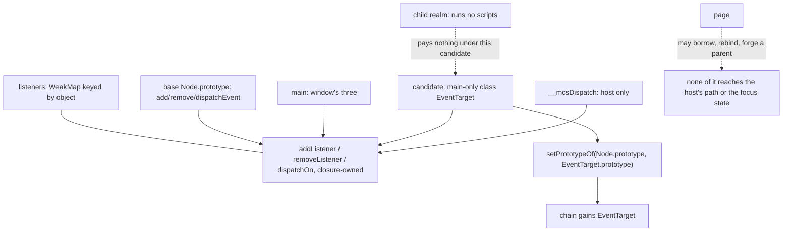

# An `EventTarget` constructor — read-only audit, 0.0.1

Design-only. Nothing implemented, no implementation court frozen, the handle
does not widen, no cap or floor proposed, no navigation or visual path run.
One throwaway build carried a candidate for measurement and went away with its
worktree. C2b — `matches`, `removeAttribute`, `replaceChildren` — stays
scope-closed, and the selector error names stay exactly as they were built.

## 1. What exists today

Measured on the shipped `f19f20f01aff…`:

| question | answer |
| --- | --- |
| `typeof EventTarget` | **`undefined`** — no global, no prototype |
| `document.body instanceof EventTarget` | `ReferenceError` |
| prototype chain of an element | `Element > Element > Node > Object` |
| `addEventListener` / `removeEventListener` / `dispatchEvent` on a node | all three are functions, declared once on the base's `Node` |
| the same on `document` | the **same function objects** as a node's |
| the same on `window` | functions, but the main extension's own, not shared |
| a page dispatching on a real node | **works**: the listener runs, `preventDefault` is honoured, `dispatchEvent` returns `false` when cancelled, `isTrusted` is `false` |

**The behaviour is already here; only the name is missing.** The listener
methods are generic by construction, because the base keys listeners by object
in a `WeakMap` rather than by node: borrowing one onto a plain object works —
`o.addEventListener = document.body.addEventListener` then
`dispatchEvent.call(o, new Event("z"))` delivers, measured. A page that wants a
bus today can either borrow a method or, more simply, use a detached element:
`document.createElement("span")` as a bus is measured working.

## 2. What is already contained, measured

Three adversarial probes, because a single dispatch model shared by nodes and
non-nodes is exactly where authority leaks would live:

- **A forged parent does not reach the tree.** A page object
  `{parentNode: realElement}` with the borrowed methods, dispatching a
  bubbling event, returns `true` and **the real element's listener does not
  run**. The walk does not follow a page-built chain into the document.
- **The reserved focus type is inert from a page.** Dispatching
  `new Event("__mcsFocus")` at a node moves nothing; `activeElement` is
  unchanged. Focus still moves only through the host's bridge.
- **The prototype is not the host's path.** A page that overwrites
  `dispatchEvent` on the prototype an element inherits from — and, on the
  candidate, `EventTarget.prototype.dispatchEvent` too — does not intercept
  the host's own action: `target.act` still applies, the page's real listener
  still runs, and the page's spy is never called. Measured on both builds.

None of this changes with an `EventTarget` constructor, because the constructor
adds a name and a prototype, not a dispatcher.

## 3. The tree

```
   base (every realm)                         main extension (main realm only)
   ------------------                         --------------------------------
   Node.prototype
     addEventListener  ---+                   candidate: class EventTarget
     removeEventListener  |                     addEventListener  --+
     dispatchEvent -------+---> addListener      removeEventListener |
                          |     removeListener   dispatchEvent ------+
   listeners: WeakMap ----+     dispatchOn            |              |
   keyed by object,             (closure-owned)       +--------------+
   not by node                        ^                      |
                                      |                      v
   focus state, hidden ---------------+            the same three helpers,
   moved only by __mcsDispatch                     already handed over by the
                                                   one-shot handle
                                                          |
                                        Object.setPrototypeOf(Node.prototype,
                                                   EventTarget.prototype)
                                                          |
                                                          v
                                    Element > Element > Node > EventTarget > Object
```



## 4. The candidate, and what it costs

Because the handle **already** hands the main extension `addListener`,
`removeListener` and `dispatchOn`, an `EventTarget` can be built entirely in
the main extension with no widening: a three-method class over the same
helpers, plus one `Object.setPrototypeOf` to put it in `Node`'s chain.

Measured on the candidate:

| | result |
| --- | --- |
| `typeof EventTarget` | `function` |
| `document.body instanceof EventTarget` | **`true`** |
| `new EventTarget()` | constructs, and works as a bus |
| subclassing | available |
| chain | `Element > Element > Node > EventTarget > Object` |

| | M1 | M2 | main-only slack |
| --- | --- | --- | --- |
| shipped | 225,626 | 1,577,884 | 40,576 |
| candidate | **225,626** | **1,577,884** | 42,928 |

**Children pay nothing** — M1 and M2 do not move at all — and the whole price
is **2,352 bytes of main-only slack**, leaving 22,608 inside the 65,536 bound.
This is the exact inverse of the error-class slice, where every child paid for
something no child could observe; here the cost lands only where the benefit
does. Courts on the candidate: `event-fidelity` 62/62, `event-view` 11/11,
`element-view` 23/23, `child-frames` 82/82, `shim-footprint` 18/18.

## 5. Loss matrix

What a page expects of `EventTarget`, and what it would get. The measured
losses in the lower half are **not** created by this slice and **not** fixed by
it — they are what `addEventListener` already does and does not do:

| the page expects | with the candidate | why |
| --- | --- | --- |
| `EventTarget` to exist and be `instanceof`-able | **served** | the class and one prototype re-parenting |
| `new EventTarget()` as a standalone bus | **served** | the helpers are generic already |
| `class Bus extends EventTarget` | **served** | ordinary subclassing |
| `document`, elements and `window` to be `EventTarget`s | **served for nodes**; `window` is not a node and keeps its own three | the main extension installs `window`'s separately |
| `{ once: true }` to remove the listener | **not served** — measured: the listener ran **twice** | options are ignored today |
| `{ capture: true }` to run in the capture phase | **not served** — accepted and ignored; the walk has one phase | one-phase dispatch, by design |
| `{ signal }` / `AbortController` | **not served** — `AbortController` is `undefined` | no abort model |
| an object with `handleEvent` as a listener | **not served, and silently**: it is registered and never called | listeners are assumed callable |
| `eventPhase` to be meaningful | `0` throughout | one phase |

The `handleEvent` row is the one I would not leave undocumented: it fails
quietly, which is worse than throwing, and it is reachable today.

## 6. Dependencies

- **The handle does not widen.** Everything the candidate needs is already in
  the one-shot handle: `addListener`, `removeListener`, `dispatchOn`, `Node`.
- **The base is untouched**, so child realms carry nothing new — and, as with
  every slice since, a child runs no scripts anyway.
- **The dispatch model stays single.** One `dispatchOn`, one `WeakMap`, one
  hidden state; the constructor does not add a second path, and the host's
  `__mcsDispatch` continues to be the only trusted one.
- **Order matters, once:** the `setPrototypeOf` must run while the main
  extension installs, before any page script. It does.
- **`window` stays outside the chain.** It is not a node; a page that tests
  `window instanceof EventTarget` would get `false`, which is a divergence a
  ruling should decide on rather than have discovered.

## 7. Is it worth doing?

Honestly: **the cost is the lowest of any slice this batch and so is the
value.** A page that needs a bus has one today, and every measured
authority property already holds without the constructor. What the slice buys
is a standard name, `instanceof`, and subclassing — real for library code,
invisible for most pages.

The neighbouring gaps in §5 — `once`, `handleEvent`, `AbortController` — are
where a page actually gets surprised, and none of them is fixed by adding the
constructor. My recommendation is therefore to rule on `EventTarget` and the
listener-options question **together**, or to take `EventTarget` knowing it is
a name and not a capability.

## 8. Pending rulings

1. **Take the candidate**, at 2,352 bytes of main-only slack and nothing per
   child, or leave `EventTarget` absent and record it in the loss list.
2. **`window instanceof EventTarget`**: leave it `false`, or give the window
   the same prototype, which is more bytes and a second re-parenting.
3. **Listener options** — `once`, `capture`, `signal`, and the silent
   `handleEvent` miss — as their own slice, before or after this one. This
   audit measured them but does not price them.
4. **What an implementation court would falsify**, if the slice is taken: the
   name, the chain, `new EventTarget()` as a bus, subclassing, the three
   containment probes of §2 re-run against the constructor, `window`'s answer
   whichever way it is ruled, and the M1/M2 floors unmoved.
