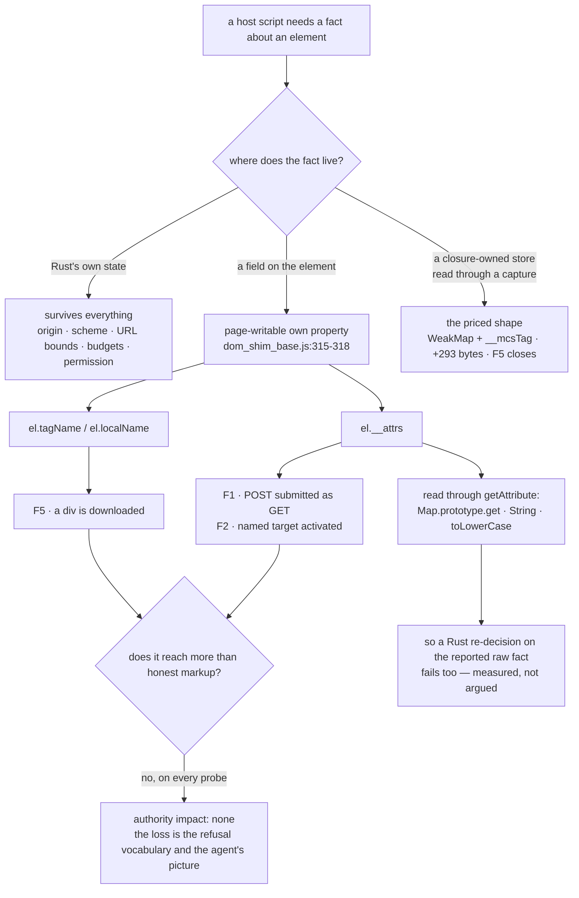

# F1, F2 and F5: what the host trusts, and who owns it

Design-only, read-only. Nothing was implemented and no court was frozen. No
capture was added, no handle widened, no base byte or bound changed in the
committed tree, nothing mixed with slimming or H2, no visual run, no soak, and
nothing downloaded. One throwaway build was made to price a candidate, measured,
and discarded; §6 says exactly what it was and proves it is gone.

`uncaptured-intrinsic-audit-0.0.1.md` §3.1 named five fail-opens. Three closed
at `7b9e11a`. These three were held back deliberately:

| | site | today |
| --- | --- | --- |
| **F1** | `methodOf`, `main.rs:591` | a `method="post"` form is submitted as a GET |
| **F2** | `targetOf`, `main.rs:572` | a `target="somewhere"` link is activated in the current frame |
| **F5** | `download_probe_script`, `main.rs:775` | a `<div href= download=>` is downloaded as a link |

Measured on `0da1c6b1` through `fail-open-triage-probe.py`, nine arms, receipt
`evidence/native-dom-control-0.0.2-fail-open-triage.json`. Each arm carries the
dishonest page **and the honest one beside it in the same document**, because
what separates a broken refusal vocabulary from an escalation is whether the
page could have had the same outcome by writing different markup.

## 1. The headline, which is not the one the ruling expected

The three defects were framed as uncaptured-intrinsic problems, and the natural
fix was "let the realm report the raw fact and have Rust decide". **Both halves
of that framing are wrong, and both were falsified by measurement rather than
argued.**

**They are not intrinsic problems.** All three are reachable with *no intrinsic
replaced at all*, by assigning an ordinary own property:

| arm | the page does | measured |
| --- | --- | --- |
| `prop_tag_name` | `div.tagName = "A"; div.localName = "a"` | the div is a `link` in the snapshot and **is downloaded** — F5 with no monkeypatch |
| `prop_attrs_method` | `form.__attrs = new Map([["method","get"], …])` | the POST form **is submitted as a GET** — F1 with no monkeypatch |
| `prop_attrs_target` | `link.__attrs = new Map([["href","/landed.html"], …])` | the named-target link **is activated** — F2 with no monkeypatch |

`dom_shim_base.js:315-318` stores an element's `localName`, `tagName`,
`nodeName` and its whole `__attrs` map as ordinary writable own properties of a
page-reachable object. No capture, no hardened global and no amount of
intrinsic routing changes what a page can write directly.

**And host-side revalidation of a realm-reported raw fact does not help
either.** `getAttribute` is `this.__attrs.get(String(name).toLowerCase())`
(`dom_shim_base.js:319`), so the raw attribute the host would ask for is read
through `Map.prototype.get`. Measured: `map_get_method` and `map_get_target`
reproduce F1 and F2 exactly, through the Map method alone, with `toLowerCase`
untouched. A Rust half that lowercased `"post"` for itself would have been
handed `"get"`.

So the smallest fix that *works* for any of the three is the same shape: **the
host must read the fact from somewhere the page cannot write.** §6 prices that
shape by building it, for F5 only, and measuring it.

## 2. F1 — `methodOf`

**The trusted fact.** `String(raw || "get").trim().toLowerCase()` where `raw` is
`form.getAttribute("method")` (`main.rs:588-592`). Three page-owned links in
that chain — the global `String`, `String.prototype.trim`/`toLowerCase`, and
`Map.prototype.get` inside `getAttribute` — plus the `__attrs` field itself.

**Measured.**

| arm | `target.act` on the POST form | server | snapshot's `method` |
| --- | --- | --- | --- |
| unpatched | `unsupported_capability/form_method_unsupported` | nothing | `post` |
| `lower_post_get` | **`applied: true`** | `/landed.html` | `get` |
| `map_get_method` | **`applied: true`** | `/landed.html` | `get` |
| `prop_attrs_method` | **`applied: true`** | `/landed.html` | `get` |
| *honest control*: a `method="get"` form in the same document | `applied: true` | `/landed.html` | `get` |

**Authority impact: none.** The honest control reaches the identical outcome —
same navigation, same fetch, same result shape. A page that wants its form
submitted as a GET writes `method="get"`. What the defect buys is that the
agent's closed refusal vocabulary is unreliable in both directions: the
snapshot advertises `method: "get"` and `activation: "allowed"` for a form the
page declared POST, so an agent planning from the snapshot is not merely
refused-wrongly, it is *told the wrong thing first*.

**The record keeps no trace.** `session.inspect`'s ledger entry for the patched
submit is byte-identical in shape to the honest one — `operation:
"target.act:submit"`, `outcome: "committed"` — and the method appears nowhere.
Measured, along with the standing rule holding: the ledger leaks no form value
and no built query on any arm. So the ledger tells no lie, and it also offers
no way to notice afterwards.

## 3. F2 — `targetOf`

**The trusted fact.** `String(el.getAttribute(attr) || "").trim().toLowerCase()`
(`main.rs:572`), compared against `""`, `"_self"`, `"_parent"`, `"_top"`. Same
chain as F1, same `__attrs` field.

**Measured.**

| arm | `target.act` on the `target="somewhere"` link | server |
| --- | --- | --- |
| unpatched | `unsupported_capability/target_named` | nothing |
| `lower_target_self` | **`applied: true`** | `/landed.html` |
| `prop_attrs_target` | **`applied: true`** | `/landed.html` |
| *honest control*: the same link without `target` | `applied: true` | `/landed.html` |

**Authority impact: none.** The refusal exists because a named target is a
frame this host does not model; defeating it makes the activation land in the
current frame, which is exactly where the honest untargeted link lands. No new
frame, no new target, no new window — the host has no code path that would make
one. The loss is the vocabulary again: `target_named` is a promise the page can
break.

## 4. F5 — the download probe's node kind

**The trusted fact.** `el.tagName.toLowerCase() !== "a"` and
`el.hasAttribute("href")` (`main.rs:775`). `tagName` is a plain own property;
`hasAttribute` is the `__attrs` chain. The element must also have been offered
to the agent, which needs `role()` (`main.rs:651`) to have called it a link —
the same fact, read the same way.

**Measured.**

| arm | `<div href="/asked.bin" download>` | *honest control*: `<a href="/asked.bin" download>` |
| --- | --- | --- |
| unpatched | not in the snapshot at all; a `<p>` that *is* in it is refused `not_a_link` | `ok`, 29 bytes, `/asked.bin` fetched |
| `lower_div_anchor` | **`ok`, 29 bytes, `/asked.bin` fetched** | same |
| `prop_tag_name` | **`ok`, 29 bytes, `/asked.bin` fetched** | same |

**Authority impact: none, and this one is proven rather than argued.** Four
escalation probes ask whether a div reaches anything an anchor cannot, each run
for the div and the anchor side by side:

| address | div | anchor |
| --- | --- | --- |
| `javascript:void(0)` | `unsupported_capability/scheme_unsupported` | identical |
| `file://` a real local file written for the probe | `unsupported_capability/scheme_unsupported` | identical |
| a second loopback origin the host was never told to allow | `permission_denied/address` | identical |
| the allowed origin | 29 bytes | identical |

The local file's bytes were never returned on any arm. Every one of those
refusals is the Rust half's: the scheme and URL bound at `main.rs:7657-7666`,
and the address policy in `net.rs`, which reaches only the one explicitly
allowed origin. The permission is checked at use and the per-profile count and
byte budgets are the host's. **What the realm decides is only whether the
element is shaped like a link; everything the download can reach is decided
in Rust.**

## 5. Independence, and the shared owner

The ruling asked for these three kept independent unless evidence proved a
shared owner. The evidence says both things, so both are reported.

**Independent in effect.** Each selective patch moves exactly its own defect
and nothing else — measured across all nine arms: `lower_post_get` leaves F2
and F5 at their unpatched answers, `lower_target_self` leaves F1 and F5, and
`lower_div_anchor` leaves F1 and F2. They can be ruled on, fixed and courted
one at a time, in any order, with no interaction.

**One owner in cause.** Every one of the three is *the host reading a fact out
of a field the page can write on an object the page can reach* — `tagName` for
F5, `__attrs` for F1 and F2, both own properties set in
`dom_shim_base.js:315-318`. That is why the `prop_*` arms exist and why they
all land. No court covers it: `property-shape-court.py` pins the internals
handle's key set, not an element's fields.

The practical consequence for a ruling: three separate slices are possible and
each is small, but they would all pay for the *same* mechanism, so doing them
together costs less than three times one. That is a claim about cause, not a
request to bundle.

## 6. Pricing, measured, on a build that no longer exists

An estimate would repeat the C1 error, so the candidate was built and measured.
**For F5 only** — the smallest and most self-contained of the three — the base
shim was given a closure-owned `WeakMap` from element to tag, written in the
`Element` constructor through the captured `weakMapSet`, and read back through
a non-writable, non-configurable `__mcsTag` global on the `__mcsJson` pattern;
`download_probe_script` then asks `__mcsTag(el) !== "a"`.

| measurement | before `0da1c6b1` | after `e3cbf79e` | delta |
| --- | ---: | ---: | ---: |
| `dom_shim_base.js` source bytes | 32,898 | 33,191 | **+293** |
| child-frame M1, one child, system arm | 233,962 | 235,738 | **+1,776** |
| child-frame M2, seven children, system arm | 1,636,236 | 1,648,732 | **+12,496** |
| child-frame M1, arena arm | 225,898 | 227,690 | +1,792 |
| child-frame M2, arena arm | 1,579,500 | 1,593,548 | +14,048 |

Caps are 262,144 and 1,835,008, so the priced arm leaves 26,406 and 186,276 of
headroom. It also scored **82/82** on child-frame, where the pushed build scored
81/82 — further evidence that the one failure there is machine variance.

**No per-realm figure may be taken from this table, and none is offered.** The
`WeakMap` holds one entry per element, so the price follows a document's element
count, not its realm count; the two measured points do not divide to the same
per-realm number, and the difference between them is the fixture, not a rate.
Anyone who wants a per-realm price must measure the documents they care about.

**And it works**: on the priced build the div is refused `not_a_link` under both
attack routes — `lower_div_anchor` and `prop_tag_name` — while the honest anchor
still delivers its 29 bytes. Receipt:
`evidence/native-dom-control-0.0.2-fail-open-triage-priced-arm.json`.

**The build is gone.** `dom_shim_base.js` and `src/main.rs` were restored from
copies taken before the edit, the binary was rebuilt, and its hash is
`0da1c6b115532886` again — the pushed build, byte for byte, with the base shim
back at 32,898 bytes. Nothing from the priced arm is in this commit except its
numbers.

## 7. Tree DAG

```
a host script needs a fact about an element
├── the fact is computed in Rust from the host's own state
│   └── survives everything a page does (origin, scheme, URL bounds, budgets, permission)
└── the fact is read out of the realm
    ├── read from a page-writable own property of a page-reachable object   ← the owner
    │   ├── el.tagName / el.localName        → F5   (prop_tag_name lands, no intrinsic touched)
    │   └── el.__attrs                       → F1, F2 (prop_attrs_* land, no intrinsic touched)
    │       └── and its accessor adds Map.prototype.get, String, toLowerCase
    │           └── so "let Rust re-decide on the raw attribute" ALSO fails (map_get_* land)
    └── read from a closure-owned store through a captured intrinsic
        └── the priced shape: WeakMap + __mcsTag  → F5 closes; +293 source bytes measured
```

## 8. Mermaid



## 9. Loss matrix

| option | closes | leaves open | measured cost | risk |
| --- | --- | --- | --- | --- |
| **A. Accept all three** | nothing | F1, F2, F5 | zero | the refusal vocabulary stays page-writable, and an agent that plans from `activation` and `method` is planning from page data. No capability is exposed — that part is proven |
| **B. Rust re-decides on a realm-reported raw fact** | **nothing** | all three | not priced, because it buys nothing | measured to fail: `map_get_*` and `prop_attrs_*` defeat it. Worth recording so it is not proposed again |
| **C. Page-unreachable tag (F5 only)** | F5 | F1, F2 | **+293 source bytes; +1,776 / +12,496 owner bytes at the two measured points; 82/82 on child-frame** | reopens the base-shim byte question and adds a sixteenth hardened global, so H3's declared set and the base-byte work both have to be in the round |
| **D. Page-unreachable attributes (F1 + F2)** | F1, F2, and the snapshot's `method` corruption with them | F5 | **not priced — deliberately.** The shape is C's, over 9 `__attrs` sites in the two shims, but C's numbers are a WeakMap of short strings per element and D's would be a WeakMap of Maps; extrapolating one from the other is the C1 error again | larger surface: `__attrs` is read by the shim's own `attributes`, `dataset` and seeding paths |
| **E. C and D in one round** | all three | — | not priced | cheaper than C plus D separately, because they share the store and the reader; that is the only reason to bundle, and it is a cost argument, not a security one |

The honest reading of this matrix: **no option is urgent.** Every escalation
probe came back refused, so nothing here is a capability leak; what is at stake
is whether the vocabulary an agent plans against means anything. That is a
product decision about how much the `activation` field is worth, and it belongs
to whoever owns the agent contract, not to this audit.

## 10. Dependencies

- **The base byte budget** and `shim-footprint-court.py`: options C, D and E
  all change `dom_shim_base.js`, which every realm compiles. The priced arm's
  numbers are above; nothing else in this audit touches base bytes.
- **H3's declared capture set and its reserved list**: C and D add a hardened
  global, not a capture — `weakMapGet`/`weakMapSet` already exist and are
  already referenced — so the declared set is unchanged, but
  `capture-declaration-court.py` should be re-read before either lands.
- **H2**: unrelated and must stay unrelated. Routing the 85 capturable sites
  through existing captures does **not** close any of these three; the
  `prop_*` arms prove it.
- **`property-shape-court.py`**: does not cover element fields today. If C or D
  lands, the natural home for "an element's tag is not the page's to write" is
  either that court or a new one; that is a freezing decision, not this audit's.
- **`downloads-court.py` and `host-answer-court.py`**: C lands in what those
  exercise. The H1 sentence corrected in `uncaptured-intrinsic-audit-0.0.1.md`
  §4 is in the second one's preamble and stays corrected.
- **`form-court.py`, `frame-action-court.py`, `page-navigation-court.py`**: D
  lands in what those exercise.

## 11. Safe failures

- If a page-unreachable tag is missing for an element the store never saw, the
  reader answers `""`, which is not `"a"`, so the download is refused. The
  failure direction is denial. That is what the priced arm actually did for
  every non-anchor.
- If a hardened reader is absent from a realm entirely, the host script throws
  and the act fails; a failed act is a refusal, never an approval. This is the
  same shape `__mcsJson` already has.
- Leaving all three open fails in the direction of *doing what the page's
  markup would have done anyway*, which is why the authority classification is
  none. It does not fail in the direction of new reach.

## 12. Court drafts, falsifiable and not frozen

Three courts, one per defect, deliberately not one court. Each names the honest
control that must keep working, because a court whose every criterion is a
refusal passes on a host that refuses everything.

**F1.** (1) With `toLowerCase` selectively lying for `"post"`, the POST form is
refused `form_method_unsupported` and the server sees nothing. (2) The same with
`Map.prototype.get` lying. (3) The same with `form.__attrs` replaced outright.
(4) The snapshot reports `method: "post"` and `activation:
"form_method_unsupported"` on all three arms. (5) *Anti-vacuity*: a
`method="get"` form in the same patched document still submits and is fetched.
(6) *Anti-vacuity*: the page's script is proved to have run, by a marker element
the snapshot must carry.

**F2.** The same six, for `target="somewhere"` → `target_named`, with an
untargeted link as the control.

**F5.** (1) With `toLowerCase` lying for `"DIV"`, the div is refused
`not_a_link` and nothing is fetched. (2) The same with `tagName` assigned
directly. (3) *Anti-vacuity*: the real `<a download>` in the same document still
delivers its bytes. (4) The four escalation pairs stay refused for div and
anchor alike — `javascript:`, `file://`, an unallowed origin — and the local
file's bytes are never returned. (5) *Anti-vacuity*: the marker.

Each court must be run against the pre-change binary first and must fail there
for its own reasons, as `signature-integrity-court.py` was.

## 13. Non-goals, and what this does not settle

No implementation, no freeze, no capture added, no handle widened, no base byte
or bound changed in the committed tree, nothing mixed with slimming or H2, no
visual run, no soak, nothing downloaded.

- Option D is **not priced**, on purpose. The `__attrs` shape is not the tag
  shape and no number here may be carried across to it.
- The probe uses one document. `dom_shim_main.js`'s own reads of `__attrs` and
  `tagName` are not exercised; whether a page API path can be turned the same
  way is unasked.
- The snapshot-side corruptions that ride along — `method: "get"` for a POST
  form, and a div appearing as a `link` — are recorded here but belong to the
  C-class in `uncaptured-intrinsic-audit-0.0.1.md` §3.2, which nothing in this
  round closes. Note the priced F5 arm leaves the div *visible as a link* and
  only refuses the download, which is the honest limit of a fix aimed at one
  call site.
- Whether the `activation` vocabulary is worth defending at all is the ruling
  this audit asks for and does not make.
