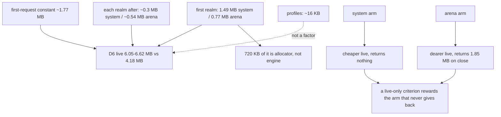

# The first realm's fixed cost — read-only audit, 0.0.1

Design-only. Nothing implemented, no court frozen, no protocol touched, D6's
numbers untouched, no navigation soak, no visual or surface run. Every figure
is a black-box read of the shipped `420cdf5b82bf…`, taken **after** paying the
first-request constant from `first-request-cost-audit-0.0.1.md`, so that
constant is not counted twice.

## 1. What a realm costs, both arms

Four targets opened in turn, then all four closed, then `memory.trim`.
`script_realm_bytes` is what the host itself accounts.

**System allocator**

| step | footprint | delta | resident | tracked |
| --- | --- | --- | --- | --- |
| constant + profile + session | 1,982,800 | — | 7,372,800 | 0 |
| + target 1 | 3,473,744 | **+1,490,944** | 10,338,304 | 327,456 |
| + target 2 | 4,014,416 | +540,672 | 10,895,360 | 654,912 |
| + target 3 | 4,325,712 | +311,296 | 11,206,656 | 982,368 |
| + target 4 | 4,620,624 | +294,912 | 11,501,568 | 1,309,824 |
| close all four | 4,653,392 | **+32,768** | 11,550,720 | 0 |
| `memory.trim` | 4,653,392 | +0 | 11,550,720 | 0 |

**Arena allocator**

| step | footprint | delta | resident | tracked |
| --- | --- | --- | --- | --- |
| constant + profile + session | 1,982,800 | — | 7,372,800 | 0 |
| + target 1 | 2,752,872 | **+770,072** | 9,601,024 | 317,232 |
| + target 2 | 3,293,568 | +540,696 | 10,141,696 | 634,464 |
| + target 3 | 3,867,032 | +573,464 | 10,698,752 | 951,696 |
| + target 4 | 4,374,960 | +507,928 | 11,190,272 | 1,268,928 |
| close all four | 2,523,472 | **−1,851,488** | 9,420,800 | 0 |
| `memory.trim` | 2,539,856 | +16,384 | 9,437,184 | 0 |

## 2. Three findings

**The first realm is not one realm's worth of memory.** On the system arm it
costs 1,490,944 while accounting for 327,456 — **1.16 MB of it is untracked**
— and by the third and fourth realm the marginal cost has fallen to 311,296
and 294,912, which is roughly what the host accounts. So the first realm
carries a one-time engine cost of about **1.16 MB** and a per-realm cost of
about **0.3 MB**.

**That one-time cost is mostly the allocator, not the engine.** The same first
realm on the arena arm costs 770,072 — **half** — with nearly identical tracked
bytes (317,232). Whatever the extra 720 KB is on the system arm, it is not
QuickJS asking for memory; it is libmalloc's page behaviour around the same
requests.

**The two arms trade live cost against recovery, and they trade it hard.**

| | system | arena |
| --- | --- | --- |
| first realm | 1,490,944 | **770,072** |
| each realm after | ~300,000 | ~540,000 |
| four realms live | 4,620,624 | 4,374,960 |
| **after closing all four** | **4,653,392** — nothing returned | **2,523,472** — 1,851,488 returned |
| `memory.trim` afterwards | releases 0 | releases 0, costs 16,384 |

The system arm is cheaper per live realm and gives nothing back. The arena arm
costs more per live realm, is cheaper at the first, and **returns 1.85 MB when
the targets close**. Neither dominates; which is better depends entirely on
whether the measurement looks at a host holding realms or a host that has
finished with them.

## 3. What this means for D6 and G1

D6 measures **live** footprint with profiles, targets and data: 6,619,592 on
the system arm, 6,046,200 on the arena arm, against 4,178,196. **The numbers
stay as they are** — this audit does not move them.

Decomposed against what is now measured:

```
   D6's ~6.0-6.6 MB
     |
     +-- first-request constant ...... ~1.77 MB   (not attributable, not reclaimable)
     +-- profile machinery ........... ~0.02 MB   (measured: profiles are free)
     +-- FIRST realm one-time ........ 1.16 MB system / ~0.45 MB arena
     +-- per realm afterwards ........ ~0.30 MB system / ~0.54 MB arena
     +-- page data and the rest ...... the remainder
```

So a D6 repair has exactly three honest shapes, and none of them is profile
work:

1. **Reduce the first-realm one-time cost.** The arena arm shows 720 KB of it
   is allocator behaviour rather than engine demand — a real target, and the
   one this audit would put first.
2. **Reduce the first-request constant**, which the previous audit found is
   untracked working set that `memory.trim` cannot release.
3. **Re-derive what D6 measures.** A criterion that reads *live* footprint
   rewards the arm that never returns memory: on these numbers the system arm
   looks 573 KB worse live, yet ends 2.13 MB worse after close. That is a
   property of the criterion, not of the route, and it is worth a ruling — but
   the ruling is yours and the numbers stay put until then.

For **G1**, the shape is favourable and now measured end to end: profiles are
free, a marginal target is 0.3–0.5 MB, and the fixed costs are two one-time
constants. A comparison campaign should report those constants separately from
the marginal figures, or the route will look worse than it scales.



## 4. Loss matrix — the candidate paths, none taken

| path | touches | measured basis | safe failure | verdict |
| --- | --- | --- | --- | --- |
| attack the 720 KB allocator delta on the first realm | realm construction and allocator choice | system 1,490,944 vs arena 770,072 at equal tracked bytes | if it cannot be reduced, record it as the engine's entry price and measure around it | **deferred**, and the strongest candidate |
| make the arena arm the default | a route-level decision | arena is 573 KB better live and 2.13 MB better after close | keep it opt-in and say why | deferred: a route ruling, not a memory fix, and the plan already keeps it opt-in deliberately |
| reduce the first-request constant | the serve loop | previous audit: untracked, unreclaimable by trim | accept it as the cost of running | deferred |
| re-derive D6 | a frozen criterion | §3 | leave D6 as it is and record that it measures live only | **ruling required**; numbers untouched here |
| profile-side work | — | profiles measure ~16 KB | — | **excluded**: measured as not the cause |

## 5. Falsifiability, for whichever is taken

Any first-realm slice should be pinned by: the first-realm delta and the
marginal delta measured separately on both arms; tracked `script_realm_bytes`
alongside the footprint, so a saving that merely stops being *accounted* is
caught; the close-and-return behaviour on both arms; and `memory.trim`
releasing what it claims. The pairing of tracked bytes with footprint is the
criterion that matters — this audit found the gap between them, and only that
pairing would keep a future change honest.

## 6. Recommendation

Nothing to implement. The next design-only step, if the order continues, is an
audit of **where the 720 KB allocator delta on the first realm goes** —
sampling the same construction under both arms — because it is the largest
addressable piece of D6 that is neither a criterion question nor an admitted
constant.
