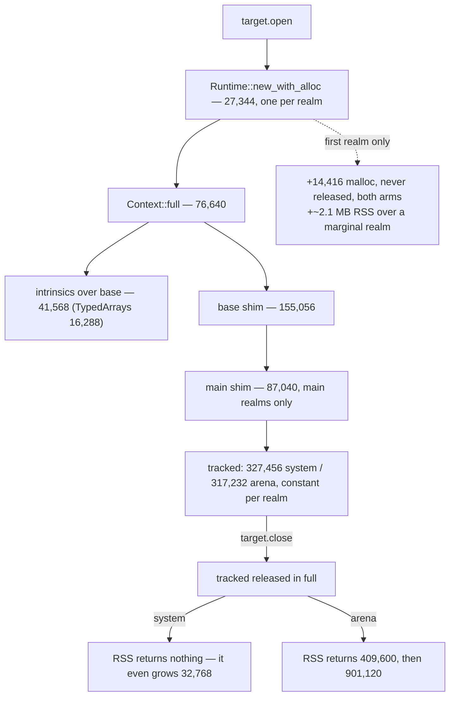

# The first realm, at engine level — design-only audit, 0.0.1

Read-only and design-only, from `092b50e`. No code, threshold or protocol
changed, no court frozen, no D6 criterion touched, no visual run, no navigation
soak, no download. Candidates were measured in a **scratch crate outside this
repository** that links the same pinned `rquickjs =0.12.2`; nothing in it is a
proposed implementation.

## 1. What a realm costs, as the host itself accounts for it

`memory.report`'s `script_realms.malloc_bytes`, paired with libmalloc's
process-wide `size_in_use` and the process RSS, opening three targets and
closing them again:

| stage | tracked | Δ | `in_use` | Δ | RSS | Δ |
| --- | ---: | ---: | ---: | ---: | ---: | ---: |
| **system arm** | | | | | | |
| empty host | 0 | | 135,008 | | 8,355,840 | |
| first realm | 327,456 | +327,456 | 479,216 | +344,208 | 10,944,512 | **+2,588,672** |
| second realm | 654,912 | +327,456 | 809,008 | +329,792 | 11,452,416 | +507,904 |
| third realm | 982,368 | +327,456 | 1,138,800 | +329,792 | 11,862,016 | +409,600 |
| close one | 654,912 | −327,456 | 809,008 | −329,792 | 11,894,784 | **+32,768** |
| close all + trim | 0 | −654,912 | 149,424 | −659,584 | 11,911,168 | 0 |
| **arena arm** | | | | | | |
| first realm | 317,232 | +317,232 | 154,032 | +19,024 | 10,452,992 | +2,064,384 |
| second realm | 634,464 | +317,232 | 158,512 | +4,480 | 11,042,816 | +589,824 |
| close one | 634,464 | −317,232 | 158,512 | −4,480 | 11,190,272 | **−409,600** |
| close all + trim | 0 | −634,464 | 149,424 | −9,088 | 10,289,152 | **−901,120** |

Four facts fall straight out:

1. **The tracked per-realm cost is exactly constant** — 327,456 system,
   317,232 arena — and it is released in full when the target closes. There is
   **no first-realm premium in the tracked number at all**.
2. **The first-realm premium is real but untracked.** In process malloc it is
   **14,416 bytes**, and those bytes are still there after every realm is closed
   and `memory.trim` has run: `in_use` settles at 149,424 against an empty
   host's 135,008. Identical on both arms, so it is host-side state, not realm
   memory.
3. **In RSS the first realm costs ~2.1 MB more than a marginal one** (2,588,672
   against ~460,000 system; 2,064,384 against ~573,000 arena).
4. **On the system arm nothing comes back.** Closing a realm *raises* RSS by
   32,768; closing all of them and trimming returns nothing. The arena arm
   returns 409,600 on one close and 901,120 on the last, which is the whole
   argument for the arena.

## 2. Where the 327,456 goes

Measured in the scratch crate, stage by stage, in libmalloc `size_in_use`:

| step | bytes | share of a realm |
| --- | ---: | ---: |
| `Runtime::new` (per realm — every realm gets its own) | 27,344 | 8.4% |
| `Context::full` | 76,640 | 23.4% |
| — of which intrinsics over `Context::base` | 41,568 | 12.7% |
| base shim evaluation | 155,056 | 47.4% |
| main shim evaluation (main realms only) | 87,040 | 26.6% |
| **a whole marginal realm, scratch** | **313,952** | |
| host-side extras (capabilities, job sink, zone/arena bookkeeping) | ~13,504 | 4.1% |
| **the host's tracked figure** | **327,456** | 100% |

**Two thirds of a realm is the shim.** The engine itself — runtime plus a full
context — is 103,856, under a third.

Intrinsics, each measured alone on top of a base context (35,072):

| intrinsic | cost | | intrinsic | cost |
| --- | ---: | --- | --- | ---: |
| TypedArrays | **16,288** | | Date | 4,784 |
| MapSet | 4,880 | | RegExp | 4,048 |
| Promise | 3,728 | | WeakRef | 1,152 |
| Performance | 384 | | Proxy | 304 |
| Eval, RegExpCompiler, Json | 0 | | | |

The shim's source is 58,957 bytes (32,472 base + 26,485 main) and costs
210,096 live in a marginal realm: **an exchange rate of about 3.6 bytes of
realm memory per byte of shim source.**

## 3. Owners, invariants, evidence

- **Owner**: one `Runtime` **and** one `Context` per realm, owned by the realm,
  dropped with it. The tracked bytes are the realm's own allocator's, which is
  why they return exactly.
- **Invariants any change must keep**: the per-realm 16 MiB memory limit and
  512 KiB stack limit stay per realm; the `__mcsInternals` handle's key set
  stays exactly as the court pins it; a child realm keeps evaluating the base
  shim only; realm capabilities stay per realm and never reach a log; closing a
  target still releases every tracked byte.
- **Evidence**: this table and the scratch crate; both arms; three realms and
  their closes; `memory.trim` after each.

## 4. Candidates, each measured before being judged

| candidate | measured saving | verdict |
| --- | ---: | --- |
| **A. Shrink the shim** | ~3.6 bytes per source byte, per realm | **The only large, semantics-neutral lever.** It is the existing main-slack work, now with an exchange rate: removing 1 KB of shim source is worth ~3.6 KB per realm, ~29 KB across eight targets. |
| B. One runtime, a context per realm | **49,872 per additional realm** (15.2%) | **Non-viable as things stand.** The 16 MiB limit and the stack limit become per *runtime*, so one realm's exhaustion becomes everyone's; the per-realm zone and arena — the instrument D6 is measured with — collapse into one; and the isolation story the host sells changes. The number is recorded so the trade is explicit, not so it is taken. |
| C. Trim intrinsics | ≤41,568 (12.7%); TypedArrays alone 16,288 | **Non-viable**: it changes what a page may do. `ArrayBuffer`, `Date`, `RegExp`, `Map` are ordinary page vocabulary. Recorded because the number bounds the whole idea: even removing *everything* buys less than one eighth of a realm. |
| D. Precompile the shim to bytecode | bounded above by the 14,416 permanent extra plus parse time | **Small.** What a realm pays for is the objects the shim *builds*, not the source it parses; bytecode changes the second, not the first. Worth measuring properly only if A is exhausted. |
| E. Skip the main shim in child realms | 87,040 per child realm | **Already done** — `target.open` evaluates base+main, child frames evaluate base only. Recorded so it is not "discovered" again. |

## 5. Safe failures, dependencies, non-goals

- **Safe failures**: nothing here changes a failure path. A realm that cannot
  be built already answers `internal`; the memory limit already refuses inside
  QuickJS's own wrappers before an allocator is called.
- **Dependencies**: candidate A is bounded by the shim's court-pinned surface —
  the handle key set, `getElementsByTagName`, the abort-signal courts. Nothing
  here touches copy-on-write, downloads, authority or retention: a realm holds
  no profile state.
- **Non-goals**: changing D6's criterion or its bound; sharing realms between
  targets; lazy shim evaluation, which would move when a page's errors appear;
  removing intrinsics a page can legitimately use.

## 6. D6 and G1

**D6 is measured in RSS, and the system arm never returns RSS.** Closing every
realm returns every tracked byte and leaves RSS exactly where it was. So a
change that lowers the tracked number does **not** automatically lower what D6
measures — on the system arm it lowers only the high-water mark, and D6's
figure is a high-water mark by construction. The arena arm is where a saving
becomes visible: it returned 901,120 on the last close.

Two consequences worth ruling on before any work is aimed at D6:

1. A candidate should be judged against **RSS on the arena arm**, not against
   tracked bytes, or the work will not show up where D6 looks.
2. The **first-realm premium — 14,416 malloc bytes, permanently — is host
   state, not realm state**. No per-realm candidate can reach it; it needs its
   own investigation, and it is small.

G1 is untouched: it compares this host with a Lightpanda baseline that still
needs an authorized binary, and nothing here changes what would be compared.

## 7. Court draft

1. The tracked per-realm cost is constant: the first realm and the eighth cost
   the same, on both arms.
2. Closing a target releases every tracked byte of its realm.
3. `memory.trim` after closing all realms returns the tracked total to zero.
4. The arena arm returns RSS on close; the system arm is allowed not to, and
   the court records which arm it measured.
5. A child realm evaluates the base shim and not the main one.
6. The per-realm memory limit stays per realm: exhausting one realm does not
   refuse another.
7. The handle's key set is unchanged by any shim work (the frozen court).
8. The first-realm premium is measured and recorded, on both arms, as a number
   that may not silently grow.

## 8. Pending rulings

1. Whether candidate A is pursued as an explicit programme with the 3.6×
   exchange rate as its yardstick, rather than member by member.
2. Whether any candidate is to be judged against arena-arm RSS, per §6.
3. Whether the 14,416-byte permanent first-realm extra is worth its own audit.
4. Whether B's numbers are wanted on the record as a rejected option, or should
   be re-examined if the isolation model ever changes.
