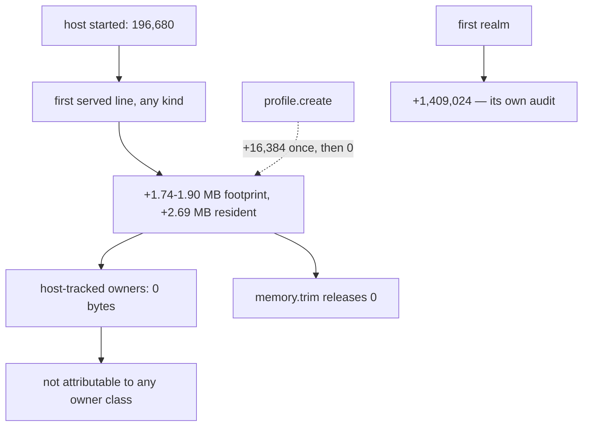

# The host's fixed first-request cost — read-only audit, 0.0.1

Design-only. Nothing implemented, no court frozen, no protocol touched, no
navigation soak, no visual or surface run. Every number is a black-box read of
the shipped `420cdf5b82bf…`. The five standing guards are untouched.

The brief was to audit the **first-profile** fixed cost, in service of G1 and
P6's D6. The first measurement dissolved the premise, so this audit reports
what is actually there.

## 1. The correction

`open-goal-triage-0.0.1.md` §1 recorded the step as *"first profile
+1,769,736"*. **That attribution was wrong.** The step is not caused by
creating a profile. It is caused by **the host serving its first line, of any
kind**:

| sequence | footprint | delta |
| --- | --- | --- |
| host started, before any request | 196,680 | — |
| three `memory.report` calls | 2,179,408 | **+1,982,728** |
| `profile.list` | 2,195,792 | +16,384 |
| `session.list` | 2,195,792 | +0 |
| a **refused** `profile.create` | 2,212,176 | +16,384 |
| a valid ephemeral `profile.create` | 2,212,176 | **+0** |
| a second ephemeral profile | 2,212,176 | **+0** |

Creating a profile costs **nothing measurable**. The earlier decomposition put
the step next to the profile only because `profile.create` happened to be the
first request it sent.

The strongest form of the measurement: a **malformed line** — not JSON at all,
answered `invalid_request` and never dispatched — pays the cost in full.

| | footprint |
| --- | --- |
| before anything | 229,448 |
| after one unparseable line | **1,966,416** |
| after an unknown operation | 1,966,416 (+0) |
| after a real `session.list` | 1,966,416 (+0) |

So it is not profiles, not the operation, and not even a valid request. It is
the first turn of the serve loop.

## 2. What it is, as far as black-box evidence can say

- **Allocator-independent.** System: +1,736,968. Arena: +1,769,736. The same
  step on both arms, which rules out an allocator arena as the explanation.
- **It is not host-tracked state.** At the moment of the jump the host's own
  accounting reports **zero bytes** across every owner class; the only non-zero
  figure anywhere in `memory.report` is `script_realms.memory_limit_bytes`,
  a *limit* of 16 MiB, not an allocation.
- **It is working set, not heap growth.** Physical footprint rises 196,680 to
  2,097,488 while resident rises 4,800,512 to 7,487,488 — the process had
  already mapped those pages and touched them for the first time.
- **It does not come back.** `memory.trim` returns `arena_released_bytes: 0`
  and *adds* 65,536 of its own; two seconds of idle release nothing; twenty
  further requests add 98,304 more and then taper.

```
   host process
     |
     +-- started, idle ................ footprint 196,680, resident 4.8 MB
     |
     +-- FIRST LINE SERVED ............ +1.74-1.90 MB footprint, +2.69 MB resident
     |     (even a malformed one)        tracked owners: 0 bytes
     |
     +-- every profile after that ..... +16,384 once, then 0
     +-- first realm .................. +1,409,024   (QuickJS, separate audit)
     +-- marginal target .............. +327,680
     +-- memory.trim .................. releases 0, costs 65,536
```



## 3. What this means for the two goals that asked

**P6's D6** requires live footprint below **4,178,196** and measures
**6,619,592**. Of that, roughly **1.9 MB is this first-request cost** and
**1.41 MB is the first realm**. Profile machinery itself is ~16 KB. So **D6
cannot be met by working on profiles at all** — the criterion is named for
profiles but is dominated by the process baseline and the JavaScript realm.
Either the process baseline shrinks, or the realm does, or the criterion is
re-derived against what it is actually measuring. This audit does not propose
which; it proposes that the choice be made knowingly.

**G1** is helped rather than hurt by the correction: the route's *marginal*
cost per target is 0.33 MB and profiles are free, which is the shape a
memory-efficiency argument wants. The fixed cost is a one-time process
constant, and a comparison campaign should measure it as such rather than
folding it into per-target figures.

## 4. Loss matrix — the reclaim paths, none taken

| path | what it would touch | measured basis | risk | verdict |
| --- | --- | --- | --- | --- |
| find and defer whatever the first turn touches | the serve loop in Rust | the jump is on the first line, before dispatch | it may be the runtime's own pages, in which case there is nothing to defer | **deferred**: needs a Rust-side instrumentation pass, not a design |
| shrink the first realm (1.41 MB) | QuickJS realm construction | measured separately in §2 | engine-level; touches every target | deferred to its own audit, as the triage ordered |
| re-derive D6 against what it measures | the profile court's criterion | §3 | a frozen criterion; moving it after measurement is exactly what the discipline forbids without a ruling | **ruling required**, not a repair |
| `memory.trim` improvements | the trim path | it releases 0 and costs 65,536 | changes an operation's meaning | deferred |
| accept the constant and measure around it | nothing | §2 | none | the honest default until one of the above is ruled |

## 5. Falsifiability, if any of this is ever taken

A court for a first-request reclaim would have to pin: the footprint before
any line and after one malformed line, on both allocators; that a profile
costs nothing measurable; that the host's tracked owners stay at zero across
the jump; and that whatever is deferred stays deferred — otherwise the saving
would simply move to the second request. That last criterion is the one that
makes such a slice honest, and it is why no reclaim should be attempted
without it.

## 6. What I recommend

Nothing to implement. The next step in the triage's order was this audit, and
its result is that **the first-profile cost does not exist** — so the ordering
should be amended: the first realm (1.41 MB) becomes the next candidate, and
D6 needs a ruling about what it is measuring before any work is aimed at it.
