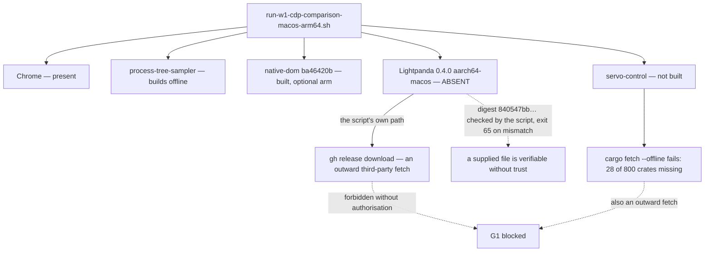

# G1 locator — read-only check, 0.0.1

Read-only, from `568dc64`. Nothing downloaded, nothing built, no comparison
started, no visual run, no navigation soak, no code or protocol changed. This
is a locator report and nothing else.

**Both baseline binaries are absent. G1 stays blocked, and the block is now
priced exactly.**

## 1. What the sanctioned runner requires

`labs/court/run-w1-cdp-comparison-macos-arm64.sh` names its inputs literally:

| input | expected | found |
| --- | --- | --- |
| Lightpanda 0.4.0 | `target/labs/lightpanda/0.4.0/lightpanda-aarch64-macos`, sha256 `840547bb7b98743a3e32618a4d120ac4a75e7c3c2d227ecf5ce8d508ddc118b7` | **absent** |
| Google Chrome | `/Applications/Google Chrome.app/Contents/MacOS/Google Chrome` | **present** |
| `process-tree-sampler` | `target/labs/process-tree-sampler/release/…`, built by the script | not built; **resolves offline**, so not blocking |
| `cargo`, `gh`, `python3`, `shasum` | on `PATH` | all four **present** |
| fixture | `labs/court/fixtures/semantic-static.html` | present |

The script's own behaviour when the binary is missing is to run
`gh release download 0.4.0 -R lightpanda-io/browser -p lightpanda-aarch64-macos`
— an outward fetch of a third-party release, which is exactly what standing
instruction forbids without separate authorisation. It then refuses on a digest
mismatch (`exit 65`), so a hand-placed file that is not the pinned artefact
cannot slip through.

## 2. Where I looked for Lightpanda

| location | result |
| --- | --- |
| `target/labs/lightpanda/0.4.0/` | directory does not exist |
| anywhere under the repository | no file named `lightpanda*` except `labs/lightpanda/`, which holds **evidence JSON only** |
| `~/.local/bin`, `/usr/local/bin`, `/opt/homebrew/bin`, `~/bin` | nothing matching |

I did **not** scan the wider filesystem: the standing rule keeps this work
inside the repository, and a home-directory sweep is a different permission
than a locator check. If it is wanted, say so and it is one command.

## 3. `servo-control`: not built, and not buildable offline today

It is a `[[bin]]` of the crate `minicon-surf-servo-api-probe`
(`labs/servo/Cargo.toml`, path `src/control.rs`), sitting beside
`servo-w1-runtime` and `servo-w3-runtime`. No built binary exists anywhere in
the repository.

The interesting part is how close it is:

| | count |
| --- | ---: |
| packages in `labs/servo/Cargo.lock` | 801 |
| of those, from a registry | 800 |
| **already in the local cargo cache** | **772** |
| **missing** | **28** |

So the Servo row is **96.5% cached**, and `servo 0.5.0`, `servo-base 0.5.0` and
their siblings are all present. But `cargo fetch --offline` still refuses —
first on `freetype 0.8.0`, and `cargo metadata --offline` on
`anstyle-wincon 3.0.11`. Most of the 28 are for **other platforms** —
`anstyle-wincon` and `dwrote` are Windows, `ohos-media-sys` and
`ohos-sys-opaque-types` are OpenHarmony, plus `hermit-abi` and `libfuzzer-sys` —
so they would very likely never be compiled on macOS arm64; cargo's resolver
wants them present all the same.

**That means even the Servo row cannot be built without a network fetch**, and
it is a fetch of 28 crates rather than one binary.

## 4. What this changes about G1's status

Nothing about the route half, which `g1-campaign-0.0.1.md` already measured.
What it adds is precision about the block:

- the Lightpanda half needs **one artefact**, whose digest is already pinned in
  the runner, so verification after the fact is mechanical;
- the Servo half needs **28 crates**, most of them for platforms this build
  will not target;
- everything else the runner needs is present, including Chrome and all four
  commands;
- the native-dom arm is built and current (`ba46420b…`), and both
  `--native-dom` and `--servo-control` are optional arguments, so the harness
  would run the moment the Lightpanda binary exists.



## 5. The minimum authorisation, and the exact commands after it

Two independent asks; either can be granted alone.

**A — the Lightpanda binary (unblocks the comparison).** Either:

- an explicit authorisation to run the script's own download, which is
  `gh release download 0.4.0 -R lightpanda-io/browser -p lightpanda-aarch64-macos -D target/labs/lightpanda/0.4.0`; or
- a file placed at `target/labs/lightpanda/0.4.0/lightpanda-aarch64-macos` by
  someone else. **No trust is needed either way**: the digest is pinned, and I
  would verify `shasum -a 256` against `840547bb…` before anything runs.

Then, and only on a further go-ahead:

```
sh labs/court/run-w1-cdp-comparison-macos-arm64.sh
sh labs/court/run-target-retention-macos-arm64.sh --native-dom \
   labs/native-dom/target/release/native-dom-control
```

**B — the Servo row (optional).** An authorisation to fetch the 28 missing
crates, i.e. a plain `cargo fetch --manifest-path labs/servo/Cargo.toml`
online, after which `cargo build --release --bin servo-control` runs locally.
Without it the Servo column stays as previously recorded evidence rather than
same-day measurement — which is what `g1-campaign-0.0.1.md` §5 already says.

## 6. What I did not do

No download, no build, no comparison, no visual run, no soak. I did not place a
substitute binary, and I did not hand-roll a Chrome-versus-native-dom
comparison outside the court — the campaign already recorded why that would not
be G1 evidence.
