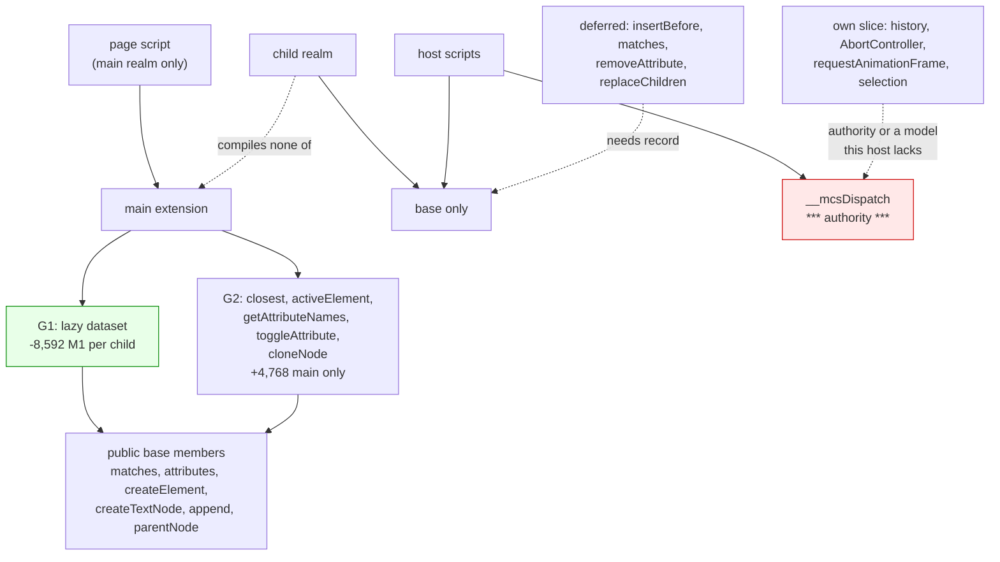

# Second browser-capability gap triage (native-dom, control 0.0.2)

Read-only measurement and design. No product code, no court frozen, no
navigation soak, no surface path. The candidate variants were built in a
throwaway worktree that has been removed; nothing here is qualification.

Measured on `d9c5099` / binary `e9d7273c310e…`.


## 1. Method

Forty capabilities probed in one page through the existing control door: the
page writes `typeof` (or a value) for each into its own element and the court
door reads them back with `target.snapshot`. No new seam, no new host
operation, nothing evaluated that a page could not evaluate itself.


## 2. What this build has, and what it does not

**Present:** `dataset`, `createTextNode`, `queueMicrotask`, `btoa`, and
`querySelectorAll` — which returns **a real `Array`**, not a `NodeList`
(`Array.isArray` is `true`, `forEach` works, and so does spread).

**Absent:** `closest`, `cloneNode`, `insertBefore`, `getAttributeNames`,
`toggleAttribute`, `document.activeElement`, `FormData`, `URL`,
`URLSearchParams`, `getComputedStyle`, `style`, `hidden`, `scrollIntoView`,
`getBoundingClientRect`, `getElementsByTagName`, `getElementsByClassName`,
`createDocumentFragment`, `EventTarget` as a constructor, `AbortController`,
`history`, `navigator.language`, `select`, `setSelectionRange`,
`selectionStart`, `innerHTML`, `outerHTML`, `insertAdjacentHTML`, `nodeValue`,
`normalize`, `isEqualNode`, `compareDocumentPosition`,
`requestAnimationFrame`, `structuredClone`, `TextEncoder`.

**A divergence nothing had recorded**: `querySelectorAll` answers a plain
array. A page that expects a live `NodeList` — one that updates as the tree
changes, or that has `item()` — gets a snapshot array instead. It is a loss
worth writing down (§6) rather than a defect to fix: the array is what every
court and every host script has always used.


## 3. The finding: there are two cost classes, not one

The per-member price ruled after the base-reduction round — 600 to 960 bytes
of M1 per child per prototype member — is real but it is not the only class.
`dataset` is built **in `Element`'s constructor**: a `Proxy`, its handler
object and three closures **on every element of every document in every
realm**, for an API no host script names.

Measured by moving it (and `kebab`, which serves nothing else) to the main
extension as a lazy accessor:

| | current `d9c5099` | with `dataset` lazy |
| --- | ---: | ---: |
| M1 (system) | 230,106 | **221,514** |
| M1 headroom under the 245,760 floor | 15,654 | **24,246** |
| M2 (system) | 1,609,244 | **1,549,100** |
| main-only slack against the `origin/main` baseline | 32,192 | **27,312** |

**8,592 bytes of M1 per child from one member** — an order above the
per-member band — because the cost is per *element*, roughly 67 bytes for each
of a document's nodes. And the main realm gets *cheaper* too, by about 4,880
bytes, since a page now pays for `dataset` only on the elements it touches.

The handle does not widen: `kebab` is used by nothing but `dataset`, so it
moves with it rather than being handed out. Courts on that scratch build:
child-frames 82/82, element-view 19/19, shim-footprint 18/18, element-api
28/28, event-view 11/11, event-fidelity 62/62, form 179/179, frame-actions
182/182, page-navigation 80/80, lifecycle 53/53, timers 68/68, job-deadline
42/42, frame-realm 62/62, cdp-frame-tree 64/64.


## 4. Candidate G2: five page-only additions, measured as a bundle

Each is buildable in the main extension out of **public members only** — no
handle widening, no base growth, and nothing a child realm compiles:

| addition | built from | agent value |
| --- | --- | --- |
| `Element.closest(selector)` | `matches`, `parentNode` | **high** — the actionable ancestor of a hit |
| `document.activeElement` | the extension's own `focus`/`blur` | moderate — pages branch on focus |
| `Element.getAttributeNames()` | `attributes` | moderate — enumerating state an agent reads |
| `Element.toggleAttribute(name, force)` | `hasAttribute`, `setAttribute`, `removeAttribute` | moderate — how pages flip state |
| `Node.cloneNode(deep)` | `createElement`, `createTextNode`, `attributes`, `append` | moderate — template-style pages |

Measured as one bundle on top of §3: **M1 unchanged at 221,514** — a child
pays nothing — and main-only slack 27,312 → **32,080**, so the five cost about
**4,768 bytes of main**, inside the 65,536 the shim court holds.


## 5. The tree

```
Agent-visible capability, bought without authority or child cost
├── A. Stop paying per element for what no child can read (G1)
│   invariant: dataset is allocated when a page reads it, never in a constructor
│   evidence: §3, and the child-frame court's M1/M2 on the same binary
│   safe failure: the accessor throws where a page reads it; no host path touches it
│   dependency: none — kebab moves with it, the handle does not widen
│   non-goal: changing what data-* attributes mean, or the snapshot's view of them
├── B. Give a page what it can build from public members (G2)
│   invariant: every addition is expressible in the extension with no base growth
│   evidence: §4's bundle measurement, main-only
│   safe failure: absent, as today; an addition that needs the base is not in this bundle
│   dependency: matches, attributes, createElement, createTextNode, append — all staying in the base
│   non-goal: anything needing record, the selector internals, or a wider handle
├── C. Leave alone what carries authority
│   invariant: navigation identity, cancellation and the revision stay where they are
│   evidence: the Event and page-navigation records
│   safe failure: the capability stays absent
│   dependency: —
│   non-goal: history, pushState, AbortController-driven fetch cancellation
└── D. Say what cannot be built here at all
    invariant: an absence with no path is recorded as a loss, not left as a to-do
    evidence: §6
    safe failure: —
    dependency: —
    non-goal: pretending a layout-free host can answer layout questions
```


## 6. The loss matrix

| capability | why it is not a candidate | class |
| --- | --- | --- |
| `getBoundingClientRect`, `getComputedStyle`, `style`, `scrollIntoView` | no layout and no CSS engine; any answer would be invented | **hard loss** |
| `innerHTML`, `outerHTML`, `insertAdjacentHTML` | parsing HTML is html5ever's job, host-side; a realm-side parser is a second parser that would disagree with the first | **hard loss** |
| `insertBefore`, `replaceChild` | correct mutation records need `record`, which is C2b's deferred dependency and the way the revision moves | deferred with C2b |
| `matches`, `removeAttribute`, `replaceChildren` | in the base, scope-closed by ruling | deferred with C2b |
| `history`, `pushState`, `popstate` | navigation identity: authority, not fidelity | own slice |
| `AbortController` | means cancelling a fetch the host owns | own slice |
| `requestAnimationFrame` | implies frames this host does not have; the timer model is the base's | own slice |
| `EventTarget` as a constructor | the listener model is the base's, and a child dispatches through it | needs a base decision |
| `select`, `setSelectionRange`, `selectionStart` | a text-selection model this host does not have; the snapshot reports no selection | own slice |
| `getElementsByTagName`, `getElementsByClassName` | live collections; `querySelectorAll` already answers, as an array | recorded loss |
| live `NodeList` semantics | `querySelectorAll` returns a plain array (§2) | **recorded loss, newly written down** |
| `URL`, `URLSearchParams`, `structuredClone`, `TextEncoder` | buildable in the extension, but each is a real implementation with its own bugs; none is agent-visible enough to earn that | not now |


## 7. Where each candidate sits




## 8. Boundary and memory assumptions, stated

- A child realm compiles the base alone and runs no page script; every
  candidate here is unreachable there, which is what makes it free of child
  cost. That is the same assumption C1 and C2a were ruled on.
- No candidate touches the capability bridge, the hidden event state, the
  revision, or any host answer. None of them can change what an action decides.
- G1 changes *when* an allocation happens, not what a page can observe:
  `element.dataset` answers the same values from the same attributes.
- The floors are the frozen ones, 245,760 and 1,720,320, and the main slack
  is the frozen 65,536. G1 improves two of the three; G2 spends main only.
- Everything was measured with one court run per variant, on one machine.


## 9. What I need ruled

1. **G1**, which is the whole reason this triage is worth acting on: 8,592
   bytes of M1 per child, no handle widening, and the main realm cheaper too.
   It also makes a second pricing class explicit — **per element**, not per
   member — which the shim-split record should carry beside the per-member
   rule.
2. **G2**, as a bundle or member by member: 4,768 bytes of main for five
   additions, `closest` being the one with real agent value and the others
   being cheap because they are already implied by members the base keeps.
3. Whether the **`querySelectorAll` array divergence** should be written into
   the README's loss list now, since it is a divergence no record mentions and
   I found it by probing rather than by reading.
4. Whether `EventTarget` as a constructor is worth a base decision later: it is
   the one absent capability whose natural home is the base, and every other
   base-side candidate has been deferred with C2b.


## 10. The rulings, and a number of mine that was wrong

**10.1 `dataset` is the next slice**, as a lazy accessor in the main
extension. `kebab` moves with it, the handle does not widen, and a child realm
has no `dataset` at all. A separate court is frozen before the code.

**10.2 My per-element figure was wrong by an order.** §3 said "roughly 67
bytes for each of a document's nodes", inferred from the 8,592-byte M1 saving
by assuming the child-frame court's fixture holds 128 nodes. It holds about
ten. Measured directly instead — two child documents, 16 nodes and 112 nodes,
same host, same order:

| build | 16-node child | 112-node child | marginal, per node |
| --- | ---: | ---: | ---: |
| current `e9d7273c310e…` | 552,679 | 752,610 | **2,082.6** |
| with `dataset` lazy | 530,055 | 650,114 | **1,250.6** |

**`dataset` costs about 832 bytes per element**, not 67, and a node costs
2,082 bytes today of which two fifths is an API no host script names. The
current build's numbers reproduced exactly on a repeat run.

**10.3 The shim-split record may carry both price classes** — per prototype
member, 600 to 960 bytes of M1 per child; and per element for anything a
constructor allocates, measured here at 832 bytes for one `Proxy` and its
closures — **and neither is a budget promise for anything future**. They are
what two measurements said, recorded so a later change is priced rather than
guessed.

**10.4 The second candidate is not a bundle.** `closest`, `activeElement`,
`getAttributeNames`, `toggleAttribute` and `cloneNode` are each their own
design and measurement, `closest` first by agent value, and none is
implemented now. The 4,768-byte bundle figure in §4 stands only as evidence
that the whole group is affordable, not as a proposal.

**10.5 The `querySelectorAll` divergence goes into the README's losses** —
a plain array, with no `item()` and no liveness — and **`EventTarget` as a
constructor waits for its own base decision**.


## 11. The frozen court for this slice

`dataset-court.py`, headless, both allocators, supervised hosts. It measures
the thing the slice is about — a cost that scales with element count — rather
than only the totals other courts already hold:

1. **The per-element gate.** Two child documents, 16 nodes and 112 nodes, in
   the same host and order; the marginal cost per child node must be **at most
   1,600 bytes**. Today it is 2,082.6 and fails; with the accessor lazy it is
   1,250.6 and passes, and the gate sits between them with margin on both
   sides.
2. **A main realm still has `dataset`**, reading and writing `data-*` with the
   same kebab conversion, and `element.dataset === element.dataset` — the
   lazy view is stable per element.
3. **A child realm has none of it**, read through the court-only realm probe.
4. **Child invariants**: a child still answers a snapshot, still applies a host
   action through the bridge, and still runs the DOM's own reset.
5. **Owner release**: closing every target returns the owners to the empty
   figure exactly.
6. **Main slack** stays inside the frozen 65,536, measured by the
   shim-footprint court on the same binary, and the frozen M1 and M2 floors
   hold in the child-frame court.
