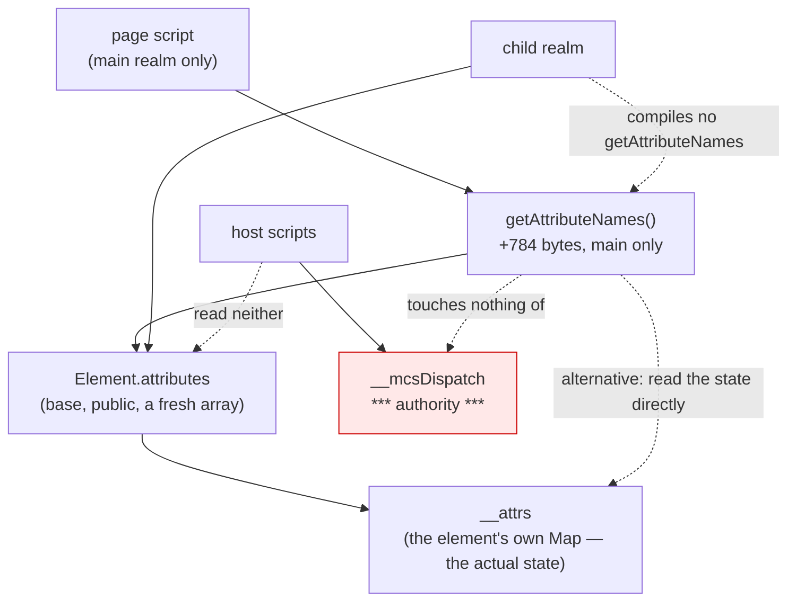

# `getAttributeNames`, and the shape of `attributes` underneath it

Design and read-only measurement only. No product code, no court frozen, no
handle widening, no navigation soak, no surface path. The cost variant was
built in a throwaway worktree that has been removed. Measured on `891be33` /
binary `8546428d23d9…`.


## 1. What the door says today

| probe | answer |
| --- | --- |
| `element.getAttributeNames` | **`undefined`** |
| `element.attributes` | a plain **`Array`**, `Array.isArray` true |
| an entry | `{"name":"class","value":"leaf"}` — a plain object, not an `Attr` |
| `attributes.item`, `attributes.getNamedItem` | `undefined` |
| `element.attributes === element.attributes` | **`false`** — a fresh array each read |
| names after `setAttribute("z-last", …)` | appended in insertion order |
| names after `removeAttribute` | the removed one is gone |
| `setAttribute("MixedCase", …)` | stored and reported as `mixedcase` |
| `attributes.map(a => a.name)` | works **here** |
| `Array.from(attributes).map(a => a.name)` | works here **and** in a browser |

No host script names `attributes` at all — verified against every
child-capable script's own literal.


## 2. What this is worth, said plainly

Like `closest`, this is **compatibility, not capability**: a page can already
read the names. Unlike `closest`, the workaround that works here —
`attributes.map(…)` — would **fail in a browser**, where `attributes` is a
`NamedNodeMap` with no `map`. So this host is not merely missing a method; the
thing underneath it has a different shape, and a page written against either
one can break on the other.

That makes the interesting finding not the missing method but §3.


## 3. The divergence underneath, which nothing had recorded

`attributes` here is a **snapshot array of plain objects**, built fresh on
every read. In a browser it is a **live `NamedNodeMap` of `Attr` nodes** with
`item()`, `getNamedItem()`, `length`, and identity across reads.

Consequences a page can see:

- `el.attributes === el.attributes` is `false` here, `true` in a browser;
- `el.attributes.map(…)` works here, throws in a browser;
- `Array.from(el.attributes)` works in both — the portable form;
- `el.attributes.getNamedItem('id')` throws here;
- a page holding `el.attributes` sees a **stale** list here after a
  `setAttribute`, and a live one in a browser;
- each read allocates one array and one object per attribute, which is a
  per-call cost paid by whoever reads it.

This is the second unrecorded divergence of this shape found by probing —
after `querySelectorAll` answering a plain array — and it belongs in the
README's losses whichever way the method is ruled.


## 4. Dependencies and cost

Built in the main extension from `attributes`, which stays in the base:
no handle widening, no base growth, nothing a child compiles, no authority.

| | current `891be33` | with `getAttributeNames` |
| --- | ---: | ---: |
| M1 (system) | 224,458 | **224,458** — unchanged |
| main-only slack | 31,872 | **32,656** |

**784 bytes of main, nothing per child.**

There is a second implementation, worth a ruling rather than a preference: read
`__attrs` — the element's own `Map`, which is the actual state — instead of
`attributes`. It allocates no intermediate objects, so a page enumerating
names on a large document pays for one array instead of one array plus an
object per attribute. It is also arguably the *more* single-source choice,
because `attributes` is itself a view over `__attrs`. It costs a few bytes
less; I have not measured the two apart, because the difference is smaller
than the noise this court can resolve.


## 5. The tree

```
Should a page's attribute enumeration work, and against which shape?
├── A. The method (owner: this audit)
│   invariant: getAttributeNames() answers the element's attribute names, lowercased, in insertion order
│   evidence: §1's probe of the underlying order and case; the court a slice would freeze
│   safe failure: absent, as today — the page's own call throws
│   dependency: attributes or __attrs, both staying in the base
│   non-goal: Attr nodes, namespaces, or a live collection
├── B. The shape underneath (owner: the base's `attributes` getter)
│   invariant: whatever it is, it is written down
│   evidence: §3
│   safe failure: leave it as it is and record it
│   dependency: —
│   non-goal: turning it into a NamedNodeMap, which is a base change nobody has asked for
└── C. The cost (owner: the shim-footprint and child-frame courts)
    invariant: nothing per child, main inside its frozen slack
    evidence: §4
    safe failure: do not add it
    dependency: the main extension
    non-goal: base growth for a page-only enumeration
```


## 6. The loss matrix

| what a page may expect | what it would get | class |
| --- | --- | --- |
| `getAttributeNames()` returning lowercased names in order | exactly that | in scope |
| `attributes` as a live `NamedNodeMap` | a fresh plain array of plain objects | **recorded loss, newly written down** |
| `attributes.item(0)`, `.getNamedItem('id')` | `undefined` — throws when called | loss |
| identity across reads | `false` | loss |
| `Attr` nodes with `ownerElement`, `namespaceURI`, `prefix` | plain `{name, value}` | loss |
| namespaced attributes, `getAttributeNamesNS` | no namespaces in this host | hard loss |
| the enumeration seen by a host script | none: no host script reads `attributes` | not applicable |


## 7. Where it sits




## 8. Boundaries and assumptions

- A child realm runs no page script and no host script reads `attributes`, so
  nothing here is reachable in a child; that is the same assumption every
  extension member since C1 has been ruled on.
- The frozen floors (245,760 and 1,720,320) and the frozen main slack (65,536)
  are the gates; this candidate moves only the third, by 784 bytes.
- No authority: attribute names are already readable one at a time through
  `getAttribute`, and the host reads neither.
- One court run per variant, one machine, scratch build removed.


## 9. What I need ruled

1. **Whether to add the method**, at 784 bytes of main and nothing per child,
   on the same compatibility ground as `closest`.
2. **Which source it reads** — `attributes` (one view, allocates an object per
   attribute per call) or `__attrs` (the state itself, allocates nothing
   extra). I lean to `__attrs`, because the Map *is* the state and the view is
   the derived thing, but it is the sort of choice that deserves saying out
   loud rather than picking.
3. **Whether the `attributes` divergence goes into the README's losses now**,
   as `querySelectorAll`'s did. It is unrelated to whether the method lands,
   and it is the larger of the two facts this audit found.


## 10. The rulings

**10.1 `getAttributeNames` is accepted** as a compatibility fix: about 784
bytes of main, nothing per child, no base growth and no handle widening.

**10.2 It reads `__attrs` directly**, the element's own `Map`, taking its keys
in insertion order — already lowercased, because `setAttribute` lowercases on
the way in. It does **not** derive from `attributes`, so it allocates no
intermediate object per attribute and it reads the state rather than a view of
it.

**10.3 It claims nothing it is not.** The return is a **new array** on every
call, which is what the standard says and what a browser does; it is not a
`NamedNodeMap`, its entries are not `Attr` nodes, and it has no identity
across calls to claim.

**10.4 The `attributes` divergence is recorded in the README's losses**,
independently of this method: a fresh plain array of plain objects, built on
every read, with no `item`, no `getNamedItem`, no identity across reads and no
live update.

**10.5 The criteria join `element-view-court.py`**, covering an element with
no attributes, a repeated `setAttribute` of the same name, mixed case, the
order after a removal, the fresh array on each call, the child divergence, and
owner release — with the floors and the slack held where they already are.

`toggleAttribute`, `cloneNode`, the selector engine's error name, C2b and
`EventTarget` all stand as previously ruled.
