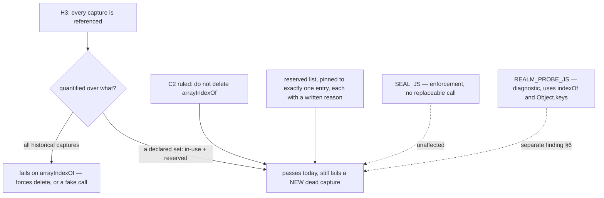

# H3 and the closed C2 — design-only, 0.0.1

Read-only and design-only, from `77f2638`. Nothing implemented, no court
frozen, no code, capture, handle, base or bound changed, no visual run, no
navigation soak, no download.

## 1. The conflict, stated exactly

- **H3** (recommended, not yet ruled): *every captured intrinsic is referenced
  at least once.*
- **C2** (ruled, permanently closed): `arrayIndexOf` is **not** deleted,
  because it records a security intent.
- `arrayIndexOf` has **zero references**.

So H3, written that way, fails on the day it is adopted, and the only ways out
are to delete the capture, to add a call, or to change what H3 quantifies over.

## 2. The four ways out, and what each is worth

| option | runtime cost | verdict |
| --- | --- | --- |
| **A. H3 quantifies over a *declared* set: captures in use, plus a pinned reserved list** | **zero** | **Recommended.** Keeps both rulings, adds no call, and stays falsifiable: a *new* dead capture still fails, because the reserved list is pinned to exactly its current contents and growing it needs a ruling. |
| B. Prove a host invariant needs it, and use it | 48.6 bytes per site per realm | **Impossible as scoped** — see §3. The capture is not reachable from where the only host-side `indexOf` lives. |
| C. Delete it | −112 system, +96 arena per realm | Reopens a closed ruling. Measured in the C2 audit; the bytes were never the argument. |
| D. Add a call to satisfy the rule | ~48.6 bytes per realm | **Excluded by the ruling, and rightly.** A call written to satisfy a rule makes the rule measure itself. |

## 3. Why B fails: no host decision can reach the capture

The seven direct `.indexOf` sites, classified by what they guard:

| site | what it touches | measured effect when `indexOf` is replaced |
| --- | --- | --- |
| `dom_shim_main.js:252, 282, 287, 302` | `classList` tokens | page-internal only — `class` is not in the snapshot |
| `dom_shim_base.js:102` | `observers`, on `MutationObserver.disconnect` | the node disappears from the agent's snapshot — fails closed |
| `dom_shim_base.js:116` | `childNodes`, on `__detach` | same |
| `dom_shim_base.js:371` | the selected-option comparison | no effect measured; options still report correctly |

And the one `indexOf` in the host's own scripts is **`REALM_PROBE_JS`**, which
the source itself labels court-only. It reports whether the handle is still
enumerable on `window`.

**The enforcement path does not use a replaceable call at all.** `SEAL_JS` —
which deletes the handle and refuses the realm if it survives — is
`delete window.__mcsInternals; return String(typeof window.__mcsInternals)`.
No method call a page can replace.

So the only host-side `indexOf` is in a **diagnostic**, not a decision. A page
can make that diagnostic report the wrong `enumerable` boolean; it cannot make
the seal pass. That is a small, separate finding, recorded in §6.

Even if it were worth hardening, `arrayIndexOf` lives in the base shim's
closure scope and is **not reachable from a host script** — only the handful of
`__mcs*` globals are. Reaching it would mean exposing a new global, which grows
the base and is out of scope this round. **B cannot be built as scoped.**

## 4. Option A in detail

H3 becomes two rules over a **declared** set:

1. Every capture **not** on the reserved list is referenced at least once.
2. The reserved list is **exactly** `["arrayIndexOf"]`, and each entry carries a
   written reason in the source next to the capture.

A future dead capture fails rule 1. Adding it to the reserved list fails rule 2
until someone rules it in, in writing. Neither rule can be satisfied by writing
a call, which is the property the ruling asked for.

**Cost: zero.** No runtime change, no bytes, no per-child impact, no effect on
M1/M2, D6 or G1. It is a source-and-court rule.

## 5. Loss matrix

| | option A | delete (C) | fake call (D) |
| --- | --- | --- | --- |
| C2's ruling | kept | overturned | kept |
| the intent is recorded | in source and in the reserved list | lost | obscured |
| a new dead capture is caught | yes | yes | **no** — the rule becomes satisfiable by writing anything |
| runtime cost | none | −112 / +96 per realm | ~48.6 per realm |
| review signal | the reserved list says "known, reasoned, unused" | nothing | a call nobody can explain |

## 6. A separate small finding

`REALM_PROBE_JS` — the court-only realm diagnostic — reads
`Object.keys(window).indexOf("__mcsInternals") >= 0`, and both `Object.keys`
and `Array.prototype.indexOf` are page-replaceable. A tampering page can
therefore make that **diagnostic** wrong in either direction, while the seal it
reports on cannot be affected. It is the courts' own instrument, so being able
to lie to it matters for the evidence chain rather than for the host's answers.
It is recorded here and **not** fixed: it is neither H3 nor C2, and it should
be ruled on its own.

## 7. Safe failures, dependencies, non-goals

- **Safe failures**: unchanged everywhere; option A adds no runtime path.
- **Dependencies**: none. It touches no frozen floor, no bound, no capture, no
  handle key.
- **Non-goals**: H2 stays not done; the 71 uncapturable sites stay a future
  candidate; the snapshot's shape validation stays a separate protocol
  question; `REALM_PROBE_JS` stays unfixed pending its own ruling.

## 8. Court draft

1. Every capture in the base shim that is not on the reserved list is
   referenced at least once in the shims.
2. The reserved list is exactly `["arrayIndexOf"]` — no more, no fewer.
3. Every reserved capture has a written reason in the source beside it.
4. The reason is not a runtime call: the reserved capture is still referenced
   zero times, and that is what the court expects.
5. The handle's key set, the M1/M2 floors and the per-realm tracked bytes are
   unchanged by adopting this rule — it has no runtime effect at all.

## 9. Pending rulings

1. **Adopt option A**, and with it the exact wording of H3's two rules.
2. The instruction that produced this round contains a tension worth resolving
   in writing: it asks to *evaluate removing the capture and revising H3's set*
   while also forbidding *reinstating C2's deletion*. This design reads the
   second as governing and treats removal as evaluated-and-rejected (§2 C). If
   the intent was the opposite — that removal is back on the table under a new,
   non-byte justification — say so and it will be redesigned around that.
3. Whether `REALM_PROBE_JS` (§6) gets its own round.
