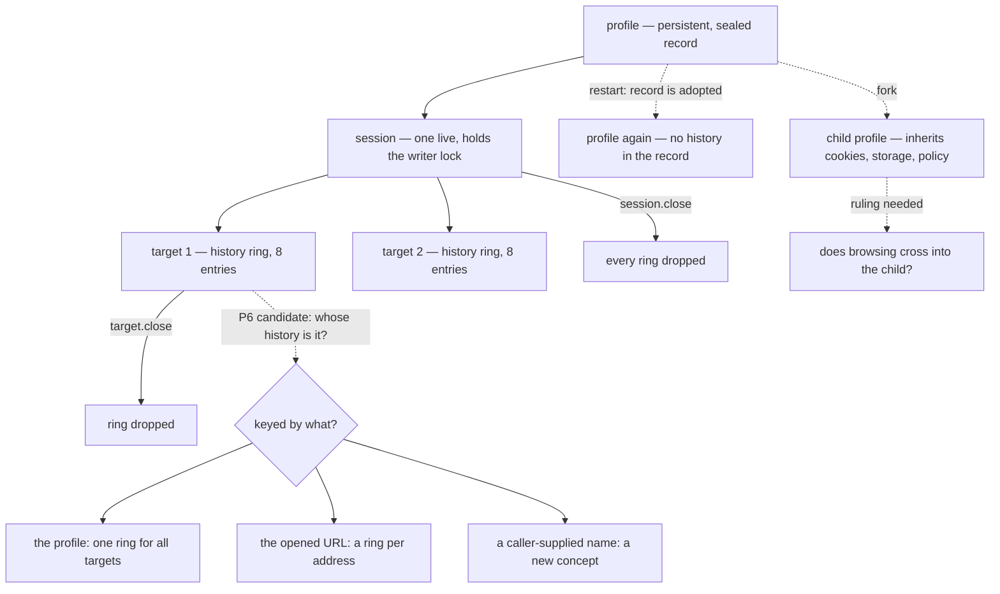

# History persistence (P6) — design-only audit, 0.0.1

Read-only and design-only, from `092b50e`. Nothing implemented, no protocol
change, no court frozen, no user data touched — every measurement ran in a
temporary profile root. No visual run, no navigation soak, no download.

## 1. What history is today, measured

| question | measured |
| --- | --- |
| where it lives | one ring **per target**, keyed by target id, beside the targets |
| at `target.open` | `length 1, position 0` — the opened URL |
| after 12 navigations | `length 8, position 7` — the oldest are evicted |
| a `target.traverse` back | position 6, `can_go_forward true` |
| navigating from there | `length 8, position 7`, forward dropped — the forward entries are truncated |
| `delta` −7, −8, +3 | `not_found`, reason `history_offset_out_of_window` |
| `delta` 0 or −20 | `invalid_request` — outside the window's own bound |
| after `target.close` and reopen | `length 1` — a fresh ring; **target ids are never reused** |
| after a host restart | `length 1` — nothing was restored |
| the sealed record on disk | **contains no URLs at all** |
| a copy-on-write fork | carries nothing of history: it is not in the record |
| what the protocol exposes | `position`, `length`, `can_go_back`, `can_go_forward` — **never the URLs** |
| `target.inspect`'s `url` field | the **current** URL, query and all |
| the audit ledger | origin only; the query never appears |
| `memory.report` | `history_entries` and `history_bytes`; no URLs |

**So the answer to the first question is unambiguous: history is in memory,
owned by the target, and nothing about it is persisted or inherited.**

## 2. The two costs that shape any design

**Bytes.** One target's full window of near-maximal URLs measures **15,416
bytes** (8 entries, `MAX_URL_BYTES` 2,000). With `MAX_TARGETS` 8 that is
~123,328 bytes across a host, against `MAX_ACCOUNTED_BYTES_PER_PROFILE` of
**131,072**. Persisting every history would consume up to **94% of a profile's
entire storage budget**, crowding out the cookies and storage it exists for.

**Writes.** Every mutation of a profile record is a full re-seal: measured at
**~12 ms and a whole-record rewrite** in the copy-on-write audit. Persisting a
history entry per navigation turns every navigation into a full profile commit.
A page that navigates ten times costs ten re-seals of everything the profile
holds.

Neither cost is fatal, but together they rule out the obvious design — "append
each committed URL to the record" — and they are why the capacity question has
to be answered before the protocol one.

## 3. The question that is actually unanswered

**"History persistence" is two features wearing one name.**

1. *Survive a restart so the **agent** can see where a profile has been.* This
   needs a way to **read entries back**, which the protocol has never offered:
   today the URLs are structurally invisible. That is a new disclosure, not a
   new storage location.
2. *Restore back/forward for a reopened **target**.* This needs the persisted
   ring to be keyed to something that survives a restart — and a target is not.
   Target ids are never reused, and a reopened target starts a fresh ring by
   construction.

Feature 2 has no well-posed identity today. Whatever it is keyed to — the URL
it was opened at, a caller-supplied name, the profile itself — is a **new
concept**, and inventing one silently would be the real cost of this work.

## 4. Owners and invariants

| | today | under persistence |
| --- | --- | --- |
| **owner** | the target | the profile record, whatever the ring is keyed to |
| **lifetime** | until the target or session closes | until the profile is deleted |
| **visibility** | shape only: position, length, can_go_* | unchanged, unless a read operation is added |
| **write path** | in memory, free | a full re-seal per committed navigation |
| **lock** | none needed | the session's writer lock, already held |
| **readonly session** | history still moves | must **not** persist: the open promised not to write |
| **ephemeral profile** | history still moves | a no-op — there is nothing on disk |

Invariants any design must keep:

1. A URL never reaches the audit ledger, an error, a receipt or a diagnostic —
   only origins do, and only where they already do.
2. The shape stays truthful: `position` and `length` describe what traversal
   will actually do, restored or not.
3. Eviction stays at the head, and a forward navigation still truncates.
4. A readonly session leaves the record untouched.
5. Persisted history never grows the record past the profile's own budget.

## 5. Protocol candidates

| candidate | shape | contract impact |
| --- | --- | --- |
| **A. profile-owned recent list** | the record keeps one bounded list of committed URLs for the profile; no restore of per-target back/forward | no operation, no argument; the enum stays 26. Answers feature 1 only, and only if a read is added |
| **B. `target.open` gains `history`** | `{session, url, history: "profile"}` restores a ring for the opened address | one optional argument; needs candidate K2's identity ruling |
| **C. new `target.history` read** | returns the entries | a 27th operation **and** the first disclosure of paths and queries to a caller — two rulings in one |
| **D. persist, expose nothing** | the record carries the ring; nothing new is readable | no protocol change at all, and **no observable benefit** except restored traversal, which needs B |

The honest recommendation is **not to pick one yet**. A and D are cheap and
answer little; B needs an identity that does not exist; C is a disclosure
decision that should be taken on its own merits, not as a side effect of
storage. The next ruling should be *which feature is wanted*, not which
candidate.

## 6. Capacity, eviction, commit

- **Capacity**: the window is 8 entries and a URL is bounded at 2,000 bytes, so
  a ring is ≤16,000 bytes. A profile-owned list should carry its own budget —
  recommended **8 entries and 16 KiB**, so history can never take more than
  12.5% of the accounted budget it shares with cookies and storage.
- **Eviction**: head eviction, unchanged, and a forward navigation truncates.
- **Commit**: the existing path already gives atomicity and rollback —
  temporary file, fsync, atomic rename, and a failed write restores the
  in-memory jar and storage and latches `read_only`. History must join **that**
  commit, not get a second write path; a history write that failed
  independently would leave the record and the ring disagreeing.
- **Rollback**: on a failed commit the ring must be restored alongside the jar
  and storage, or a target would traverse to an entry the record never kept.

## 7. Dependencies, conflicts, non-goals

- **Copy-on-write**: if history lives in the record, a fork copies it, and the
  child inherits the parent's browsing. That contradicts the spirit of the
  ruling that the child must not even record its parent's *name*.
  **Recommended: history is not inherited**, and the fork clears it.
- **Downloads**: a download is not a navigation and never touches history.
  Non-goal, and worth stating so it is not added by accident.
- **Cache**: does not exist; no interaction.
- **D6**: the live cost does not change; the record grows by at most the
  history budget. It must be measured against D6 before landing, not assumed.
- **G1**: unaffected — no comparison baseline depends on history.
- **Non-goals**: restoring documents, forms, scroll or script state (going back
  already refetches); cross-profile history; unbounded history; exposing URLs
  without a disclosure ruling.

## 8. Safe failures

| situation | answer |
| --- | --- |
| a readonly session navigates | history moves in memory; **nothing is written** |
| the record write fails | the existing `internal` commit-failed, the ring rolled back with the jar and storage, and the latch set |
| the persisted list is corrupt at adoption | the profile is already refused at adoption today (`not_found`, corrupt) — history must not add a second, softer path |
| an ephemeral profile | persistence is a no-op, and must not be reported as done |
| the history budget is exhausted | evict, never refuse a navigation — a full history is not a reason to fail a page |
| a restore is asked for a target with no persisted ring | an empty ring, not an error |

## 9. Court draft

1. A navigation appends exactly one entry, and only on commit.
2. Head eviction at the bound, and a forward navigation truncates — unchanged
   from today's measured behaviour.
3. A readonly session navigates without writing: the record's digest is
   identical afterwards.
4. A restart restores the shape the ruling promises, and nothing more.
5. No URL, path or query appears in the ledger, an error, a receipt,
   `memory.report` or `profile.inspect`.
6. A failed commit rolls the ring back with the jar and storage, and the
   traversal afterwards matches the record.
7. The history budget is enforced and cannot push a profile past its accounted
   budget.
8. A fork does not carry the parent's history (per the recommendation above).
9. An ephemeral profile persists nothing, and says nothing was persisted.
10. Traversal answers stay exactly as measured in §1: `history_offset_out_of_window`
    for an out-of-window delta, `invalid_request` outside the bound.
11. A corrupt persisted list is refused at adoption the way a corrupt record
    already is — no softer path.
12. The live memory cost is measured against D6 before the capability lands.

## 10. Pending rulings

1. **Which feature** — the agent seeing where a profile has been (needs a
   disclosure ruling), or a reopened target restoring its back/forward (needs a
   new identity), or neither.
2. If the second: what a restored ring is keyed to.
3. Whether a fork inherits history — recommended **no**.
4. The history budget, if it is not the recommended 8 entries / 16 KiB.
5. Whether a readonly session's asymmetry (history moves, nothing persists) is
   acceptable, or whether readonly should freeze the ring too.
