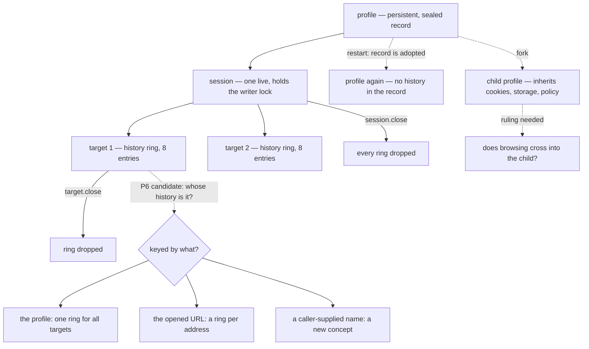

# History persistence (P6) — design-only audit, 0.0.1

Read-only and design-only, from `092b50e`. Nothing implemented, no protocol
change, no court frozen, no user data touched — every measurement ran in a
temporary profile root. No visual run, no navigation soak, no download.

## 1. What history is today, measured

| question | measured |
| --- | --- |
| where it lives | one ring **per target**, keyed by target id, beside the targets |
| at `target.open` | `length 1, position 0` — the opened URL |
| after 12 navigations | `length 8, position 7` — the oldest are evicted |
| a `target.traverse` back | position 6, `can_go_forward true` |
| navigating from there | `length 8, position 7`, forward dropped — the forward entries are truncated |
| `delta` −7, −8, +3 | `not_found`, reason `history_offset_out_of_window` |
| `delta` 0 or −20 | `invalid_request` — outside the window's own bound |
| after `target.close` and reopen | `length 1` — a fresh ring; **target ids are never reused** |
| after a host restart | `length 1` — nothing was restored |
| the sealed record on disk | **contains no URLs at all** |
| a copy-on-write fork | carries nothing of history: it is not in the record |
| what the protocol exposes | `position`, `length`, `can_go_back`, `can_go_forward` — **never the URLs** |
| `target.inspect`'s `url` field | the **current** URL, query and all |
| the audit ledger | origin only; the query never appears |
| `memory.report` | `history_entries` and `history_bytes`; no URLs |

**So the answer to the first question is unambiguous: history is in memory,
owned by the target, and nothing about it is persisted or inherited.**

## 2. The two costs that shape any design

**Bytes.** One target's full window of near-maximal URLs measures **15,416
bytes** (8 entries, `MAX_URL_BYTES` 2,000). With `MAX_TARGETS` 8 that is
~123,328 bytes across a host, against `MAX_ACCOUNTED_BYTES_PER_PROFILE` of
**131,072**. Persisting every history would consume up to **94% of a profile's
entire storage budget**, crowding out the cookies and storage it exists for.

**Writes.** Every mutation of a profile record is a full re-seal: measured at
**~12 ms and a whole-record rewrite** in the copy-on-write audit. Persisting a
history entry per navigation turns every navigation into a full profile commit.
A page that navigates ten times costs ten re-seals of everything the profile
holds.

Neither cost is fatal, but together they rule out the obvious design — "append
each committed URL to the record" — and they are why the capacity question has
to be answered before the protocol one.

## 3. The question that is actually unanswered

**"History persistence" is two features wearing one name.**

1. *Survive a restart so the **agent** can see where a profile has been.* This
   needs a way to **read entries back**, which the protocol has never offered:
   today the URLs are structurally invisible. That is a new disclosure, not a
   new storage location.
2. *Restore back/forward for a reopened **target**.* This needs the persisted
   ring to be keyed to something that survives a restart — and a target is not.
   Target ids are never reused, and a reopened target starts a fresh ring by
   construction.

Feature 2 has no well-posed identity today. Whatever it is keyed to — the URL
it was opened at, a caller-supplied name, the profile itself — is a **new
concept**, and inventing one silently would be the real cost of this work.



## 4. Owners and invariants

| | today | under persistence |
| --- | --- | --- |
| **owner** | the target | the profile record, whatever the ring is keyed to |
| **lifetime** | until the target or session closes | until the profile is deleted |
| **visibility** | shape only: position, length, can_go_* | unchanged, unless a read operation is added |
| **write path** | in memory, free | a full re-seal per committed navigation |
| **lock** | none needed | the session's writer lock, already held |
| **readonly session** | history still moves | must **not** persist: the open promised not to write |
| **ephemeral profile** | history still moves | a no-op — there is nothing on disk |

Invariants any design must keep:

1. A URL never reaches the audit ledger, an error, a receipt or a diagnostic —
   only origins do, and only where they already do.
2. The shape stays truthful: `position` and `length` describe what traversal
   will actually do, restored or not.
3. Eviction stays at the head, and a forward navigation still truncates.
4. A readonly session leaves the record untouched.
5. Persisted history never grows the record past the profile's own budget.

## 5. Protocol candidates

| candidate | shape | contract impact |
| --- | --- | --- |
| **A. profile-owned recent list** | the record keeps one bounded list of committed URLs for the profile; no restore of per-target back/forward | no operation, no argument; the enum stays 26. Answers feature 1 only, and only if a read is added |
| **B. `target.open` gains `history`** | `{session, url, history: "profile"}` restores a ring for the opened address | one optional argument; needs candidate K2's identity ruling |
| **C. new `target.history` read** | returns the entries | a 27th operation **and** the first disclosure of paths and queries to a caller — two rulings in one |
| **D. persist, expose nothing** | the record carries the ring; nothing new is readable | no protocol change at all, and **no observable benefit** except restored traversal, which needs B |

The honest recommendation is **not to pick one yet**. A and D are cheap and
answer little; B needs an identity that does not exist; C is a disclosure
decision that should be taken on its own merits, not as a side effect of
storage. The next ruling should be *which feature is wanted*, not which
candidate.

## 6. Capacity, eviction, commit

- **Capacity**: the window is 8 entries and a URL is bounded at 2,000 bytes, so
  a ring is ≤16,000 bytes. A profile-owned list should carry its own budget —
  recommended **8 entries and 16 KiB**, so history can never take more than
  12.5% of the accounted budget it shares with cookies and storage.
- **Eviction**: head eviction, unchanged, and a forward navigation truncates.
- **Commit**: the existing path already gives atomicity and rollback —
  temporary file, fsync, atomic rename, and a failed write restores the
  in-memory jar and storage and latches `read_only`. History must join **that**
  commit, not get a second write path; a history write that failed
  independently would leave the record and the ring disagreeing.
- **Rollback**: on a failed commit the ring must be restored alongside the jar
  and storage, or a target would traverse to an entry the record never kept.

## 7. Dependencies, conflicts, non-goals

- **Copy-on-write**: if history lives in the record, a fork copies it, and the
  child inherits the parent's browsing. That contradicts the spirit of the
  ruling that the child must not even record its parent's *name*.
  **Recommended: history is not inherited**, and the fork clears it.
- **Downloads**: a download is not a navigation and never touches history.
  Non-goal, and worth stating so it is not added by accident.
- **Cache**: does not exist; no interaction.
- **D6**: the live cost does not change; the record grows by at most the
  history budget. It must be measured against D6 before landing, not assumed.
- **G1**: unaffected — no comparison baseline depends on history.
- **Non-goals**: restoring documents, forms, scroll or script state (going back
  already refetches); cross-profile history; unbounded history; exposing URLs
  without a disclosure ruling.

## 8. Safe failures

| situation | answer |
| --- | --- |
| a readonly session navigates | history moves in memory; **nothing is written** |
| the record write fails | the existing `internal` commit-failed, the ring rolled back with the jar and storage, and the latch set |
| the persisted list is corrupt at adoption | the profile is already refused at adoption today (`not_found`, corrupt) — history must not add a second, softer path |
| an ephemeral profile | persistence is a no-op, and must not be reported as done |
| the history budget is exhausted | evict, never refuse a navigation — a full history is not a reason to fail a page |
| a restore is asked for a target with no persisted ring | an empty ring, not an error |

## 9. Court draft

1. A navigation appends exactly one entry, and only on commit.
2. Head eviction at the bound, and a forward navigation truncates — unchanged
   from today's measured behaviour.
3. A readonly session navigates without writing: the record's digest is
   identical afterwards.
4. A restart restores the shape the ruling promises, and nothing more.
5. No URL, path or query appears in the ledger, an error, a receipt,
   `memory.report` or `profile.inspect`.
6. A failed commit rolls the ring back with the jar and storage, and the
   traversal afterwards matches the record.
7. The history budget is enforced and cannot push a profile past its accounted
   budget.
8. A fork does not carry the parent's history (per the recommendation above).
9. An ephemeral profile persists nothing, and says nothing was persisted.
10. Traversal answers stay exactly as measured in §1: `history_offset_out_of_window`
    for an out-of-window delta, `invalid_request` outside the bound.
11. A corrupt persisted list is refused at adoption the way a corrupt record
    already is — no softer path.
12. The live memory cost is measured against D6 before the capability lands.

## 10. Pending rulings

1. **Which feature** — the agent seeing where a profile has been (needs a
   disclosure ruling), or a reopened target restoring its back/forward (needs a
   new identity), or neither.
2. If the second: what a restored ring is keyed to.
3. Whether a fork inherits history — recommended **no**.
4. The history budget, if it is not the recommended 8 entries / 16 KiB.
5. Whether a readonly session's asymmetry (history moves, nothing persists) is
   acceptable, or whether readonly should freeze the ring too.

---

## 11. Ruled — 2026-09-06: deferred, deliberately

No candidate is chosen. The audit asked which of two features is wanted before
which shape it should take, and the ruling is that neither is taken yet: the
next round on P6 must first say whether it is **agent disclosure** or
**reopen-target restoration**, and then design that one alone, with its own
permission, redaction and budget rulings.

**The status quo is now a decision, not an absence.** It stands as measured in
§1, and each of these is a thing the next design must keep or explicitly
overturn:

| held | |
| --- | --- |
| the ring is per target, in memory, 8 entries | |
| no URL is persisted anywhere | |
| a copy-on-write fork inherits no history | |
| a download never enters history | |
| a readonly session's ring moves, and writes nothing | |
| an ephemeral profile is a no-op | |

## 12. Carried forward as its own question

`target.inspect` reports the target's current `url` **including its query**,
while the audit ledger carries origins only and the history ring exposes no
URLs at all. That asymmetry is deliberate today — a caller that opened a target
already knows the address it asked for — but it is the one place a query string
crosses the protocol, and it is **not** fixed in this round. It is recorded
here as a disclosure question of its own, to be ruled on its own merits rather
than as a side effect of a storage design.

---

## 13. Ruled — disclosure only, and the shape it may take

Recorded chronologically. §11's deferral stands as written and is not edited;
this section says what was decided after it. **Nothing is implemented, no court
is frozen, no operation enum is changed, and no product code is touched.**

### 13.1 The ruling

Of §3's two features, **agent disclosure is taken and reopen-target restoration
is refused** — not deferred, refused, and not in combination.

The reason is a measurement made after §11, on `2d57ce864002406e…`: §1 records
that a target does not survive a restart, but **target ids are also reused
across restarts**. A fresh host numbers from `target_1` again. So a persisted
ring keyed by target id would not merely fail to reattach — it would **silently
reattach to an unrelated target**, which is worse than not restoring at all: a
wrong answer where there was previously an honest empty one. §3 called feature
2's identity "a new concept"; this makes the cost concrete, and the honest
answer is not to invent one.

Disclosure stands on its own: it is a question about what a caller may *read*,
answerable without any identity for a reopened target.

### 13.2 The minimal shape of the exposure

The enum stays at 26 operations, so candidate C of §5 — a new `target.history`
read — is out by construction. The minimal shape that remains:

```
   profile record gains ONE bounded list of committed entries
        |
        +-- read through an OPT-IN argument on an EXISTING operation:
              profile.inspect {profile}                  -> exactly as today, NO entries
              profile.inspect {profile, history: true}   -> entries[]
```

Two properties earn the "minimal" claim. **No new operation**, so the closed
enum and both schemas are untouched; one optional argument on one existing
operation, the same size of change the readonly mode turned out to need. And
**opt-in**, so the default response is byte-identical to today's: no existing
caller, court, receipt or `memory.report` gains a URL by accident. A disclosure
that changes what everyone already reads is not minimal, whatever its size.

Scope is the **profile**, not the target — the feature is "where has this
profile been", and §1 already establishes the per-target ring is in memory and
dies with the target.

### 13.3 The one question this shape cannot decide by itself

**Does a disclosed entry carry its query string?**

This is the crux, and it is a ruling rather than a detail. The repository's
standing redaction rule is that a built query is page data and belongs in no
ledger, error, receipt or diagnostic; §1 confirms the audit ledger carries
origins only. But §12 already records the asymmetry that `target.inspect.url`
reports the current URL *including* its query.

**Recommendation: origin and path, never the query.** A disclosed history is
read by an agent to know where a profile has been, and an origin plus path
answers that; a query is where session tokens, search terms and form-built
values live. This loses fidelity deliberately, and the loss is the point.
Recorded as a recommendation, not a decision — if the ruling wants full URLs,
that is a disclosure decision to take knowingly, and it should also settle §12
rather than leave two different answers in one protocol.

### 13.4 Boundaries, all inherited rather than invented

| boundary | answer, and where it comes from |
| --- | --- |
| **budget** | 8 entries and 16 KiB, inside the profile's existing accounted budget (§6). History can never take more than 12.5% of the budget it shares with cookies and storage, and the record's write path is the existing one — a full re-seal, joined to the same atomic commit, never a second write path (§6) |
| **eviction** | at the head, unchanged; a full history **evicts, never refuses a navigation** (§8) |
| **readonly session** | the ring moves in memory, **nothing is written** — the open promised not to write, and §11 already holds this as decided |
| **ephemeral profile** | a no-op, and it must **say** nothing was persisted rather than report success (§8) |
| **fork / copy-on-write** | **not inherited**; the fork clears it (§7), which is what the copy-on-write ruling already requires when it forbids a child from recording even its parent's name |
| **download** | never enters history — a download is not a navigation (§7), stated so it is not added by accident |
| **cache** | does not exist; no interaction |
| **D6 / G1** | the live cost does not change; the record grows by at most the history budget, and that must be **measured** against D6 before anything lands, not assumed (§7) |

### 13.5 Safe failures

Unchanged from §8, which was written for both features and survives the
narrowing intact. The two that the disclosure shape adds:

| situation | answer |
| --- | --- |
| `history: true` on an ephemeral profile | an empty list plus the explicit "nothing is persisted here", never a silent empty that reads like "this profile has been nowhere" |
| the persisted list is corrupt at adoption | the profile is already refused at adoption today; disclosure must not add a second, softer path (§8) |
| `history: false` or the argument absent | byte-identical to today's response — the absence of the field is not an empty list |

### 13.6 What is still not decided

1. The query-string question in §13.3 — the only one that blocks a design.
2. Whether the disclosed list is *ordered* most-recent-first and whether it
   carries timestamps; a timestamp is its own disclosure and is **not**
   recommended in the first slice.
3. The court, which is not drafted here beyond §9's list; §9 was written for
   both features and needs narrowing before it is frozen.

Nothing above is proposed for implementation. `target.inspect`'s current-URL
asymmetry (§12) remains its own question and is not settled by this ruling.

## 14. Ruled — the shape settled, and the court frozen against it

Recorded chronologically; §13 stands as written. **Still nothing implemented**:
the court below is frozen and measured, and the capability is not built.

### 14.1 What was ruled

- **Entries carry origin and path only** — never a query string, a fragment, a
  form-built value, a token or a search term. §13.3 asked the question and
  recommended this; it is now decided.
- **The §12 asymmetry is settled by the same ruling, and deliberately not by
  making the two the same.** `target.inspect`'s current `url` keeps its query:
  it is existing browser state, read by a caller that already asked for that
  address. A profile's disclosed history is a **stricter privacy trim**, and it
  must never be read as a full URL. Two different answers, each with a reason,
  rather than one answer imposed on both.
- **Order is most-recent-first**, fixed.
- **No timestamps.** A timestamp is its own disclosure surface and waits for a
  requirement that names it.
- **The default `profile.inspect {profile}` stays byte-identical**; only
  `history: true` returns bounded entries.
- **No `target.history` operation, no restored target ring, no enum change.**

### 14.2 The court, frozen

`history-disclosure-court.py`, frozen against those numbers before the host
changes. Two frozen constants, from the host's own `MAX_HISTORY_ENTRIES` 8 and
`MAX_URL_BYTES` 2,000: **8 entries and 16,384 bytes**.

Baseline on the shipped `2d57ce864002406e…`:
`native-dom-control-0.0.2-history-disclosure-baseline` — **11 of 24**.

| group | criteria | baseline | meaning |
| --- | --- | --- | --- |
| **P** detector control | 4 | **4 pass** | the privacy detector is proved before anything relies on it |
| **G** ground | 7 | **7 pass** | what must stay true before *and* after |
| **D** disclosure | 13 | **0 pass** | the capability, absent by design today |

Every criterion is scored on every run. A court that grows its criteria only
once the capability exists cannot be said to cover them, and its early receipts
would flatter the work; here the count stays 24 and only the pass count moves.

The D group covers each area the ruling named: the 8-entry and 16 KiB budget
(D2, D3), atomic-commit consistency (G7 with D12 — a corrupt record is refused,
and what survives a restart is what the record holds), eviction that never
refuses a navigation (G2), readonly moving without writing (D8), the ephemeral
explicit no-op (D9), a fork inheriting nothing (D10), downloads excluded (D11),
query and fragment never leaking (D4, D13), corrupt-record safe failure (G7),
and absence distinguished from `history: true` (D7, G4).

### 14.3 Two things found while writing it, recorded rather than repaired quietly

**The P group exists because the obvious check is vacuous.** While nothing is
disclosed, "no entry carries a query" passes because there are no entries. So
the detector is proved first, against a planted query, a planted fragment, a
bare origin-and-path and a structured entry.

**D8 was written vacuously, and the court's own principle caught it.** As first
written it compared the disclosure before and after a readonly navigation,
found two *absent* lists equal, and **passed** — the exact defect the P group
exists to prevent, inside the court that carries the P group. It now requires
the list to exist on both sides, and fails until it does. The receipt says so.

**The ground group is not vacuous either, and that was observed rather than
argued.** While this court was being written its navigations were sent under
`0.0.1`, where `target.navigate` does not exist. G1 and G2 failed — ring length
1, twelve `invalid_request` refusals. The ground criteria can fail, and did.

### 14.4 Still not decided

The court is frozen; **implementation is not authorised**, and nothing about
the host has changed. The atomic-commit criterion is covered only as far as a
court without fault injection can reach it — forcing a mid-commit failure needs
the profile court's machinery and is named as out of scope rather than assumed.
