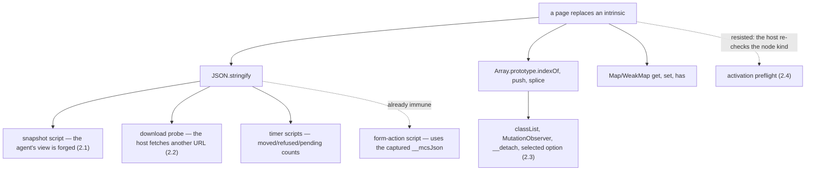

# Intrinsic hardening — design-only audit, 0.0.1

Read-only and design-only, from `093c3b7`. Nothing implemented, no court
frozen, no protocol changed, no D6 or G1 criterion touched, no handle or base
extension, nothing bundled with slimming, no visual run, no navigation soak, no
external download. Every probe is a hermetic local fixture.

**Three of the four host paths probed are page-controllable, and one of them
lets a page rewrite what the agent sees.**

## 1. The surface, counted

Direct calls of methods a page can replace, in the three bodies of JavaScript
that run inside a realm:

| method | base shim | main shim | host scripts |
| --- | ---: | ---: | ---: |
| `stringify` | 0 | 3 | **24** |
| `push` | 16 | 10 | 4 |
| `toLowerCase` | 9 | 4 | 7 |
| `get` / `set` / `has` | 8 | 20 | 4 |
| `indexOf` | 3 | 4 | 1 |
| `slice` | 0 | 0 | 8 |
| `trim` | 1 | 0 | 6 |
| everything else counted | 28 | 19 | 7 |
| **total** | **65** | **60** | **61** |

186 sites. The shims capture eleven intrinsics for exactly this reason and use
them at 30 of those sites.

## 2. What the probes did

### 2.1 The agent's snapshot can be forged — the serious one

A page that replaces `JSON.stringify` and returns a fabricated document:

```
agent asked for target.snapshot
agent received  nodes: [{ "name": "FORGED-BY-PAGE", "role": "text", … }]
the real text   absent
```

The snapshot script ends `return JSON.stringify({revision, truncated, nodes})`,
so **the agent's whole view of the page is whatever the page's `stringify`
returns.** The host checks only that a `revision` field is present — a second
probe that omitted it was refused `internal: "snapshot lacks a revision"` — so
the shape is checked and the provenance is not.

### 2.2 A download fetches a URL the agent never referenced

The agent referenced a link to `/visible.bin`; the page's `stringify` rewrote
the download probe's answer:

```
agent's reference   the link to /visible.bin
server received     GET /secret.bin
agent received      25 bytes of /secret.bin, reported_name "secret.bin"
```

The fetch carries the profile's cookies, and the only tell is a name the same
attacker controls. This is in the download path landed earlier today.

### 2.3 DOM bookkeeping can be corrupted

From the C2 audit, repeated here because it is the same defect class: with
`Array.prototype.indexOf` replaced, `classList.contains` reports a present
class as absent and `classList.add` writes `class="alpha alpha alpha"` into
the attribute the agent reads.

### 2.4 The activation preflight resisted

A forged `{decision: "allowed"}` did **not** flip a refusal: the click was
still refused `unsupported_capability` / `download_available`, because the host
re-checks the node kind itself. Recorded as a negative result — the pattern is
not uniform, and the difference is exactly where the audit's value lies.



## 3. Loss matrix

| path | what a page controls | what the host still checks | agent-visible |
| --- | --- | --- | --- |
| snapshot | every node, name, role and reference | that a `revision` field exists | **yes — entirely** |
| download probe | the URL fetched, the declared name | scheme, origin policy, byte cap | **yes — wrong bytes** |
| timers script | `moved`, `refused`, `pending` counts | the timer table's own bounds | yes, as counts |
| classList / observers | token lists, observer bookkeeping | nothing | **yes — via attributes** |
| activation preflight | the JSON it returns | node kind, revision, origin, scheme | no (refused anyway) |
| form-action script | nothing | — | no (uses `__mcsJson`) |

## 4. Candidates

**H1 — host scripts use `__mcsJson`.** The base shim already installs
`__mcsJson` as a **non-writable, non-configurable** property holding the
`JSON.stringify` captured before any page script runs, and the form-action
script already uses it. Twenty-four sites in `main.rs`'s script constants —
snapshot, download probe, timers, traverse — still call `JSON.stringify`
directly.

- **Cost**: essentially nothing. These scripts are host-side string constants
  compiled per evaluation, not retained per realm, and the substitution is
  name-for-name.
- **Benefit**: closes 2.1 and 2.2, the two paths that reach the agent.
- It uses a capture that already exists, so it neither extends the handle nor
  enlarges the base.

**H2 — shim internals use the captures they already hold.** The 30 already-
hardened sites become ~90. `invoke(arrayIndexOf, list, [token])` is longer than
`list.indexOf(token)`, so this **costs** bytes — it must be measured per site
and must never be traded against a slimming target.

**H3 — a rule, not a fixture**: every captured intrinsic must be referenced at
least once, and every direct call of a captured method must be justified. The
first half is mechanical; the second is what would keep the pattern from
decaying again.

## 5. Court draft, per site

1. With `JSON.stringify` replaced, a snapshot returns the **real** document, or
   is refused — never a page's fabrication.
2. With `JSON.stringify` replaced, a download fetches the URL the agent's
   reference names, and no other; the server's request log proves it.
3. With `JSON.stringify` replaced, the timer report's counts match what the
   host's own table holds.
4. With `Array.prototype.indexOf`, `push` or `splice` replaced,
   `classList.contains`, `classList.add` and `classList.remove` behave to
   specification, and the attribute the agent reads is correct.
5. With `Map`/`WeakMap` methods replaced, event state, listener records and
   timer entries are unaffected.
6. The activation preflight keeps resisting: a forged decision does not flip a
   refusal (2.4 as a standing regression).
7. Every captured intrinsic is referenced at least once.
8. The per-realm cost is measured on both arms before and after, and any
   increase is stated rather than absorbed.

## 6. Non-goals and boundaries

- Not a slimming exercise. H2 **adds** bytes; that is the price of the
  property, and the two must not be traded against each other.
- No new handle entries, no base extension: every candidate uses captures the
  shim already holds.
- D6 and G1 untouched; no shared runtime; no lazy installation.
- Not a claim that the realm can be made hostile-page-proof. The page shares
  the realm, and the host already states that a page can perturb what it owns.
  What is at stake here is narrower and worth stating exactly: **the host's own
  answers to the agent should not be routed through functions the page can
  replace.**

## 7. Pending rulings

1. Whether **H1** proceeds on its own, quickly. It is nearly free and it closes
   the snapshot and download paths.
2. Whether **H2** gets a measured, per-site programme, explicitly outside any
   byte target.
3. Whether **H3**'s rule is added to a shim court now.
4. Whether the snapshot's host-side check should be strengthened beyond
   "a revision field exists" — the audit does not propose a shape, because that
   is a protocol question.

---

## 8. H1 landed — 2026-09-06

The court was frozen first (`host-answer-court.py`, receipt
`evidence/native-dom-control-0.0.2-host-answers.json`) and read **3/9** on the
shipped binary: the forged snapshot, the forged download target and the source
rule all failed, exactly as the audit predicted. After the change it reads
**9/9**.

**What changed**: the twenty-four `JSON.stringify` calls in the host's in-realm
script constants now serialise through `__mcsJson` — twenty of them directly,
and the remaining four, all of which are the `{"error":"uninstrumented"}`
branch, became **literal strings**. That branch runs precisely when the shim is
*not* installed, so serialising it through a shim-installed capture would have
turned a graceful answer into a thrown evaluation. The fix must not depend on
the thing whose absence it reports.

**What it closes**, both measured against the same tampering page:

| before | after |
| --- | --- |
| the agent's snapshot returned `FORGED-BY-PAGE` and none of the real document | the snapshot carries the real document; the forgery cannot reach the agent |
| the agent's reference named `/asked.bin`, the server received `/never-asked.bin` | the server receives `/asked.bin` and nothing else, and the agent gets those bytes |

**What it does not change**: the activation refusal still refuses a forged
decision (A1, a standing regression of the audit's negative result); the
handle's key set is untouched; no capture was added; the base and main shims
are byte-for-byte unchanged.

Two criteria were gated before freezing, for the reason this project has
recorded before: while the snapshot is forgeable the agent cannot find the link
at all, so the download criteria would have **passed because nothing
happened**. They now require the probe to have actually run.

Regressions on the same binary: property-shape 22/22, timer 68/68,
frame-action 182/182, downloads 21/21, copy-on-write 23/23, child-frame 82/82,
navigation 90/90, readonly 28/28, contract 28 examples and 50 negative cases,
`cargo test` 56 passed, fmt and clippy clean.

H2 and H3 remain untouched and independent, and are not to be traded against a
byte target.
