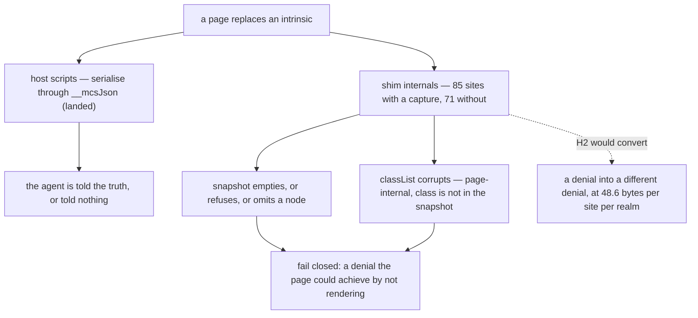

# H2 and H3 — design-only audit, 0.0.1

Read-only and design-only, from `4b7d42c` (H1 landed). Nothing implemented, no
court frozen, no handle, base or bound changed, no visual run, no navigation
soak, no external download. Every probe is a hermetic local fixture.

**Recommendation: H3 yes, H2 no — on evidence, not on cost.** After H1, the
remaining monkeypatches make a page *invisible* to the agent; they do not make
it *lie* to the agent. Paying 48.6 bytes per site per realm to convert one
denial into another is not a trade this audit can justify.

## 1. The surface, split by whether a capture even exists

| method | capture | base | main | host scripts |
| --- | --- | ---: | ---: | ---: |
| `push` | `arrayPush` | 16 | 10 | 4 |
| `get` | `mapGet` / `weakMapGet` | 2 | 9 | 2 |
| `set` | `mapSet` / `weakMapSet` | 3 | 8 | 1 |
| `indexOf` | `arrayIndexOf` | 3 | 4 | 1 |
| `slice` | `arraySlice` | 0 | 0 | 8 |
| `has` | `mapHas` | 3 | 3 | 1 |
| `splice` | `arraySplice` | 4 | 0 | 0 |
| `stringify` | `jsonStringify` | 0 | 3 | 0 |
| **with a capture** | | **31** | **37** | **17** |

| method | base | main | host scripts |
| --- | ---: | ---: | ---: |
| `toLowerCase` | 9 | 4 | **7** |
| `includes` | 7 | 0 | 0 |
| `map` / `filter` / `concat` | 10 | 4 | 3 |
| `split` / `trim` / `join` | 4 | 2 | 7 |
| `keys` / `entries` / `parse` / others | 3 | 9 | 2 |
| **with no capture at all** | **33** | **19** | **19** |

**H2 as scoped can reach 85 of 156 sites.** The other 71 have no capture to
route through, and creating one would grow the base — which this round forbids.
`toLowerCase` is the largest single gap at 20 sites, seven of them in the host's
own decision scripts, including the download probe's `tagName.toLowerCase() !==
"a"`.

## 2. H3: is every capture used?

| capture | references | | capture | references |
| --- | ---: | --- | --- | ---: |
| `weakMapGet` | 7 | | `arraySplice` | 1 |
| `arrayPush` | 7 | | `arraySlice` | 1 |
| `mapGet` | 3 | | `mapSet` | 1 |
| `weakMapSet` | 2 | | `reflectApply` | 1 |
| `mapHas` | 1 | | `jsonStringify` | 1 |
| **`arrayIndexOf`** | **0** | | | |

One dead capture, already ruled a permanent HOLD for deletion because it
records an intent. H3's rule — *every capture is referenced at least once* — is
one line of court and would have surfaced it without anyone hunting.

## 3. What the remaining patches actually do, post-H1

Each row is a page that replaces one intrinsic and then does nothing else:

| page replaces | the agent's snapshot | download of a link | download of a non-link |
| --- | --- | --- | --- |
| *nothing* | 4 nodes, 3 texts | correct bytes | refused `not_a_link` |
| `String.prototype.toLowerCase` | **0 nodes** | unreachable | unreachable |
| `Array.prototype.push` | **refused `internal`** | unreachable | unreachable |
| `Map.prototype.get` | 4 nodes, **the link absent** | unreachable | unreachable |
| `Array.prototype.indexOf` | 4 nodes, **the div and its text absent** | correct bytes | refused `not_a_link` |
| `Array.prototype.splice` | 4 nodes, 3 texts | correct bytes | refused `not_a_link` |

**Every outcome is a denial.** The page can empty its own snapshot, provoke a
typed refusal, or hide one node — all of which a page can already achieve by
not rendering the content in the first place. None of them makes the host tell
the agent something untrue. That is precisely the property H1 restored, and it
holds under every patch probed here.

The `classList` corruption from the C2 audit persists, and its reach is now
measurable: `class` is **not** part of the snapshot, so the damage is confined
to the page's own behaviour — which the agent then reads as ordinary page
state, exactly as it would read a page whose author wrote the same bug.

## 4. What H2 would cost

Measured by adding 100 sites of each form to the real base shim:

| form | per site, per realm |
| --- | ---: |
| `list.indexOf(x)` | 427.2 |
| `invoke(arrayIndexOf, list, [x])` | 475.8 |
| **the routing itself** | **48.6** |

| where | sites | cost |
| --- | ---: | --- |
| base shim | 31 | **~1,507 bytes in every realm**, child frames included |
| main shim | 37 | ~1,798 bytes in every main realm |
| host scripts | 17 | ~0 at rest — compiled per call, like H1 |
| a main realm, total | | **~3,305**, and ~26 KB across eight targets |

## 5. Owners, invariants, dependencies, safe failures, non-goals

- **Owner**: the shim's own bookkeeping — observers, child node lists, event
  state, timer entries. The host's answers are no longer in this set; H1 moved
  them out.
- **Invariant at stake**: not "a page cannot perturb the realm it shares" — the
  host has never claimed that — but "the host does not report a page's
  perturbation as its own answer". H1 secured it; §3 shows H2 is not needed to
  keep it.
- **Dependency that would bind H2**: `shim-footprint-court.py` freezes M1 and
  M2 floors (245,760 and 1,720,320) as *standing floors, not budgets*. Base-side
  H2 adds ~1,507 bytes to every child realm, so it must be measured against
  those frozen floors **before** any implementation. They may not move.
- **Safe failures**: unchanged. Every patched path already ends in a typed
  refusal or an empty result; nothing here fails open.
- **Non-goals**: new captures (they grow the base); the 71 uncapturable sites;
  any trade against a slimming target; touching D6, G1, the handle key set, or
  the snapshot's shape validation, which stays a protocol question.

## 6. Loss matrix

| if H2 is taken | if H2 is not taken |
| --- | --- |
| ~1,507 bytes per realm and ~1,798 per main realm, permanently | those bytes stay available |
| 85 of 156 sites hardened; 71 remain by construction | the same 71 remain, and the 85 keep failing closed |
| M1/M2 floors must be re-measured against frozen values | floors untouched |
| a denial becomes a different denial | the denial is unchanged |
| the pattern becomes consistent, which is worth something for review | the pattern stays a third applied, and H3 makes that visible |

## 7. Pending rulings

1. **H3**: adopt the rule — every captured intrinsic is referenced at least
   once — as a criterion in a shim court. Cheap, mechanical, and it is what
   surfaced `arrayIndexOf`.
2. **H2**: recommended **not** to proceed. If it is taken anyway, it should be
   scoped to sites that feed a host decision rather than page bookkeeping, and
   measured against the frozen M1/M2 floors first.
3. The 71 uncapturable sites, `toLowerCase` above all: they need either new
   captures (base growth, forbidden this round) or host-side re-checking of the
   kind that already made the activation path resist. Worth its own round.
4. Whether the snapshot's shape validation is strengthened — unchanged from the
   previous audit, still a protocol question, still not proposed here.
