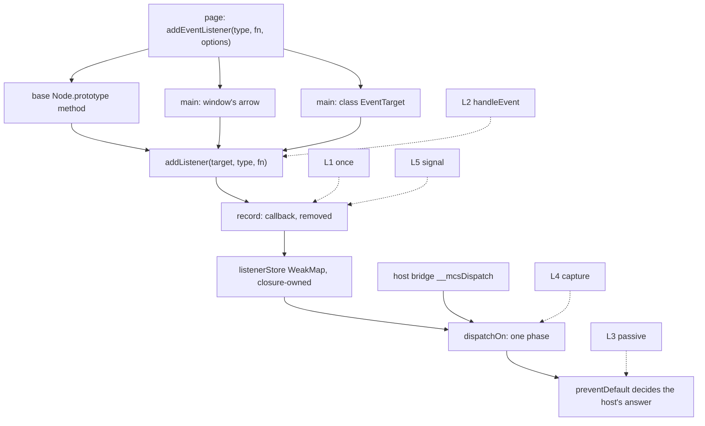

# Listener options, `handleEvent` and `AbortController` — read-only audit, 0.0.1

Design-only. Nothing implemented, no implementation court frozen, the handle
does not widen, no cap or floor proposed, no navigation or visual path run.
Three throwaway builds carried a cost ladder and went away with their
worktree. The window divergence, C2b, and the attribute-name and selector
losses all stay exactly as they are.

## 1. What a page gets today

Measured on the shipped `6177450e0cc0…`:

| the page writes | what happens | the standard |
| --- | --- | --- |
| `{once: true}` | **ignored** — the listener ran twice | runs once |
| `{once: true}` under the **agent's** clicks | ignored — two `target.act` clicks ran it twice | runs once |
| `{capture: true}` ordering | **no capture phase**: child then parent | parent then child |
| `removeEventListener(t, f, false)` after `add(t, f, true)` | **removes it** — the listener never ran again | does not remove: capture is part of identity |
| `add(t, f, true)` and `add(t, f, false)` | **one registration** | two |
| `{passive: true}` then `preventDefault()` | **cancels**: dispatch returned `false`, `defaultPrevented` true | cannot cancel |
| `{signal}` | ignored; an arbitrary object is accepted silently | removes on abort |
| `new AbortController()` | **`ReferenceError`** | exists |
| `addEventListener(t, {handleEvent})` | **silently dropped at registration** — never called, and removing it does not throw | called |
| `eventPhase` | 2 then 3 | 2 then 3 |

Two of these are worse than "unimplemented". The `capture` row removes a
listener the standard says it must not, so a page that uses capture correctly
loses a working handler. And the `handleEvent` object fails **silently at
registration** — `typeof fn !== "function"` returns early — so nothing ever
runs and nothing ever says why. `CAPTURING_PHASE` is not even a constant in
the base: the one-phase model goes all the way down.

## 2. Where the options are lost

Not in the store, which is the surprise: `addListener` never receives them.
Three call sites forward exactly two arguments, and each would have to change
for any option to arrive at all.

```
  page: addEventListener(type, fn, options)
            |
            |  the third argument is dropped here, three times over
            v
  +--------------------------+  +---------------------------+  +-------------------------+
  | base Node.prototype      |  | main window g.addEvent…   |  | main class EventTarget  |
  | addEventListener(t, fn)  |  | (type, fn) => …           |  | addEventListener(t, fn) |
  +--------------------------+  +---------------------------+  +-------------------------+
            |                              |                              |
            +--------------+---------------+------------------------------+
                           v
                 addListener(target, type, fn)      <- base, closure-owned
                           |
                 record { callback, removed }       <- no once, no capture,
                           |                           no passive, no signal
                 listenerStore: WeakMap by target
                           |
                 dispatchOn(target, event)          <- one phase: target, then
                           |                           ancestors, then window
                 host bridge __mcsDispatch ---------+   (bubbling only)
```



## 3. Five candidates, and one prerequisite

**L0 — forward the third argument.** Three one-line changes, worth nothing on
its own and required by all five. It is not a candidate; it is the price of
entry, and it is why "just add `once`" is not a one-line change.

- **L1 `once`** — a flag on the record; the dispatcher removes the record
  after it runs. Touches the record and the invoke site.
- **L2 `handleEvent`** — accept an object whose `handleEvent` is callable,
  keep the object as the identity and the method as the handler. Registration
  only; nothing about dispatch changes except the receiver.
- **L3 `passive`** — a flag consulted by `preventDefault`. This one **reduces**
  what a page can do: today a passive listener cancels, and the host reads
  `defaultPrevented` to decide whether a navigation proceeds.
- **L4 `capture`** — the expensive one. Capture becomes part of listener
  identity (fixing the wrong removal in §1) and the single walk becomes three
  segments: root-down for capture, the target for both, then bubbling. It also
  needs the `CAPTURING_PHASE` constant the base does not have.
- **L5 `signal` / `AbortController`** — `AbortController` and `AbortSignal` in
  the main extension, a signal held on the record, and a check when the
  listener would run.

## 4. What they cost, measured

A cumulative ladder, each built on the last, against the shipped binary, with
`child-frame-court` on both allocators. Marginal deltas are per child; the
totals are what the host would carry.

| build | M1 | marginal Δ/child | M2 | total Δ/child |
| --- | --- | --- | --- | --- |
| shipped | 225,626 | — | 1,577,884 | — |
| **O1** = L0+L1+L2+L3 | 227,018 | **+1,392** | 1,587,628 | +1,392 |
| **O2** = O1+L4 (capture) | 228,682 | **+1,664** | 1,599,276 | +3,056 |
| **O3** = O2+L5 (signal) | 230,058 | **+1,376** | 1,608,908 | **+4,432** |

M2 tracks seven times M1 at every rung, so nothing here is super-linear. At the
top of the ladder the floors are still clear — 245,760 and 1,720,320 — but the
**M1 headroom falls from 20,134 to 15,702**, and main-only slack rises from
42,928 to 49,760 inside 65,536. Every existing court passes at every rung:
`event-fidelity` 62/62, `event-view` 11/11, `event-target` 24/24, `form`
179/179, `frame-actions` 182/182, `page-navigation` 80/80, `child-frames`
82/82, `shim-footprint` 18/18.

Behaviour at the top of the ladder, measured: `once` runs once — including
under two `target.act` clicks; capture ordering is parent then child; capture
is part of identity, so the wrong removal is gone; a passive listener cannot
cancel; `AbortController` exists, `abort()` stops later delivery, and a signal
already aborted registers nothing.

## 5. Authority, and the one thing I would not ship as measured

- **`passive` moves power away from the page**, which is the right direction:
  today a passive listener can cancel, and the host's navigation decision reads
  that same flag.
- **`capture` lets a page see the host's own synthesized event earlier** —
  before the target's own listener — and stop it there. It gains no new
  authority over the host's answer, which is still `defaultPrevented` read
  through the bridge, but the ordering change is real and should be ruled on
  rather than discovered.
- **`signal` puts a page object inside the host's dispatch loop.** In the
  measured candidate the record holds whatever the page passed and the walk
  reads `signal.aborted` while dispatching: a page-made `{aborted: false}`
  works as a signal, measured. That is fine until the page passes
  `{get aborted() { … }}`, at which point **page code runs inside the host's
  walk**, in the middle of a snapshot, exactly where this host has spent
  several slices making sure only its own code runs. If L5 is taken, the
  design should brand real signals — a closure-owned `WeakSet` of signals the
  host itself minted — and read a boolean the host owns, not a property of a
  page object. This audit measured the naive version; it does not recommend
  it.

## 6. Loss matrix after each rung

| the page expects | today | O1 | O2 | O3 |
| --- | --- | --- | --- | --- |
| `once` | no | **yes** | yes | yes |
| `handleEvent` objects | no, silently | **yes** | yes | yes |
| `passive` cannot cancel | no | **yes** | yes | yes |
| capture ordering | no | no | **yes** | yes |
| capture in listener identity | no, and it wrongly removes | no | **yes** | yes |
| `AbortController` | no | no | no | **yes** |
| abort fires an `abort` event on the signal | no | no | no | **no** — the candidate only stops delivery |
| `signal` branded to the host | — | — | — | **no** in the measured candidate; §5 says it should be |
| `stopPropagation` in the capture phase halting the rest | n/a | n/a | yes | yes |
| `once` + `capture` interaction | n/a | n/a | yes | yes |

## 7. Dependencies

- **Every rung is base work**, so every rung is paid by every child realm,
  and no child can use any of it: children run no scripts. This is the same
  divergence the error-class slice recorded, and it is why the ladder is
  priced per child rather than per page.
- **The handle does not widen** for any rung: `addListener`, `removeListener`
  and `dispatchOn` are already handed over, and only their signatures change.
- **The host bridge is unaffected in shape**: `__mcsDispatch` still mints the
  event and reads `defaultPrevented`. `once` and `passive` change what the
  answer is in specific cases, and the frozen `event-fidelity` court passed at
  every rung.
- **`AbortController` is main-only** in the candidate; only the record's
  signal check is base work.
- The window's three methods and the `EventTarget` class must forward options
  too, or `window.addEventListener(t, f, {once:true})` stays broken while a
  node's works — measured: it is broken today.

## 8. Pending rulings

1. **Which rungs, and in what order.** L1 and L2 are the cheapest and fix the
   two silent failures; L3 is small and reduces page power; L4 is the largest
   single step and also the only one that fixes a *wrong* behaviour rather
   than a missing one; L5 is the one with an authority question attached.
2. **The headroom.** The full ladder leaves 15,702 bytes of M1 headroom against
   the frozen floor. That is a policy call, not a technical one: nothing here
   moves a floor, and the slice should stop where the ruling says.
3. **`signal` branding** (§5) before any L5 implementation: a host-minted
   `AbortSignal` recognised through a closure-owned `WeakSet`, rather than
   reading a property off a page object during dispatch.
4. **Whether `abort` should fire its own event on the signal**, or stopping
   delivery is enough for this host.
5. **What an implementation court must falsify**, per rung: the §1 table
   inverted, the wrong removal gone, the passive listener unable to cancel, the
   agent's two clicks running a `once` listener once, `window` and
   `EventTarget` honouring options like a node, and the M1/M2 floors measured
   on the same binary.


## 9. Ruled — the first rung only

L0, L1 and L2 are taken: forward the options at all three call sites, honour
`once`, and accept an object with `handleEvent`. The two silent failures are
what this rung is for.

`once` removes the registration after the listener has run once, on an
ordinary page dispatch and on the host's own, so an agent that clicks twice
runs a `once` handler once.

`handleEvent` is resolved **at registration**: the record keeps the object as
the listener's identity and the method as the handler, so the host never reads
a property off a page object while it is dispatching. That is deliberate and
it is a divergence worth writing down — the standard re-reads `handleEvent` on
every call, and this host will not, because reading it mid-walk would run page
code inside the host's own snapshot. A page that swaps the method after
registering keeps the handler it registered.

Deferred, each for its own reason, and none of it implemented here:

- **L4 `capture`** needs an ordering and authority design of its own: it would
  let a page see and stop the host's synthesized event before the target does.
- **L3 `passive`** waits with it, because today a passive listener can cancel
  and the host reads that same flag — a fix that changes what a navigation
  decision sees deserves its own ruling.
- **L5 `signal`** waits for a closure-branded host signal. The naive version
  measured in §5 is refused: no page object is to be read inside the dispatch
  loop.

The implementation court is frozen before the code and covers ordinary and
host-driven dispatch, removal identity, re-adding after `once` has fired, a
listener that throws, `window` and `EventTarget` honouring the options like a
node, and owner cleanup. The M1 and M2 floors and the main-only slack are
measured by the child-frame and shim-footprint courts on the same binary, and
a failure there stops the rung.
