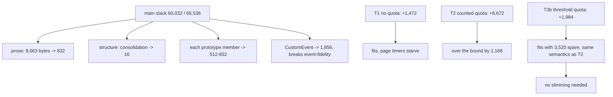

# Reclaiming main-extension slack — read-only audit, 0.0.1

Design-only. Nothing implemented, no court frozen, the handle does not widen,
no cap or floor proposed or moved, no navigation, visual or surface path run.
Several throwaway builds carried the candidates and went away with their
worktree. The three frozen guards hold throughout: `AbortSignal.timeout` stays
absent in the tree, the handle's exact key set is untouched, and no host path
aborts a page's signal.

The brief was to find at least **1,168 bytes** of main-only slack so the
quota-bearing `timeout()` could fit. The measurements answer that question —
and then make it unnecessary, which is the more useful result.

## 1. What main-only slack is actually made of

Measured against the shipped `536ad23ed12a…` at 60,032 of 65,536:

| change | slack after | reclaimed | capability cost |
| --- | --- | --- | --- |
| **every full-line comment removed** — 8,063 bytes of prose, a third of the file | 59,200 | **832** | none, readability only |
| three accessors consolidated into one table and loop | 60,016 | **16** | none |
| **both together** | 59,184 | **848** | none |
| ten trivial prototype members **added** | 68,352 | −8,320 | — |
| three trivial prototype members **added** | 61,568 | −1,536 | — |
| `CustomEvent` removed | 58,176 | **1,856** | `event-fidelity` falls to 60 of 62 |

The shape of it: **prose is nearly free and structure is nearly free; runtime
members are the whole cost.** Eight thousand bytes of comments are worth 832,
one allocation block — while a single prototype member costs between 512 and
832 on its own. Consolidating descriptors saved 16 bytes, which is to say
nothing.

So the only capability-free reclaim available is **848 bytes**, and the target
was 1,168. **Short by 320.** Everything past that costs a page-visible
capability and breaks a frozen court, which is a ruling, not an optimisation.

By that measurement alone the answer to the brief is: no reliable
capability-free path, so R6 stays deferred.

## 2. Except the premise was wrong, and that is the finding

The 1,168-byte gap came from **T2**, the quota shape measured in
`abort-signal-timeout-audit-0.0.1.md`: a `{count, limit}` object, a counter
incremented on schedule and decremented in the callback. It cost 6,672 bytes
of slack over the plain version and landed at 66,704, past the bound.

That was one implementation of the quota, not the quota itself. **T3 does the
same job with no new state at all**: `timeout()` reads the timer table the
page already has and refuses when it is fuller than the reserve.

```js
if (timers.pending.size >= THRESHOLD) throw new RangeError("too many timeout signals");
```

| | slack | left of 65,536 | signals accepted | `setTimeout` left afterwards |
| --- | --- | --- | --- | --- |
| shipped | 60,032 | 5,504 | — | — |
| T1, no quota | 61,504 | 4,032 | 62 | **0 — starvation** |
| T2, counter and limit object | **66,704** | **−1,168** | 14 | 48 |
| **T3, threshold 48** | **62,016** | **3,520** | 46 | 16 |
| **T3b, threshold 16** | **62,016** | **3,520** | 14 | **48** |

**T3b is T2's exact semantics — fourteen signals, forty-eight timer slots kept
for the page — at 4,688 bytes less, and it fits with 3,520 to spare.**
`shim-footprint` is 18 of 18 and `child-frames` 82 of 82 on it; M1 and M2 do
not move, so no child pays for any of this.

The threshold is a single constant: reserving *n* slots for the page means
refusing signals once the table holds 64 − n. Both values were built and
measured; the choice is a ruling, not a cost.

## 2.1 Why T2 cost so much

Not stated as fact, because it was not isolated: the difference between T2 and
T3b is a small object and a closure that captures it, and this host prices
runtime structure in blocks — the same effect that makes ten prototype members
cost 8,320 and eight thousand bytes of prose cost 832. The lesson worth
keeping is procedural: **a shape's cost is not its source size**, so a design
that misses a bound should be re-shaped and re-measured before anything is
given up for it.

## 3. The tree

```
   main extension, 60,032 of 65,536 slack
        |
        +-- prose ................ 8,063 source bytes  ->    832 slack
        +-- descriptor structure .. 3 accessors merged  ->     16 slack
        +-- a prototype member ...................... 512-832 slack EACH
        +-- CustomEvent ............................... 1,856 slack, breaks a court
        |
   what R6 needs
        |
        +-- T1  no quota ....... +1,472  fits, starves the page's timers
        +-- T2  counted quota .. +6,672  correct, 1,168 over the bound
        +-- T3b threshold quota  +1,984  correct, 3,520 under the bound
```



## 4. Loss matrix for the slimming candidates

| candidate | reclaims | what is lost | verdict |
| --- | --- | --- | --- |
| strip main comments | 832 | the reasoning stays only in the audits and courts | available, and cheap, but it buys 832 |
| consolidate descriptors | 16 | nothing | not worth a commit on its own |
| remove `CustomEvent` | 1,856 | a page-visible constructor; `event-fidelity` 60 of 62 | a capability ruling, not slimming |
| remove one moved member | ~512–832 each | whatever that member does, and its court | same |
| move a member to the base | negative | every child pays for what no child can use | refused by the standing divergence |
| **re-shape the quota (T3b)** | **n/a — spends 4,688 less** | nothing | **the one that solves the brief** |

## 5. Pending rulings

1. **Take T3b for R6** — the quota semantics already accepted, at 62,016 with
   3,520 of slack left, no child cost, and both bounds intact. The `timeout`
   court guard would be amended by that ruling rather than bypassed.
2. **The reserve constant**: 48 slots kept for the page (threshold 16, as T3b),
   or another split. Both measured shapes cost the same.
3. **Whether to strip the main comments anyway**, for 832 bytes of headroom
   this batch does not need. My recommendation is no: the reasoning in that
   file is the only place some invariants are stated near the code, and 832
   bytes is not worth trading for it while the bound has room.
4. **Nothing else here is proposed.** Removing `CustomEvent` or a moved member
   is a capability decision that should be argued on its own merits, not
   funded by a timer.
