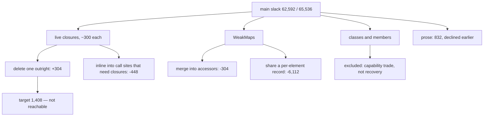

# Architecture-level main-slack recovery — read-only audit, 0.0.1

Design-only. Nothing implemented, no court frozen, the handle does not widen,
no cap or floor moved, no navigation, visual or surface path run. Throwaway
builds carried every candidate and went away with their worktree. No capability
was removed, no `CustomEvent` or member deleted, no authority, loss or guard
changed — those were excluded from the brief and stayed excluded.

**The answer is HOLD.** The target was 1,408 bytes; the best measured recovery
is **304**, and nothing compounds.

## 1. What main slack is made of

The main extension holds, at the time of this audit: four `WeakMap`s
(`datasets`, `classLists`, `signalReason`, `signalHandler`), seven small
helper closures (`tokenError`, `checkToken`, `tokensOf`, `writeTokens`,
`classListOf`, `kebab`, `quota`, plus `cloneOf`), five classes (`EventTarget`,
`AbortSignal`, `AbortController`, `CustomEvent_`, `Headers_`, `Response_`), the
ten moved C1 members, the page-facing `Event` view, and the host-facing
installs (`cookie`, `location`, `onload`, lifecycle, timers, the `__mcs*`
bridge).

The previous batch established that prose is nearly free and runtime members
are not. This audit sharpens it: **the unit of main slack is a live closure,
worth roughly 300 bytes**, and the design has no spare ones.

## 2. Five candidates, all built and measured

Against the shipped `4a518db` line at 62,592 of the 65,536 bound. Positive
means reclaimed.

| candidate | what it does | slack | reclaimed |
| --- | --- | --- | --- |
| **C5** remove the `quota` helper, call `tokenError` directly | one closure fewer, no new one | 62,288 | **+304** |
| **C7** C5 plus `writeTokens` inlined at its three statement call sites | two closures fewer, code duplicated | 62,384 | +208 |
| **C2** `quota` delegates to `tokenError` instead of building its own error | keeps both closures | 62,544 | +48 |
| **C1** merge `signalReason` and `signalHandler` into one `WeakMap` | one map fewer, one accessor closure more | 62,896 | **−304** |
| **C4** `datasets` and `classLists` share one per-element record | two maps fewer, two accessor objects more | 68,704 | **−6,112** |
| (C6) C5 plus `kebab` inlined | one closure fewer, **three** new arrows at the call sites | 63,040 | −448 |

**Every indirection lost.** C1 and C4 replace storage with accessors and cost
more than the storage they remove; C6 replaces one closure with three. The two
that gained did so by deleting a closure outright and putting nothing in its
place — and even they do not add up: C7 removes strictly more than C5 and
reclaims *less*, because the block boundary sits between them.

## 3. The tree

```
   main slack, 62,592 of 65,536
        |
        +-- live closures ......... ~300 bytes each   <- the only real lever
        |     tokenError, checkToken, tokensOf,
        |     writeTokens, classListOf, kebab, quota, cloneOf
        |
        +-- WeakMaps .............. cheaper than the accessors that would
        |     datasets, classLists,     replace them (C1, C4 both lost)
        |     signalReason, signalHandler
        |
        +-- classes and members ... excluded by the brief; deleting one is a
        |     EventTarget, AbortSignal,   capability trade, not a recovery
        |     AbortController, CustomEvent
        |
        +-- prose ................. 8,063 source bytes worth 832, declined by
                                     an earlier ruling for readability
```



## 4. Loss matrix

What each candidate would cost if taken, beyond its bytes:

| candidate | invariant it touches | compatibility / capability | reentrancy or lifecycle | court falsifiability |
| --- | --- | --- | --- | --- |
| C5 (`quota` removed) | none — the same error object, name and message | none | none | trivially: the storage court's quota criteria already pin the thrown name |
| C7 (`writeTokens` inlined) | *"a call that changes nothing writes nothing"* now lives in three copies | none today | none | the classList court pins the behaviour, not the copies — **a future edit could fix one copy and miss two, and no criterion would notice** |
| C2 | none | none | none | same as C5 |
| C1 | the signal state's storage shape | none | none | the abort-signal courts pin behaviour, not storage |
| C4 | `element.classList` and `element.dataset` identity stability | **would risk it** — both currently promise the same object per element | none | the dataset and classList courts pin identity, so a mistake here fails loudly |

C7 is the one worth naming: it trades **review safety** for bytes, which is a
kind of cost the courts cannot catch, and it reclaims less than C5 alone.

## 5. Why the target is out of reach

- The best single-candidate recovery is **304**.
- The two that gain do not compose: taking both gives 208, less than one.
- The only larger lever measured anywhere is the prose strip at **832**, which
  an earlier ruling declined on readability grounds and which, even if taken
  with C5, reaches **1,136** — still short of 1,408.
- Everything else in the extension is a class, a member or a `WeakMap` whose
  removal is either a capability trade (excluded by the brief) or a net loss
  (C1, C4, measured).

And the 1,408 figure is itself a floor that should be re-measured, not
inherited: it came from `getElementsByClassName`'s lean shape against a fill of
62,016, and the fill is now 62,592. The true requirement is whatever that
method costs from the current fill, which is at least as large.

## 6. HOLD, and what would change it

No reliable recovery path exists at this architecture. `getElementsByClassName`
stays unimplemented and its frozen 36-criterion court stays as the gate.

Three things would change the answer, none of them proposed here and each its
own ruling:

1. **A capability trade** — deleting a class or a member, which the brief
   excluded and which the earlier triage priced (`CustomEvent`: 1,856, and it
   breaks `event-fidelity`).
2. **The prose strip at 832**, if a later ruling values the bytes over the
   reasoning sitting next to the code; it is still not enough alone.
3. **A different split** — moving page-only surface out of the main extension
   entirely, which is an architecture change with its own base, handle and
   child questions, and nothing in this audit suggests it would pay.

The useful residue is the rule, which is now measured twice over: **main slack
is closure count**, indirection costs more than it saves, and the way to spend
less is to write fewer live functions rather than fewer bytes.
