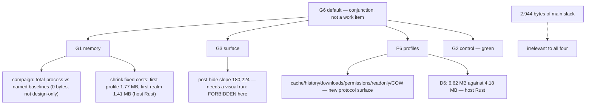

# G1, G3, P6, G6 — read-only triage, 0.0.1

Design-only. Nothing implemented, no court frozen, nothing pushed, no
navigation soak, no visual or surface path run. The five standing guards hold.
Measurements below are black-box reads of the shipped `420cdf5b82bf…` and of
receipts already on main.

**The finding that shapes everything else: none of the four open goals is
limited by main-extension slack.** The 2,944 bytes left in that budget are
irrelevant to all of them. Every remaining path is host-side Rust, a native
surface, a protocol capability, or a measurement campaign — so by the brief's
own filter (no base growth, no handle widening, no new main closure, no
authority or protocol change, ≤2,944 bytes) **there is no candidate to take**,
and the useful output is a map of what each goal actually needs.

## 1. Where the host's memory actually goes

Measured now, step by step, on the shipped binary:

| step | physical footprint | delta |
| --- | --- | --- |
| empty host | 196,680 | — |
| **+ first profile** | 1,966,416 | **+1,769,736** |
| + session | 1,966,416 | +0 |
| **+ first target (realm)** | 3,375,440 | **+1,409,024** |
| + second target | 3,703,120 | +327,680 |
| − both targets | 3,735,888 | +32,768 |
| − session | 3,735,888 | +0 |

Two fixed costs dominate: **the first profile at 1.77 MB and the first realm at
1.41 MB**. A *marginal* target is 0.33 MB, which is the number that matters for
the route's scaling story. Closing does not return the footprint, which is the
allocator-retention behaviour already recorded rather than a new leak.

## 2. G1 — memory

**Owner** the route as a whole. **Invariant** bounded and *materially* more
efficient than named same-machine baselines. **Evidence** deterministic
workloads reporting complete process-tree component, peak and post-close
values. **Safe failure** reject or narrow the route; attribution alone does not
pass. **Dependency** none technical; it needs a comparison campaign.
**Non-goal** proving efficiency by attribution or by per-realm caps.

```
   G1
    |
    +-- in hand: per-realm caps and floors (M1 232,298 / M2 1,624,588),
    |            retention and soak courts, marginal target 0.33 MB
    |
    +-- missing: total-process comparison against NAMED baselines on one
    |            machine, with peak and post-close, per the gate's wording
    |
    +-- pressure: first profile 1.77 MB + first realm 1.41 MB are the fixed
                 costs any comparison will be dominated by
```

**Candidates.** (a) An evidence-only campaign: run the existing courts and
baselines and publish the comparison — **zero bytes, no code**, but it is a
measurement run, not a design-only step, so it is out of this brief.
(b) Shrink the two fixed costs — host-side Rust, no main slack, and the only
lever that would change the verdict rather than document it. **Deferred**, with
§1 as the starting map.

## 3. G3 — surface

**Owner** the surface process. **Invariant** headed and headless are the same
target, realm, DOM, scroll and profile across show/hide. **Evidence** a
stateful page retained across cycles with a real window. **Safe failure**
repair ownership; never relabel a restart as switching. **Dependency** AppKit,
a child process, and a visual run. **Non-goal** proving it with a synthetic
buffer.

Current evidence, read from the committed receipts: `-surface-headless` is
17/17, and `-surface` is **106 of 110**, failing exactly the retention pair on
both allocators — post-hide host footprint over headless per round
`[278,528 · 425,984 · 458,752]` with a **slope of 180,224**, and the same shape
on the arena arm.

```
   G3
    +-- proven: headless refusal path, ownership mechanics, CDP continuity
    +-- open:   post-hide footprint grows per cycle (slope 180,224)
    +-- needs:  a visual run and AppKit teardown work — forbidden here
```

**Every G3 candidate is deferred by the brief itself**: nothing can be measured
further without running a visual court, and the standing rule forbids it
without an explicit, once-only, foreground authorisation. Nothing here asks for
one.

## 4. P6 — profiles

**Owner** the profile cabinet. **Invariant** identity isolated and durable,
single-writer, with budgets and diagnostics. **Evidence** named persistent and
ephemeral profiles proving separation and locks. **Safe failure** block
persistence or multi-client use. **Dependency** host storage and the protocol.
**Non-goal** synthetic values standing in for real credentials.

Done and on main: two persistent plus one ephemeral isolating storage, policy
and locks; the sealed keychain-enveloped store; an RFC 6265 subset jar;
`localStorage`; opt-in HTTPS with pinned roots; persistent Secure cookies
across restart.

Open, from the plan and the receipts: **cache, history, downloads, permission
prompts, readonly and copy-on-write profiles** — each a host capability with
its own protocol surface — and one measured gate, `-profile` at **92 of 94**,
where **D6** wants the live footprint below **4,178,196** and measures
**6,619,592**, a gap of 2.44 MB that §1 attributes to the first profile and the
first realm.

```
   P6
    +-- done:  isolation, locks, sealed store, jar, storage, HTTPS, restart
    +-- open:  cache · history · downloads · permissions · readonly · COW
    |            each needs a protocol capability -> deferred
    +-- open:  D6 footprint, 6.62 MB against a 4.18 MB target
                 -> host-side Rust, not main slack
```

**Candidates.** All deferred: the six capabilities each need a new protocol
surface, which the brief excludes; D6 needs host-side allocation work.

## 5. G6 — default

**Owner** the product. **Invariant** the route can represent MiniCon Surf.
**Evidence** G1 and G2 independently green plus the surface and profile gates.
**Safe failure** no default engine; keep the labs without weakening either
outcome. **Dependency** literally G1, G3 and P6. **Non-goal** declaring a
default on partial evidence.

G2 is green. G6 is therefore **not a work item at all** — it is the conjunction
that closes when the other three do, and nothing about it can be advanced
directly.

## 6. The map



## 7. Loss matrix — what each path costs if it is ever taken

| path | goal | main slack | base/child | handle | authority or protocol | visual | verdict here |
| --- | --- | --- | --- | --- | --- | --- | --- |
| comparison campaign | G1 | 0 | none | none | none | none | **deferred: it is a run, not a design** |
| shrink first-profile cost | G1, P6 | 0 | none | none | none | none | deferred: host Rust, measurable, no guard touched |
| shrink first-realm cost | G1 | 0 | none | none | none | none | deferred: touches realm construction, needs its own audit |
| AppKit teardown | G3 | 0 | none | none | none | **required** | deferred: the standing rule forbids it here |
| cache, history, downloads, permissions | P6 | 0 | none | none | **new operations** | none | deferred: closed enum, protocol ruling first |
| readonly / copy-on-write profiles | P6 | 0 | none | none | **new semantics** | none | deferred: needs a design of its own |
| anything in the main extension | — | ≤2,944 | — | — | — | — | **no candidate exists**: no open goal lives there |

## 8. Ordering, if the next ruling wants one

1. **Shrink the first-profile step (1.77 MB).** It is the largest single fixed
   cost, it serves G1 and P6's D6 at once, it is host-side with no guard, and
   §1 already localises it.
2. **Shrink the first-realm step (1.41 MB)**, second because it is deeper —
   QuickJS realm construction — and its own audit should precede any attempt.
3. **The G1 comparison campaign**, which is what the gate actually asks for and
   which needs no code; it should follow the two above so it measures the route
   as it will be, not as it was.
4. **P6's remaining capabilities**, each behind a protocol ruling, in whatever
   order the product wants; none is blocked by memory.
5. **G3**, last, and only with an explicit visual authorisation.

**Nothing in this triage is proposed for implementation now.** The honest
summary is that the page-surface work this batch has been doing is finished as
far as the open goals are concerned: they are not waiting on the shim.
