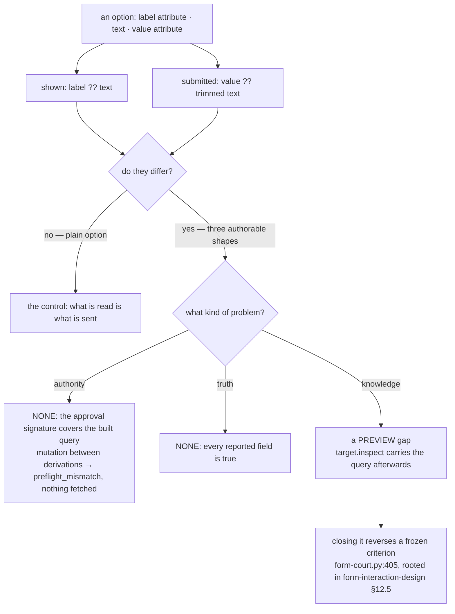

# An option's label, and the value that reaches the server

Design-only, read-only protocol audit of the one thing
`text-answer-court.py` names in its own `not_under_test`. Nothing was
implemented, no court was frozen, no handle, base or bound was altered, nothing
was mixed with intrinsic hardening or slimming, no historical receipt was
touched, no visual run, no soak, nothing downloaded. Receipt:
`evidence/native-dom-control-0.0.2-option-value.json`.

Eight select shapes, each driven through **both** act doors — a submit aimed at
the form and one aimed at its submitter — plus two arms that mutate the chosen
option between the snapshot and the act. Eighteen arms in all, on `2d57ce86`.

**Form values and built query strings are page data.** The server in this probe
records only which of twelve disjoint markers it saw, how many bytes the query
was, and whether a space or an emoji survived encoding. Nothing else about a
query is in the receipt or in this document.

## 1. The two sides

| what the agent sees | `snapshot_script` | `options[] = {index, label, selected, disabled}`, `selected`; `label` is `getAttribute("label") ?? textContent` |
| --- | --- | --- |
| what the host submits | `SERIALIZE_JS` | `o.getAttribute("value") ?? (o.textContent \|\| "").trim()` |

Two different expressions over three possible strings. Measured, with no patch
of any kind:

| the author writes | the agent is shown | the server receives |
| --- | --- | --- |
| `<option label="A">B</option>` | **A** | **B** |
| `<option label="A" value="V">B</option>` | **A** | **V** |
| `<option value="V">B</option>` | **B** | **V** |
| `<option>B</option>` | B | B |

The last row is the control and it matters: the gap is not universal. When an
author writes an ordinary option, what the agent reads is exactly what goes on
the wire. The gap opens only when the author separates the two, which HTML
invites them to do.

## 2. It is not an oversight. It is a ruled invariant

`form-court.py:405` carries a frozen criterion in as many words:

> *the snapshot reports no option value* — `all("value" not in o for o in options)`

and its helper is named for the same intent: *"What a check may say about
options: their shape, never their text."* The rule behind it is
`form-interaction-design-0.0.1.md` §12.5:

> *"A form value, an option value and a built query string are page data. They
> may not appear in the audit ledger, the court-only log, an error's details, a
> receipt, or any diagnostic."*

So the snapshot's silence about option values is a decision that was made,
frozen and is still enforced. **Any candidate that exposes the value is a
request to reverse it**, not a bug fix — which is the single most important
thing this audit has to say.

## 3. It is a preview gap, not an information gap

The same §12.5 continues, and the distinction is the whole answer:

> *"`target.inspect` may still report the committed URL, query included, because
> that is the browser state an Agent must be able to read."*

Measured: after the submit, `target.inspect` carries the committed URL with its
query, so the agent can read the submitted option text and the typed textbox
value. It cannot read the option's *label* there, because the label never goes
on the wire.

**The agent can already learn exactly what it sent — afterwards.** What it
cannot do is see what it is *about* to send. The gap is one of timing, and
naming it correctly changes what is worth doing about it.

## 4. Authority is bound even though the answer is silent

A form's approval signature includes `navigation.href`, and for a form that
href is the declared action **plus the built query**. So the bytes that will be
submitted are inside what the preflight approved.

Measured on two arms: a page whose `focus` handler rewrites the selected
option's `value` between the two derivations gets
`unsupported_capability/preflight_mismatch`, and **the server sees nothing**.
Both doors behave identically on every shape.

So an agent's approval binds the exact payload even though the agent cannot
read it. This is not a fail-open, and it is not a wrong answer: everything the
snapshot says about an option is true. It is an **information gap with a
timing bound**, and the authority question is already closed.

## 5. The other shapes, each measured

- **Duplicate labels.** Two options labelled identically, carrying different
  values. The agent cannot tell them apart from the answer at all — and the
  `index` it acts on is the host's own, so choosing index 0 submitted index 0's
  value. **Index is the discriminator, and it works**; the label is not
  load-bearing for identity.
- **A disabled option.** Reported `disabled: true`, and asking for it is refused
  `unsupported_capability/option_disabled`. Honestly reported and enforced.
- **A pre-selected option.** Reported truthfully as `selected` on the option and
  in the select's `selected` index. Worth noting: a form submitted with no act
  at all sends the pre-selected option's value, which the agent has never seen —
  the same gap, arrived at without the agent choosing anything.
- **Whitespace and Unicode.** A label of `"  X😀  "` is shown **trimmed** —
  `X😀` — because the snapshot trims a label; the value of `"  Y😀  "` reached
  the server **with its spaces and its emoji intact**, because the serialiser
  does not trim an explicit `value` attribute. So the two sides differ in
  *shape* as well as in content, and the difference is invisible from the
  answer.

## 6. The asymmetry worth naming

The snapshot **does** expose a textbox's `value` — measured on the same
document, `"value" in node` is true for the text input and false for every
option. A typed form value is in the agent's answer today; an option's value is
not.

Both are page data by §12.5's definition. The rule that separates them is not
written down anywhere this audit could find: §12.5 governs *ledgers,
diagnostics and receipts*, and explicitly exempts what an agent must be able to
read. The snapshot is the latter, which is why a textbox's value is in it. On
that reading the option rule is stricter than §12.5 requires, and
`form-court.py:405` is the place the extra strictness lives.

**That is a question about intent, and this audit does not answer it.** It
records that the two fields are treated differently, that only one of the two
treatments is justified by a written rule, and that the frozen criterion is the
one that would have to move.

## 7. Tree DAG

```
an option carries up to three strings: label attribute, text, value attribute
├── what the agent is shown        label attribute ?? text          (trimmed, cut at 256)
├── what the host submits          value attribute ?? trimmed text  (not trimmed if declared)
└── do they differ?
    ├── no, for an ordinary <option>B</option>          ← the control; the gap is not universal
    └── yes, in the three shapes an author can write
        ├── is it a fail-open?      no — the approval signature covers the built query
        │   └── measured: a mutation between derivations → preflight_mismatch, nothing fetched
        ├── is it a wrong answer?   no — every field the snapshot reports is true
        └── is it an information gap?
            ├── before the act   YES — the agent cannot preview the payload
            └── after the act    NO  — target.inspect carries the committed query (§12.5 allows it)
                └── so it is a PREVIEW gap, bounded in time
                    └── and closing it means reversing a frozen criterion:
                        form-court.py:405 "the snapshot reports no option value"
```

## 8. Mermaid



## 9. Candidates, and their exact contract cost

**None of these is a schema change.** `control-0.0.2.schema.json` constrains a
success `result` only as `{"type": "object", "maxProperties": 64}`; a snapshot
node's fields are not pinned anywhere in the schema, and
`protocol/check_contract.py` asserts nothing about them. What would move is a
**frozen court criterion** and the answer's shape, not the contract file.

| candidate | what changes | contract | cost, from a measured base | what it needs |
| --- | --- | --- | --- | --- |
| **P0 — nothing, and say so** | the audit records that the gap is a preview gap and that `target.inspect` closes it afterwards | none | zero | no ruling; the invariant stands as frozen |
| **P1 — `options[].value`** | the effective submitted value, cut at 256 like every other page string | no schema change; `form-court.py:405` **must be reversed**, and its group-5 secrecy criteria re-read | a 64-option select node measures **4,603 bytes** today; adding a value costs at most `,"value":"…"` per option, so **at most +17,088 bytes** for a full select — roughly five times the node. The host's per-node byte accounting still truncates against `max_bytes`, so the effect is fewer nodes per answer, not an unbounded one | a ruling that reverses §12.5's application to the snapshot |
| **P2 — `options[].value_differs`** | one boolean per option: the submitted value is not the shown label | no schema change; does not violate the **letter** of `form-court.py:405`, which forbids a `value` key — but it does report something about the value, so the criterion's author should rule | at most `,"value_differs":true` ≈ 22 bytes per option, **≤1,408 bytes** for a full select against the measured 4,603 | a ruling on intent, not on secrecy |
| **P3 — document the preview gap** | a note in the protocol README that an option's label is not its payload and that `target.inspect` reports the committed query | prose only | zero | no ruling |

`form-court.py:403`'s shape check is a **subset** test — `{"index", "label",
"selected", "disabled"} <= set(o)` — so it would not obstruct P1 or P2; only
the explicit no-value criterion beside it would.

## 10. Loss matrix

| option | closes | leaves open | cost | risk |
| --- | --- | --- | --- | --- |
| **P0 + P3** | nothing, and nothing needs closing for authority or truth | an agent cannot preview a select's payload | zero | an agent implementer who assumes label = payload will be wrong; P3 is what stops that |
| **P1** | the preview gap completely | nothing here | up to +17,088 bytes per select against a measured 4,603, so select-heavy pages truncate sooner | reverses a deliberate, frozen decision about page data in the answer; every group-5 secrecy criterion in `form-court.py` must be re-read, not merely re-run |
| **P2** | the agent learns *that* it cannot infer the payload | it still cannot see the payload | ≤1,408 bytes per select | a boolean about page data is still a fact about page data; smaller ruling, same category |
| **Expose only on request** — a snapshot flag | the gap, for agents that ask | — | not measured | a new request field is a real contract change, unlike P1 and P2; the largest of the four and the only one that touches the schema |

**The recommendation is P0 with P3.** Authority is bound, every reported field
is true, and the agent can read the committed query after the fact by a route
the original design explicitly blessed. What is missing is a preview, and the
only thing standing between the agent and it is a rule someone wrote on purpose.
That is a ruling to make deliberately or not at all — and if it is made, P2 is
the smaller step and P1 is the honest one.

## 11. Dependencies

- **`form-court.py`** — criterion at line 405 is the blocker for P1 and the
  thing to re-read for P2. Its group 5 (*secrecy*) greps the ledger, the log and
  the receipt for every fake value; **none of those is the snapshot**, so group 5
  would not fail on P1 — which is exactly why line 405 exists separately, and
  why reversing it must be deliberate.
- **`text-answer-court.py`** — its `not_under_test` names this question; if a
  ruling exposes the value, that note should be updated rather than deleted, and
  the new field would fall under its per-field limit criterion at 256.
- **`snapshot_script`'s byte budget** — the host's per-node accounting
  (`main.rs:7029`) is what keeps P1 bounded; no bound would move, but answers
  would carry fewer nodes.
- **`target.inspect`** — the route that already closes the gap after the act.
  Nothing here changes it.
- **No dependency** on the intrinsic line, on H2, on slimming, on the allocators
  or on any pin: none of the candidates touches a shim byte.

## 12. Safe failures

- **P0**: the failure mode is an agent that assumes the label is the payload and
  is wrong about a page that separated them. It cannot be *harmed* by the
  assumption — the act it approved is the act that happens — but it can be
  *surprised*, and only after the fact.
- **P1**: an option whose effective value cannot be read answers `""`, which is
  what an option with an empty value submits anyway; the cut is the same
  surrogate-safe one every other page string goes through, so a value cannot
  lose the answer.
- **P2**: if the comparison cannot be made the honest answer is `true` — *"you
  cannot assume"* — which fails toward telling the agent less than it hoped
  rather than more than is true.
- Every candidate leaves the approval signature exactly as it is, so no failure
  mode of any of them can widen what an act may do.

## 13. A court draft, conditional

**No court is drafted for P0**, because it changes nothing and a court over
unchanged behaviour would only re-assert `form-court.py:405`, which already
holds.

If P1 or P2 is ruled, the court that belongs with it is small and its shape is
fixed by this audit: for each of the four shapes in §1 the snapshot's new field
must equal what the server actually receives, measured by disjoint markers and
never by reading the query; the plain option must show no difference at all,
which is the anti-vacuity half; duplicate labels must be distinguishable by the
new field; a disabled option must still be refused; and the ledger, the
court-only log and the receipt must still contain none of it — group 5's greps
run unchanged, because the ruling would move what the *snapshot* may say and
nothing else.

## 15. The ruling

Recorded as the standing decision, 2026-09-06:

> **The asymmetry stays, and it is deliberate.** The snapshot does not expose
> `options[].value`; no `value_differs` flag is added; no new request field is
> added. `form-court.py:405` — *"the snapshot reports no option value"* — and
> `form-interaction-design-0.0.1.md` §12.5 stand as they are.
>
> What this is: **a deliberate preview gap.** What it is not: an
> information-integrity defect or an authority defect. The submitted query
> remains readable after the commit through `target.inspect`, and the approval
> signature covering the built query — with `preflight_mismatch` on any mutation
> between the two derivations — is what keeps the act bound to what was
> approved.

So the four candidates in §9 are all declined, including the free one: even
documenting it in the protocol README was not asked for, and this section is
where the decision lives instead. An agent implementer reading this audit is
told the two things that matter — that a label is not a payload, and that
`target.inspect` reports the committed query — and the recommendation of §10 is
superseded by the ruling above.

The §6 asymmetry — a textbox's `value` is in the snapshot and an option's is
not — is **settled as intended** by this ruling rather than left open. It is not
a gap between the written rule and the code; it is a narrower rule for options
than §12.5 requires, kept on purpose.

Nothing in this round changed a bound, a handle, a base byte, a court criterion
or a line of product code.

## 14. Non-goals, and what this does not settle

No implementation, no court frozen, no criterion moved, no schema touched, no
handle, base or bound altered, nothing mixed with intrinsic hardening or
slimming, no historical receipt rewritten, no visual run, no soak, nothing
downloaded.

- **Whether §12.5's rule was ever meant to cover the snapshot** is the question
  under all of this, and it is not this audit's to answer. The audit shows only
  that the written rule governs ledgers and diagnostics, that it explicitly
  exempts what an agent must read, that a textbox's value is in the snapshot
  today, and that an option's is kept out by a separate frozen criterion.
- A `<select multiple>` was not measured; the host models a single selection and
  the probe followed it.
- `<optgroup>`, and an option whose value is set by script rather than authored,
  were not measured.
- The probe uses GET forms on one hermetic origin. A POST form is still refused
  `form_method_unsupported`, so there is no second serialisation path to audit.
