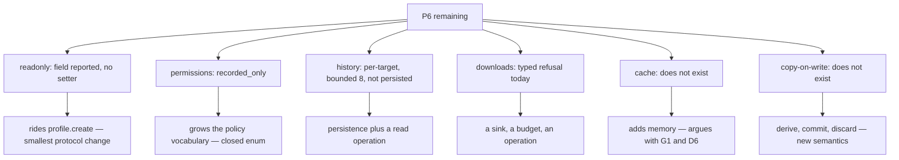

# P6's remaining capabilities — host-side triage, 0.0.1

Design-only and read-only. Nothing implemented, no court frozen, no protocol
changed, D6 untouched, nothing downloaded, no navigation soak, no visual or
surface run. Every "today" below is a black-box measurement of the shipped
`420cdf5b82bf…`.

P6 asks for cookies, storage, cache, history, downloads, permissions and
network policy under named persistent and ephemeral profiles, with
single-writer ownership and per-profile budgets. Cookies, storage, the sealed
store, the jar, HTTPS with pinned roots and persistence across restart are
done and on main. This triages the six that are not.

## 1. What each one is today, measured

| capability | measured state today |
| --- | --- |
| **permissions** | `profile.inspect` reports `policy: {network, permissions, permissions_effect: "recorded_only"}`. The host **says out loud that it records and does not enforce**. `profile.policy.set` accepts exactly `{session, network, permissions}` — a `downloads` or `cache` field is refused `invalid_request`. There is no per-permission vocabulary because there are no permission-bearing capabilities. |
| **downloads** | Clicking a link with a `download` attribute answers **`unsupported_capability`** with `details.reason = "download_unsupported"`. A typed refusal, not a silent failure. |
| **history** | Per **target**, bounded to 8 entries, readable through `target.inspect.history` and walked by `target.traverse`. Measured after one link-click navigation: `{can_go_back: false, can_go_forward: false, length: 1, position: 0}`, and `traverse -1` answers `not_found` with `reason: history_offset_out_of_window`. **There is no profile-level or persisted history at all.** |
| **cache** | No HTTP cache exists. The word "cache" in the network layer is the **TLS session cache** — bounded, per profile, never shared. |
| **readonly profiles** | `profile.inspect` already reports `read_only: false`, and **nothing can set it**: the policy operation's field set is exactly `{session, network, permissions}`. The report exists without the capability behind it. |
| **copy-on-write** | Nothing. No commit, no discard, no derived profile. |

## 2. The shape of the work

```
   P6 remaining
     |
     +-- readonly ......... the report field EXISTS; needs a setter and
     |                      enforcement at every write path
     +-- permissions ...... "recorded_only" today; needs enforcement points
     |                      and a per-permission vocabulary
     +-- history .......... per-target and bounded today; profile-level means
     |                      persistence in the sealed record and a way to read it
     +-- downloads ........ typed refusal today; needs a sink, a budget and
     |                      an action or operation to carry it
     +-- cache ............ nothing today; needs storage, eviction, budgets,
     |                      and it argues with G1
     +-- copy-on-write .... nothing today; needs derive/commit/discard semantics
```



## 3. Per capability: owner, invariant, evidence, safe failure, dependency, non-goal

**Readonly profiles.** *Owner* the profile cabinet. *Invariant* a readonly
profile answers reads and refuses every write, typed. *Evidence* a profile
opened readonly refuses cookie, storage and policy writes while a sibling
still writes. *Safe failure* refuse the mode rather than accept writes that
vanish. *Dependency* a flag on `profile.create` and a check at each write path.
*Non-goal* copy-on-write, which is a different capability.

**Permissions.** *Owner* the profile's policy. *Invariant* a denied permission
is denied at the point of use, not merely recorded. *Evidence* a capability
that consults it and a court that shows deny changing an outcome. *Safe
failure* keep `recorded_only` and keep saying so. *Dependency* at least one
permission-bearing capability to enforce against — today there is none.
*Non-goal* a permission vocabulary larger than the capabilities that exist.

**History.** *Owner* the profile. *Invariant* what a profile remembers
survives restart and is bounded and redacted like everything else in the
record. *Evidence* entries written, read back after restart, bounded, and
absent for ephemeral profiles. *Safe failure* keep history per-target and
in-memory. *Dependency* the sealed record's format, a budget, and a read
operation. *Non-goal* per-target back/forward, which already exists.

**Downloads.** *Owner* the host. *Invariant* a download is an explicit,
budgeted transfer to a named sink, never an implicit file write. *Evidence* a
refused case, an allowed case, a budget refusal, and nothing written outside
the sink. *Safe failure* the current typed `download_unsupported`. *Dependency*
a sink path, a per-profile budget, and an operation or action kind. *Non-goal*
resuming, or anything touching the user's own directories by default.

**Cache.** *Owner* the network layer. *Invariant* a cache is bounded per
profile, never shared across them, and never a covert identity channel.
*Evidence* hit and miss behaviour, eviction under budget, and isolation
between profiles. *Safe failure* no cache, which is today. *Dependency*
storage, eviction, budgets. *Non-goal* a disk cache before an in-memory one is
proven bounded — and note it **adds memory**, which argues directly with G1
and D6.

**Copy-on-write.** *Owner* the profile cabinet. *Invariant* a derived profile
starts identical, diverges privately, and commits or discards atomically.
*Evidence* derive, diverge, commit, discard, and a crash between them.
*Safe failure* refuse the mode. *Dependency* readonly first, plus record
versioning. *Non-goal* sharing a derived profile between hosts.

## 4. Loss matrix

| capability | protocol change | memory cost | interacts with a frozen guard | measured today |
| --- | --- | --- | --- | --- |
| readonly | **smallest** — a flag on `profile.create` | negligible | none | field already reported |
| permissions | grows the policy vocabulary | negligible | none | `recorded_only`, self-labelled |
| history | new operation plus record format | small, bounded | the record's budget | per-target only |
| downloads | new operation or action kind | small | the profile budget | typed refusal |
| cache | new subsystem | **material — argues with G1/D6** | D6's live footprint | absent |
| copy-on-write | several operations | small | record versioning | absent |

**None of these moves D6.** Profile machinery measures about 16 KB; D6's gap
is the first-request constant and the realms. The one exception is **cache**,
which would add memory and make D6 worse — worth knowing before it is
scheduled rather than after.

## 5. Ordering, and why

1. **Readonly.** The report field already exists and reads `false`; the gap is
   a setter and enforcement. Smallest protocol change, no memory, and it is a
   precondition for copy-on-write.
2. **Permissions enforcement.** It closes a gap the host currently announces
   about itself. But it needs something to enforce *against*: with no
   permission-bearing capability, the honest version of this step may be to
   keep `recorded_only` and say why, until one exists.
3. **History persistence**, which is bounded, redacted work in a record format
   that already exists.
4. **Downloads**, which needs a sink and a budget and is the first item that
   writes outside the profile record.
5. **Copy-on-write**, after readonly.
6. **Cache**, last, and only with a memory ruling — it is the one item that
   makes G1 and D6 worse rather than better.

Nothing here is proposed for implementation, and each of items 1 through 6
needs its own design and a protocol ruling before code.
