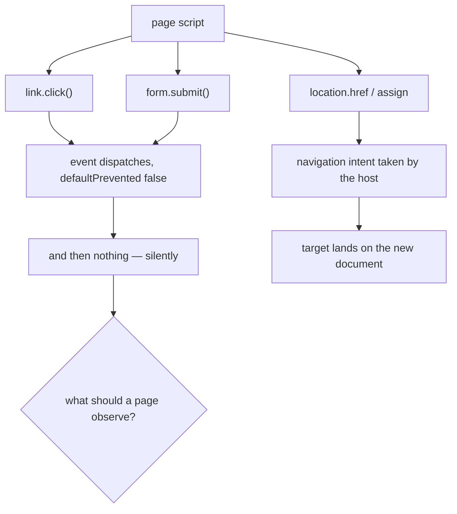

# The page's own activation is silent — design-only audit, 0.0.1

Design-only and read-only. Nothing implemented, no protocol changed, no court
frozen, D6 and G1 untouched, no navigation soak, no visual run, nothing
downloaded. Measured black-box against the shipped `8ff70b9f26c1…`.

## 1. The defect is wider than downloads

The downloads audit called a page's own `link.click()` on `a[download]` "the
fourth vector". **That framing was too narrow, and this corrects it.** Measured
across the page's ways of navigating itself:

| what the page's own script does | what happens |
| --- | --- |
| `location.href = "/next.html"` | **navigates** — the target lands on `next.html` |
| `location.assign("/next.html")` | **navigates** |
| **`link.click()` on a plain link** | **nothing** — the target stays put, and the server never sees the request |
| **`form.submit()`** | **nothing** — same |
| `link.click()` on `a[download]` | nothing |
| the click event itself | dispatches normally: listeners run, `dispatchEvent` returns `true`, `defaultPrevented` is `false` |

So the page's navigation authority runs entirely through **`location`**.
Activation — clicking a link, submitting a form — dispatches a perfectly good
event and then does nothing at all, silently. The download case is one instance
of a general silence, not a download problem.

```
   page script
     |
     +-- location.href / location.assign ....... intent raised, host navigates
     |
     +-- link.click() ........................... event dispatches, nothing else
     +-- form.submit() .......................... event dispatches, nothing else
            |
            +-- a[download]: also nothing, which is where this was noticed
```



## 2. What a page is entitled to observe

The ruling's constraint is that a page-observable safe failure must not smuggle
a host control error into the page. Working out what is left:

- For a **plain link or form**, the browser behaviour a page expects is
  **navigation**. There is no "failure" to report — the honest fix is to do the
  thing, not to invent an error object no browser has.
- For **`a[download]`**, a browser page observes **nothing** either: the
  download happens outside the document, and no event or return value tells the
  page it worked. So silence is standard-conformant *here* — what is missing is
  not a page signal but an **agent-visible** one.

That splits the fix cleanly, and the split is the recommendation.

## 3. Two candidates, and the authority question

**Candidate A — activation raises the same intent `location` already raises.**
For plain links and form submits, the shim's activation path would raise the
navigation intent the host already takes from `location`, and the host would
navigate exactly as it does today for the agent's own click.

The authority question answers itself: **a page can already navigate itself
through `location`**, measured above. Routing activation through the same door
adds **no new power** — only fidelity. It does not let a page reach anything it
could not reach with one line of `location.href`.

What it must preserve: the existing scheme and target rules (the activation
decision already refuses `javascript:`, unsupported schemes and named targets),
one intent per document, and the host's own refusals staying host-side.

**Candidate B — leave activation inert, make it visible to the agent.** The
attempted activation is recorded where the agent can see it — an audit entry or
an inspect counter — with a closed vocabulary and no page-authored text. The
page still observes nothing, which for `a[download]` is exactly what a browser
gives it.

**Recommendation: A for links and forms, B for `a[download]`.** A closes a
real fidelity gap with no new authority; B is the only honest answer for the
download case, because there is no page-visible failure a browser would show
and inventing one would be worse than silence.

## 4. Owner, invariant, evidence, safe failure, dependency, non-goal

**Owner** the shim's activation path, with the host's intent mechanism.
**Invariant** a page that activates a link or form reaches the same decision an
agent's click would, and never a different one. **Evidence** a court where the
page's own click navigates exactly where `target.act` would, and where every
existing refusal — scheme, target, download — still refuses. **Safe failure**
today's inertness, which is wrong but not dangerous. **Dependency** the
page-navigation slice's intent mechanism and its one-intent-per-document rule.
**Non-goal** a page-visible error object for downloads; window.open; and any
new navigation authority.

## 5. Court draft

1. A page's `link.click()` on a same-origin link navigates the target to the
   same URL an agent's click would.
2. A page's `form.submit()` on a `GET` form navigates the same way.
3. Every existing activation refusal still refuses, and **still refuses
   host-side**: `javascript:` and unsupported schemes, named targets, and
   `a[download]`.
4. **No host control error text reaches the page** — the page's `click()`
   still returns `undefined`, throws nothing, and the click event's
   `defaultPrevented` is unchanged.
5. `preventDefault()` on the click still suppresses the activation, as it does
   for the agent's click.
6. One intent per document still holds: two clicks in one turn do not produce
   two navigations.
7. For `a[download]`, the page still observes nothing, and the **agent** can
   see the attempt through a closed-vocabulary record.
8. The redaction rule holds: nothing page-authored reaches the host's
   diagnostics through the new record.

Criterion 4 is the ruling's constraint written as a check, and criterion 5 is
the one that keeps the page's own cancellation meaningful.

## 6. Pending rulings

1. **A for links and forms**, which is a fidelity fix with no new authority.
2. **B for `a[download]`**, agent-visible only.
3. Whether `form.submit()` is in the same slice as `link.click()` or waits —
   they share the activation path, so this audit sees no reason to split them.
4. Whether the agent-visible record is an audit entry or an inspect counter;
   both are closed-vocabulary, and the audit ledger already refuses page text.
