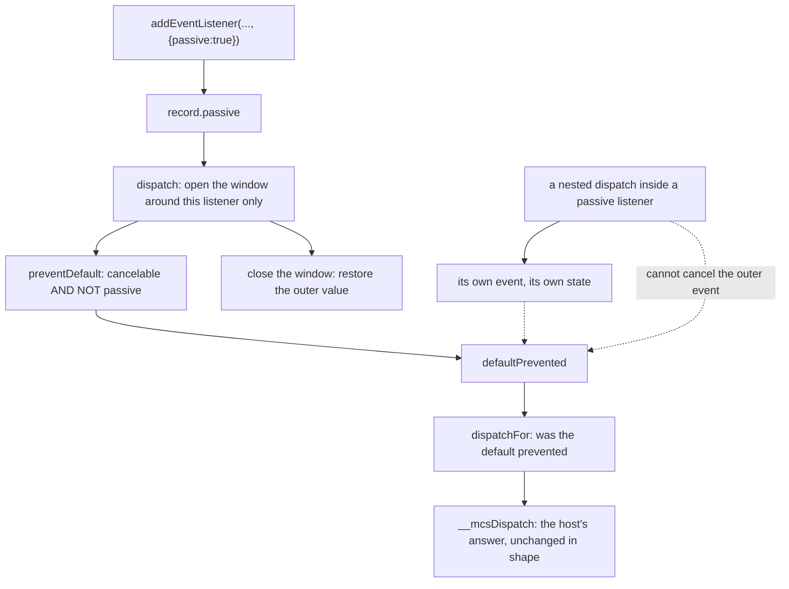

# Passive listeners (L3) — read-only audit, 0.0.1

Design-only. Nothing implemented, no implementation court frozen, the handle
does not widen, no cap or floor proposed, no navigation or visual path run.
One throwaway build carried the candidate and went away with its worktree. L5
`signal`/`AbortController` stays deferred, and a page getter still has no
business inside the dispatch walk.

This is the rung where the standard **takes power away from the page**, so the
audit is mostly about authority rather than fidelity.

## 1. The rule, and what this host does instead

The standard: a listener registered `{passive: true}` may not cancel. Its
`preventDefault()` is ignored, the event's canceled flag is never set, and
`dispatchEvent` still answers `true`.

Measured on the shipped `112b303b5edd…` against a candidate built on it:

| probe | shipped | candidate | standard |
| --- | --- | --- | --- |
| a passive listener calls `preventDefault` | `returned false`, `prevented true` | **`returned true`, `prevented false`** | true / false |
| a passive and a non-passive listener both call it | false / true | false / true | false / true |
| the non-passive one registered **first** | false / true | false / true | false / true |
| passive + `capture` | false | **true** | true |
| passive + `once` | prevented true | **prevented false** | prevented false |
| passive on `window` | returned false | **returned true** | true |
| passive on a **non-cancelable** event | true / false | true / false | true / false |

## 2. The authority finding

This is the reason the rung matters, and it is measured through a real
`target.act` on both builds. The fixture is a link whose own click listener is
registered `{passive: true}` and calls `preventDefault()`.

| | shipped | candidate |
| --- | --- | --- |
| the agent clicks the link | ok, applied | ok, applied |
| **where the target ends up** | **stays** — the navigation is refused | **`/next.html`** — the navigation happens |

So **today a page can refuse an agent's action through a route the standard
says is inert.** Declaring a listener passive is a promise not to cancel; this
host honours the cancel anyway, and the host's bridge reads `defaultPrevented`
without knowing the promise was made. The fix does not give a page anything —
it takes back something a page should never have had.

A second escape closes with it. A passive listener can today dispatch a nested
event and cancel the **outer** one from inside that nested listener:

| | shipped | candidate |
| --- | --- | --- |
| outer event cancelled from a nested dispatch | **yes** | **no** |
| the nested event itself still cancellable | yes | yes |

That second row matters as much as the first: passivity belongs to the
listener's own invocation, not to everything that happens while it runs.

## 3. The model

The flag is per record and the state is per event, saved and restored around
each invocation, so nothing leaks between listeners, between phases, or
between dispatches.

```
  addListener(target, type, fn, {passive: true})
        |
        v
  record { callback, handler, once, capture, passive }
        |
  dispatchOn: for each hop, for each record
        |
        +-- outerPassive = state.passive
        +-- state.passive = record.passive     <- the window opens
        +-- invoke(handler)                    <- preventDefault checks it
        +-- state.passive = outerPassive       <- and closes again
        |
  preventDefault(): if (cancelable && !passive) defaultPrevented = true
        |
        v
  dispatchOn returns !defaultPrevented  ->  dispatchFor  ->  __mcsDispatch
                                            (the host's only question)
```



## 4. Cost

| | M1 | Δ per child | M2 | slack | M1 headroom |
| --- | --- | --- | --- | --- | --- |
| shipped `112b303b5edd…` | 228,922 | — | 1,600,956 | 46,464 | 16,838 |
| candidate | 229,322 | **+400** | 1,603,756 | 46,864 | 16,438 |

M2 is exactly seven times the M1 delta. **This is the cheapest rung in the
ladder** — a flag on the record, a two-line window around the invocation and
one condition in `preventDefault` — and it is the only one that reduces what a
page can do. Floors of 245,760 and 1,720,320 hold.

Courts on the candidate: `capture-phase` 36/36, `listener-options` 30/30,
`event-fidelity` 62/62, `form` 179/179, `frame-actions` 182/182,
`page-navigation` 80/80, `child-frames` 82/82, `shim-footprint` 18/18.

One measurement note, because it nearly became a false finding: the first run
of `form` and `child-frames` on the candidate read 176/177 and 79/80 with
checks *missing*, which looked like the candidate breaking a flow. It was the
environment — the pinned `puppeteer-core` client had disappeared from the
ignored `target/labs/d4` — and the **shipped** binary read the same numbers.
Restoring the client from the local npm cache brought both back to 179/179 and
82/82 on both builds. Nothing was attributed to the candidate on the strength
of a run I had not reproduced against the baseline.

## 5. Loss matrix

| the page expects | after L3 | why |
| --- | --- | --- |
| a passive listener cannot cancel | **served** | the flag gates `preventDefault` |
| `dispatchEvent` still answers `true` | **served** | nothing sets the flag |
| passivity confined to that listener | **served** | the window opens and closes around one invocation |
| a nested dispatch cannot cancel the outer event | **served** — and it can today | the outer event's own state stays passive while its listener runs |
| a **late** `preventDefault`, after the dispatch, to be ignored | **not served**: it still sets `defaultPrevented` on both builds | the window is closed by then, so the flag is written; the host has already read its answer, so nothing it decides changes — a page can only mislead itself |
| a console warning when a passive listener calls `preventDefault` | never | this host has no console channel |
| `passive` defaulting to true for scroll and touch types | never | the host models no such events, and a default that varies by type is a page-visible rule this design does not want |
| `passive` to affect `stopPropagation` | no, correctly | passivity is about the default, not the walk |

## 6. Authority falsifiers, for the court that would freeze this

Each is a measured pair, so the court fails on the current build for the right
reason and passes only when the rung exists:

1. **The agent's click is not refusable by a passive listener** — the pair in
   §2, through a real `target.act`, comparing where the target ends up.
2. **A non-passive listener on the same event still refuses it**, so the fix
   removes exactly one route and not the page's legitimate one.
3. **A nested dispatch inside a passive listener cannot cancel the outer
   event**, and the nested event stays cancellable itself.
4. **The window closes**: a dispatch after a passive one still cancels
   normally, and a second listener in the same dispatch is unaffected by the
   first's passivity.
5. **`passive` composes with `capture` and `once`**, in either phase.
6. **The host's answer is read from `defaultPrevented` only** — a passive
   listener that calls `stopPropagation` still stops the walk, and still does
   not change the navigation.

## 7. Dependencies and child impact

- **Base only.** The record, the window and `preventDefault` all live in the
  base, so every child realm carries the bytes and no child can use them —
  children run no scripts. The same divergence as every rung since the
  error-class slice.
- **The handle does not widen**; the main extension needs no change, since the
  three call sites already forward options.
- **`__mcsDispatch` is untouched in shape.** It asks one question and gets a
  more honest answer.
- **No interaction with L5.** Nothing here reads a page object during the
  walk; `passive` is a boolean copied at registration.

## 8. Pending rulings

1. **Take L3 at +400 bytes per child**, headroom 16,438, or leave the escape
   in §2 open and record it as a standing authority loss — which I would not
   recommend, since it lets a page refuse an agent's action by declaring it
   would not.
2. **The late `preventDefault`** in §5: leave it as measured (the flag is
   written, nothing the host reads changes), or spend bytes to make the record
   remember it was passive for the life of the event.
3. **No type-based default passivity**, ever, unless a future event model
   needs it — proposed as a written position rather than an omission.
4. **What the implementation court must falsify**: §6 entire, plus the §1
   table and the M1/M2 floors on the same binary.
