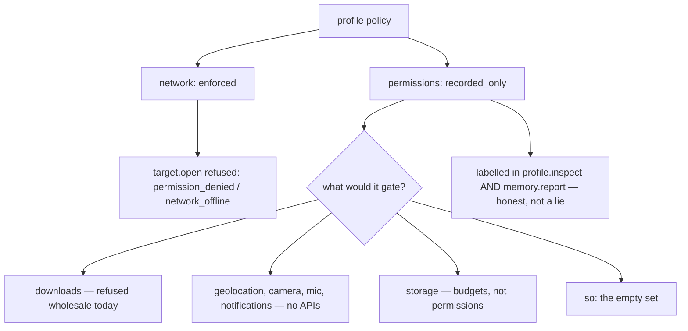

# Permissions enforcement — design-only audit, 0.0.1

Design-only and read-only. Nothing implemented, no protocol changed, no court
frozen, D6 and G1 untouched, no navigation soak, no visual run, nothing
downloaded. Every claim below is a black-box measurement of the shipped
`8ff70b9f26c1…`.

**The finding: the gap is real, and it is not a lie.** `permissions` gates
nothing — and the host says so, in two places a client can read, without being
asked. What is missing is not enforcement machinery but **anything to
enforce**.

## 1. What the two policy fields actually do

| probe | measured |
| --- | --- |
| `policy` at open | `{network: "online", permissions: "allow_by_default", permissions_effect: "recorded_only"}` |
| **`network: "offline"`, then `target.open`** | **refused `permission_denied`, message `network policy: network_offline`** |
| back online, a page's own `fetch` | succeeds, `fetch ok 11` |
| **`permissions: "deny_by_default"`, then a page's `fetch`** | **succeeds — `fetch ok 11`, unchanged** |
| `profile.storage.put` under `deny_by_default` | **ok — unchanged** |
| the same, read back after closing and reopening the session | the policy is still `deny_by_default`: the state is the **profile's**, the session is only the handle |
| `memory.report` owners | `policies: {bytes: 2, deny_by_default: 1, offline: 0, permissions_effect: "recorded_only"}` |

So **`network` is a capability**: it is checked, and its refusal is typed and
named. **`permissions` is a record**: it round-trips, persists and is counted,
and changes no outcome anywhere this audit could reach.

## 2. It is honest, and that matters for the ruling

A page or an agent can discover the truth **without reading the plan**:
`permissions_effect: "recorded_only"` appears in `profile.inspect` *and* in
`memory.report`'s owner block. Nothing pretends the deny took effect; no call
answers "denied" and then proceeds; there is no silent lie of the kind this
batch found in `handleEvent`, `onabort` or `abort(reason)`.

That changes what the gap is. It is not a defect to repair — it is **a field
waiting for a subject**.

## 3. There is nothing to enforce

Enumerated against what this host can actually do:

| a permission would gate | does this host have it? |
| --- | --- |
| network access | **yes — and it already has its own enforced field**, `network`, with `permission_denied` |
| downloads | no: a `download` link is refused `unsupported_capability` / `download_unsupported` |
| geolocation, camera, microphone, notifications, clipboard, MIDI, sensors | **none of these APIs exist** in the shim |
| storage | governed by per-profile budgets, not by permission |
| cookies | governed by the jar, `Secure` and the HTTPS slice |

**The set of permission-bearing capabilities is empty.** Enforcing
`permissions` today would be enforcing over nothing: the code would be
unreachable, and a court could only prove it by adding a capability first.

```
   profile policy
     |
     +-- network ......... CHECKED at target.open and fetch
     |                     refusal: permission_denied "network_offline"
     |
     +-- permissions ..... recorded, persisted, counted, labelled
                           recorded_only — and gates NOTHING, because
                           nothing in this host asks a permission question
                                 |
                                 +-- downloads?  refused wholesale today
                                 +-- geolocation, camera, mic, notifications?
                                     the APIs do not exist
```



## 4. Owner, invariant, evidence, safe failure, dependency, non-goal

**Owner** the profile's policy, set through a session handle and stored on the
profile. **Invariant** a permission that is denied is denied *at the point of
use*, and the answer says so with a typed refusal. **Evidence** a capability
that asks the question, plus a court where deny changes an outcome and allow
does not. **Safe failure** keep `recorded_only` and keep announcing it —
which is what the host does today. **Dependency** at least one
permission-bearing capability; downloads is the nearest candidate.
**Non-goal** a permission vocabulary richer than the capabilities that exist,
and any per-origin permission model while there is nothing to ask about.

## 5. The three candidates

| candidate | what it costs | what it buys | verdict |
| --- | --- | --- | --- |
| **keep `recorded_only`, sharpen the record** | nothing in the host; a documentation slice | the truth is already discoverable; this makes the *reason* discoverable too | **recommended** |
| per-session enforcement | a check with no call site; a protocol question, since policy is profile state reached through a session | nothing measurable until a capability exists; a court could not falsify it | **not now** |
| profile-level enforcement | the same, plus deciding what happens to live sessions when the policy changes mid-flight | same | **not now** |

The second and third are the same work in different scopes, and both are
**unfalsifiable today**: with no capability asking a permission question, a
court for either could only pass vacuously. That is the strongest argument
against taking them: this host's discipline is that a criterion must be able
to fail.

## 6. A court draft, for whenever a capability arrives

Not frozen, and deliberately written against **downloads** as the first
subject, because it is the nearest capability that would ask:

1. With `permissions: allow_by_default`, the capability proceeds and the
   answer is ordinary.
2. With `deny_by_default`, the same call is **refused `permission_denied`**,
   with a reason naming the permission — the same code `network` already uses,
   not a new vocabulary.
3. The refusal happens **at the point of use**, not at policy-set time: setting
   deny succeeds, and the next call is what fails.
4. `profile.inspect` reports `permissions_effect: "enforced"` once anything is
   enforced — so the label stops saying `recorded_only` **only** when it stops
   being true.
5. The policy still persists across restart and is still profile state reached
   through a session handle.
6. A **readonly session cannot change the policy** — already true as of the
   readonly slice, and worth pinning here so the two capabilities stay
   consistent.
7. The `network` field keeps behaving exactly as it does now, with its own
   typed refusal, unchanged by any permissions work.

Criterion 4 is the one that keeps this honest: the label is part of the
contract with a client, and it must move only with the behaviour.

## 7. Dependencies on the rest of P6

- **readonly** (done): a readonly session already refuses `profile.policy.set`
  with `session_read_only`. Any permissions work inherits that and must not
  blur the two refusals — `permission_denied` for a denied permission,
  `session_read_only` for an open that promised not to write.
- **downloads**: the natural first subject. If downloads land first,
  permissions enforcement becomes falsifiable and cheap; if permissions land
  first, they gate nothing.
- **copy-on-write**: no interaction beyond the policy being part of the record
  a derived profile would copy.
- **history**: none.

## 8. Recommendation and pending rulings

1. **Keep `recorded_only`.** It is honest, discoverable in two places, and
   enforcing an empty set would add unfalsifiable code. The audit recommends
   **no host change**.
2. **Bind permissions to downloads** whenever downloads are ruled in, and take
   the §6 court with that slice rather than on its own.
3. If a ruling wants the gap closed sooner anyway, say which capability should
   ask the first permission question — because without one, there is nothing
   for a court to falsify, and this host does not ship criteria that cannot
   fail.
