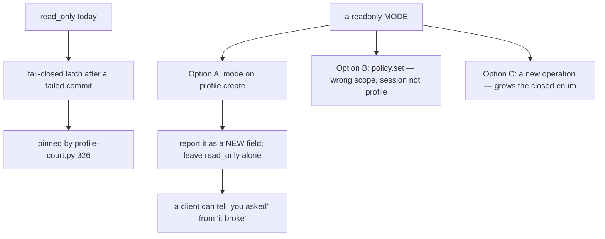

# Readonly profiles — design-only audit, 0.0.1

Design-only and read-only. Nothing implemented, no court frozen, no protocol
changed, no field added, D6 untouched, nothing downloaded, no navigation soak,
no visual run. Permissions, history, downloads, cache and copy-on-write are
untouched and out of scope.

**The headline: the `read_only` field that made this look cheap is already
taken, and it means something else.**

## 1. What `read_only` is today

It is **a fail-closed latch, not a mode**. In the host, a profile write that
fails to commit to the sealed store sets `profile.read_only = true` and every
later write is refused with `commit_failed: "storage is read-only after an
earlier failed commit"` — after rolling back the in-memory jar and storage to
their previous values.

It is **court-pinned**: `profile-court.py:326` requires *"storage stays
read-only for the rest of the host lifetime after a commit failure"*.

So a client reading `read_only: true` today learns **"this profile broke and
stopped accepting writes"**. A readonly *mode* would mean **"you asked for a
profile that does not write"**. Those are different facts with different
operator responses, and conflating them would make the field useless for both.

That reframes the triage's "the field already exists, so this is the cheapest
capability": the *report* exists, but it is spoken for.

## 2. Where a mode would have to live

Measured on the shipped host:

- `profile.create` accepts exactly `{persistence, name}` — any other key is
  `invalid_request`.
- `profile.policy.set` accepts exactly `{session, network, permissions}` — a
  `downloads` or `cache` field is refused the same way. It is **session**
  scoped, not profile scoped.
- The protocol schemas and `check_contract.py` pin the **operation enum** and
  the request envelope; the per-operation argument sets for `profile.*` are
  enforced by the host, not the contract, so a new argument is a host change
  plus new contract examples rather than a schema-enum change.

```
   profile.create {persistence, name}            <- host-enforced field set
        |
        +-- Option A: add `mode: "readwrite"|"readonly"`   smallest, profile-scoped
   profile.policy.set {session, network, permissions}
        |
        +-- Option B: add a writes knob            WRONG SCOPE: session, not profile
   a new operation, e.g. profile.mode.set
        |
        +-- Option C: grows the closed enum in both schemas, both mappings,
                      the CLI/CDP examples and the negative cases
```



**Recommendation, for a ruling rather than for code:** Option A, with the mode
reported as its **own** field. Leave `read_only` meaning exactly what it means
now, and let the frozen criterion keep passing untouched.

## 3. The state machine, and the question it forces

```
                    create(mode=readwrite)          create(mode=readonly)
                              |                              |
                              v                              v
                        [ writable ] --write fails--> [ latched ]      [ readonly ]
                              |                          ^                  |
                              +---- writes refused ------+                  |
                                     commit_failed                          |
                                                                            v
                                                            writes refused, typed
                                                            DIFFERENTLY from the latch
```

The two refusals must be distinguishable, or the mode makes the latch
unreadable. That is the single most important design constraint here, and it
is why this is not a one-line flag.

**Is the mode a property of the profile or of the open?** This audit
recommends **the open**: not persisted in the sealed record, so reopening
without the flag is writable again. Persisting it would need a record format
change and would let one mistaken call make a profile permanently unwritable —
a footgun with no undo in the current operation set.

**Ephemeral plus readonly** is a combination with nothing to read: it should be
refused as `invalid_request` rather than silently accepted. That is a ruling,
not an implementation detail.

## 4. Concurrency, locks and the trap

Today a profile is single-writer: a second host attaching gets a typed
`profile_locked`, and can open the same identity after the owner closes.

The trap: a readonly attach *looks* like it should not need the writer lock,
and **letting it skip the lock would quietly add a new capability** — multiple
concurrent readers of one profile — with its own consistency questions (a
reader observing a writer's half-committed record). This audit recommends the
first slice **keep taking the writer lock**, so readonly changes what a holder
may do and not who may hold. Multiple readers, if wanted, is a separate design
with its own ruling.

## 5. Memory, retention, redaction

- **Memory: nothing.** Profiles measure about 16 KB and a readonly profile
  loads the same record. This capability neither helps nor hurts G1 or D6.
- **Retention: nothing new.** No new owner class, no new buffer.
- **Redaction:** the mode is a closed two-word vocabulary in `profile.inspect`;
  it carries no page or user data. The refusal message must name the mode, not
  the attempted value — the same rule the host already follows for storage
  budgets.

## 6. A court draft, for whenever this is ruled in

Not frozen. What it would have to falsify:

1. A profile created readonly reports the **new** mode field, and
   `read_only` stays `false` — the latch is untouched.
2. Every write path refuses with a **typed error distinct from
   `commit_failed`**: storage put, policy set, and a page's own cookie and
   `localStorage` writes.
3. Reads still work: `profile.inspect`, storage get, cookies visible to a page,
   targets open and pages run.
4. A writable sibling profile in the same host still writes — the mode is per
   profile, not global.
5. **The latch still behaves**: on a writable profile a failed commit still
   sets `read_only: true` and still refuses afterwards, so
   `profile-court.py:326` passes unchanged on the same binary.
6. Reopening the same identity **without** the flag is writable again — the
   mode is the open's, not the record's.
7. `persistence: "ephemeral"` with `mode: "readonly"` is refused
   `invalid_request`.
8. The writer lock is still taken: a second host still gets `profile_locked`
   against a readonly holder.
9. The contract's examples and negative cases cover the new argument, and an
   unknown mode value is refused.

Criterion 5 is the one that matters most: it is what proves the new mode did
not eat the old meaning.

## 7. Pending rulings

1. **Which shape** — Option A (a `mode` argument on `profile.create`, reported
   as its own field) is what this audit recommends; B is the wrong scope and C
   grows the closed enum for no gain.
2. **Open-scoped, not persisted** — recommended, and it is a real decision
   because it makes readonly non-sticky by design.
3. **Ephemeral + readonly refused** — recommended.
4. **The writer lock is still taken** — recommended, with multiple readers
   deferred as its own capability.
5. **`read_only` keeps its meaning**, and the new mode gets a new field. If a
   future ruling wants one field with a reason, that is an amendment to a
   frozen criterion and should be taken knowingly rather than as a side effect.
