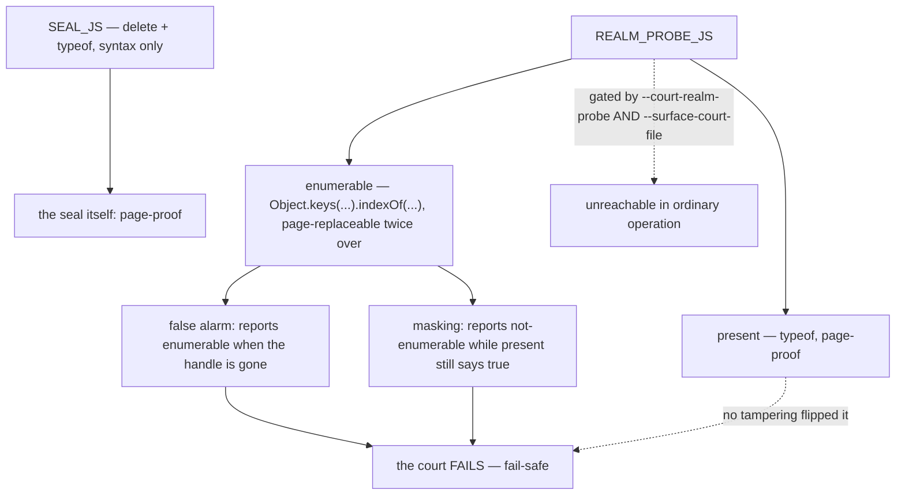

# The court realm probe — design-only audit, 0.0.1

Read-only and design-only, from `210f740`. Nothing implemented, no court
frozen, no H3 declared set changed, no H2 work, no visual run, no navigation
soak, no download. Every probe is a hermetic local fixture.

**Finding: the diagnostic can be made to lie, but only in the fail-safe
direction. No host answer and no security decision depends on it.**

## 1. What it is and how far it reaches

`REALM_PROBE_JS` asks a realm seven fixed questions and joins the booleans. Two
of them are about the internals handle:

```js
String(typeof window.__mcsInternals !== "undefined")          // "present"
String(Object.keys(window).indexOf("__mcsInternals") >= 0)    // "enumerable"
```

- It runs **only** from `realm_probe()`, which returns `None` unless
  `court_realm_probe` is set.
- That flag needs `--court-realm-probe 1` **and** `--surface-court-file`; the
  host exits 64 if the second is missing.
- Its only consumer is the court section of `memory.report`.
- The only criteria that read it are in `shim-footprint-court.py:347–355`: *the
  internals handle is gone from the main realm, and not enumerable.*

**Nothing else reads it.** No host answer to an agent, no refusal, no
permission, no budget, and no navigation or download decision.

## 2. The enforcement is elsewhere, and it is page-proof

The seal is `SEAL_JS`:

```js
(() => { delete window.__mcsInternals; return String(typeof window.__mcsInternals); })()
```

`delete` and `typeof` are syntax; there is no method call for a page to
replace. It runs before any page script in that realm, and the host refuses the
realm if the handle survives. **The probe verifies the seal; it does not
perform it.**

## 3. What a page can actually do to it

Measured with the probe enabled, one tampering per run:

| the page does | `present` | `enumerable` | the truth |
| --- | --- | --- | --- |
| nothing | false | false | the handle is gone |
| `Object.keys = () => []` | false | false | gone — the lie is invisible because the truth agrees |
| `indexOf` always finds | false | **true** | gone — a **false alarm** |
| re-adds `window.__mcsInternals` | **true** | true | a property really is there — truthful |
| re-adds it **and** hides it | **true** | **false** | present; `enumerable` lies, `present` does not |

Two conclusions follow, and the second is the important one:

1. `present` is built on `typeof`, and **no tampering made it report false
   while a property existed**. `enumerable` is controllable in both directions.
2. **Every tampering produces a court *failure*, never a false pass.** The
   criterion demands `present == false and enumerable == false`; row 3 fails on
   `enumerable`, rows 4 and 5 fail on `present`. A page cannot use this channel
   to make a broken seal look intact.

So the residual risk is not a security bypass. It is **false alarms**: a
hostile page can make a court report a failure that is not real, which wastes
an investigation and, if anyone noticed the pattern, could be used to discredit
the evidence chain.



## 4. The fix, verified rather than argued

Replace the two replaceable calls with syntax:

```js
var enumerable = false;
for (var k in window) { if (k === "__mcsInternals") enumerable = true; }
```

Measured on the same tamperings, with a marker property that really is present
and enumerable:

| the page does | `Object.keys(...).indexOf(...)` | `for…in` |
| --- | --- | --- |
| nothing | true | **true** |
| `Object.keys = () => []` | **false** | **true** |
| `indexOf` always −1 | **false** | **true** |
| `indexOf` always 0 | true | **true** |

The syntax form told the truth in every case; the method form was wrong in two.

**Cost**: the probe is a host-side script constant, compiled per call and not
retained in a realm, exactly like the H1 substitution — which moved no
per-realm byte. The per-call compile cost of a `for…in` against a
`Object.keys().indexOf()` was not isolated, because neither is retained and the
probe runs only under a court flag; if that number is wanted it should be
measured on its own rather than inferred.

Two alternatives, recorded and not recommended: dropping the `enumerable` field
(it is a real check when it is not lied to), and reporting the host's own
record of having sealed instead (that would stop the probe verifying the realm,
which is its whole purpose).

## 5. Safe failures, dependencies, non-goals

- **Safe failure today**: the channel already fails safe, as §3 shows. The fix
  removes false alarms, it does not close a bypass.
- **Dependencies**: `shim-footprint-court.py` reads both fields; a syntax-only
  rewrite must leave its two criteria reading exactly as they do now on an
  untampered page (false, false).
- **Non-goals**: H2; changing H3's declared set; touching `SEAL_JS`, which
  needs nothing; adding a capture or a global; anything about the snapshot's
  shape validation.

## 6. Court draft

1. On an untampered page the probe reports `present false, enumerable false`,
   and `shim-footprint-court`'s two criteria still read as they do today.
2. With `Object.keys` replaced to return `[]`, the probe still reports the truth
   about a name that is genuinely enumerable.
3. With `Array.prototype.indexOf` replaced in either direction, the probe still
   reports the truth.
4. With a page that re-adds `window.__mcsInternals`, `present` is **true** — the
   court fails, and that failure is correct.
5. `SEAL_JS` is unchanged and still contains no method call.
6. The probe stays double-gated: absent `--surface-court-file` the host exits
   rather than probing.

## 7. Pending rulings

1. Whether the syntax-only rewrite proceeds. It is a host-script change of the
   same class as H1, with no per-realm cost, and §4 shows it verified.
2. Whether the per-call compile cost is wanted as its own measurement first.
3. Whether §3's conclusion — that this channel is fail-safe and reaches no host
   answer — is enough to leave it alone entirely. That is a defensible ruling,
   and the audit does not argue against it.

---

## 8. Court frozen, and the repair priced — 2026-09-06

`probe-truthfulness-court.py` is frozen from §6, receipt
`evidence/native-dom-control-0.0.2-probe-truthfulness.json`. It states, for each
of seven pages, **what is actually true** about a property named
`__mcsInternals` on `window`, and requires the probe to say it — rather than
comparing one run against another.

It reads **21/25** on the shipped binary. The four failures are exactly the
repair's targets:

| failing criterion | what the probe says | what is true |
| --- | --- | --- |
| the page re-adds the name and blinds `Object.keys` | not enumerable | **enumerable** |
| the page re-adds the name and blinds `indexOf` | not enumerable | **enumerable** |
| the page blinds `indexOf` into always finding | enumerable | **not enumerable** |
| the probe's source still asks through a replaceable call | — | — |

Everything else passes today, and two groups of that are worth naming. **Every
`present` criterion passes** — `typeof` was truthful in all seven scenarios,
including the two where a page re-added the name and tried to hide it. And
**every containment criterion passes**: in no scenario did the pair read
`false, false` while a property of that name existed. That is the audit's
fail-safe finding, now standing as a criterion rather than a claim.

### What the repair costs, measured directly

The probe is compiled per call, so the cost is per evaluation, not per realm.
Both forms were evaluated 2,000 times in a realm with the shims installed, six
runs:

| | source bytes | ns per evaluation | retained after 2,000 |
| --- | ---: | ---: | ---: |
| `Object.keys(window).indexOf(…) >= 0` | 579 | **18,136 – 18,790** | ~82 KB |
| syntax-only `for…in` | 625 (+46) | **21,999 – 22,965** | ~66–82 KB |

**About +3.8 µs per evaluation, roughly +21%.** Retention is indistinguishable:
both leave the same order of pending garbage, and the spread between runs of one
form exceeds the difference between the forms.

This number is measured, **not** extrapolated from H1. The reason it is not
zero, unlike H1's substitution, is that the two are not the same kind of change:
H1 swapped one native call for another, while this replaces a native
`Object.keys` with an interpreted walk over `window`'s properties. The cost is
the walk, not the compile.

In context: the probe runs once per realm per `memory.report`, and only when
both court flags are set. Four microseconds against a court-only diagnostic is
not a reason to keep a lie in the evidence chain — but it is a real number and
it is stated rather than rounded to nothing.

**Not done**: no implementation, no source change, no handle, base or bound
change, `SEAL_JS` untouched.
