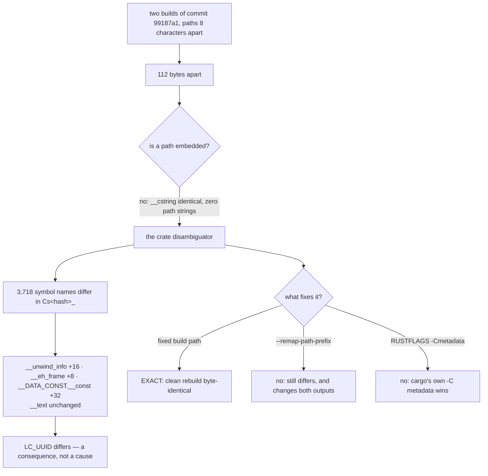

# Why two builds of one commit differ, and what would fix it

Design-only, read-only. No build script, no cargo configuration, no product
code, no court, no bound, handle or base byte changed; no historical receipt or
register semantics touched; nothing downloaded and no network used — every
build was `--offline` with the local pinned toolchain. Two scratch worktrees
were created, measured, and removed; the main worktree was never modified and
its binary is still `2d57ce864002406e`.

The provenance-recovery round measured that rebuilding a commit does not
reproduce that round's binary. This audit asks **why**, and whether it can be
fixed. Receipt:
`evidence/native-dom-control-0.0.2-reproducible-build.json`.

## 1. The experiment

Commit `99187a1` was checked out into two scratch worktrees whose paths differ
by **eight characters** and nothing else — `…/repro/aaaa` and
`…/repro/bbbbbbbbbbbb` — and built with `cargo build --release --offline`,
rustc 1.97.0 and cargo 1.97.0.

| | sha256 (first 16) | size |
| --- | --- | ---: |
| built at `…/aaaa` | `7d31698c9d839c97` | 5,856,848 |
| built at `…/bbbbbbbbbbbb` | `3e11814c36b06157` | 5,856,960 |

**112 bytes apart for an 8-character path difference**, first differing byte at
offset 697.

## 2. It is not embedded paths

The obvious explanation is wrong, and the measurement says so three ways.

- **`__TEXT.__cstring` is byte-identical in size** in both builds
  (`0x11715`). If the build path were being written into the binary as a
  string, that section would grow.
- **Neither binary contains its own build path.** `strings` finds zero
  occurrences of `repro/aaaa` in the first, zero of `repro/bbbbbbbbbbbb` in the
  second, and zero occurrences of the scratch root in either.
- **The only absolute paths in the image are the Rust distribution's own**,
  already remapped to `/rust/deps/…`.

## 3. It is the crate disambiguator in symbol mangling

The sections that do differ are the ones whose size follows the *length of
symbol names*:

| section | at `…/aaaa` | at `…/bbbbbbbbbbbb` | delta |
| --- | ---: | ---: | ---: |
| `__TEXT.__unwind_info` | `0xd4e8` | `0xd4f8` | **+16** |
| `__TEXT.__eh_frame` | `0x478fc` | `0x47904` | **+8** |
| `__DATA_CONST.__const` | `0x568b0` | `0x568d0` | **+32** |
| `__TEXT.__cstring` | `0x11715` | `0x11715` | 0 |
| `__TEXT.__text` | `0x319fc8` | `0x319fc8` | 0 |

And the symbol names themselves differ, in exactly the field that carries the
crate's disambiguator:

```
…/aaaa           __RINvCsjoNTN0wbErc_18native_dom_control17read_bounded_line…
…/bbbbbbbbbbbb   __RINvCs8HYukM8TxBZ_18native_dom_control17read_bounded_line…
                          ^^^^^^^^^^^^ the Cs<disambiguator>_ field
```

**3,718 symbol names differ between the two builds.** Cargo derives each
package's `-C metadata` from its identity *including its absolute path*, rustc
hashes that into the `Cs…_` component of every v0-mangled symbol, and the
resulting name-length differences ripple into unwind info, exception frames and
constant layout. The machine code is the same size; the names for it are not.

**`LC_UUID` differs too** — `6728914F…` against `600CAC1F…` — but that is a
consequence, not a cause: the linker derives it from the linked image's
content. There is no build timestamp: the image carries `LC_BUILD_VERSION`,
which records SDK and platform versions rather than a clock.

## 4. What was tested as a fix, and what it did

| option | result | measured |
| --- | --- | --- |
| **a fixed build path** | **works, exactly** | a clean rebuild of the same worktree returns `7d31698c9d839c97`, byte-identical to the first build |
| `--remap-path-prefix` | **does not fix it** | the two builds still differ, `2e5033490ad56d36` against `f62fe3d48bca3d14` — and both changed from their un-remapped values, so it is not a no-op either: it remaps debug and `file!()` paths, which were never the problem |
| `RUSTFLAGS="-Cmetadata=…"` | **does not fix it** | the two still differ, `ee449d4739e1d4ec` against `7cacef2029f34a35`, and the disambiguators are still unequal (`Cs4um302DgVBa_` against `Cs9cSlRj5XVV3_`) with 3,678 symbol names apart. Cargo passes its own `-C metadata` after `RUSTFLAGS`, so cargo's wins |

Only the first works, and it works completely.

## 5. What this means for the register, which is better than it looked

Every hash in `README.md`'s ledger was produced at **one path**,
`~/repos/minicon-surf/labs/native-dom`, because that is where this work is
built. So the register is internally consistent, and its hashes **are**
re-derivable — by anyone building the same commit at that same path.

That is not a hope. It was measured earlier in this line of work, before the
question was asked: during the round-C implementation, `ba46420b` was rebuilt in
the main worktree from a stashed source state and returned
`ba46420bb1e6d986`, exactly the hash its committed receipt names. Same commit,
same path, same hash.

So the correct reading of a register hash is: **a provenance token that
identifies which build produced a receipt, re-derivable at the same path and not
elsewhere.** It is not a portable digest of the source, and the register should
not be read as promising one.

## 6. Tree DAG

```
two builds of one commit differ
├── is a path written into the binary?
│   └── NO — __cstring identical in size, zero occurrences of either build path,
│       the only absolute paths are the toolchain's own /rust/deps/…
├── what does differ?
│   ├── 3,718 symbol names, in the Cs<disambiguator>_ field
│   ├── __unwind_info +16, __eh_frame +8, __DATA_CONST.__const +32
│   ├── __text identical — the code is the same, its names are not
│   └── LC_UUID — a consequence of the above, not a cause
├── why?  cargo derives -C metadata from the package's absolute path
└── what fixes it?
    ├── a fixed build path            → exact: clean rebuild is byte-identical
    ├── --remap-path-prefix           → NO: still differs, and changes both outputs
    └── RUSTFLAGS -Cmetadata          → NO: cargo's own -C metadata wins
```

## 7. Mermaid



## 8. Loss matrix

| option | buys | costs | measured |
| --- | --- | --- | --- |
| **Do nothing, and say what a hash means** | the register keeps working exactly as it does; the reading is corrected rather than the build | a hash stays re-derivable only at the canonical path; nobody else can verify one from source | yes — §5, including the `ba46420b` corroboration |
| **Write down the canonical build path as a rule** | anyone following it re-derives any hash; the property becomes deliberate instead of accidental | a rule to keep; a build elsewhere silently produces a different token | yes — clean rebuild is byte-identical at a fixed path |
| `--remap-path-prefix` in `.cargo/config.toml` | nothing here | it **changes every hash in the register's meaning** while fixing nothing | yes — measured not to work |
| A stable `-C metadata` per package | would fix it in principle | cargo offers no per-package setting, and the `RUSTFLAGS` route is overridden; reaching it means a build-system change and a real collision risk if every crate shares one | partly — the `RUSTFLAGS` route is measured not to work; no supported route was found to measure |
| Build in a container at a fixed path | portable re-derivation by anyone | a container, a pinned image, and a round of its own | **not measured** — no container was built and no number here may be carried to one |

**The recommendation is the first two together**: change nothing about the
build, and write down both the canonical path and what a register hash means.
That costs nothing, is fully measured, and removes the only real hazard — a
reader who believes a hash is a portable digest of the source.

## 9. Dependencies and non-goals

- Nothing in this audit touches `Cargo.toml`, `.cargo/config.toml`, any build
  script, any court, any bound or any product code. No option above is applied.
- The register's semantics are **unchanged**: every committed hash keeps its
  meaning, and §5 only makes that meaning explicit.
- The provenance-recovery ruling stands: `b00dd3a`'s and `a229c13`'s hashes
  remain unrecoverable, and this audit explains precisely why a rebuild cannot
  supply them.
- Measured on this machine, this toolchain and this crate only. Another
  platform, another rustc, or a crate with build scripts that read their own
  path may differ, and no number here may be carried across.
- Not measured: containers, `SOURCE_DATE_EPOCH`, `-Z` unstable reproducibility
  flags, and whether the same non-determinism affects the `servo` or
  `synthetic-control` labs.
