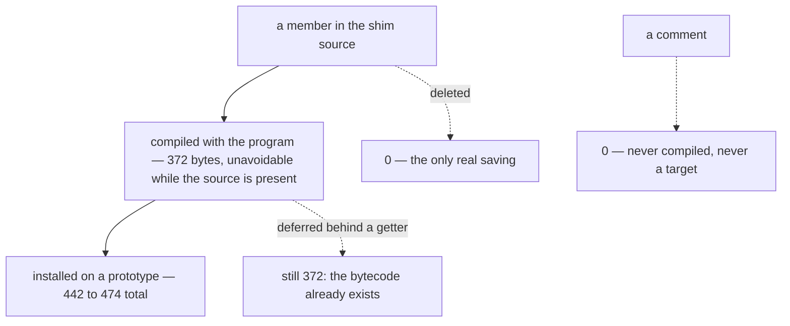

# Shim reduction — design-only audit, 0.0.1

Read-only and design-only, from `1191d93`. Nothing implemented, no court
frozen, no protocol or threshold changed, no D6 criterion touched, no shared
runtime considered, no page capability removed, no visual run, no navigation
soak, no download. Every number was measured in the scratch crate outside this
repository against the same pinned `rquickjs =0.12.2`.

## 1. The yardstick was wrong, and here is the right one

The previous audit derived **3.6 realm-bytes per source byte** from the whole
shim (58,957 source → 210,096 live). That is a true *average* and a false
*guide*: it assumes every source byte costs the same, and measurement says the
spread is total.

Each construct below was appended 200 times to the real base shim and the
**marginal** realm was measured — the realm a second target pays for:

| what is added | per item | per source byte |
| --- | ---: | ---: |
| a closure | **502** | 5.83× |
| a property installed with its own `defineProperty` | **474** | 5.22× |
| a class-body method | 445 | — |
| a batched `Object.defineProperties` entry | 443 | — |
| a plain `prototype.x = function` assignment | **442** | 7.78× |
| a plain object literal | 150 | 3.02× |
| 100 bytes of string data | 27 | 0.27× |
| **a comment** | **0** | **0.00×** |

**Comments are free.** 21,290 bytes of them changed the marginal realm by
exactly zero. The shims are 29–30% comments — 17,329 bytes — and removing every
one of them would save **nothing**.

So the unit of reduction is **a member, not a byte**, and the price is
**~442–474 bytes in every realm that evaluates it**.

## 2. What a realm actually pays, split by who pays it

| | bytes | paid by |
| --- | ---: | --- |
| engine floor: runtime + full context, empty shim | **103,856** | every realm |
| the base shim | **122,800** | every realm, child frames included |
| the main shim | **87,296** | main realms only — child realms already skip it |
| a main realm, total | **313,952** | |
| a child realm, total | **226,656** | |

The main shim's exemption for child realms is already in the host and is not
counted as a saving anywhere below.

## 3. The finding that decides the shape of any reduction

**The cost is the compiled bytecode, not the installed object.**

Two hundred members were put behind a single lazy accessor that nothing ever
touches, so not one of them is installed. They still cost **372 bytes each** —
79–84% of what installing them costs.

| | per member |
| --- | ---: |
| installed eagerly | 442–474 |
| **compiled but never installed** | **372** |
| the saving deferral actually buys | **~70–100 (16–21%)** |

QuickJS compiles nested functions when it compiles their enclosing function, so
a member deferred behind a getter has already been paid for. **Lazy
installation is not a reduction technique here.** It was the most obvious
candidate on the list and it is worth about a fifth of what it appears to be.

## 4. Inventory, priced

| | classes | accessors (get/set) | function-like | members × ~450 | measured total |
| --- | ---: | ---: | ---: | ---: | ---: |
| base (every realm) | 6 | 31 | 29 | ~29,700 | **122,800** |
| main (main realms) | 6 | 22 | 59 | ~39,150 | **87,296** |

Named members account for about **24% of the base shim's cost** and about
**45% of the main shim's**. The rest is the top-level program's own bytecode,
the class prototypes, the WeakSets and Maps, and the property descriptors —
none of which shrink by deleting a member. **Nobody should expect linear
returns from member removal on the base shim**, and a programme aimed at it
should measure the structural remainder first.

## 5. Candidates, each judged against a measurement

| candidate | measured | verdict |
| --- | --- | --- |
| **C1. Batch the separate `defineProperty` calls into `Object.defineProperties`** | 474 → 443, ~31 per member; ~27 such sites | **Viable and semantics-neutral.** Same descriptors, same properties, same order, no handle change: about **840 bytes per realm** for a mechanical edit. Small, but it is the only free one. |
| **C2. Remove the dead capture `arrayIndexOf`** (`dom_shim_base.js:24`) | defined once, referenced nowhere in either shim | **Viable.** A capture rather than a function, so the saving is small, but it is dead. |
| **C3. Lazy installation of rarely used members** | 372 vs 442 | **Rejected on measurement**: the bytecode is already paid for; deferral buys 16–21%, at the cost of moving when a page's errors appear. |
| **C4. Strip comments** | 0 bytes for 21,290 | **Rejected**: free to keep, and the comments are the record of why the shim is shaped as it is. |
| **C5. Convert accessors to methods** | 474 vs 442 | **Rejected**: ~32 bytes each, and it changes a page-visible API from a property to a function. Not a semantics-neutral edit. |
| **C6. Remove members the browser-gap triage says are unneeded** | ~442–474 each, in every realm for base | **The only large lever**, and it must be measured member by member: this project has already been burned once by extrapolating a member's price. |
| C7. De-duplicate names shared by base and main | 18 shared names inspected | **Not a candidate**: they are loop variables and the handle imports (`Document`, `Element`, `Node`, `addListener`, `dispatchOn`, `signals`…), which is the existing design, not duplication. |

## 6. What each candidate must not disturb

- **Child and main semantics**: C1 and C2 touch neither. A base-shim change is
  paid for — and must be verified — in *both* realm kinds; a main-shim change
  only in main realms.
- **The handle's exact key set**: court-pinned at `g, document, Document,
  Element, Node, Event, addListener, removeListener, dispatchOn, contains,
  focusedElement, eventStateOf, signals`. C1 and C2 add and remove nothing
  there.
- **Authority**: the shim holds the lifecycle and dispatch capabilities; no
  candidate here touches how they are minted or read.
- **Memory and arena RSS**: a saving is only visible where D6 looks on the
  arena arm; C1's ~840 bytes per realm is far below the arena's page
  granularity and will not move RSS at all. That is an argument for honesty
  about C1, not against doing it.

## 7. Court draft

1. The `__mcsInternals` key set is unchanged (the frozen court, unmodified).
2. Every existing shim court still passes: attribute names, event target,
   listener options, capture, passive, abort signal and its surface and
   timeout, tag-name query, page-error redaction.
3. A child realm still evaluates the base shim only.
4. The properties C1 batches are indistinguishable from today: same names, same
   enumerability, writability and configurability, same values.
5. The measured per-realm cost does not rise: the tracked figure is compared
   before and after, on both arms.
6. Any member removed under C6 is measured on its own, before and after, and
   the number is recorded — no extrapolation from another member's price.

## 8. Pending rulings

1. Whether C1 and C2 are worth a commit on their own (~840 bytes per realm and
   one dead capture), or should wait to ride along with a C6 removal.
2. Whether the structural remainder — 76% of the base shim, not attributable to
   named members — gets its own audit before any C6 programme is opened.
3. Whether C6 candidates are drawn from the browser-gap triage, and if so which
   members are on the table, given that removing a member removes a capability
   from every page.

---

## 9. C1 was implemented, measured, and not taken — 2026-09-06

The court was frozen first (`property-shape-court.py`, receipt
`evidence/native-dom-control-0.0.2-property-shape.json`, **22/22** on the
shipped binary). Then C1 was written exactly as ruled — descriptors, names,
order and page-visible behaviour preserved item by item — and measured.

**It does not pay, and the shims are back as they were.**

### What C1 could actually reach

Order must be preserved, so only **adjacent** `defineProperty` calls on the
*same* object may merge. That is three groups, not the twenty-seven sites §5
counted:

| group | members |
| --- | ---: |
| base, on `g`: `__mcsString`, `__mcsJson`, `__mcsArmDispatch`, `__mcsInternals` | 4 |
| main, on `Node.prototype`: `firstChild`, `lastChild`, `parentElement` | 3 |
| main, on `Element.prototype`: `innerText`, `defaultValue` | 2 |

### What it measured

With the refactor in place, the guard court still passed 22/22 — the property
shape is untouched, which is what the ruling required. The bytes went the wrong
way:

| per realm, tracked | before | after |
| --- | ---: | ---: |
| system | 327,456 | **327,456** (unchanged) |
| arena | 317,232 | **317,872** (+640) |

### Why the audit was wrong

§5 priced batching at ~31 bytes per member from a 200-member experiment. That
saving is the **call site**, amortised across the batch — and the batch pays for
its own descriptor container. Sweeping group sizes shows where the two cross:

| members | separate | batched | difference |
| ---: | ---: | ---: | ---: |
| 2 | 768 | 816 | **+48** |
| 3 | 1,536 | 1,552 | **+16** |
| 4 | 1,920 | 1,904 | −16 |
| 6 | 2,688 | 2,608 | −80 |
| 8 | 3,456 | 3,312 | −144 |
| 16 | 8,576 | 8,272 | −304 |
| 32 | 15,872 | 15,312 | −560 |

**Batching pays from four members up, and only from about six is it worth
noticing.** Our three groups are 4, 3 and 2, whose net is +48 logical bytes;
allocator quantisation then rendered that as 0 on the system arm and +640 on
the arena.

The error was mine and it is the same one this project has recorded twice
before: **a per-member price measured at one scale was extrapolated to
another.** A 200-member batch and a 3-member batch are different regimes, and
nothing in §5 said which one the shim is in.

### What is kept

- `property-shape-court.py` **stays**, frozen. It is a refactor guard: it pins
  every own property of `window`, `Node.prototype`, `Element.prototype`,
  `Document.prototype`, `Event.prototype` and `document` — names, creation
  order, kind and all three flags — and it is what proved C1 was semantically
  clean before the byte measurement rejected it on other grounds.
- The break-even table above, so the next person does not re-derive it.
- **C1 is withdrawn.** The recommendation in §5 is superseded: batching is not
  a reduction for groups this small.
